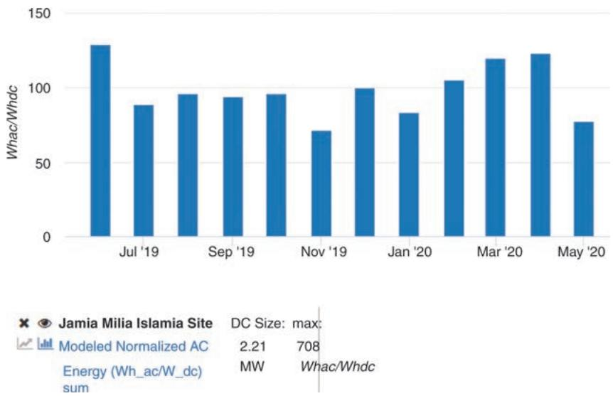  
Figure 4.6 Sum of modeled normalized energy $(Wh_{ac} / Wh_{de})$

Figure 4.5 shows the EER for the monthly operation of the 2.2 MW plant. This performance ratio is measured as a ratio of expected output based on nameplate readings to the measured output for a given reporting period. From Figure 4.5, it is identified that the average EER from May 2019 to May 2020 is 1.2.

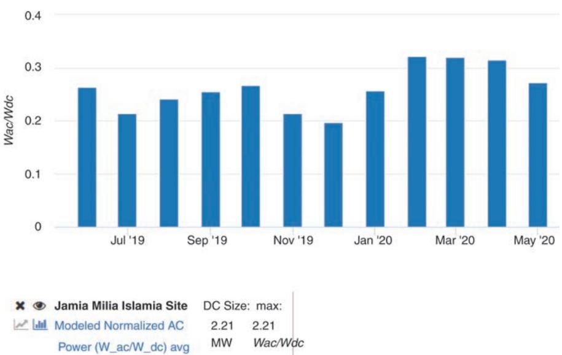  
Figure 4.7 Average of modeled normalized power ( $W_{ac}/W_{de}$ )

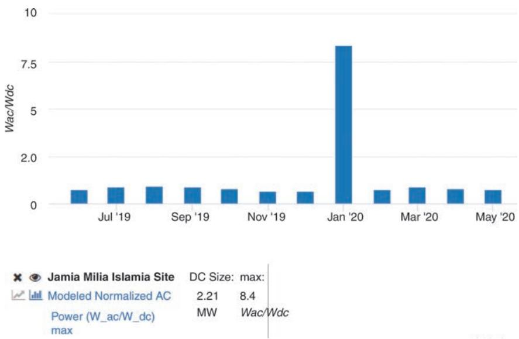  
Figure 4.8 Maximum of modeled normalized power

Figure 4.6 shows the sum of normalized energy of the final yield per month for the 2.2 MW plant. This identifies the effect of temporal and local insulations that factor the reference yield obtained from the ratio of irradiated energy (kWh/m $^{2}$ ) to irradiance (kW/m $^{2}$ ), under standard test conditions (STC) for a given period [7]. For a given plant, the normalized energy is obtained as a ratio of plant output power to the nominal PV power generated under STC during a certain period. From the Figure 4.6, it is identified that the sum of modeled normalized energy is 1187.6 Wh $_{ac}$ /Wh $_{dc}$ .

Figure 4.7 shows the sum of normalized power output per month for the 2.2 MW plant. This is characterized as a ratio of the total power output of PV generation to the nominal power generation capacity of the PV system under STC [7]. Generally, the average value of normalized power outputs varies from 0 to 1 and extends up to 2 depending on the cloud enhancements and PV installation area [7]. The average of normalized power is identified as $0.3W_{ac} / W_{dc}$ . Further, the maximum normalized power shown in Figure 4.8 is identified as $8.4W_{ac} / W_{dc}$ .

## 4.1.2 Components used in the system

The components used in this system are mainly PV modules and inverters of different ratings. For performing the reliability analysis of the components in the site, a base case of a PV system with 20 kW string and central inverters are considered. The details of the PV module and inverter are given as follows:

PV module: The chosen module is 310 W Sun-power type which has higher efficiency. Table 4.1 shows the characteristics of the Sun-power PV module.

Table 4.1 Characteristics of the Sun-power PV module

<table><tr><td>Parameter</td><td>Data</td></tr><tr><td>Manufacturer</td><td>Sun-power</td></tr><tr><td>Model</td><td>SPR-E19-310-COM</td></tr><tr><td>Efficiency</td><td>21.13%</td></tr><tr><td>Dimensions (module area)</td><td>Length: 1559 mmWidth: 1046 mm</td></tr><tr><td>Specific parameters</td><td>Current at the maximum power: $I_{mp} = 5.67$  AVoltage at the maximum power: $V_{mp} = 54.7$  VShort circuit current: $I_{sc} = 6.05$  AOpen circuit voltage: $V_{oc} = 64.4$  V</td></tr></table>

The reliability analysis is done for two different designs, a string inverter system of 20 kW and a central inverter system of 20 kW, where each system uses the same module rating of 310 W.

Inverter: Two different PV system configurations with 20 kW string inverter (SG15KTL-M/SG20KTL-M) and 20 kW central inverter (SG1250UD/SG1500UD) of Sungrow are chosen for conducting the reliability analysis. The details of both inverters are available in $[8]$ and $[9]$ , respectively. The string inverter systems are mounted outdoor near the PV strings (either beneath a module or at a wall corner) and its temperature varies between 0 °C and 60 °C considering their direct exposure to heat emitted by PV panels and environmental conditions. Further, the central inverter is installed in an electrical room with additional cooling facilities and its temperature varies between 0 °C and 40 °C.

As the semiconductor modules are involved in the inverters, they are the most vulnerable components in the PV system $[10]$ . These modules operate at high power levels and temperatures, which increase their failure risk and degrade the reliability of inverters $[11, 12]$ . Hence, while performing reliability, sufficient data corresponding to the operation and failure rates of the PV inverter and PV modules is necessary. Sections 4.2 and 4.3 of the chapter discuss these aspects to identify the reliability indices and perform the reliability analysis.

## 4.2 Data collected for reliability study

The site identified for the case study achieves grid integration of PV systems by utilizing string and centralized inverter-based structures. As discussed in Section 4.1.2, a 20 kW string inverter and a 20 kW central inverter are considered for conducting the reliability assessment. The corresponding schematics of both systems are shown in Figures 4.9 and 4.10.

To distinguish, the string inverter system has each string connected to its inverter, whereas the central system has all the strings of an array connected to a single inverter. For the central system with total capacity equal to the capacity of an n-string system indicates that each string inverter capacity is 1/n of the central inverter. Further, from Figure 4.10, it is observed that, for a system with n PV strings, each string can generate 1/n of the power output of the total capacity. This indicates that failure in any string will not lead to system failure but will decrease the power output of the system. Considering this scenario, the reliability analysis is performed with an assumption that each PV string will have the same failure and repair rates. Further, the data required for the reliability analysis of a grid-connected solar inverter is obtained based on the failure rates of various components in the system.

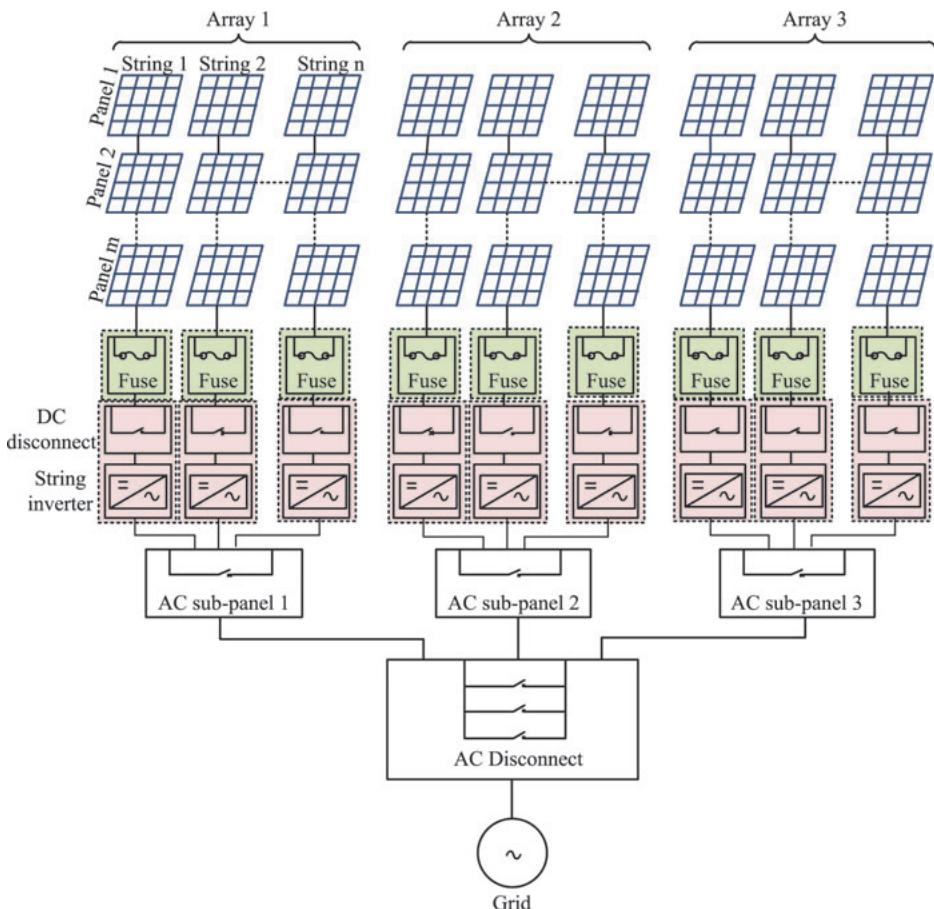  
Figure 4.9 Schematic of a string inverter-based PV system

## 4.2.1 Failure rate of power electronic switches

The failure rate of power electronics switches is calculated using empirical models discussed in $[13–16]$ . Generally, these failure rates are determined by the thermal stress on the devices, e.g. insulated-gate bipolar transistors (IGBTs) and metal oxide semiconductor field-effect transistors (MOSFETs). This indicates that the failure rate is a function of temperature or voltage, which is directly related to system input power levels and power loss. Besides, diodes are also associated with IGBTs and MOSFETs. Hence, their reliability also depends on system input power levels and power loss through voltage and temperature. The failure rate of diodes is calculated using empirical models discussed in $[17]$ .

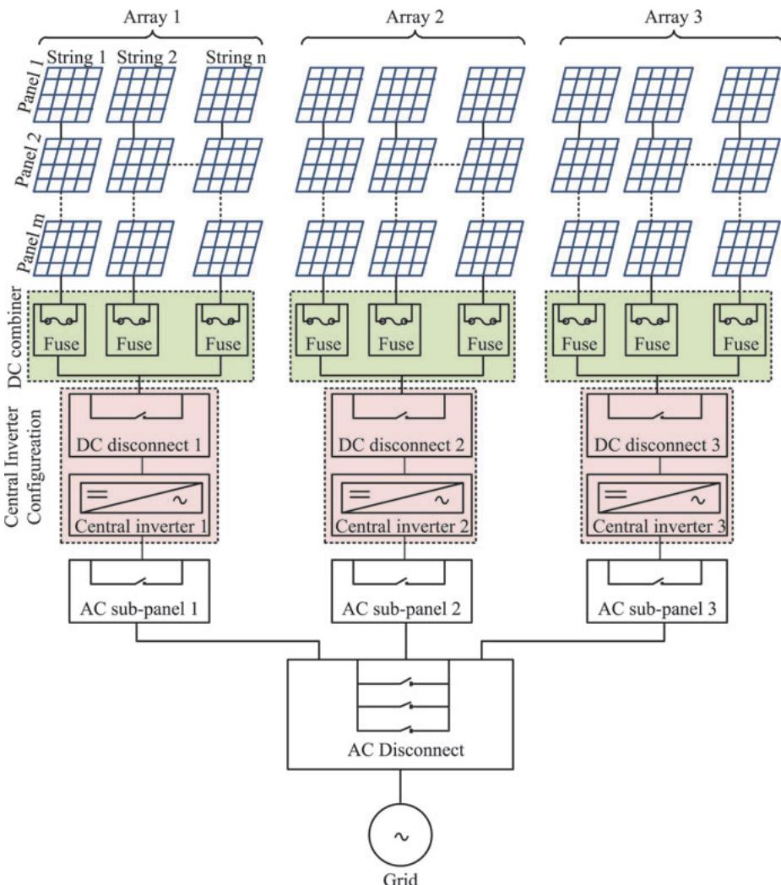  
Figure 4.10 Schematic of a central inverter-based PV system

## 4.2.1.1 Thermal model of IGBT and diode

Typically, IGBTs with anti-parallel diodes are widely used in PV inverters. The thermal models of an IGBT and a diode from junction to ambient and junction to case scenarios are given in Figures 4.11 and 4.12, respectively [18, 19]. For a known power loss in the system, the temperature variation of an IGBT and diode is estimated from the linear heat transfer equation discussed in [20] as

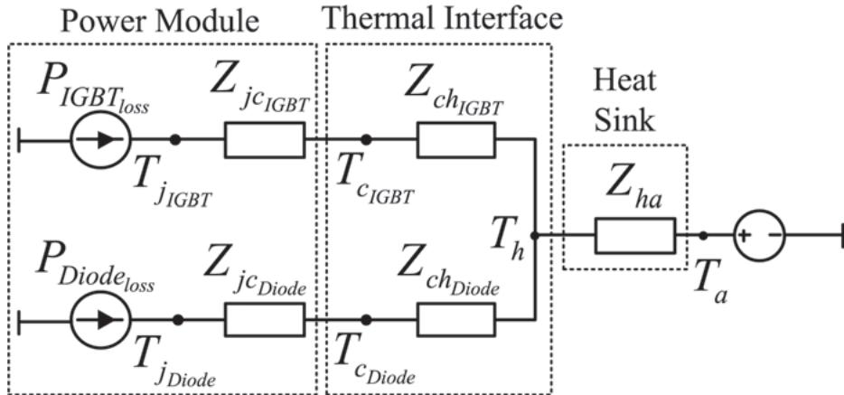  
Figure 4.11 Thermal model of IGBT and diode (single IGBT and diode with $T_{j}$ , $T_{c}$ , $T_{h}$ , and $T_{a}$ corresponding to junction, case, heat sink, and ambient temperatures, respectively, and $Z_{jc}$ , $Z_{ch}$ , and $Z_{ha}$ corresponding to thermal impedance junction to case, case to heat sink, and heat sink to ambient, respectively)

$$
\Delta T _ {I G B T} = R _ {t h 1} P _ {I G B T _ {l o s s}} + R _ {t h 2} P _ {D i o d e _ {l o s s}}\tag{4.1}
$$

$$
\Delta T _ {D i o d e} = R _ {t h 3} P _ {I G B T _ {l o s s}} + R _ {t h 4} P _ {D i o d e _ {l o s s}}\tag{4.2}
$$

where $P_{IGBT_{loss}}$ is the power dissipation in IGBT, $P_{Diodeloss}$ corresponds to power dissipation in the diode, $R_{th1}$ and $R_{th2}$ correspond to the thermal resistance of IGBT and diode, respectively, and $R_{th3}$ and $R_{th4}$ correspond to thermal coupling coefficients between IGBT and diode.

Further, the junction temperature of an IGBT or a diode is estimated as

$$
T _ {j} = T _ {c} + \Delta T = T _ {a} + R _ {t h} \left(P _ {I G B T _ {l o s s}} + P _ {D i o d e _ {l o s s}} + P _ {a d d}\right) + \Delta T\tag{4.3}
$$

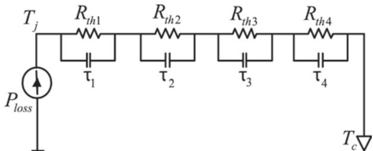  
Figure 4.12 Equivalent RC thermal network with $R_{th}$ corresponding to resistance and $\tau$ corresponding to capacitance [18]

where $T_{c}$ is the case temperature, $T_{a}$ is the ambient temperature, $R_{th}$ corresponds to thermal resistance from junction to the case including sink, and $P_{add}$ is the additional power loss due to other mounted devices.

## 4.2.1.2 IGBT failure rate

The failure rate of an IGBT is estimated using an empirical model recommended by the Fides reliability guide 2009 [14] as

$$
\begin{array}{c} \lambda_ {I G B T} = \left(\lambda_ {0 T H} \prod_ {\text {Thermal}} + \lambda_ {0 T C y C a s e} \prod_ {T C y C a s e} + \lambda_ {0 T C y S J} \prod_ {T C y S J} + \lambda_ {0 R H} \prod_ {R H} + \lambda_ {0 M e c h} \prod_ {M e c h}\right) \\ \prod_ {\text {Induced}} \prod_ {P M} \prod_ {\text {Process}} \end{array} \tag {4}\tag{4.4}
$$

where $\lambda_{0TH}$ corresponds to the effect of thermal stress on the failure rate of an IGBT; $\lambda_{0TCyCase}$ corresponds to the effect of thermal cycling on the case; $\lambda_{0TCySJ}$ corresponds to the effect of thermal cycling on the solder joint; $\lambda_{0RH}$ and $\lambda_{0Mech}$ correspond to humidity and mechanical overstress, respectively; $\Pi_{thermal}$ , $\Pi_{TCyCase}$ , $\Pi_{TCySJ}$ , $\Pi_{RH}$ , and $\Pi_{Mech}$ correspond to physical overstress accelerating parameters of thermal, mechanical, and electrical origin; $\Pi_{Induced}$ is the overstress caused by additional factors; $\Pi_{PM}$ is the manufactured part quality; and $\Pi_{Process}$ is the technical control over reliability and quality in a product life cycle.

For a known junction temperature, the temperature factor is calculated as

$$
\Pi_ {T h e r m a l} = \Pi_ {E I}. e ^ {1 1 6 0 4 \times 0. 7 \times \left[ 1 / 2 9 3 - 1 / \left(T _ {j} + 2 7 3\right) \right]}\tag{4.5}
$$

where $T_{j}$ corresponds to the IGBT junction temperature and

$$
\Pi_ {E I} = \left\{ \begin{array}{l l} \left(\frac {v _ {\text {applied}}}{v _ {r , I G B T}}\right) ^ {2. 4} & \text {if} \left(\frac {v _ {\text {applied}}}{v _ {r , I G B T}}\right) > 0. 3 \\ 0. 0 5 6 & \text {if} \left(\frac {v _ {\text {applied}}}{v _ {r , I G B T}}\right) \leq 0. 3 \end{array} \right.\tag{4.6}
$$

in which $v_{applied}$ corresponds to the voltage applied across the IGBT, and $v_{r,IGBT}$ corresponds to the IGBT rated reverse voltage.

From (4.1) - (4.6), the failure rate of an IGBT is a function of voltage or temperature that corresponds to the power loss and system input power levels.

## 4.2.1.3 Diode failure rate

The failure rate of the diode in PV inverters is estimated using a standard reliability model discussed in [17] as

$$
\lambda_ {D} = \lambda_ {b} \pi_ {T} \pi_ {S} \pi_ {C} \pi_ {Q} \pi_ {E}\tag{4.7}
$$

where $\lambda_{b}$ represents the diode basic failure rate, $\pi_{T}$ , $\pi_{S}$ , $\pi_{C}$ , $\pi_{Q}$ , and $\pi_{E}$ correspond to temperature, electrical stress, construction, quality, and environmental factors, respectively. For a known junction temperature $T_{j}$ , the temperature factor is calculated as

$$
\pi_ {T} = e ^ {- 3 0 9 1 \left(1 / (T _ {j} + 2 7 3) - 1 / 2 9 8\right)}\tag{4.8}
$$

The electrical stress factor [21, 22] is calculated as

$$
\pi_ {S} = \left\{ \begin{array}{l l} \left(\frac {v _ {\text {applied}}}{v _ {r , \text {diode}}}\right) ^ {2. 4 5} & \text {if} 0. 3 <   \frac {v _ {\text {applied}}}{v _ {r , \text {diode}}} <   1 \\ 0. 0 5 4 & \text {if} \frac {V _ {\text {applied}}}{V _ {r , \text {diode}}} \leq 0. 3 \end{array} \right.\tag{4.9}
$$

where $v_{applied}$ is the voltage applied across the diode and $v_{r,diode}$ corresponds to the diode-rated reverse voltage.

From the (4.7) - (4.9), the failure rate of a diode is similar to the failure rate of an IGBT and forms a function of voltage or temperature that corresponds to the power loss and system input power levels.

## 4.2.1.4 Capacitor failure rate

Another important factor that leads to the PV inverter failure is related to capacitors $[23]$ . A comparative analysis in $[24]$ has identified that the electrolytic capacitor dominates in an inverter failure. Further, the industrial representatives at US Department of Energy (DOE) workshop $[25, 26]$ indicated that the quality of DC-bus capacitors is a critical problem affecting the reliability of the inverter. The conventional methods for predicting the reliability of capacitors $[13]$ have identified that the capacitor failure rate is dependent on ripple current, DC voltage applied, and ambient conditions such as heat sinking, temperature, and airflow. Further, the inverters mounted outdoor are exposed to harsh ambient environments and may suffer high capacitor failure rates. This indicates that the capacitor failure rate can be determined by hotspot temperature, which is estimated by the base life at actual and maximum hotspot temperatures $[27]$ . The generalized expression for computing the capacitor failure rate is given as

$$
\lambda_ {C} = \frac {1}{r _ {C}} = \frac {1}{L _ {b} \cdot 2 ^ {\left(T _ {m a x} - T _ {c}\right) / 1 0}}\tag{4.10}
$$

where $r_{C}$ corresponds to the capacitor life expectancy, $L_{b}$ corresponds to the base life at a maximum core temperature $T_{max}$ , and $T_{C}$ corresponds to the actual core temperature. Further, the lifetime of the capacitor depends on the ripple current flowing through it and can be estimated as a function of the hotspot temperature in (4.10). The current ripple rate for a central inverter-based system without storage components is approximated as

$$
i _ {r} (t) = \frac {V _ {0}}{V _ {d}} I _ {0} \cos (2 \omega t - \varphi)\tag{4.11}
$$

in which $V_{0}$ is the grid voltage, $V_{d}$ is the input DC voltage, $I_{0}$ is the RMS output current, and $\omega$ and $\varphi$ correspond to the fundamental frequency and power factor, respectively. It is noted that the higher-order harmonics due to smaller amplitudes of on/off switching are neglected here. Further, the RMS value of the ripple current is calculated as

$$
I _ {r} = \frac {P _ {0}}{\sqrt {2} V _ {d}}\tag{4.12}
$$

where $P_{0}$ denotes the inverter output power.

For a steady-state condition, the hotspot temperature of the capacitor is calculated as

$$
T _ {c} = T _ {a} + \theta_ {c} \left(I _ {r} ^ {2} R _ {s}\right)\tag{4.13}
$$

where $T_{a}$ corresponds to the ambient temperature, $\theta_{c}$ represents the thermal resistance of the capacitor, and $R_{s}$ corresponds to the equivalent series resistance (ESR) of the capacitor. Further, the power loss is obtained by substituting (4.13) into (4.10).

## 4.2.2 Reliability of inverter

Failure in any component of the PV inverter sometimes may lead to a complete outage indicating no parallel redundancy $[11]$ . Hence, its reliability can be modeled as a series network with the reliability indices as

$$
\lambda_ {I} (P, V, T) = \lambda_ {C} + \sum_ {i} (\lambda_ {D i} + \lambda_ {S i})\tag{4.14}
$$

$$
r _ {I} (P, V, T) = \frac {1}{\lambda_ {I}} \left[ \lambda_ {C} r _ {c} + \sum_ {i} \left(\lambda_ {D i} r _ {D i} + \lambda_ {S i} r _ {S i}\right) \right]\tag{4.15}
$$

$$
A _ {I} (P, V, T) = \frac {1}{\lambda_ {I}} \left[ \frac {\frac {1}{r _ {1}}}{\lambda_ {I} + \frac {1}{r _ {1}}} \right]\tag{4.16}
$$

where $\lambda_{I}$ represents the failure rate, $r_{I}$ represents the repair time, and $A_{I}$ represents the availability of PV inverter. Further, the subscripts C, D, and S correspond to the capacitor, diode, and IGBT, respectively, and i indicates the ith component. Besides, the availability of AC subpanel and DC disconnect is calculated from the failure and repair rate as

$$
A _ {D C} = \frac {\frac {1}{r _ {D C}}}{\lambda_ {D C} + \frac {1}{r _ {D C}}}\tag{4.17}
$$

$$
A _ {A C} = \frac {\frac {1}{r _ {A C}}}{\lambda_ {A C} + \frac {1}{r _ {A C}}}\tag{4.18}
$$

As the failure rate probability of the three-phase AC disconnect is very low, it can be assumed to be perfectly reliable and can be easily modeled if the failure data is available. Further, the reliability parameters for central and string configurations of a PV system are given in Tables 4.2 and 4.3, respectively [28].

Table 4.2 Base case reliability analysis parameters (central inverter system)

<table><tr><td colspan="5">IGBT and diode</td></tr><tr><td> $T_a=25\ ^{\circ}\text{C}$ </td><td> $\mu=0.8$ </td><td> $cos\varphi=0.95$ </td><td> $V_t=480\ \text{V}$ </td><td> $f=20\ \text{kHz}$ </td></tr><tr><td> $P_{add}=11\ \text{W}$ </td><td> $\theta_a=0.11\ ^{\circ}\text{C/W}$ </td><td> $V_{1o}=0.9654\ \text{V}$ </td><td> $\underline{\text{a1}}=0.1642$ </td><td> $b_1=0.6468$ </td></tr><tr><td>k=1.6783</td><td>z=0.0181</td><td>h=0.0040</td><td>r=1.3444</td><td> $V_{r,IGBT}=480\ \text{V}$ </td></tr><tr><td> $\theta_{11}=0.640\ ^{\circ}\text{C/W}$ </td><td> $\theta_{12}=0.250\ ^{\circ}\text{C/W}$ </td><td> $\theta_{21}=0.300\ ^{\circ}\text{C/W}$ </td><td> $\theta_{22}=0.830\ ^{\circ}\text{C/W}$ </td><td> $r_{Di}=20\ \text{days}$ </td></tr><tr><td> $\lambda_{OTH}=0.3021$ </td><td> $\Pi_{induced}=2.0$ </td><td> $\Pi_{PM}=1.7$ </td><td> $\Pi_{Process}=4.0$ </td><td> $r_{Si}=20\ \text{days}$ </td></tr><tr><td> $k_{goff}=1.0$ </td><td> $k_{gon}=1.5$ </td><td> $V_{r,diode}=600\ \text{V}$ </td><td> $t_a=25.9\ \text{ns}$ </td><td> $t_b=54.1\ \text{ns}$ </td></tr><tr><td> $V_{2o}=0.711\ \text{V}$ </td><td> $a_2=0.136$ </td><td> $b_2=0.395$ </td><td> $I_{rr}=10\ \text{A}$ </td><td> $\lambda_b=0.005$ </td></tr><tr><td> $\pi_E=6$ </td><td> $\pi_c=1$ </td><td> $\pi_Q=2.4$ </td><td></td><td></td></tr><tr><td colspan="5">Capacitor</td></tr><tr><td> $L_b=20\ 000\ \text{hours}$ </td><td> $T_{max}=95\ ^{\circ}\text{C}$ </td><td> $R_S=0.02\ \text{ohms}$ </td><td> $\theta_c=15.6\ ^{\circ}\text{C/W}$ </td><td> $r_c=10\ \text{days}$ </td></tr><tr><td colspan="5">PV array</td></tr><tr><td> $\lambda_{P,i}=1.1416$ </td><td> $r_{P,i}=48\ \lambda_F=5.7078$ </td><td> $r_F=10$ </td><td>d=0.5%  $\alpha=26.99$ </td><td> $\beta=5.83$ </td></tr><tr><td colspan="5">DC disconnect and AC subpanel</td></tr><tr><td> $\lambda_{DC}=0.05$ </td><td> $r_{DC}=16$ </td><td> $\lambda_{AC}=0.01$ </td><td> $r_{AC}=10$ </td><td></td></tr></table>

It should be noted that the unit for failure rates is 1/(106 hrs) and repair time is hrs. Further, these parameters are adapted with reliability evaluation techniques and the IEEE reliability standards $[29]$ to assess the reliability of the PV plant. There are many techniques such as Monte Carlo simulations $[30]$ , Markov chain method $[31]$ , reliability block diagrams $[32]$ , fault tree analysis $[33]$ , and state enumeration method (SEM) $[34]$ available in the literature. In this chapter, the SEM $[35, 36]$ is used to perform the reliability analysis on the PV system. This method adapts the impact of voltage levels, input power levels, and power losses on the failure rate of different components in a PV system. It works on an underlying assumption that each PV system has three operating states, the normal or idle state, the working state, and the out of service state. Initially, the equivalent reliability parameters of multiple PV string in an array are identified and their reliability indices are determined using SEM. Generally, these indices are either energy-oriented or time-oriented. The methodology corresponding to states of PV array and the reliability indices for both string and central system are discussed in Section 4.3.

Table 4.3 Base case reliability analysis parameters (string inverter)

<table><tr><td colspan="5">IGBT and diode</td></tr><tr><td> $T_{a}=25\ ^{\circ}\text{C}$ </td><td> $\mu=0.8$ </td><td> $cos\varphi=0.95$ </td><td> $V_{t}=480\ \text{V}$ </td><td> $f=20\ \text{kHz}$ </td></tr><tr><td> $P_{add}=11\ \text{W}$ </td><td> $\theta_{a}=0.11\ ^{\circ}\text{C/W}$ </td><td> $V_{1o}=0.9654\ \text{V}$ </td><td> $a_{1}=0.1642$ </td><td> $b_{1}=0.6468$ </td></tr><tr><td> $k=1.6783$ </td><td> $z=0.0181$ </td><td> $h=0.0040$ </td><td> $r=1.3444$ </td><td> $V_{r,IGBT}=480\ \text{V}$ </td></tr><tr><td> $\theta_{11}=0.640\ ^{\circ}\text{C/W}$ </td><td> $\theta_{12}=0.250\ ^{\circ}\text{C/W}$ </td><td> $\theta_{21}=0.300\ ^{\circ}\text{C/W}$ </td><td> $\theta_{22}=0.830\ ^{\circ}\text{C/W}$ </td><td> $r_{Di}=20\ \text{days}$ </td></tr><tr><td> $\lambda_{OTH}=0.3021$ </td><td> $\Pi_{Induced}=2.0$ </td><td> $\Pi_{PM}=1.7$ </td><td> $\Pi_{Process}=4.0$ </td><td> $r_{Si}=20\ \text{days}$ </td></tr><tr><td> $k_{goff}=1.0$ </td><td> $k_{gon}=1.5$ </td><td> $V_{r,diode}=600\ \text{V}$ </td><td> $t_{a}=25.9\ \text{ns}$ </td><td> $t_{b}=54.1\ \text{ns}$ </td></tr><tr><td> $V_{2o}=0.711\ \text{V}$ </td><td> $a_{2}=0.136$ </td><td> $b_{2}=0.395$ </td><td> $I_{rr}=10\ \text{A}$ </td><td> $\lambda_{b}=0.005$ </td></tr><tr><td> $\pi_{E}=6$ </td><td> $\Pi_{c}=1$ </td><td> $\Pi_{Q}=2.4$ </td><td></td><td></td></tr><tr><td colspan="5">Capacitor</td></tr><tr><td> $L_{b}=20\ 000\ \text{hours}$ </td><td> $T_{max}=95\ ^{\circ}\text{C}$ </td><td> $R_{S}=0.2\ \text{ohms}$ </td><td> $\theta_{c}=4.52\ ^{\circ}\text{C/W}$ </td><td> $r_{c}=10\ \text{days}$ </td></tr><tr><td colspan="5">PV array</td></tr><tr><td> $\lambda_{p,i}=1.1416$ </td><td> $r_{p,i}=48$ </td><td> $r_{F}=10$ </td><td> $d=0.5\%$ </td><td> $\beta=5.83$ </td></tr><tr><td colspan="5">DC disconnect and AC subpanel</td></tr><tr><td> $\lambda_{DC}=0.05$ </td><td></td><td> $\lambda_{AC}=0.01$ </td><td></td><td> $r_{AC}=10$ </td></tr></table>

## 4.3 Reliability study for the identified site

In this section, the methodology for conducting a reliability study on a base case of the identified site is presented. The failure rates are discussed, and the data collected in the previous section are the inputs to carry out the reliability analysis of grid-connected PV systems.

```txt
Algorithm 4.1: Approach for PV system risk analysis

Step 1: Identify the chronological data of PV system (solar insolation, ambient temperature, power output, DC voltage, AC voltage, and frequency)

Step 2: Evaluate the discrete probabilistic distribution of power input

Step 3: Assess the energy losses along with switching and conduction losses at each input power level in semiconductors.
Assess the energy losses in capacitors using DC voltage and ripple current.
Predict hotspot temperatures by thermal models of the IGBT, diode, and capacitor.
Quantify risks in PV inverters

Step 4: State enumeration-based PV array risk analysis

Step 5: Calculate the PV system risk indices and perform sensitivity analysis (insolation, temperature, number of strings, component reliability parameters, etc.)
```

## 4.3.1 Risk modeling for components of PV system

As discussed earlier in Section 4.2, the grid-connected PV systems either deal with string/multi-string or centralized structures. The string/multi-string structure deals with an own inverter for each string or multiple strings in the PV array. Whereas, for a central system, all the strings are connected to a single inverter system that is feeding the grid. For a condition where an n string inverter system has the same capacity of a central inverter system, the capacity of the central inverter system is n times of each string inverter system. The systematic approach adopted for PV risk analysis is shown in Algorithm 4.1.

## 4.3.1.1 The periodic discrete probability distribution of input power

The varying energy losses in the components connected to PV systems due to the periodic input power resulted in temperature variations in a solar inverter. Hence, the input power levels play a significant role in determining the life cycle of the PV system and its components. For the site considered in this case study, the data loggers sample and record the operational quantities of the PV system for every 5–15 minutes. This helps in obtaining a linear and highly intermittent power curve with a broad set of data points. Further, to perform the periodic risk analysis, the power curve data is divided into four seasons as shown in Figure 4.13.

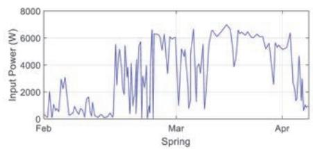

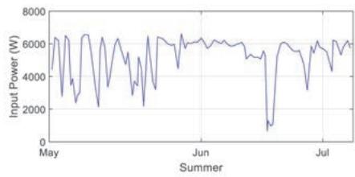

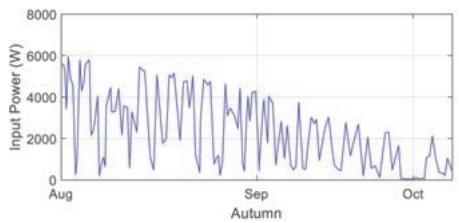

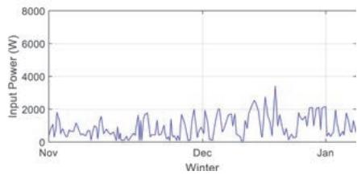  
Figure 4.13 Power curve data of different periods in chronological order of spring, summer, autumn, and winter

These input power curves are aggregated into a discrete probability distribution for quantifying their effect on PV system operation risks. The K-means clustering technique is used to cluster the data point into multiple power levels by eliminating the chronology. The detailed procedure is as follows: Initially, it is assumed to divide the annual power curve into K power levels. The term K is adjusted depending on the degree of precision needed for the reliability analysis. For the system in the case study, the satisfactory results are guaranteed by setting K around 10–15. Further, the K power level clustering of the yearly input power curve data with N data points is achieved by following Algorithm 4.2.

For a successful convergence, the mean $\mu_{i}$ corresponds to ith mean power level and the probability $p_{i}$ is given by $p_{i} = \frac{N_{S_{i}}}{N}$ , where N corresponds to the number of power curves.

The discrete probability distribution achieved by aggregating the periodic data of the input power curve in Figure 4.13 into 12 power levels is shown in Figure 4.14. Each power level in Figure 4.14 evaluates the availability of power electronic components, expected periodic energy output, and PV system risk indices weighted by the power level probability.

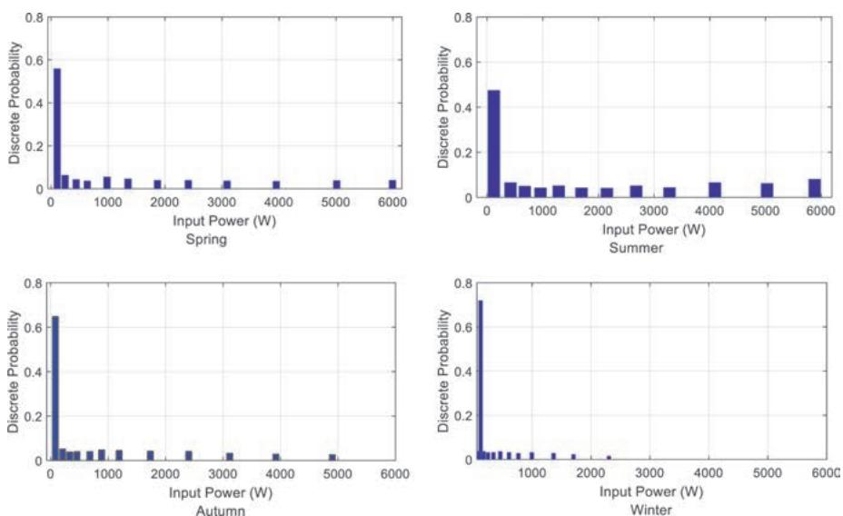  
Figure 4.14 Discrete probability distribution of power curve data of different periods in chronological order of spring, summer, autumn, and winter

## Algorithm 4.2: K power level clustering

<div class="mineru-algorithm" style="white-space: pre-wrap; font-family:monospace;">
Step 1: Initialize cluster $S = \{S_1, S_2, \dots, S_k\}$ and randomly assign the data points to each cluster.
Step 2: Calculate mean for an initial cluster, where $i = 1, 2, \dots, 3$ corresponds to the cluster $S_i$.
Step 3: Calculate the distance between each data point $P_j$ ($j = 1, 2, \dots, N$) and mean $\mu_i$ of $i$th cluster. $d_{ji} = |P_j - \mu_i|$
Step 4: The data points are assigned to the nearest cluster and the cluster means are recalculated using $\mu_i = \frac{1}{Ns_i} \Sigma p_j \epsilon S_i P_j$, where $N_{\text{si}}$ corresponds to total data points in $i$th cluster.
Step 5: Iterate the process in steps 3 and 4 until every $\mu_i$ is unchanged between any two iterations.
</div>

## 4.3.2 Reliability analysis of PV array

## 4.3.2.1 Equivalent parameters for reliability of PV string

The PV string consists of series-connected PV modules with a fuse inside the DC combiner box. There are three repairable failure modes of PV modules $[37–40]$ : (i) short circuit and (ii) open circuit of PV modules, and (iii) failure at a junction box that results in an outage of the whole string. These faults can be characterized by their average failure rates and repair rates of the PV module. Further, because of shading effects, a PV module can be bypassed through diodes resulting in a lower output of the string. Hence, this phenomenon is not considered as an outage but instead represents a low input power level. Besides, the probability of the instantaneous bypass of multiple panels is low and can be negligible. Therefore, the equivalent parameters for the reliability of a PV string are given as

$$
\begin{array}{l} \lambda_ {S} = \sum_ {i = 1} ^ {m} \lambda_ {P, i} + \lambda_ {F} \\ r _ {S} = \frac {1}{\lambda_ {S}} \left(\sum_ {i = 1} ^ {m} \lambda_ {P, i} r _ {P, i} + \lambda_ {F} r _ {F}\right) \end{array}\tag{4.19}
$$

(4.20)

where $\lambda$ is the failure rate, S represents equivalent PV string, m corresponds to total number of modules in a string, P is an equivalent PV module, F indicates the fuse in DC combiner, r corresponds to repair time, and $\lambda_{P,i}$ and $r_{P,i}$ correspond to the failure and repair rate of the ith PV module, respectively.

## 4.3.2.2 State enumeration for PV array reliability analysis

The SEM is adapted to compute the PV array reliability parameters from the data of n PV strings. This method can be applied to both heterogeneous and homogenous PV strings. Generally, the availability, unavailability, and other operating states of PV strings in an array can be given as

$$
\left(A _ {S 1} + U _ {S 1}\right) \left(A _ {S 2} + U _ {S 2}\right) \dots \left(A _ {S n} + U _ {S n}\right)\tag{4.21}
$$

where $A_{Si}$ is the availability and $U_{Si}$ is the unavailability of the ith PV string and n corresponds to the number of PV strings in an array. Further, the availability of the ith string is calculated as

$$
A _ {S i} = \frac {\frac {1}{r _ {S i}}}{\lambda_ {S i} + \frac {1}{r _ {S i}}}\tag{4.22}
$$

and the unavailability of the ith string is calculated as

$$
U _ {S i} = \frac {\lambda_ {S i}}{\lambda_ {S i} + \frac {1}{r _ {S i}}}\tag{4.23}
$$

Considering the above aspects of the PV array, the probability of an enumerated state $\alpha$ is given as

$$
p _ {A} (\alpha) = \prod_ {i = 1} ^ {n _ {f}} U _ {S i} \prod_ {i = 1} ^ {n - n _ {f}} A _ {S i}\tag{4.24}
$$

with $n_{f}$ representing the number of the failed PV strings and $n - n_{f}$ corresponds to healthy PV strings in state $\alpha$ .

For the condition where j PV strings fail, all the enumerated states are aggregated into the ith state of the PV array. This gives the probability of enumerated states as

$$
p _ {A j} = \sum_ {\alpha \in G (n _ {f} = j)} p _ {A} (\alpha) = \sum_ {\alpha \in G (n _ {f} = j)} \left(\prod_ {i = 1} ^ {n _ {f}} U _ {s i} \prod_ {i = 1} ^ {n - n _ {f}} A _ {S i}\right) j = 0, 1, \dots , n\tag{4.25}
$$

where $G\left(n_{f}=j\right)$ corresponds to the enumerated states of j strings outage. Based on the above observations, state 1 corresponds to the outage of one string with $(n-1)$ contingency, state 2 corresponds to the outage of two strings with $(n-2)$ contingency, state j corresponds to the outage of j strings with $(n-j)$ contingency, and state n corresponds to the outage of all the PV strings. Additionally, the common causes of failures such as lightning, environmental effects, and mechanical issues or other electrical problems that are independent of n strings failure are represented as a downstate or an additional failure event in the enumeration process.

This discussion on state enumeration for PV array incorporates the impact of voltage levels, power inputs, failure rates, and power losses to provide a viable approach for the reliability analysis.

## 4.3.2.3 Effect of aging and degradation

The failures in PV panels and degradation of PV modules increase with an increase in operation time and advancing age. Hence, these factors play a significant role in risk analysis while dealing with the end-stage life of PV modules. Considering this, a linear model of PV panel degradation is developed as discussed in $[17]$ and the performance degradation of the PV panel in terms of power for a lifetime is given as

$$
p _ {i} = p _ {0} \left[ 1 - (k - 1) d \right] \quad k = 1, 2, \dots , L\tag{4.26}
$$

where $p_0$ corresponds to the PV module's initial power capacity, $d$ represents the constant slope, and $k$ corresponds to a specified year during the observed life cycle $L$ .

Further, to assess the annual unavailability, an aging failure model is adapted as follows: for an aging failure, the probability function of failure density $f(t)$ with failure transition period t after surviving for T years is given by

$$
P _ {T, t} = \frac {\int_ {T} ^ {T + t} f (t) d t}{\int_ {T} ^ {\infty} f (t) d t}\tag{4.27}
$$

Further, the subsequent failure period t is divided into N subintervals with equal length $\Delta x$ . This gives the failure probability at the ith interval as

$$
P _ {i} = \frac {\int_ {T} ^ {T + i \Delta x} f (t) d t - \int_ {T} ^ {T + (i - 1) \Delta x} f (t) d t}{\int_ {T} ^ {\infty} f (t) d t} \quad (i = 1, 2, \dots , N)\tag{4.28}
$$

The average duration of unavailability for failures at the ith interval can be estimated as

$$
U D _ {i} = t - (2 i - 1) \Delta x / 2 \quad (i = 1, 2, \dots , N)\tag{4.29}
$$

Further, the unavailability for a subsequent failure period t is given by

$$
U _ {T, t} = \sum_ {i = 1} ^ {N} P _ {i}. U D _ {i} / t\tag{4.30}
$$

From (4.27) to (4.30), the total unavailability of repairable and non-repairable aging failures with the failure transition period t after surviving for T years is given as

$$
U _ {S} = U _ {S, r} + U _ {T, t} - U _ {S, r} U _ {T, t}\tag{4.31}
$$

$$
A _ {S} = 1 - U _ {S}\tag{4.32}
$$

where $U_{S}$ and $A_{S}$ correspond to the total unavailability and availability of a PV string, respectively.

## 4.3.3 PV system risk indices

The PV risk indices quantify the performance of the PV system and are useful at the planning stage for design selection and at the operation stage for reduced costs and increased benefits. Conventionally, the outage duration and failure rate are widely adopted as PV system risk indices. Further, two new indices that are focused on energy and time are discussed for better performance quantification.

## 4.3.3.1 Equivalent parameters for reliability of PV string

The energy-based indices provide the annual statistics of the PV system energy yield along with the system uncertainties.

## A. Ideal energy output

The ideal energy output (IEO) estimates the power output of a PV system by multiplying the clustered power levels of the perfectly reliable generation with their corresponding converter efficiency curves. This is mathematically expressed as

$$
\mathrm{IEO} = \sum_ {l} \sum_ {i = 1} ^ {K} \mu_ {i} \eta_ {i} p _ {i} D\tag{4.33}
$$

where K corresponds to the input power levels per phase, i and l correspond to the input power level for the ith instant at the lth phase, $\mu_{i}$ , $n_{i}$ , and $p_{i}$ correspond to the mean, efficiency, and the probability of the ith power level, respectively, and D depends on the total time considered. For an annual IEO, the total time considered D = 8760 hrs. Generally, while dealing with aging and degradation failures, the IEO is estimated for the first year of the PV system life cycle as it gives the IEO.

## B. Expected energy output

The expected energy output (EEO) of a PV system is associated with the non-perfect reliability, and it is estimated by multiplying the ideal output of the generation with the availability of the system. Further, the total EEO is obtained by multiplying the sum of expected outputs at each power level with the probability of each power level.

The EEO for a central inverter system is estimated as

$$
\mathrm{EEO} = \sum_ {l} \left[ \sum_ {i = 1} ^ {K} \eta_ {i} p _ {i} D \sum_ {j \in \{0, 1, 2, \dots , n - 1 \}} f _ {j} \mu_ {i} p _ {A j} A _ {I, i j} \left(f _ {j} \mu_ {i}, V _ {D C, i}\right) \right] A _ {D C} A _ {A C}\tag{4.34}
$$

where $f_{j}\mu_{i}$ is the projected inverter input power considering failures of the PV array, $p_{Aj}$ corresponds to the probability of PV array's jth state, $A_{I,j}$ corresponds to inverter availability for the ith input power level and the jth state of PV array, $A_{DC}$ represents the availability of the DC disconnect, and $A_{AC}$ corresponds to the availability of the AC subpanel. The value of $f_{j}$ while estimating the inverter input power is obtained as a ratio that depends on the state of the PV array and number of homogenous strings (n) in a PV array.

Similarly, the EEO for a string inverter PV system is given as

$$
\mathrm{EEO} = \sum_ {l} \left[ \sum_ {i = 1} ^ {K} \eta_ {i} p _ {i} D \sum_ {j = \{0, 1, 2, \dots , n - 1 \}} f _ {j} \mu_ {i} p _ {A j} \left(\mu_ {\text {str}, i}, V _ {D C, \text {str}, i}\right) \right] A _ {A C}\tag{4.35}
$$

where $p_{Aj}$ is the state probability function that defines the power flow through the DC-side voltage and the string inverters. This function implicitly incorporates the failure risk of string inverters, which is a major difference between the EEO of the central and string inverters. Further, $\mu_{str,i}$ corresponds to the string inverter input power at the ith power level, and $V_{DC,str,i}$ represents the string inverter DC-side voltage.

## C. Energy availability $(A_{e})$

The energy availability is calculated as a ratio of the normalized EEO to IEO, which is given as

$$
A _ {e} = \frac {\mathrm{EEO}}{\mathrm{IEO}}\tag{4.36}
$$

Generally, the IEO is a constant as it is estimated for the first year of the PV system life cycle.

## 4.3.3.2 Equivalent parameters for reliability of PV string

The time-based indices quantify the annual availability and unavailability time of the PV systems to justify their maintenance requirements.

## A. Availability time $(A_{t})$

The availability time $A_{t}$ is the relative measure of the expected operating time for a PV system in a year under normal conditions. The availability time of central and string inverter PV systems with multiple phases are given in (4.37) and (4.38), respectively, as

$$
A _ {t, c e n} = \prod_ {l} \left[ \sum_ {i = 1} ^ {K} p _ {i} p _ {A 0} A _ {I, i 0} \left(f _ {0} \mu_ {i}, V _ {D C, i}\right) A _ {D C} A _ {A C} \right]\tag{4.37}
$$

$$
A _ {t, s t r} = \prod_ {l} \left[ \sum_ {i = 1} ^ {K} p _ {i} p _ {A 0} \left(\mu_ {s t r, i}, V _ {D c, s t r, i}\right) A _ {A C} \right]\tag{4.38}
$$

For a PV system that does not need any repair or replacement, the availability time is represented as a percentage of the time. It should be noted that the availability time for a PV system also includes the zero-power output during no solar insolation.

Further, the time unavailability is given as

$$
U _ {t} = 1 - A _ {t}\tag{4.39}
$$

Notably, the PV system unavailability includes the probability that it operates with parts of the PV string out of service or in different derated states. These derated states can be estimated using the SEM.

B. Available $(H_{av})$ , derated $(H_{dr})$ , and outage hours $(H_{dw})$

The operation of a PV system for fully available hours $H_{av}$ is given as

$$
H _ {a v} = A _ {t} \cdot 8 7 6 0\tag{4.40}
$$

Similarly, the average down time of the PV plant gives the outage hours $H_{dw}$ of the system. $H_{dw}$ for the central and string inverter PV systems are given by (4.41) and (4.42), respectively:

$$
H _ {d w, c e n} = 8 7 6 0 \cdot \prod_ {l} \left[ 1 - \sum_ {i = 1} ^ {K} p _ {i} \sum_ {j \in \{0, 1, 2, \dots , n - 1 \}} p _ {A j} A _ {I, i j} \left(f _ {j} \mu_ {i}, V _ {D C, i}\right) A _ {D C} A _ {A C} \right]\tag{4.41}
$$

$$
H _ {d w, s t r} = 8 7 6 0 \cdot \prod_ {l} \left[ 1 - \sum_ {i = 1} ^ {K} p _ {i} \sum_ {j \in \{0, 1, 2, \dots , n - 1 \}} p _ {A j} \left(\mu_ {s t r, i}, V _ {D C, s t r, i}\right) A _ {A C} \right]\tag{4.42}
$$

Further, the operation of the PV system in the derated state is given as

$$
H _ {d r} = 1 - H _ {a v} - H _ {d w}\tag{4.43}
$$

Hence, the time-based reliability indices are the major asset for the intelligent management of the PV system.

## 4.4 Results of site study for reliability analysis

The reliability analysis is carried out considering the 20-kW central and string PV inverter systems connected to the distribution network. The inverter efficiency curve is not considered for the test case as the DC voltage and inverter outputs are measured directly. Further, the required reliability parameters and the discrete probability model of annual power outputs are discussed in Tables 4.2 and 4.3 of Section 4.2.

## 4.4.1 Results of reliability indices

The reliability parameters in Tables 4.2 and 4.3 are used to obtain the reliability indices for the base case during the first year of service as shown in Table 4.4.

From the results, it is identified that both the systems have similar reliability indices. The central inverter system has a slight advantage in terms of fully available time, and the string inverter system is slightly advantageous in terms of energy availability. Due to multiple inverters in the string-based system, their failure frequency is significant, which affects the fully available time of the system. Further, the impact of outage in a string inverter only affects the string, whereas the central inverter outage affects all the strings. This justifies the relatively high energy availability for a string inverter.

Table 4.4 Reliability indices for the base case during the first year of service

<table><tr><td>Energy-based indices</td><td>Central inverter system</td><td>String inverter system</td></tr><tr><td>EEO (MWh)</td><td>19.84</td><td>19.91</td></tr><tr><td>IEO (MWh)</td><td>19.95</td><td>19.95</td></tr><tr><td> $A_e$ </td><td>0.98917</td><td>0.99173</td></tr><tr><td>Time-based indices</td><td>Central inverter system</td><td>String inverter system</td></tr><tr><td> $A_t$ </td><td>0.91004</td><td>0.90827</td></tr><tr><td> $H_{\text{av}}$  (hrs)</td><td>7956.062</td><td>7901.3334</td></tr><tr><td> $H_{\text{dr}}$  (hrs)</td><td>803.9317</td><td>858.6634</td></tr><tr><td> $H_{\text{dw}}$  (hrs)</td><td>0.0063</td><td>0.0032</td></tr></table>

## 4.4.2 Aging and degradation effects

The long-term performance analysis for a PV system must deal with aging and degradation effects. Hence, energy availability $(A_{e})$ and availability time $(A_{t})$ indices are calculated for both central and string systems for 25 years, as shown in Figure 4.15.

From the results in Figure 4.15, it is observed that the energy availability and availability time are sensitive to change in service age for both PV systems. In contrast to both indices, the relative sensitivity of $A_{e}$ is smoother than $A_{t}$ , as $A_{t}$ remains insensitive for almost 15 years of the operating life and falls quickly to approach the mean life of the PV array, where $A_{e}$ depicts a constant decrease. This indicates that the changes in the degradation of PV efficiency and aging can be identified easily by $A_{e}$ , as $A_{t}$ only indicates the influence of aging because of the indirect impact of PV degradation. This occurs due to the effect of inverter input power on the failure rate of components. Both $A_{e}$ and $A_{t}$ are very low at the end of life with $A_{t}$ nearly equal to zero, indicating a high repair requirement. This indicates the dominance of aging failure as the PV system reaches the end of life.

## 4.4.3 PV risk assessment

## 4.4.3.1 Impact of temperature

The PV risk assessment for the impact on ambient temperature is generally related to the inverter systems and their installation site. The central inverter is installed in an electrical room with additional cooling facilities, and it is assumed that its temperature may vary between $0\ °C$ and $40\ °C$ as per the operating scenario and climatic conditions in New Delhi, India. Further, the string inverter systems are mounted outdoor near the PV strings, and it is assumed that its temperature may vary between $0\ °C$ and $60\ °C$ considering their direct exposure to environmental conditions. While conducting the risk analysis, the temperatures below $0\ °C$ are not considered due to low-performance risk. Besides, for a comparative analysis, the central inverter is subjected to temperatures between $40\ °C$ and $60\ °C$ and the sensitivity results are given in Table 4.5, Figure 4.16, and Tables 4.6 and 4.7.

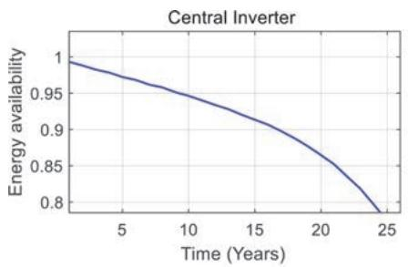

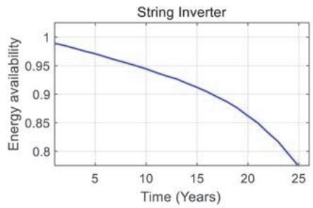

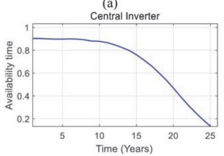  
(c)

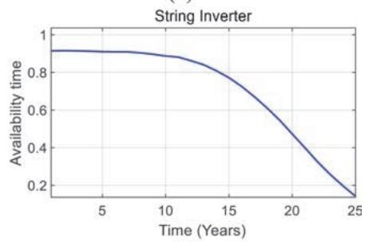  
(d)  
Figure 4.15 Degradation effect on (a) energy availability of the central inverter, (b) energy availability of the string inverter, (c) availability time of the central inverter, and (d) availability time of the string inverter

From the results in Table 4.5, it is observed that the temperature rise has an equal impact on both systems. During the first service year, for an ambient temperature varying between $0\ °C$ and $60\ °C$ , the energy availability of the central inverter decreases from 99 percent to 96 percent. In contrast, the energy availability of string inverters varies from 99.2 percent to 99 percent only. This indicates that the string inverter is more tolerant of temperature changes seen from the energy availability perspective when compared with the central inverter under the same conditions. Similarly, at the end of life operation, i.e. for the 25th year, the energy availability results indicate the dominance of aging failures over the temperature impact. Further, the availability time during the first service year decreases with temperature for both systems with a drop from 90 percent to 89 percent for central inverter systems and 90 percent to 88 percent for string inverter systems. This indicates that additional maintenance is required while considering the temperature impact on PV systems.

From Figure 4.16, it is identified that the varying temperature influences the reliability of the PV system. For the experiment, it is assumed that the temperatures vary between 10 °C and 30 °C in spring, 30 °C and 48 °C in summer, 25 °C and 38 °C in autumn, and between 0 °C and 20 °C in winter. From the results in Figure 4.16, it is observed that the string inverter system has a higher energy availability and lower availability time when compared with the central inverter system in spring, autumn, and winter seasons. This adheres to the reliability indices in Table 4.4, where the energy availability of string inverters is higher than the central inverters and the availability time of the central inverters is higher than the string inverters. However, during the summer period, both the energy availability and availability time of the string inverters are higher than the availability time of the central inverter.

Table 4.5 Impact of temperature on availability of PV inverter

<table><tr><td colspan="9">Energy availability</td></tr><tr><td rowspan="2">Time (years)</td><td>Temperature 0</td><td></td><td>20</td><td></td><td>40</td><td></td><td>60</td><td></td></tr><tr><td>Central inverter</td><td>String inverter</td><td>Central inverter</td><td>String inverter</td><td>Central inverter</td><td>String inverter</td><td>Central inverter</td><td>String inverter</td></tr><tr><td>0</td><td>0.99</td><td>0.992</td><td>0.98</td><td>0.99</td><td>0.97</td><td>0.99</td><td>0.96</td><td>0.99</td></tr><tr><td>5</td><td>0.97</td><td>0.98</td><td>0.93</td><td>0.97</td><td>0.9</td><td>0.97</td><td>0.89</td><td>0.97</td></tr><tr><td>10</td><td>0.93</td><td>0.94</td><td>0.88</td><td>0.93</td><td>0.86</td><td>0.92</td><td>0.84</td><td>0.92</td></tr><tr><td>15</td><td>0.88</td><td>0.88</td><td>0.84</td><td>0.87</td><td>0.83</td><td>0.86</td><td>0.79</td><td>0.85</td></tr><tr><td>20</td><td>0.85</td><td>0.86</td><td>0.81</td><td>0.85</td><td>0.79</td><td>0.84</td><td>0.76</td><td>0.83</td></tr><tr><td>25</td><td>0.78</td><td>0.8</td><td>0.74</td><td>0.78</td><td>0.71</td><td>0.74</td><td>0.65</td><td>0.7</td></tr><tr><td colspan="9">Availability time</td></tr><tr><td rowspan="2">Time (years)</td><td>Temperature 0</td><td></td><td>20</td><td></td><td>40</td><td></td><td>60</td><td></td></tr><tr><td>Central inverter</td><td>String inverter</td><td>Central inverter</td><td>String inverter</td><td>Central inverter</td><td>String inverter</td><td>Central inverter</td><td>String inverter</td></tr><tr><td>0</td><td>0.9</td><td>0.9</td><td>0.9</td><td>0.9</td><td>0.9</td><td>0.89</td><td>0.89</td><td>0.88</td></tr><tr><td>5</td><td>0.83</td><td>0.84</td><td>0.82</td><td>0.83</td><td>0.82</td><td>0.83</td><td>0.82</td><td>0.83</td></tr><tr><td>10</td><td>0.7</td><td>0.76</td><td>0.68</td><td>0.74</td><td>0.68</td><td>0.73</td><td>0.68</td><td>0.73</td></tr><tr><td>15</td><td>0.54</td><td>0.56</td><td>0.51</td><td>0.55</td><td>0.5</td><td>0.53</td><td>0.5</td><td>0.53</td></tr><tr><td>20</td><td>0.37</td><td>0.43</td><td>0.33</td><td>0.42</td><td>0.32</td><td>0.42</td><td>0.31</td><td>0.42</td></tr><tr><td>25</td><td>0.2</td><td>0.2</td><td>0.2</td><td>0.2</td><td>0.19</td><td>0.2</td><td>0.19</td><td>0.2</td></tr></table>

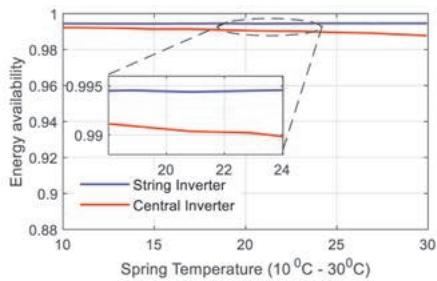  
(a) Energy availability in spring

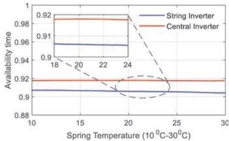  
(b) Availability time in spring

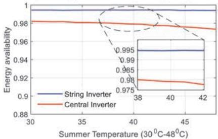

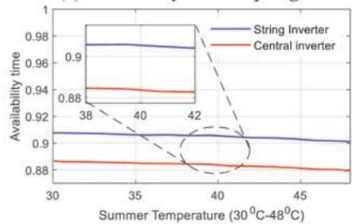

(c) Energy availability in summer  
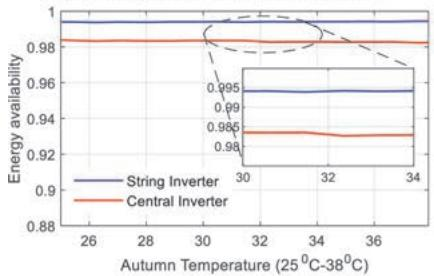

(d) Availability time in summer  
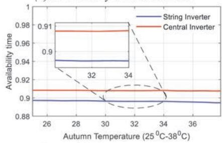

(e) Energy availability in autumn  
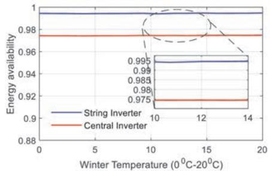  
(g) Energy availability in winter

(f) Availability time in autumn  
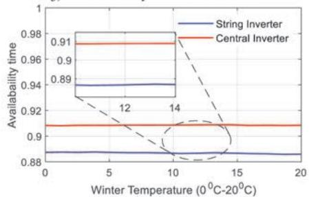  
(h) Availability time in winter  
Figure 4.16 Impact of periodic temperature variations on the reliability of string and central inverters

Table 4.6 Statistical parameters of temperature sensitivity test for energy availability index in different periods

<table><tr><td rowspan="2">Periodic division</td><td colspan="2">Mean</td><td colspan="2">Standard deviation</td></tr><tr><td>String</td><td>Central</td><td>String</td><td>Central</td></tr><tr><td>Spring</td><td>0.9931</td><td>0.9939</td><td> $4.26 \times 10^{-4}$ </td><td> $6.97 \times 10^{-3}$ </td></tr><tr><td>Summer</td><td>0.9928</td><td>0.9927</td><td> $4.18 \times 10^{-4}$ </td><td> $7.62 \times 10^{-3}$ </td></tr><tr><td>Autumn</td><td>0.9932</td><td>0.9953</td><td> $4.02 \times 10^{-4}$ </td><td> $2.17 \times 10^{-3}$ </td></tr><tr><td>Winter</td><td>0.9931</td><td>0.9967</td><td> $4.07 \times 10^{-4}$ </td><td> $5.93 \times 10^{-4}$ </td></tr></table>

Further, the energy availability and availability time in Figure 4.16 are analyzed using the mean and standard deviation of energy availability and availability time indices. From Table 4.6, it is identified that the string inverter dominates the central inverter over energy availability with high mean and low standard deviation. The higher mean value indicates the high energy production and the lower standard deviation indicates low sensitivity to change in temperature. This adheres to the condition that any failure in the string inverter blocks the power output of the only string, whereas the failure in central inverter blocks the complete power generation resulting in reduced energy availability. Similarly, the results in Table 4.7 indicate that the central inverter dominates the string inverter configuration over the availability time with high mean and low standard deviation. This adheres to the condition that the string inverter-based systems are prone to more failures due to the existence of more inverters and high redundancy. Further, the higher mean value and lower standard deviation for string inverter over availability time indicate the problems faced by the central inverter due to high-power inputs during summer. This high-power phenomenon dominates the multiplicity of string inverters and results in more failures in the central inverter during summer.

Table 4.7 Statistical parameters of temperature sensitivity test for availability time index in different periods

<table><tr><td rowspan="2">Periodic division</td><td colspan="2">Mean</td><td colspan="2">Standard deviation</td></tr><tr><td>String</td><td>Central</td><td>String</td><td>Central</td></tr><tr><td>Spring</td><td>0.8976</td><td>0.9027</td><td> $5.97 \times 10^{-3}$ </td><td> $3.92 \times 10^{-3}$ </td></tr><tr><td>Summer</td><td>0.8992</td><td>0.8991</td><td> $6.09 \times 10^{-3}$ </td><td> $6.17 \times 10^{-3}$ </td></tr><tr><td>Autumn</td><td>0.9021</td><td>0.9042</td><td> $5.68 \times 10^{-3}$ </td><td> $1.21 \times 10^{-3}$ </td></tr><tr><td>Winter</td><td>0.9027</td><td>0.9061</td><td> $5.57 \times 10^{-3}$ </td><td> $9.1 \times 10^{-4}$ </td></tr></table>

## 4.4.3.2 Impact of solar insolation

The solar insolation defines the PV inverter input power, which is directly proportional to the power loss in IGBTs, diodes, and capacitors. This indicates that higher solar irradiance will result in high failure rates for the inverter. Further, to test the impact of solar insolation on PV systems, a sensitivity analysis is carried out by varying the PV inverter input power from 0.6 to 1.2 times of the standard input.

Figure 4.17 indicates that the energy availability of the central inverter system is highly vulnerable to variations in solar irradiance, especially during summer and spring. It decreases from 99.4 percent to 98 percent in summer and 99.3 percent to 98.3 percent in spring as the irradiance increases from 0.6 pu to 1.2 pu. Further, the energy and availability time of the string inverter system is less affected by the variation in irradiance for all the seasons as the system design evenly impacts the input power distribution. This indicates that the string inverters are less prone to the electrical stresses for an increase in solar irradiance level >1 pu. For a better understanding of the effect of solar irradiance on the energy and availability time of both inverters, the statistical parameters for results in Figure 4.17 are shown in Tables 4.8 and 4.9.

These statistical parameters correspond to the mean value and standard deviation of energy and availability time indices. From Table 4.8, it is observed that the string configuration is dominant in terms of energy availability index over the central configuration with a higher mean value and lower standard deviation. The higher mean values indicate high energy production whereas the lower standard deviation indicates lower sensitivity to temperature changes, except for the mean value in winter. This superiority is achieved by the string inverters as the failure of an inverter only affects the power generation of that specific string. Further, based on the statistical parameters for availability time in Table 4.9, it is observed that the string inverter is highly sensitive to solar irradiance, as the central inverter has a higher mean value.

## 4.4.3.3 Impact of capacitor equivalent series resistance

The capacitor ESR corresponds to the resistive part of the capacitor impedance that is largely observed in commonly used electrolytic capacitors for inverters. Generally, the increase in ESR results in higher hotspot temperatures making the capacitor more susceptible to failures. Further, to observe the sensitivity of inverter failures for changing ESR, a base case of the ESR variations by two times is generated and the results are given in Figure 4.18.

Figure 4.18 shows that the energy and availability time of string inverters are insensitive for ESR variations in all the seasons, whereas the central inverter system that is heavily equipped with cooling systems is insensitive to ESR variations especially in summer and spring. This is due to the even distribution of the input power among the string inverters of each phase. Further, different studies have identified in [41, 42] that the RMS ripple current for string inverters is six times less than the RMS ripple current for the central inverter. This results in a significantly lower hotspot temperature, which further leads to lower capacitor failure rate and steady energy and availability time for the string system. Moreover, the drawback of the central inverter system can be overcome by implementing an optimally rated capacitor at the design stage to ensure the system reliability.

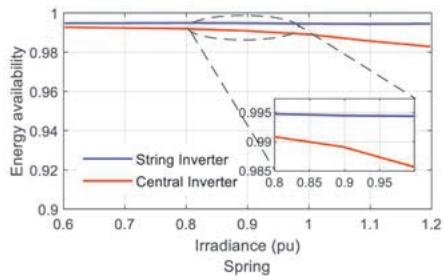  
(a) Energy availability in spring

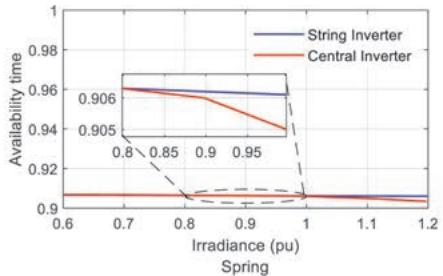  
(b) Availability time in spring

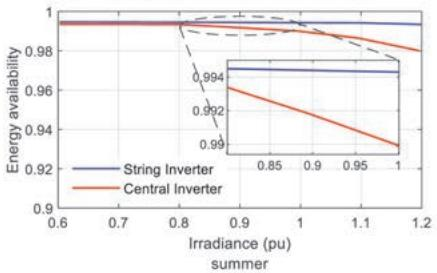  
(c) Energy availability in summer

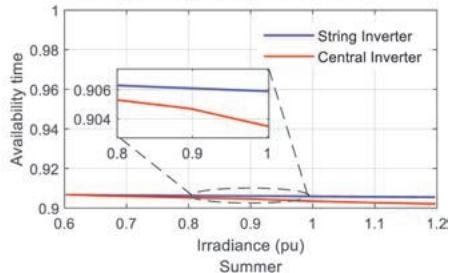  
(d) Availability time in summer

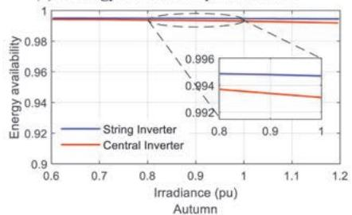

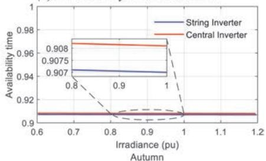

(e) Energy availability in autumn  
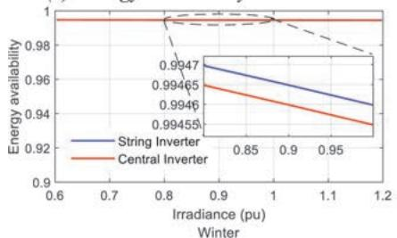  
(g) Energy availability in winter

(f) Availability time in autumn  
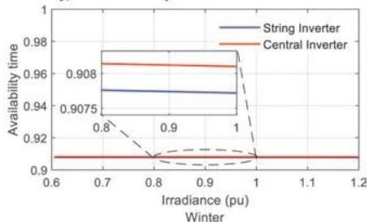  
(h) Availability time in winter  
Figure 4.17 Impact of solar irradiance variation on the reliability of string and central inverters

Table 4.8 Statistical parameters of irradiance sensitivity test for energy availability index in different periods

<table><tr><td rowspan="2">Periodic division</td><td colspan="2">Mean</td><td colspan="2">Standard deviation</td></tr><tr><td>String</td><td>Central</td><td>String</td><td>Central</td></tr><tr><td>Spring</td><td>0.9932</td><td>0.9911</td><td> $3.13 \times 10^{-5}$ </td><td> $3.47 \times 10^{-3}$ </td></tr><tr><td>Summer</td><td>0.9927</td><td>0.9916</td><td> $3.32 \times 10^{-5}$ </td><td> $4.68 \times 10^{-3}$ </td></tr><tr><td>Autumn</td><td>0.9929</td><td>0.9921</td><td> $1.83 \times 10^{-5}$ </td><td> $1.02 \times 10^{-4}$ </td></tr><tr><td>Winter</td><td>0.9926</td><td>0.9937</td><td> $5.71 \times 10^{-6}$ </td><td> $3.4 \times 10^{-5}$ </td></tr></table>

## 4.4.4 Impact of the increased number of strings on PV system reliability

Further, to investigate the impact of risks due to the more distributed design of PV systems, the number of strings n in a PV array is varied by keeping the total output of the array at 7 kW. The results of the risk analysis are given in Table 4.10.

From the results in Table 4.10, it is observed that during the initial stages of service life, the energy availability and availability time of the central PV system are insensitive to an increase in the number of strings n. This is because the string failure rate reduces with several panels, but more contingencies occur with increasing n. These effects create an offset at the beginning of the PV system life cycle. As the PV system proceeds to the end of life, the energy availability and availability time decrease very quickly for an increased number of strings due to the dominance effect of the aging of components. In the case of a string inverter-based PV system, it is observed that the energy availability slightly decreases during the first 10 years of the service life with an increase in n. Similarly, the availability time drops to a significant value with increasing average repair time for an increase in n. This indicates that the maintenance requirements for increasing n in string inverters elevate quickly, resulting in higher maintenance costs.

Table 4.9 Statistical parameters of irradiance sensitivity test for availability time index in different periods

<table><tr><td rowspan="2">Periodic division</td><td colspan="2">Mean</td><td colspan="2">Standard deviation</td></tr><tr><td>String</td><td>Central</td><td>String</td><td>Central</td></tr><tr><td>Spring</td><td>0.906</td><td>0.9062</td><td> $1.3 \times 10^{-4}$ </td><td> $1.41 \times 10^{-3}$ </td></tr><tr><td>Summer</td><td>0.9058</td><td>0.906</td><td> $2.1 \times 10^{-4}$ </td><td> $2.97 \times 10^{-3}$ </td></tr><tr><td>Autumn</td><td>0.9075</td><td>0.9082</td><td> $4.99 \times 10^{-5}$ </td><td> $2.71 \times 10^{-4}$ </td></tr><tr><td>Winter</td><td>0.9078</td><td>0.9081</td><td> $1.17 \times 10^{-5}$ </td><td> $1.47 \times 10^{-5}$ </td></tr></table>

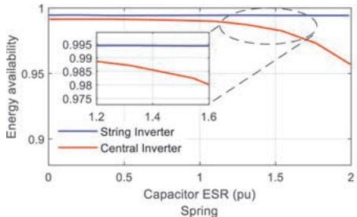  
(a) Energy availability in spring

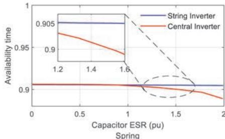  
(b) Availability time in spring

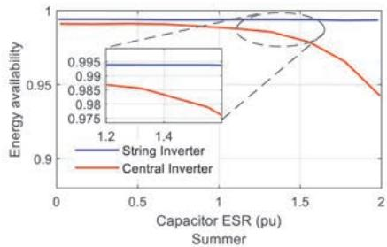  
(c) Energy availability in summer

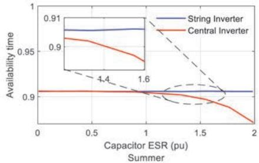  
(d) Availability time in summer

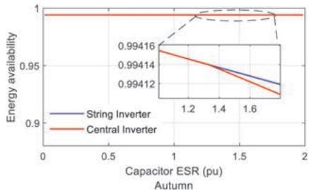

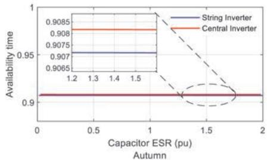

(e) Energy availability in autumn  
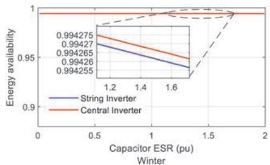  
(g) Energy availability in winter

(f) Availability time in autumn  
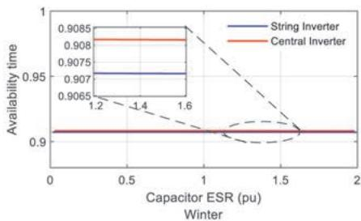  
(h) Availability time in winter  
Figure 4.18 Impact of capacitor ESR on the reliability of string and central inverters

Table 4.10 Impact of the increased number of strings on the availability of PV inverters

<table><tr><td colspan="9">Energy availability</td></tr><tr><td rowspan="3">Time (years)</td><td colspan="8">Number of strings</td></tr><tr><td colspan="2">4</td><td colspan="2">8</td><td colspan="2">12</td><td colspan="2">16</td></tr><tr><td>Central inverter</td><td>String inverter</td><td>Central inverter</td><td>String inverter</td><td>Central inverter</td><td>String inverter</td><td>Central inverter</td><td>String inverter</td></tr><tr><td>0</td><td>0.98</td><td>0.98</td><td>0.98</td><td>0.98</td><td>0.97</td><td>0.98</td><td>0.96</td><td>0.98</td></tr><tr><td>5</td><td>0.91</td><td>0.94</td><td>0.89</td><td>0.94</td><td>0.88</td><td>0.94</td><td>0.88</td><td>0.93</td></tr><tr><td>10</td><td>0.88</td><td>0.91</td><td>0.87</td><td>0.91</td><td>0.87</td><td>0.89</td><td>0.83</td><td>0.88</td></tr><tr><td>15</td><td>0.79</td><td>0.88</td><td>0.76</td><td>0.87</td><td>0.73</td><td>0.87</td><td>0.71</td><td>0.85</td></tr><tr><td>20</td><td>0.76</td><td>0.83</td><td>0.73</td><td>0.78</td><td>0.71</td><td>0.75</td><td>0.68</td><td>0.7</td></tr><tr><td>25</td><td>0.73</td><td>0.81</td><td>0.71</td><td>0.76</td><td>0.68</td><td>0.71</td><td>0.6</td><td>0.62</td></tr><tr><td colspan="9">Availability time</td></tr><tr><td rowspan="3">Time (years)</td><td colspan="8">Number of strings</td></tr><tr><td colspan="2">4</td><td colspan="2">8</td><td colspan="2">12</td><td colspan="2">16</td></tr><tr><td>Central inverter</td><td>String inverter</td><td>Central inverter</td><td>String inverter</td><td>Central inverter</td><td>String inverter</td><td>Central inverter</td><td>String inverter</td></tr><tr><td>0</td><td>0.88</td><td>0.88</td><td>0.88</td><td>0.86</td><td>0.88</td><td>0.86</td><td>0.88</td><td>0.86</td></tr><tr><td>5</td><td>0.85</td><td>0.86</td><td>0.84</td><td>0.85</td><td>0.84</td><td>0.85</td><td>0.84</td><td>0.85</td></tr><tr><td>10</td><td>0.73</td><td>0.81</td><td>0.71</td><td>0.78</td><td>0.67</td><td>0.75</td><td>0.6</td><td>0.73</td></tr><tr><td>15</td><td>0.68</td><td>0.69</td><td>0.62</td><td>0.63</td><td>0.56</td><td>0.58</td><td>0.48</td><td>0.54</td></tr><tr><td>20</td><td>0.52</td><td>0.51</td><td>0.43</td><td>0.46</td><td>0.35</td><td>0.4</td><td>0.26</td><td>0.32</td></tr><tr><td>25</td><td>0.24</td><td>0.2</td><td>0.18</td><td>0.12</td><td>0.11</td><td>0.07</td><td>0</td><td>0</td></tr></table>

Table 4.11 Impact of panel failure rate on availability of PV inverters

<table><tr><td colspan="7">Energy availability</td></tr><tr><td rowspan="3">Time (years)</td><td colspan="6">Panel failure rate(pu)</td></tr><tr><td colspan="2">0</td><td colspan="2">1</td><td colspan="2">2</td></tr><tr><td>Central inverter</td><td>String inverter</td><td>Central inverter</td><td>String inverter</td><td>Central inverter</td><td>String inverter</td></tr><tr><td>0</td><td>0.97</td><td>0.98</td><td>0.97</td><td>0.97</td><td>0.96</td><td>0.97</td></tr><tr><td>5</td><td>0.94</td><td>0.93</td><td>0.92</td><td>0.91</td><td>0.91</td><td>0.9</td></tr><tr><td>10</td><td>0.89</td><td>0.87</td><td>0.88</td><td>0.85</td><td>0.85</td><td>0.83</td></tr><tr><td>15</td><td>0.82</td><td>0.83</td><td>0.8</td><td>0.8</td><td>0.79</td><td>0.78</td></tr><tr><td>20</td><td>0.8</td><td>0.78</td><td>0.78</td><td>0.77</td><td>0.76</td><td>0.75</td></tr><tr><td>25</td><td>0.78</td><td>0.76</td><td>0.77</td><td>0.75</td><td>0.75</td><td>0.75</td></tr><tr><td colspan="7">Availability time</td></tr><tr><td rowspan="3">Time (years)</td><td colspan="6">Number of strings</td></tr><tr><td colspan="2">0</td><td colspan="2">1</td><td colspan="2">2</td></tr><tr><td>Central inverter</td><td>String inverter</td><td>Central inverter</td><td>String inverter</td><td>Central inverter</td><td>String inverter</td></tr><tr><td>0</td><td>0.87</td><td>0.88</td><td>0.83</td><td>0.83</td><td>0.8</td><td>0.8</td></tr><tr><td>5</td><td>0.86</td><td>0.85</td><td>0.83</td><td>0.81</td><td>0.8</td><td>0.8</td></tr><tr><td>10</td><td>0.79</td><td>0.79</td><td>0.76</td><td>0.75</td><td>0.7</td><td>0.73</td></tr><tr><td>15</td><td>0.67</td><td>0.62</td><td>0.56</td><td>0.53</td><td>0.51</td><td>0.44</td></tr><tr><td>20</td><td>0.61</td><td>0.53</td><td>0.49</td><td>0.41</td><td>0.31</td><td>0.33</td></tr><tr><td>25</td><td>0.34</td><td>0.3</td><td>0.16</td><td>0.17</td><td>0</td><td>0</td></tr></table>

## 4.4.5 Impact of panel failure rate on PV system reliability

The effect of PV panel failure rate $\lambda_{p}$ on the reliability of the PV system is assessed through sensitivity analysis as shown in Table 4.11.

From the results in Table 4.11, it is observed that the failure rate has a similar effect on energy availability and availability time of both central and string connected PV systems. This is due to the high number of series-connected modules in each string. Further, it can be specified that the availability time is more sensitive to the failure rate than the energy availability. Notably, the repair time for the PV panel $r_{p}$ has similar sensitivity characteristics with the failure rate of the PV panel. This is because the PV panel availability is equal to $\frac{\lambda_{p}r_{p}}{(1+\lambda_{p}r_{p})}$ , where both the variables $\lambda_{p}$ and $r_{p}$ are exchangeable.

## 4.5 Summary

This chapter discussed a case study to evaluate the reliability of a PV system. The developed approach quantified the effects of different operational conditions on the reliability of PV arrays, inverters, and overall PV system. Further, two different PV system configurations developed on 20-kW grid-connected central and string inverter systems are identified to perform the reliability analysis by adopting SEMs. Besides, the major contributions include risk analysis for periodic impacts on the PV systems and effect analysis of aging failure models and different operational conditions. These aspects of the developed approach and their implementation with actual PV systems provide efficient design options for PV systems and valuable information for operation and maintenance.

## References

[1] National Institution for transforming India. Report of the expert group on 175 GW. New Delhi; 2015.

[2] Renewable Energy Project Monitoring Division. Plant wise details of all India renewable energy projects. 6/3/2019/1410. New Delhi, India: Central electricity authority, Ministry of Power, Government of India; 2020. Available from https://cea.nic.in/wp-content/uploads/2020/04/Plant-wise-details-of-RE-Installed-Capacity-merged.pdf [Accessed 15th May 2021].

[3] Alagh Y.K., IEA. ‘India 2020 policy energy review’. Journal of Quantitative Economics: Journal of the Indian Econometric Society. 2006;4(1):1–14.

[4] Cronin J., Anandarajah G., Dessens O. ‘Climate change impacts on the energy system: A review of trends and gaps’. Climatic Change. 2018;151(2):79–93.

[5] Drück H., Pillai R.G., Tharian M.G., Majeed A.Z. (eds.). Green Buildings and Sustainable Engineering. Singapore: Springer Singapore; 2019.

[6] Indian Met Department. Ever Recorded Maximum Temperature, Minimum Temperature and 24 Hours Heaviest Rainfall upto 2010. Pune; 2010.

[7] Häberlin H. ‘Normalized representation of energy and power of PV systems’. Photovoltaics: System Design and Practice. 1st edn. Chichester, UK: John Wiley & Sons, Ltd; 2012. pp. 487–506. Available from https://onlinelibrary.wiley.com/doi/book/10.1002/9781119976998.

[8] Sungrow. SG15KTL-M/SG20KTL-M Multi-MPPT string inverter for 1000 Vdc system. Version 13. 2019. Available from https://www.europe-solarstore.com/download/Sungrow/SUNGROW\_SG15\_20KTL-M\_V13\_Datasheet.

[9] Sungrow. ‘SG1250UD/SG1500UD outdoor inverter for 1000 Vdc system’. 2019.

[10] Saha K. ‘Planning and installing photovoltaic system: a guide for installers, architects and engineers’. International Journal of Environmental Studies. 2014:1–2.

[11] Formica T.J., Khan H.A., Pecht M.G. 'The effect of inverter failures on the return on investment of solar photovoltaic systems'. IEEE Access. 2017;5:21336–43.

[12] Flicker J., Kaplar R., Marinella M., Granata J. 'PV inverter performance and reliability: what is the role of the bus capacitor?' 2012 IEEE 38th Photovoltaic Specialists Conference (PVSC) PART. 2012;2:1–3.

[13] Harms J.W. Revision of MIL-HDBK-217, Reliability prediction of electrical equipment. Annual Symposium on Reliability and Maintainability (RAMS); San Jose, CA, USA, 25-28 January 2010; 1991. pp. 1–3.

[14] FIDES Group. Reliability methodology for electronics systems. FIDES guide 2009 Edition A. France: Union Technique de l'Electricité; 2010. pp. 1–465. Available from https://www.fides-reliability.org/en [Accessed 15th May 2021].

[15] ‘Jonathan S. (Ed.). Reliability Characterisation of Electrical and Electronic Systems. Elsevier’. 2015.

[16] Kurukuru V.S.B., Haque A., Khan M.A., Tripathy A.K. 'Reliability analysis of silicon carbide power modules in voltage source converters'. 2019 International Conference on Power Electronics, Control and Automation (ICPECA); 2019. pp. 1–6.

[17] Department of Defense of the USA. ‘Reliability prediction of electronic equipment’. Military Handbook (MIL-HDBK). 1991;217F:205.

[18] Zhou D., Blaabjerg F., Lau M., Tonnes M. Thermal profile analysis of doubly-fed induction generator based wind power converter with air and liquid cooling methods. 2013 15th European Conference on Power Electronics and Applications (EPE); 2013. pp. 1–10.

[19] Shahzad M., Bharath K.V.S., Khan M.A., Haque A. 'Review on reliability of power electronic components in photovoltaic inverters'. 2019 International Conference on Power Electronics; 2019. pp. 1–6.

[20] Liu X., Li L., Das D., Pecht M. ‘An electro-thermal parametric degradation model of insulated gate bipolar transistor modules’. Microelectronics Reliability. 2020;104(46(9)):113559.

[21] Infineon Technologies AG. IGBT selection guide-Common IGBT applications and topologies. B133-I0528-V1-7600-EU-EC. 9500 Villach, Austria: Infineon Technologies Austria AG; 2018. pp. 1–8. Available from https://www.infineon.com/cms/austria/en/ [Accessed 15th May 2021].

[22] Clemente S. A simple tool for the selection of IGBTs for motor drives and UPSs. Proceedings of 1995 IEEE Applied Power Electronics Conference and Exposition (APEC); 1995. pp. 755–64.

[23] Flicker J.D. Capacitor reliability in photovoltaic inverters. Unlimited Release. Albuquerque, New Mexico 87185 and Livermore, California 94550: Sandia National Laboratories; 2012. pp. 1–78. Available from http://www.ntis.gov/help/ordermethods.asp?loc=7-4-0#online [Accessed 15th May 2021].

[24] Nelson J.J., Venkataramanan G., El-Refaie A.M. 'Fast thermal profiling of power semiconductor devices using Fourier techniques'. IEEE Transactions on Industrial Electronics. 2006;53(2):521–9.

[25] Ton D B.W. ‘Summary report on the DOE high-tech inverter workshop’. US Department of Energy. 2005;2005.

[26] U.S. Department of Energy. Workshop Summary Report: R & D for Dispatchable Distributed Energy Resources at Manufacturing Sites; 2016. p.32.

[27] Harb S., Balog R.S. Reliability of candidate photovoltaic module-integrated-inverter topologies. 2012 Twenty-Seventh Annual IEEE Applied Power Electronics Conference and Exposition (APEC); 2012. pp. 898–903.

[28] Li S. Condition-dependent risk assessment of large-scale grid-tied photovoltaic power systems. (University of Connecticut) [Master's Thesis] Storrs, CT 06269, United States, University of Connecticut Graduate School. 2012. Available from https://opencommons.uconn.edu/gs\_theses/370 [Accessed 15th May 2021].

[29] Warren C.A., Saint R. ‘IEEE reliability indices standards’. IEEE Industry Applications Magazine. 2005;11(1):16–22.

[30] Moharil R.M., Kulkarni P.S. 'Reliability analysis of solar photovoltaic system using hourly mean solar radiation data'. Solar Energy. 2010;84(4):691–702.

[31] Cristaldi L., Khalil M., Faifer M. ‘Markov process reliability model for photovoltaic module failures’. Acta Imeko. 2017;6(4):121.

[32] Sayed A., El-Shimy M., El-Metwally M., Elshahed M. ‘Reliability, availability and maintainability analysis for grid-connected solar photovoltaic systems’. Energies. 2019;12(7):1213.

[33] Hu R., Mi J., Hu T., Fu M., Yang P. ‘Reliability research for PV system using BDD-based fault tree analysis’. 2013 International Conference on Quality; 2013. pp. 359–63.

[34] Zhang P., Li W., Li S., Wang Y., Xiao W. ‘Reliability assessment of photovoltaic power systems: review of current status and future perspectives’. Applied Energy. 2013;104(1):822–33.

[35] Ghahderijani M.M., Barakati S.M., Tavakoli S. 'Reliability evaluation of stand-alone hybrid microgrid using sequential Monte Carlo simulation'. 2012 Second Iranian Conference on Renewable Energy and Distributed Generation; 2012. pp. 33–8.

[36] Billinton R., Hua Chen., Ghajar R. 'A sequential simulation technique for adequacy evaluation of generating systems including wind energy'. IEEE Transactions on Energy Conversion. 1996;11(4):728–34.

[37] Haque A., Bharath K.V.S., Khan M.A., Khan I., Jaffery Z.A. 'Fault diagnosis of photovoltaic modules'. Energy Science & Engineering. 2019;7(3):622–44.

[38] Kurukuru V.S.B., Blaabjerg F., Khan M.A., Haque A. 'A novel fault classification approach for photovoltaic systems'. Energies. 2020;13(2):308.

[39] Ahmad S., Hasan N., Bharath Kurukuru V.S., Ali Khan M., Haque A. 'Fault classification for single phase photovoltaic systems using machine learning techniques'. 2018 8th IEEE India International Conference on Power Electronics (IICPE); 2018. pp. 1–6.

[40] Kurukuru V.S.B., Haque A., Khan M.A., Tripathy A.K. 'Fault classification for photovoltaic modules using thermography and machine learning techniques'. 2019 International Conference on Computer and Information Sciences (ICCIS); 2019. pp. 1–6.

[41] Bianchi N., Dai Pre M. ‘Active power filter control using neural network technologies’. IEE Proceedings-Electric Power Applications. 2003;150(2):139–45.

[42] Martins D.C. ‘Analysis of a three-phase grid-connected PV power system using a modified dual-stage inverter’. ISRN Renewable Energy. 2013;2013(5):1–18.

Chapter 5

# Control strategy for grid-connected solar inverters

Zhongting Tang $^{1}$ and Yongheng Yang $^{2}$

## Abstract

As an essential interface between the photovoltaic (PV) panels and the utility grid, solar PV inverters are responsible for converting intermittent solar energy to meet the utility grid requirement, where the inverter output should be synchronized with the grid voltage in terms of phase frequency and amplitude. In addition, considering system cost, conversion efficiency, power quality, and reliability of the grid-connected PV system, the control strategy of solar inverters should be carefully designed. Regarding grid-connected solar inverters, the basic control strategies include a maximum power point tracking (MPPT) algorithm (i.e., increasing efficiency and maximizing the energy harvesting), a DC-link voltage control, and a grid-connected current control (i.e., responsible for the power injection and current quality). In this chapter, the model of PV modules and a few typical MPPT methods are briefly introduced. Then, the DC-link voltage control and grid-connected current control are presented for the single-phase and three-phase solar inverters, respectively.

## 5.1 Introduction

## 5.1.1 Demands for grid-connected solar inverters

The solar systems generally consist of PV panels (i.e., module, strings, or arrays), power electronics (i.e., solar inverters, used for solar energy harvesting in grid-connected applications), and electric grid, as shown in Figure 5.1. The continuous development of solar power-generation systems can provide more clean energy, yet it also poses threats in terms of stability and economic energy management to the utility grid $[1]$ (highly fluctuating due to intermittency). Therefore, to achieve a grid-friendly solar PV system with good performances of reliability, efficiency, and stability, the requirements for grid-connected solar inverters become more strict and flexible in many codes, exemplified as in $[2]$ . As shown in Figure 5.1, the demands for a grid-connected solar system have three aspects. Referring to the PV side, maximum power harvesting and good maintenance of the PV panels should be ensured to enhance high energy utilization as well as a long lifetime. For the grid side, the requirements of grid-supporting capabilities have also been increased in addition to good power quality, voltage or frequency regulation as well as the abnormal grid voltage protection and recovery. As the key interface, the grid-connected solar inverter not only should consider most of the above requirements in both PV and grid sides but also has great demands for high-efficiency conversion and proper temperature management $[3]$ . The main goal is to increase the reliability of solar inverters, producing the most energy with the least cost. In addition, communication is specifically required nowadays for intelligent and cooperative smart solar systems.

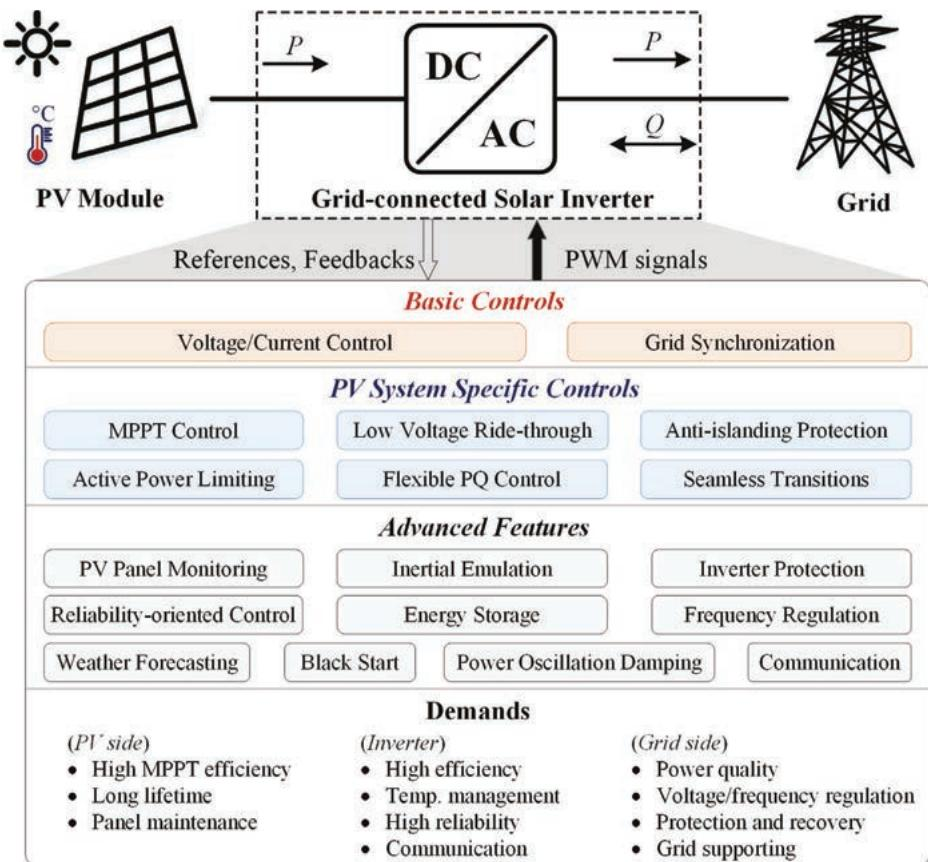  
Figure 5.1 General control structure for the grid-connected solar PV inverter

## 5.1.2 General controls

To meet the above demands, reliable and efficient controls should be performed on solar PV inverters. With the drastically increasing solar capacity, more advanced features have been required in addition to basic controls of grid-connected inverters and PV-system-specific controls, as detailed below.

1. Basic controls—As presented in Figure 5.1, the common basic controls of grid-tied inverters include voltage or current controls and grid synchronization schemes. In addition to improving the efficiency and reliability of the grid-connected solar PV inverters, another control objective is to have good steady-state and dynamic performances, achieve good power quality (e.g., a low total harmonic distortion level as grid requirements $[4, 5]$ ), and synchronize well with the grid voltage.

2. PV-system-specific controls—As known, power generation from solar PV systems is highly dependent on the weather or climate conditions $[1]$ . Thus, inverters applied in solar PV systems should have many specific controls, such as the MPPT control (i.e., MPPT at any solar radiation and temperature conditions) $[6]$ , active power limiting (i.e., alleviating the effect of the power fluctuation), anti-islanding protection, and fast recovery (i.e., grid resilience). In addition, the specific controls for the wind systems, e.g., low-voltage ride-through, are now mandatory in PV systems, as presented in IEEE 1547-2018 $[2]$ . Correspondingly, more flexible PQ (i.e., active power P and reactive power Q) control is required to provide grid support $[7]$ , e.g., frequency control through active power and voltage control by reactive power.

3. Advanced features—Since reliability and grid-supporting capability are emphasized more and more in today's grid-connected solar systems (i.e., high PV-capacity integration), many advanced features should be considered in the solar PV inverter controls. For instance, system condition monitoring and maintenance of PV panels achieve a long lifetime and high reliability. For a good grid-supporting performance of grid-connected solar PV inverters, delta power production control, artificial and virtual inertia controls, black start for enhancing the grid resilience, power oscillation damping, and implementing virtual synchronous generators by energy storage have been adopted in $[8–10]$ . In addition, reliability-oriented controls (e.g., power-limiting control with weather forecasting and junction temperature control $[11]$ ) can also be employed to enhance the reliability and lifetime of the solar PV system (both the PV panels and solar inverters).

Nevertheless, those PV special controls and advanced features can be achieved by modifying the universal controls of solar inverters, e.g., MPPT control and current or voltage controls, which is the focus of this chapter. Generally, an MPPT algorithm is integrated into either the DC voltage or the AC output current control in single-stage solar inverters and implemented by the DC–DC converter in two-stage solar inverters $[3]$ . Additionally, the DC-link voltage control and grid-connected current control are well implemented on the DC–AC conversion stage $[12]$ . In this chapter, first, the PV model, as well as some conventional MPPT algorithms, is depicted. Then, the modeling and controller design of the DC-link voltage and grid-connected current control will be introduced for both single-phase and three-phase inverters. In the end, the controller design will be demonstrated and verified with two case studies. One is a two-stage three-phase inverter in the dq-reference frame with proportional-integral (PI) controllers, including the current controller, DC-link voltage controller, and active power and reactive power controller. Another is the proportional-resonant (PR) controller for a single-phase inverter.

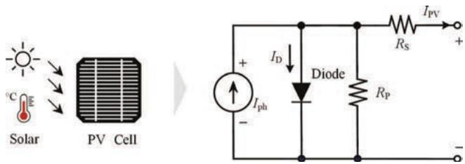  
Figure 5.2 Equivalent circuit of a PV cell model

## 5.2 MPPT control

## 5.2.1 Modeling of PV panels

It is known that the PV panel model and its characteristics under different temperatures and irradiance levels are of significance to the PV system analysis (i.e., especially the MPPT control design) [13]. As shown in Figure 5.2, a single-diode model of the PV cell is presented, where the output characteristics can be expressed as

$$
I _ {\mathrm{PV}} = I _ {\mathrm{ph}} - I _ {\mathrm{O}} \left[ \exp \left(\frac {V _ {\mathrm{PV}} + R _ {\mathrm{S}} I _ {\mathrm{PV}}}{A K T / q}\right) - 1 \right] - \frac {V _ {\mathrm{PV}} + R _ {\mathrm{S}} I _ {\mathrm{PV}}}{R _ {\mathrm{P}}}\tag{5.1}
$$

where $I_{\mathrm{PV}}$ and $V_{\mathrm{PV}}$ are the PV cell output current and voltage, $A$ is the ideality factor of the p-n junction, $K$ is the Boltzmann's constant ( $1.3806503 \times 10^{-23}$ J/K), $T$ is the cell temperature in Kelvin (for simplicity, in practice, the ambient temperature is considered), $q$ is the charge of an electron ( $1.6 \times 10^{-19}$ C), $R_{\mathrm{S}}$ and $R_{\mathrm{P}}$ are the PV cell series and shunt resistances (i.e., $R_{\mathrm{S}} \ll R_{\mathrm{P}}$ ), respectively, and $I_{\mathrm{ph}}$ is the photocurrent, depending on both the solar irradiance $G$ and the ambient temperature $T$ as

$$
I _ {\mathrm{ph}} (G, T) = \left(I _ {\mathrm{scn}} + K _ {\mathrm{i}} (T - T _ {\mathrm{n}})\right) \frac {G}{G _ {\mathrm{n}}}\tag{5.2}
$$

where $I_{\mathrm{scn}}$ and $G_{\mathrm{n}}$ are the nominal short-circuit current and the nominal solar irradiance (i.e., $G_{\mathrm{n}} = 1000 \, \mathrm{W/m^2}$ ) under the nominal cell temperature $T_{\mathrm{n}}$ (i.e., $T_{\mathrm{n}} = 25 \, ^{\circ}\mathrm{C} = 298.15 \, \mathrm{K}$ ), respectively, and $K_{\mathrm{i}}$ is the current temperature coefficient. In (5.1), the diode saturation current $I_{\mathrm{O}}$ is related to the ambient temperature according to

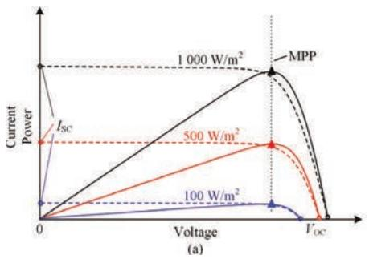

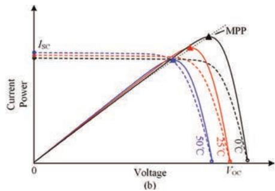  
Figure 5.3 I–V and P–V characteristics of a PV cell: (a) different solar irradiance levels at 25 °C and (b) different temperatures at 1 000 W/ $m^{2}$

$$
I _ {\mathrm{O}} (T) = \frac {I _ {\mathrm{scn}} + K _ {\mathrm{i}} (T - T _ {\mathrm{n}})}{\exp \left(\frac {V _ {\mathrm{ocn}} + K _ {\mathrm{v}} (T - T _ {\mathrm{n}})}{a V _ {\mathrm{t}} (T)}\right) - 1}\tag{5.3}
$$

in which $V_{ocn}$ is the nominal open-circuit voltage under $T_{n}$ , $K_{v}$ is the voltage temperature coefficient, a is the diode ideality factor, and $V_{t}$ is the thermal voltage.

According to (5.1)-(5.3), the irradiance and ambient temperature highly affect $I_{\mathrm{ph}}$ and $I_{\mathrm{o}}$ and, then, the PV output power. The current-voltage $(I - V)$ and power-voltage $(P - V)$ characteristics are shown in Figure 5.3, which indicate that the maximum power point (MPP) is varying with ambient conditions. Thus, the solar inverter should integrate proper controllers to track the MPP under different weather conditions.

## 5.2.2 MPPT algorithm

As demonstrated in Figure 5.3, the P-V characteristics curves are always of “hill” nature, where the hilltop represents the MPP. To track the MPP under different ambient conditions, many MPPT algorithms have been proposed, such as the Constant Voltage (CV), the Perturb and Observe (P&O), the Incremental Conductance (INC), the Sliding Control method, the fuzzy logic, and the neural network $[14]$ . Among them, the P&O and INC, which are also known as “hill-climbing” methods, are widely used due to their good performance in terms of simple implementation, fewer sensor requirements, and relatively high efficiency.

In this chapter, the P&O MPPT algorithm is exemplified to clarify the principle. Figure 5.4 depicts the flowchart of the P&O MPPT algorithm, where $V(\mathrm{k})$ and $I(\mathrm{k})$ are the PV output voltage and current at the time instant of k, and the output power is $P(\mathrm{k}) = V(\mathrm{k}) \times I(\mathrm{k})$ , correspondingly. As shown in Figure 5.4, the P&O operation can be summarized as:

1. When $dP / dV > 0$ (i.e., $dP = \Delta P$ and $dV = \Delta V$ ), the P&O MPPT algorithm acts in the forward perturbation, i.e., increasing the reference voltage of the PV panel ( $V_{\mathrm{ref}} = V(\mathrm{k}) + V_{\mathrm{step}}$ );

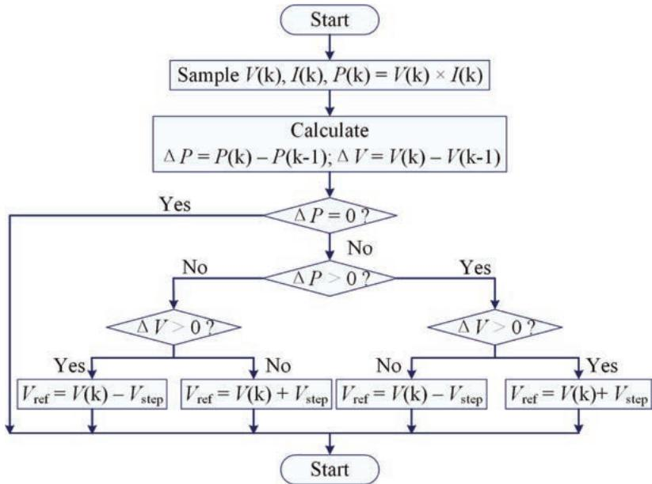  
Figure 5.4 Flowchart of the P&O MPPT algorithm

2. When $dP / dV < 0$ , the perturbation direction of the algorithm is reversed, where the reference voltage of the PV panel decreases (i.e., $V_{\mathrm{ref}} = V(\mathrm{k}) - V_{\mathrm{step}}$ , in which $V_{\mathrm{step}}$ is the perturbation step-size).

Obviously, the larger the $V_{step}$ is, the more rapid the tracking is, yet the larger the power oscillation is. Therefore, a modified P&O MPPT algorithm with a variable step-size can be adopted. According to different $\Delta P$ , the modified MPPT algorithm adopts different perturbation step-sizes $V_{step}$ to achieve a trade-off between the tracking speed and the power oscillation [15].

As mentioned in Section 5.1.2, the MPPT algorithm should be integrated into the control of the single-stage inverter or implemented only by the DC–DC converter of a two-stage system $[12]$ . In this chapter, simulation results of a 4-kW two-stage grid-connected solar inverter with a trapezoidal solar irradiance profile are shown in Figure 5.5, which compares the performance of the traditional P&O MPPT algorithm in Figure 5.4 and the variable step-size P&O MPPT algorithm in $[15]$ . As presented in Figure 5.5, the traditional P&O MPPT algorithm can have a rapid tracking of the MPP, and the power oscillation appears near the MPP. By comparison, the MPPT algorithm with variable perturbation step-size can achieve rapid tracking as well as small power variations. It should be mentioned that the above algorithms (e.g., CV, P&O, and INC) are not suitable for tracking the global MPP of multiple PV panels under partial shading conditions $[6, 14]$ . The prior-art global MPPT algorithms have been compared in $[16]$ , such as the particle swarm optimization algorithm $[17]$ and the Cuckoo search algorithm $[18]$ .

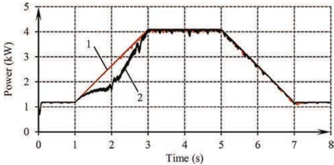  
Figure 5.5 Performance comparison of the modified (line 1) and conventional (line 2) P&O MPPT algorithm (ambient temperature 25 °C)

## 5.3 Solar inverter control

To simplify the control analysis of the PV system, a two-stage inverter system is shown in Figure 5.6, which includes the PV array, the DC–DC optimizer, the grid-connected inverter, the passive components, and the grid. Referring to control tasks, the first stage (i.e., the DC–DC converter) aims to implement the MPPT algorithm, while the second stage focuses on transferring the extracted power from the DC–DC converter to the grid with low energy losses $[19–21]$ . In addition, the inverter should have the performance in terms of good dynamics, robust synchronization, high power quality, and grid-supporting capability (i.e., reactive power injection, islanding protection, low-voltage ride-though capability, etc.) $[22–24]$ . Therefore, the DC-link voltage and the grid current should be regulated effectively to achieve those goals.

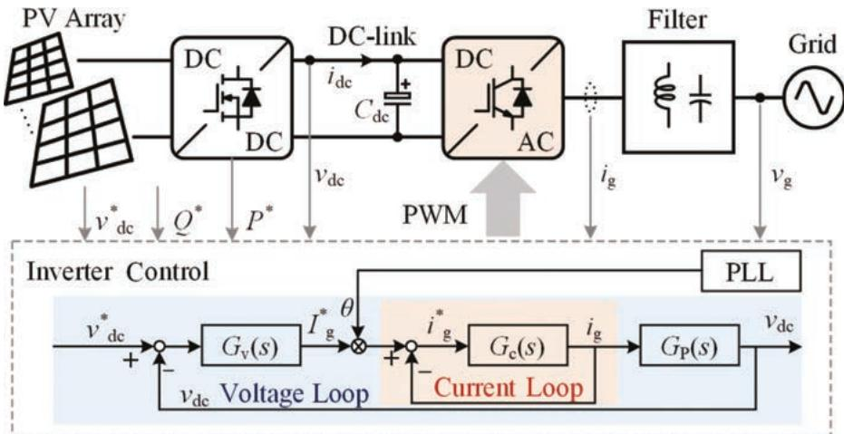  
Figure 5.6 Dual-loop control for a two-stage grid-connected solar inverter

As demonstrated in Figure 5.6, the typical double closed-loop control for the two-stage grid-connected solar inverter contains a current inner loop control and a voltage outer loop control [12, 25]. As shown in Figure 5.6, $v_{\mathrm{dc}}$ , $i_{\mathrm{dc}}$ , $v_{\mathrm{g}}$ , and $i_{\mathrm{g}}$ represent the sampling value of the DC-link voltage, the DC current, the grid voltage, and the grid current, respectively. $v_{\mathrm{dc}}^{*}$ and $i_{\mathrm{g}}^{*}$ are the reference DC-link voltage and the reference grid current. $I_{\mathrm{g}}^{*}$ is the amplitude of $i_{\mathrm{g}}^{*}$ . $G_{\mathrm{v}}(s)$ , $G_{\mathrm{c}}(s)$ , and $G_{\mathrm{p}}(s)$ are the DC-link voltage controller, the current controller, and the plant. $\theta$ is the phase angle, which is achieved by employing a PLL on the grid voltage $v_{\mathrm{g}}$ . The DC-link voltage controller $G_{\mathrm{v}}(s)$ generates the grid current amplitude $I_{\mathrm{g}}^{*}$ by regulating the error of the reference DC-link voltage $v_{\mathrm{dc}}^{*}$ and the sampling one $v_{\mathrm{dc}}$ . By multiplying $I_{\mathrm{g}}^{*}$ and the phase-locked loop (PLL)-synchronized signal $\theta$ of the grid voltage $v_{\mathrm{g}}$ , the grid current reference $i_{\mathrm{g}}^{*}$ can be obtained. Then, the current control $G_{\mathrm{c}}(s)$ generates the pulse width modulation (PWM) signals for the plant $G_{\mathrm{p}}(s)$ to achieve the zero-tracking of the grid current $i_{\mathrm{g}}$ . The following will present the modeling and design of the grid current inner loop control and the DC-link voltage outer loop controller (i.e., including the PQ control) for both the single-phase and three-phase inverters, as shown in Figure 5.7, where an $L$ -type filter (i.e., the inductance and its equivalent resistance are depicted) is adopted in both solar inverters.

## 5.3.1 Reference frame transformation

According to IEEE 1547 Std. [2], the solar inverters should have flexible power control capability (i.e., active power control and reactive power control) to achieve grid supporting. The PQ control based on the PQ theory is a way to achieve this goal, where the PQ theory needs the reference frame transformations in both the single-phase and three-phase inverters [26, 27]. Therefore, the following will depict the reference frame transformations, which include the Clarke and Park transformations (i.e., the AC control variables, including voltages and currents, will be transformed into two DC quantities). The reference frame transformations and the PQ controller can be applied to both single- and three-phase solar inverter system [28].

## A. Clarke transformation (abc→ αβ)

The circuit diagram of a three-phase inverter is presented in Figure 5.7b, where $v_{ga}$ , $v_{gb}$ , $v_{gc}$ , and $i_{ga}$ , $i_{gb}$ , and $i_{gc}$ represent the three-phase grid voltages and grid currents. Assuming that the grid-connected solar system is balanced when the inverter employs a three-phase inverter, the three-phase system can be transferred to a two-phase system on the stationary reference frame (i.e., the $\alpha\beta$ -reference frame). The transformation can be expressed as

$$
\left[ \begin{array}{c} x _ {\alpha} \\ x _ {\beta} \end{array} \right] = \frac {2}{3} \left[ \begin{array}{c c c} 1 & \frac {- 1}{2} & \frac {- 1}{2} \\ 0 & \frac {\sqrt {3}}{2} & \frac {- \sqrt {3}}{2} \end{array} \right] \left[ \begin{array}{c} x _ {\mathrm{a}} \\ x _ {\mathrm{b}} \\ x _ {\mathrm{c}} \end{array} \right]\tag{5.4}
$$

in which $x_{a}$ , $x_{b}$ , and $x_{c}$ are the control variables (e.g., voltages or currents of the system) and $x_{\alpha}$ and $x_{\beta}$ are transferred variables in the $\alpha\beta$ -reference frame [29].

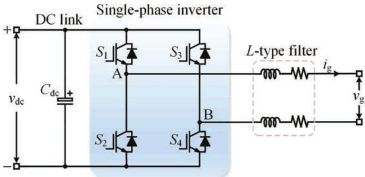

(a)  
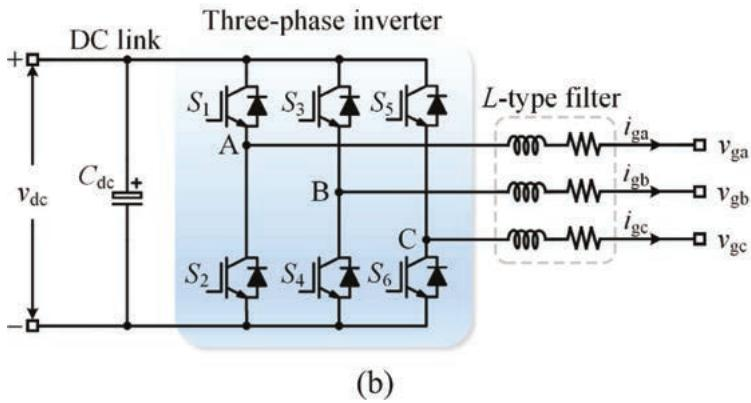  
Figure 5.7 Circuit diagram of two general solar inverters with an L-type filter: (a) single-phase inverter and (b) three-phase inverter

## B. Park transformation (αβ→ dq)

The main advantage of the flexible control based on the PQ theory in both the single-phase and three-phase inverter is to directly synthesize the power references. To simplify the control algorithm, the traditional PI controller is enough to have good steady-state and dynamic performance. However, the variables in the $\alpha\beta$ -reference frame in (5.4) are still AC variables rotating at the grid frequency, where the grid angle frequency is $\omega$ . In that case, the PI controller for the $\alpha\beta$ components (i.e., being period variable) has poor performance in terms of zero-error tracking [30]. To tackle this issue, the $\alpha\beta$ components can be transferred to the dq-reference frame (i.e., the synchronous reference frame), which is known as the Park transformation [31]. The $\alpha\beta \rightarrow dq$ transformation is given as

$$
\left[ \begin{array}{c} x _ {\mathrm{d}} \\ x _ {\mathrm{q}} \end{array} \right] = \left[ \begin{array}{c c} \cos \omega t & \sin \omega t \\ - \sin \omega t & \cos \omega t \end{array} \right] \left[ \begin{array}{c} x _ {\alpha} \\ x _ {\beta} \end{array} \right]\tag{5.5}
$$

in which $x_{d}$ and $x_{q}$ are the variables on the dq-reference frame. By employing (5.5), the two DC quantities on the dq-reference frame can be obtained to have a better control design, especially for PI controllers.

Referring to the single-phase systems, the $\alpha\beta$ -reference frame (i.e., a fictitious component $x_{\beta}$ in-quadrature with the original variable $x_{\alpha}$ ) can be created by an orthogonal signal generator (OSG), which has been generally reviewed in [32]. Then, the Park transformation in (5.5) can be employed as the same as three-phase systems.

## 5.3.2 Grid-connected current control

As shown in Figure 5.6, the inner grid-current loop should ensure a fast transient response, where the timescale should be far smaller than the outer voltage loop. In addition, the current controller also needs good performances in terms of power quality and grid synchronization $[25]$ . For a single-phase inverter, periodic controllers are good candidates for zero-error tracking, e.g., the proportional resonant controller, the repetitive controller, and the deadbeat controller $[33–35]$ . By contrast, the three-phase inverter commonly adopts a classical PI controller, which tracks the grid current reference in the synchronous dq-reference frame $[36]$ .

To unify and simplify the controller design for both the single-phase and three-phase inverters in this chapter, the traditional PI controller in the dq-reference frame will be discussed for the inner grid-current control, as presented in Figure 5.6. The d- and q-components can be calculated directly by the PQ control of the outer voltage control loop. Assuming that the controller sampling rate is fast enough and the impact from discretization can be neglected, the analysis is based on the models in the s-domain. Accordingly, this section mainly discusses the design procedure of the inner current loop for solar inverters, and the design of the DC-link voltage control and PQ control will be followed.

## A. Modeling of the grid current controller

Figure 5.7 shows the circuit diagrams of the single-phase and three-phase inverters, which can be modeled as current sources according to the Kirchhoff's law. Referring to the single-phase inverter in Figure 5.7a, the dynamics for the inverter output can be described as

$$
L \frac {d i _ {\mathrm{g}}}{d t} + R i _ {\mathrm{g}} = \upsilon_ {\mathrm{AB}} - \upsilon_ {\mathrm{g}}\tag{5.6}
$$

in which L and R are the L-type inductance and its equivalent resistance, $v_{AB}$ , $i_{g}$ , and $v_{g}$ are the inverter output voltage, the grid current, and the grid voltage, and A and B are the output terminals of the single-phase inverter.

Correspondingly, the dynamic equation of the three-phase inverter can be expressed as

$$
\left\{ \begin{array}{l} L \frac {d i _ {\mathrm{ga}}}{d t} + R i _ {\mathrm{ga}} = v _ {\mathrm{AB}} - v _ {\mathrm{ga}} \\ L \frac {d i _ {\mathrm{gb}}}{d t} + R i _ {\mathrm{gb}} = v _ {\mathrm{BC}} - v _ {\mathrm{gb}} \\ L \frac {d i _ {\mathrm{gc}}}{d t} + R i _ {\mathrm{gc}} = v _ {\mathrm{CA}} - v _ {\mathrm{gc}} \end{array} \right.\tag{5.7}
$$

in which $v_{AB}$ , $v_{BC}$ , $v_{CA}$ , $i_{ga}$ , $i_{gb}$ , $i_{gc}$ , and $v_{ga}$ , $v_{gb}$ , $v_{gc}$ are the output voltage, the grid current, and the grid voltage of the three-phase inverter, and A, B, and C are also the output terminals. As previously mentioned in Section 5.3.1, the single-phase inverter can obtain the dq-reference frame by an OSG and the Park transformation in (5.5), while the three-phase inverter can do so by the reference frame transformation in (5.4) and (5.5). Therefore, it can obtain the dynamics in the dq-reference frame as

$$
\left\{ \begin{array}{l} L \frac {d i _ {\mathrm{d}}}{d t} + R i _ {\mathrm{d}} - \omega L i _ {\mathrm{q}} = v _ {\mathrm{d} 1} - v _ {\mathrm{d}} \\ L \frac {d i _ {\mathrm{q}}}{d t} + R i _ {\mathrm{q}} + \omega L i _ {\mathrm{d}} = v _ {\mathrm{q} 1} - v _ {\mathrm{q}} \end{array} \right.\tag{5.8}
$$

where $i_{d}$ and $i_{q}$ are the grid current on the dq-reference frame, $v_{d1}$ and $v_{q1}$ are the inverter output voltages on the d- and q-axis, and $v_{d}$ and $v_{q}$ represent the grid voltages on the d- and q-axis, respectively.

It can be seen from (5.8) that the grid current can be controlled by regulating the inverter output voltage, where the d- and q-axis output currents are coupled to each other. Thus, the controller should add a decoupling term to obtain the output voltage references (i.e., $v_{dl}^{*}$ and $v_{ql}^{*}$ ), which can be modified as

$$
\left\{ \begin{array}{l} v _ {\mathrm{d1}} ^ {*} = v _ {\mathrm{d1}} + \omega L i _ {\mathrm{q}} - v _ {\mathrm{d}} \\ v _ {\mathrm{q1}} ^ {*} = v _ {\mathrm{q1}} - \omega L i _ {\mathrm{d}} - v _ {\mathrm{q}} \end{array} \right.\tag{5.9}
$$

The current control loop model can then be rewritten as

$$
\left\{ \begin{array}{l} L \frac {d i _ {\mathrm{d}}}{d t} + R i _ {\mathrm{d}} = v _ {\mathrm{dl}} ^ {*} \\ L \frac {d i _ {\mathrm{q}}}{d t} + R i _ {\mathrm{q}} = v _ {\mathrm{ql}} ^ {*} \end{array} \right.\tag{5.10}
$$

where the $d$ - and $q$ -axis output currents (i.e., the grid current in grid-connected solar systems) are decoupled. In addition, the dynamics of $d$ - and $q$ -axis output current are identical, as demonstrated in (5.10). Consequently, the control of one axis can be analyzed in detail during design. According to (5.10), the plant transfer functions from the inverter voltage references to the grid currents in the $dq$ -reference frame can be obtained as [37]

$$
\frac {i _ {\mathrm{d}} (s)}{v _ {\mathrm{d} 1} ^ {*} (s)} = \frac {i _ {\mathrm{q}} (s)}{v _ {\mathrm{q} 1} ^ {*} (s)} = \frac {1}{L s + R}\tag{5.11}
$$

also indicating that the d- and q-axis output currents have the same dynamics.

## B. Design of the grid current controller

As shown in (5.10), the current control loops for the $d$ - and $q$ -axis components are identical. Hence, the design procedure on the $d$ -axis (i.e., for the $d$ -axis current $i_{\mathrm{d}}$ )

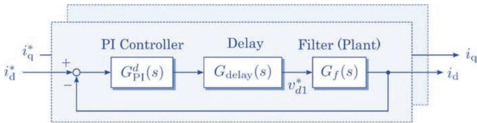  
Figure 5.8 Current control loops in the synchronous dq-reference frame, which focus on the design of the controllers: $G_{\mathrm{PI}}^{\mathrm{d}}(\mathrm{s}) = \text{the d-component PI current controller, } G_{\text{delay}}(\mathrm{s}) = \text{the elapsed delay due to the PWM and computations in the control system, and } G_{f}(\mathrm{s}) = \text{the filter (plant) transfer function}$

is depicted in Figure 5.8, which is also applicable in the controller design for the q-axis current.

As presented in Figure 5.8, these transfer functions of $G_{\mathrm{PI}}^{\mathrm{d}}(s)$ , $G_{\mathrm{delay}}(s)$ , and $G_{\mathrm{f}}(s)$ can be given as

$$
\begin{array}{l} G _ {\mathrm{PI}} ^ {\mathrm{d}} (s) = k _ {\mathrm{dp}} + \frac {k _ {\mathrm{di}}}{s} = \frac {k _ {\mathrm{dp}} (1 + T _ {\mathrm{di}} s)}{T _ {\mathrm{di}} s} \\ G _ {\mathrm{delay}} (s) = \frac {1}{1 + 1 . 5 T _ {\mathrm{s}} s} \\ G _ {\mathrm{f}} (s) = \frac {1}{R + L s} = \frac {T _ {\mathrm{f}}}{L (1 + T _ {\mathrm{f}} s)} \end{array}\tag{5.12}
$$

(5.13)

(5.14)

where $k_{dp}$ and $k_{di}$ are the proportional and the integral gains of the PI current controller, $T_{di} = k_{dp}/k_{di}$ is the integrator time constant, $T_{s}$ is the sampling time, and $T_{f} = L/R$ is the L-type filter time constant.

The cross-coupling $(\omega Li_{\mathrm{q}})$ and the voltage feed-forward $(v_{\mathrm{d}})$ terms in (5.9) for the d-axis current component control loop are neglected, which is illustrated in Figure 5.8. Therefore, the two terms are considered as disturbances in the current control system. Thus, the open-loop transfer function can be expressed as

$$
G _ {\mathrm{open}} ^ {\mathrm{d}} (s) = G _ {\mathrm{PI}} ^ {\mathrm{d}} (s) G _ {\mathrm{delay}} (s) G _ {\mathrm{f}} (s) = \frac {k _ {\mathrm{dp}} T _ {\mathrm{f}} (1 + T _ {\mathrm{di}} s)}{T _ {\mathrm{di}} L s (1 + T _ {\mathrm{f}} s) (1 + 1 . 5 T _ {\mathrm{s}} s)}\tag{5.15}
$$

Accordingly, the closed-loop transfer function is obtained as

$$
G _ {\mathrm{close}} ^ {\mathrm{d}} (s) = \frac {G _ {\mathrm{open}} ^ {\mathrm{d}} (s)}{1 + G _ {\mathrm{open}} ^ {\mathrm{d}} (s)} = \frac {k _ {\mathrm{dp}} T _ {\mathrm{f}} \left(1 + T _ {\mathrm{di}} s\right)}{T _ {\mathrm{di}} L s \left(1 + T _ {\mathrm{f}} s\right) \left(1 + 1 . 5 T _ {\mathrm{s}} s\right) + k _ {\mathrm{dp}} T _ {\mathrm{f}} \left(1 + T _ {\mathrm{di}} s\right)}\tag{5.16}
$$

which can also be applied for the q-axis current.

To simplify the parameters design of the PI current controller, the integrator time $T_{di}$ is chosen as the same as the filter time constant $T_{f}$ in (5.16). In that case, the closed-loop transfer function can be rewritten as

$$
G _ {\mathrm{close}} ^ {\mathrm{d}} (s) = \frac {k _ {\mathrm{dp}}}{L s (1 + 1 . 5 T _ {\mathrm{s}} s) + k _ {\mathrm{dp}}} = \frac {\frac {2 k _ {\mathrm{dp}}}{3 T _ {\mathrm{s}} L}}{s ^ {2} + \frac {2}{3 T _ {\mathrm{s}}} s + \frac {2 k _ {\mathrm{dp}}}{3 T _ {\mathrm{s}} L}}\tag{5.17}
$$

being a typical second-order system with

$$
\omega_ {\mathrm{n}} ^ {2} = \frac {2 k _ {\mathrm{dp}}}{3 T _ {\mathrm{s}} L} \text {and} 2 \zeta \omega_ {\mathrm{n}} = \frac {2}{3 T _ {\mathrm{s}}}\tag{5.18}
$$

where $\omega_{n}$ is the natural frequency and $\zeta$ is the damping ratio.

In practice, the optimal damping ratio is $\zeta = 1/\sqrt{2}$ to achieve an overshoot of 5 percent for a step response [33]. Consequently, the proportional and integral gains can be obtained as

$$
k _ {\mathrm{dp}} = \frac {L}{3 T _ {\mathrm{s}}} \text { and } k _ {\mathrm{di}} = \frac {L}{3 T _ {\mathrm{s}} T _ {\mathrm{f}}}\tag{5.19}
$$

Assuming that the grid current controller is optimally designed, the closed-loop transfer function can then be approximated as

$$
G _ {\mathrm{close}} ^ {\mathrm{d}} (s) \approx \frac {1}{1 + 3 T _ {\mathrm{s}} s} = \frac {1}{1 + \tau s}\tag{5.20}
$$

in which the bandwidth can be estimated as

$$
f _ {\mathrm{bw}} ^ {\mathrm{d}} \approx \frac {1}{2 \pi \tau} = \frac {1}{6 \pi T _ {\mathrm{s.}}}\tag{5.21}
$$

It should be noted that the reference frame transformations will increase calculational burdens in practice. Therefore, the current controller has another alternative method to achieve zero-error tracking, i.e., adopting a PR controller in the single-phase inverters or the three-phase inverters under the $\alpha\beta$ -reference frame [33, 34] (i.e., both are typical periodic signal systems). The PR controller has better performance in terms of zero-error tracking than the PI controller in AC signal systems, where the transfer function can be expressed as

$$
G _ {\mathrm{PR}} (s) = k _ {\mathrm{rp}} + \frac {k _ {\mathrm{ri}} s}{s ^ {2} + \omega^ {2}}\tag{5.22}
$$

where $k_{rp}$ and $k_{ri}$ represent the control gains of the PR controller $G_{\mathrm{PR}}(s)$ .

It can be illustrated in (5.22) that the PR controller can approach infinity at its resonant frequency $\omega$ , resulting in good tracking for the AC signal. Referring to parameters design for the PR controller, $k_{rp}$ can be tuned in the same way in (5.19), whereas $k_{ri}$ can be chosen as

$$
k _ {\mathrm{ri}} = 2 \alpha_ {\mathrm{h}} k _ {\mathrm{rp}}\tag{5.23}
$$

where $\alpha_{h}$ is the resonant bandwidth. To maintain control stability, the resonant bandwidth should be far smaller than the current controller bandwidth.

Accordingly, the PR controller has a significant advantage in AC periodic-signal systems, reducing the complexity caused by the reference frame transformation. Obviously, a small variation of the resonant frequency $\omega$ will affect the PR controller's performance in (5.22), possibly resulting in system instability. Therefore, an improved PR controller is introduced in [38] to have an adjustable tracking frequency, where the transfer function can be expressed as

$$
G _ {\mathrm{PR}} (s) = k _ {\mathrm{rp}} + \frac {k _ {\mathrm{ri}} \omega_ {\mathrm{c}} s}{s ^ {2} + 2 \omega_ {\mathrm{c}} s + \omega^ {2}}\tag{5.24}
$$

in which $\omega_{c}$ represents the adjustable cut-off frequency. Notably, the cut-off frequency $\omega_{c}$ will lead to a compromise of the controller gain [37–39].

## 5.3.3 PQ Control

## A. Modeling of the PQ control

As mentioned above, the advanced grid-connected solar system should have flexible power control capability, i.e., the full controllability of the active power and reactive power $[2]$ . The three-phase PQ control is based on the instantaneous power theory $[40]$ . In the synchronous dq-reference frame, the instantaneous active power P and reactive power Q can be given as

$$
\left\{ \begin{array}{l} P = \frac {3}{2} \left(v _ {\mathrm{d}} i _ {\mathrm{d}} + v _ {\mathrm{q}} i _ {\mathrm{q}}\right) \\ Q = \frac {3}{2} \left(v _ {\mathrm{q}} i _ {\mathrm{d}} - v _ {\mathrm{d}} i _ {\mathrm{q}}\right) \end{array} \right.\tag{5.25}
$$

Assuming that the PLL is aligned with the grid voltage vector to the d-axis of the dq-reference frame (i.e., $v_{q} = 0$ ), the transfer functions from the d- and q-axis output currents to the active and reactive power can be calculated as

$$
\begin{array}{c} \frac {P (s)}{i _ {\mathrm{d}} (s)} = \frac {3}{2} v _ {\mathrm{d}} (s) = \frac {3}{2} V _ {\mathrm{m}} \\ \frac {Q (s)}{i _ {\mathrm{q}} (s)} = - \frac {3}{2} v _ {\mathrm{d}} (s) = - \frac {3}{2} V _ {\mathrm{m}} \end{array}\tag{5.26}
$$

which are simply the proportional gains with $V_{m}$ being the amplitude of the grid voltage $v_{g}$ . Notably, for single-phase inverters, the power calculation and the single-phase PQ theory can be achieved similarly.

## B. Design of the DC-link controller

Figure 5.9 shows the PQ control block, which includes the DC-link voltage control in the dq-reference frame. According to (5.25) and (5.26), an open-loop control is sufficient to regulate the active and reactive power with the direct power references. That is, the active power and reactive power references (i.e., $P^{*}$ and $Q^{*}$ ) can be employed directly to obtain the d- and q-axis currents when the DC-link voltage is an ideal DC source. However, a closed-loop control is practically employed on the active power control to improve the control performance due to uncertainties in the system (e.g., input power variations and power losses), as demonstrated in Figure 5.9 (i.e., the active power is regulated by a closed-loop DC-link voltage controller). The DC-link voltage controller design will be detailed in Section 5.3.4.

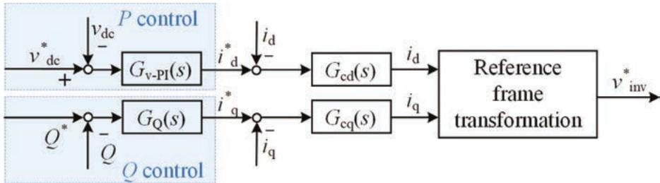  
Figure 5.9 PQ control block with DC-link voltage control loop in the synchronous dq-reference frame, where $\mathrm{G}_{Q}(\mathrm{s})$ represents the reactive power controller, $\mathrm{G}_{cd}(\mathrm{s})$ and $\mathrm{G}_{cq}(\mathrm{s})$ are the current controllers for the d- and q-axis components, and $v_{inv}^{*}$ is the reference inverter output voltage

## 5.3.4 DC-link voltage control

The main objective of the outer control loop of the DC-link voltage can be summarized in two aspects: (1) alleviating the pulsating power effects on the inverter (i.e., the double-frequency ripple of the single-phase inverter and the six-frequency ripple of the three-phase inverter); (2) minimizing the fluctuations caused by the transient input power change from the PV array $[12]$ . The most frequently used DC-link voltage controllers are based on a standard PI controller $[41]$ . In this section, the basic PI controller design for the DC-link voltage will be introduced.

## A. Modeling of the DC-link controller

Assuming that the power in the DC side is transferred to the AC side without losses, the input DC power is equal to the inverter output average power based on the instantaneous power theory, which can be given as

$$
\overbrace {v _ {\mathrm{dc}} \left(i _ {\mathrm{dc}} + C _ {\mathrm{dc}} \frac {d v _ {\mathrm{dc}}}{d t}\right)} ^ {\text {DC input power}} = \overbrace {\frac {1}{2} \left(v _ {\mathrm{d}} i _ {\mathrm{d}} + v _ {\mathrm{q}} i _ {\mathrm{q}}\right) (\text {single - phase}) o r \frac {3}{2} \left(v _ {\mathrm{d}} i _ {\mathrm{d}} + v _ {\mathrm{q}} i _ {\mathrm{q}}\right) (\text {three - phase})} ^ {\text {Output average power}}\tag{5.27}
$$

where $C_{dc}$ is the DC-link capacitance as shown in Figure 5.6. Here, the d-axis reference of the solar inverter is synchronized with the d-axis component of the grid voltage by a PLL, which means $v_{q} = 0$ . In that case, the linear model can be achieved by applying the small-signal analysis to (5.27). In that case, the transfer functions of the DC-link voltage in the single-phase inverter and the three-phase inverter can be expressed as

$$
\frac {v _ {\mathrm{dc}} (s)}{i _ {\mathrm{g}} (s)} = \frac {1}{2} \frac {V _ {\mathrm{m}}}{V _ {\mathrm{dc}} C _ {\mathrm{dc}} s} (\text {single - phase})\tag{5.28}
$$

$$
\frac {v _ {\mathrm{dc}} (s)}{i _ {\mathrm{d}} (s)} = \frac {3}{2} \frac {V _ {m}}{V _ {\mathrm{dc}} C _ {\mathrm{dc}} s} (\text {three - phase})\tag{5.29}
$$

in which $V_{dc}$ and $I_{dc}$ are the average DC-link voltage ( $v_{dc}$ ) and current ( $i_{dc}$ ), respectively.

## B. Design of the DC-link controller

As presented in Figure 5.9, the outer DC-link voltage controller can generate the d-axis current reference. In addition, the traditional and effective PI controller for the DC-link voltage will be introduced, where the transfer functions can be expressed as

$$
G _ {\mathrm{v}} (s) = k _ {\mathrm{vp}} + \frac {k _ {\mathrm{vi}}}{s} = \frac {k _ {\mathrm{vp}} (1 + T _ {\mathrm{vi}} s)}{T _ {\mathrm{vi}} s}\tag{5.30}
$$

$$
G _ {\mathrm{v}} (s) = \frac {1}{2} \frac {V _ {\mathrm{m}}}{V _ {\mathrm{dc}} C _ {\mathrm{dc}} s} (\text {single - phase}) \text {or} \frac {3}{2} \frac {V _ {\mathrm{m}}}{V _ {\mathrm{dc}} C _ {\mathrm{dc}} s} (\text {three - phase})\tag{5.31}
$$

where $k_{vp}$ and $k_{vi}$ represent the proportional and integral parameters of the PI controller for the DC-link voltage, respectively, and $T_{vi} = k_{vp} / k_{vi}$ is the integrator time.

Referring to the choice of the DC-link voltage reference, two aspects should be considered. One is that the DC-link voltage $V_{dc}$ should be higher than the minimum required value in different applications and control conditions to ensure the current controllability and avoid the overmodulation of grid-connected solar inverters. That can be summarized as follows:

• In single-phase systems, $V_{dc} \geq V_{m}$ .

\- In three-phase systems, $V_{dc} \geq \sqrt{3} V_{m}$ with space vector modulation scheme, while $V_{dc} \geq 2 V_{m}$ with a sinusoidal PWM scheme.

The other aspect is that the average DC-link voltage $V_{dc}$ should not be much higher than the above required value to ensure low power losses (i.e., high DC-link voltage leads to high switching losses for the semiconductor devices).

According to Figures 5.6, 5.8 and 5.9, the open-loop transfer function of the DC-link voltage control loop can be expressed by

$$
G _ {\mathrm{v-open}} (s) = G _ {\mathrm{v-PI}} (s) G _ {\text {close}} ^ {\mathrm{d}} (s) G _ {\mathrm{P}} (s)\tag{5.32}
$$

With the simplified current control loop in (5.20), the transfer function in (5.32) is given as

$$
G _ {\mathrm{v-open}} (s) \approx \frac {3 V _ {\mathrm{m}} k _ {\mathrm{vp}} \left(1 + T _ {\mathrm{vi}} s\right)}{2 T _ {\mathrm{vi}} V _ {\mathrm{dc}} C _ {\mathrm{dc}} s ^ {2} \left(1 + 3 T _ {\mathrm{s}} s\right)}\tag{5.33}
$$

Then, the phase crossover frequency $\omega_{pc}$ can be expressed as

$$
\omega_ {\mathrm{pc}} (s) = \frac {1}{\sqrt {3 T _ {\mathrm{vi}} T _ {\mathrm{s}}}}\tag{5.34}
$$

Accordingly, the parameters of the PI controller $k_{vp}$ and $k_{vi}$ at the phase crossover frequency ( $\omega_{pc}$ ) is given by

$$
k _ {\mathrm{vp}} = \frac {C _ {\mathrm{dc}}}{2 \sqrt {T _ {\mathrm{vi}} T _ {\mathrm{s}}}}, \text {and} \mathrm{k} _ {\mathrm{vi}} = \frac {C _ {\mathrm{dc}}}{2 \sqrt {T _ {\mathrm{vi}} ^ {3} T _ {\mathrm{s}}}}\tag{5.35}
$$

The parameters can be selected with the consideration of the desired bandwidth or the response time, the phase margin or the transient behavior of the solar inverter system.

## 5.4 Case study

## 5.4.1 PI controller for three-phase inverters

To demonstrate the control design in Section 5.3, the controllers of a 10-kW two-stage three-phase grid-connected solar inverter are designed. Figure 5.10 shows the schematic and the entire control of the inverter stage, which includes the reference frame transformations, the current control in the dq-reference frame, the PQ control, and the DC-link voltage control. The system parameters of the two-stage three-phase solar system are shown in Table 5.1. Assuming that the MPPT control in the first stage is robust, the input power for the three-phase inverter is constant.

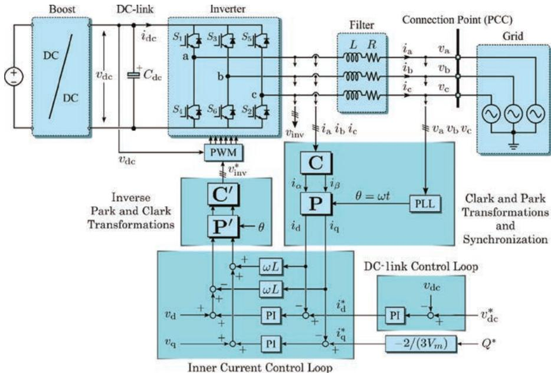  
Figure 5.10 Control structure of the inverter stage in a two-stage, three-phase grid-connected solar system in the synchronous dq-reference frame, where the PQ control includes a closed-loop voltage control and an open-loop control for the reactive power. The PLL is used for reference transformations.

Based on (5.19) and the system parameters in Table 5.1, the PI control parameters for the d-axis current loop can be chosen as

$$
k _ {\mathrm{dp}} = 3 3. 3 \text { and } k _ {\mathrm{di}} = 6 6 6. 7\tag{5.36}
$$

Table 5.1 System parameters of the 10-kW grid-connected three-phase solar inverter

<table><tr><td>Parameter</td><td>Symbol</td><td>Value</td></tr><tr><td>DC-link voltage reference</td><td> $v^{*}_{dc}$ </td><td>600 V</td></tr><tr><td>DC-link capacitor</td><td> $C_{dc}$ </td><td>500  $\mu$ F</td></tr><tr><td>Grid phase voltage amplitude</td><td> $V_{m}$ </td><td>311 V</td></tr><tr><td>Filter inductance</td><td> $L$ </td><td>5 mH</td></tr><tr><td>Filter resistance</td><td> $R$ </td><td>0.1  $\Omega$ </td></tr><tr><td>Switching frequency</td><td> $f_{sw}$ </td><td>20 kHz</td></tr><tr><td>Sampling frequency</td><td> $f_{sw} = 1/T_{s}$ </td><td>20 kHz</td></tr></table>