# Reliability of Power Electronics Converters for Solar Photovoltaic Applications

Edited by
Ahteshamul Haque, Frede Blaabjerg, Huai Wang,
Yongheng Yang, Zainul Addin Jaffery

Published by The Institution of Engineering and Technology, London, United Kingdom  
The Institution of Engineering and Technology is registered as a Charity in England & Wales (no. 211014) and Scotland (no. SC038698).

© The Institution of Engineering and Technology 2021

First published 2021

This publication is copyright under the Berne Convention and the Universal Copyright Convention. All rights reserved. Apart from any fair dealing for the purposes of research or private study, or criticism or review, as permitted under the Copyright, Designs and Patents Act 1988, this publication may be reproduced, stored or transmitted, in any form or by any means, only with the prior permission in writing of the publishers, or in the case of reprographic reproduction in accordance with the terms of licences issued by the Copyright Licensing Agency. Enquiries concerning reproduction outside those terms should be sent to the publisher at the undermentioned address:

The Institution of Engineering and Technology
Michael Faraday House
Six Hills Way, Stevenage
Herts, SG1 2AY, United Kingdom

www.theiet.org

While the authors and publisher believe that the information and guidance given in this work are correct, all parties must rely upon their own skill and judgement when making use of them. Neither the author nor publisher assumes any liability to anyone for any loss or damage caused by any error or omission in the work, whether such an error or omission is the result of negligence or any other cause. Any and all such liability is disclaimed.

The moral rights of the author to be identified as author of this work have been asserted by him in accordance with the Copyright, Designs and Patents Act 1988.

British Library Cataloguing in Publication Data
A catalogue record for this product is available from the British Library

ISBN 978-1-83953-116-3 (hardback)
ISBN 978-1-83953-117-0 (PDF)

Typeset in India by Exeter Premedia Services Private Limited Printed in the UK by CPI Group (UK) Ltd, Croydon

## Contents

List of figures
List of tables
About the Editors
1 Power electronics converters for solar PV applications
Ahteshamul Haque
1.1 Introduction
1.2 Role of power electronics in solar PV systems
1.3 DC–DC power electronics converters
1.3.1 Buck converter
1.3.2 Boost converter
1.3.3 Buck-boost converter
1.3.4 Single-ended primary inductance converter
1.3.5 Ćuk converter
1.3.6 Positive-output super-lift Luo converter
1.3.7 Ultra-lift Luo converter
1.3.8 Zeta converter
1.3.9 Flyback converter
1.3.10 Three-port half-bridge DC–DC converter
1.3.11 Full-bridge converter
1.3.12 Dual active bridge converter
1.3.13 Multielement resonant converter
1.3.14 Push-pull converter
1.4 DC–AC converters
1.4.1 Transformer-based inverter
1.4.2 Transformerless inverter
1.4.2.1 Half-bridge transformerless inverter
1.4.2.2 Neutral point-clamped transformerless inverter
1.4.2.3 Active neutral point-clamped transformerless inverter
1.4.2.4 T-type transformerless inverter
1.4.2.5 Three-switch transformerless inverter
1.4.2.6 Full-bridge transformerless inverter
1.4.2.7 H5 transformerless inverter
1.4.2.8 Full-bridge transformerless inverter with midpoint switches and diodes
1
2
3
4
5
6
7
8
9
10
11
12
13
14
15
16
17
18
19
20
21
22
23
24
25
26
27
28
29
30
31
32
33
34
35
36
37
38
39
40
41
42
43
44
45
46
47
48
49
50
51
52
53
54
55
56
57
58
59
60
61
62
63
64
65
66
67
68
69
70
71
72
73
74
75
76
77
78
79
80
81
82
83
84
85
86
87
88
89
90
91
92
93
94
95
96
97
98
99
100
101
102
103
104
105
106
107
108
109
110
111
112
113
114
115
116
117
118
119
120
121
122
123
124
125
126
127
128
129
130
131
132
133
134
135
136
137
138
139
140
141
142
143
144
145
146
147
148
149
150
151
152
153
154
155
156
157
158
159
160
161
162
163
164
165
166
167
168
169
170
171
172
173
174
175
176
177
178
179
180
181
182
183
184
185
186
187
188
189
190
191
192
193
194
195
196
197
198
199
200
201
202
203
204
205
206
207
208
209
210
211
212
213
214
215
216
217
218
219
220
221
222
223
224
225
226
227
228
229
230
231
232
233
234
235
236
237
238
239
240
241
242
243
244
245
246
247
248
249
250
251
252
253
254
255
256
257
258
259
260
261
262
263
264
265
266
267
268
269
270
271
272
273
274
275
276
277
278
279
280
281
282
283
284
285
286
287
288
289
290
291
292
293
294
295
296
297
298
299
300
301
302
303
304
305
306
307
308
309
310
311
312
313
314
315
316
317
318
319
320
321
322
323
324
325
326
327
328
329
330
331
332
333
334
335
336
337
338
339
340
341
342
343
344
345
346
347
348
349
350
351
352
353
354
355
356
357
358
359
360
361
362
363
364
365
366
367
368
369
370
371
372
373
374
375
376
377
378
379
380
381
382
383
384
385
386
387
388
389
390
391
392
393
394
395
396
397
398
399
400
401
402
403
404
405
406
407
408
409
410
411
412
413
414
415
416
417
418
419
420
421
422
423
424
425
426
427
428
429
430
431
432
433
434
435
436
437
438
439
440
441
442
443
444
445
446
447
448
449
450
451
452
453
454
455
456
457
458
459
460
461
462
463
464
465
466
467
468
469
470
471
472
473
474
475
476
477
478
479
480
481
482
483
484
485
486
487
488
489
490
491
492
493
494
495
496
497
498
499
500
501
502
503
504
505
506
507
508
509
510
511
512
513
514
515
516
517
518
519
520
521
522
523
524
525
526
527
528
529
530
531
532
533
534
535
536
537
538
539
540
541
542
543
544
545
546
547
548
549
550
551
552
553
554
555
556
557
558
559
560
561
562
563
564
565
566
567
568
569
570
571
572
573
574
575
576
577
578
579
580
581
582
583
584
585
586
587
588
589
590
591
592
593
594
595
596
597
598
599
600
601
602
603
604
605
606
607
608
609
610
611
612
613
614
615
616
617
618
619
620
621
622
623
624
625
626
627
628
629
630
631
632
633
634
635
636
637
638
639
640
641
642
643
644
645
646
647
648
649
650
651
652
653
654
655
656
657
658
659
660
661
662
663
664
665
666
667
668
669
670
671
672
673
674
675
676
677
678
679
680
681
682
683
684
685
686
687
688
689
690
691
692
693
694
695
696
697
698
699
700
701
702
703
704
705
706
707
708
709
710
711
712
713
714
715
716
717
718
719
720
721
722
723
724
725
726
727
728
729
730
731
732
733
734
735
736
737
738
739
740
741
742
743
744
745
746
747
748
749
750
751
752
753
754
755
756
757
758
759
760
761
762
763
764
765
766
767
768
769
770
771
772
773
774
775
776
777
778
779
780
781
782
783
784
785
786
787
788
789
790
791
792
793
794
795
796
797
798
799
800
801
802
803
804
805
806
807
808
809
810
811
812
813
814
815
816
817
818
819
820
821
822
823
824
825
826
827
828
829
830
831
832
833
834
835
836
837
838
839
840
841
842
843
844
845
846
847
848
849
850
851
852
853
854
855
856
857
858
859
860
861
862
863
864
865
866
867
868
869
870
871
872
873
874
875
876
877
878
879
880
881
882
883
884
885
886
887
888
889
890
891
892
893
894
895
896
897
898
899
900
901
902
903
904
905
906
907
908
909
910
911
912
913
914
915
916
917
918
919
920
921
922
923
924
925
926
927
928
929
930
931
932
933
934
935
936
937
938
939
940
941
942
943
944
945
946
947
948
949
950
951
952
953
954
955
956
957
958
959
960
961
962
963
964
965
966
967
968
969
970
971
972
973
974
975
976
977
978
979
980
981
982
983
984
985
986
987
988
989
990
991
992
993
994
995
996
997
998
999
1000
1001
1002
1003
1004
1005
1006
1007
1008
1009
1010
1011
1012
1013
1014
1015
1016
1017
1018
1019
1020
1021
1022
1023
1024
1025
1026
1027
1028
1029
1030
1031
1032
1033
1034
1035
1036
1037
1038
1039
1040
1041
1042
1043
1044
1045
1046
1047
1048
1049
1050
1051
1052
1053
1054
1055
1056
1057
1058
1059
1060
1061
1062
1063
1064
1065
1066
1067
1068
1069
1070
1071
1072
1073
1074
1075
1076
1077
1078
1079
1080
1081
1082
1083
1084
1085
1086
1087
1088
1089
1090
1091
1092
1093
1094
1095
1096
1097
1098
1099
1100
1101
1102
1103
1104
1105
1106
1107
1108
1109
1110
1111
1112
1113
1114
1115
1116
1117
1118
1119
1120
1121
1122
1123
1124
1125
1126
1127
1128
1129
1130
1131
1132
1133
1134
1135
1136
1137
1138
1139
1140
1141
1142
1143
1144
1145
1146
1147
1148
1149
1150
1151
1152
1153
1154
1155
1156
1157
1158
1159
1160
1161
1162
1163
1164
1165
1166
1167
1168
1169
1170
1171
1172
1173
1174
1175
1176
1177
1178
1179
1180
1181
1182
1183
1184
1185
1186
1187
1188
1189
1190
1191
1192
1193
1194
1195
1196
1197
1198
1199
1200
1201
1202
1203
1204
1205
1206
1207
1208
1209
1210
1211
1212
1213
1214
1215
1216
1217
1218
1219
1220
1221
1222
1223
1224
1225
1226
1227
1228
1229
1230
1231
1232
1233
1234
1235
1236
1237
1238
1239
1240
1241
1242
1243
1244
1245
1246
1247
1248
1249
1250
1251
1252
1253
1254
1255
1256
1257
1258
1259
1260
1261
1262
1263
1264
1265
1266
1267
1268
1269
1270
1271
1272
1273
1274
1275
1276
1277
1278
1279
1280
1281
1282
1283
1284
1285
1286
1287
1288
1289
1290
1291
1292
1293
1294
1295
1296
1297
1298
1299
1300
1301
1302
1303
1304
1305
1306
1307
1308
1309
1310
1311
1312
1313
1314
1315
1316
1317
1318
1319
1320
1321
1322
1323
1324
1325
1326
1327
1328
1329
1330
1331
1332
1333
1334
1335
1336
1337
1338
1339
1340
1341
1342
1343
1344
1345
1346
1347
1348
1349
1350
1351
1352
1353
1354
1355
1356
1357
1358
1359
1360
1361
1362
1363
1364
1365
1366
1367
1368
1369
1370
1371
1372
1373
1374
1375
1376
1377
1378
1379
1380
1381
1382
1383
1384
1385
1386
1387
1388
1389
1390
1391
1392
1393
1394
1395
1396
1397
1398
1399
1400
1401
1402
1403
1404
1405
1406
1407
1408
1409
1410
1411
1412
1413
1414
1415
1416
1417
1418
1419
1420
1421
1422
1423
1424
1425
1426
1427
1428
1429
1430
1431
1432
1433
1434
1435
1436
1437
1438
1439
1440
1441
1442
1443
1444
1445
1446
1447
1448
1449
1450
1451
1452
1453
1454
1455
1456
1457
1458
1459
1460
1461
1462
1463
1464
1465
1466
1467
1468
1469
1470
1471
1472
1473
1474
1475
1476
1477
1478
1479
1480
1481
1482
1483
1484
1485
1486
1487
1488
1489
1490
1491
1492
1493
1494
1495
1496
1497
1498
1499
1500
1501
1502
1503
1504
1505
1506
1507
1508
1509
1510
1511
1512
1513
1514
1515
1516
1517
1518
1519
1520
1521
1522
1523
1524
1525
1526
1527
1528
1529
1530
1531
1532
1533
1534
1535
1536
1537
1538
1539
1540
1541
1542
1543
1544
1545
1546
1547
1548
1549
1550
1551
1552
1553
1554
1555
1556
1557
1558
1559
1560
1561
1562
1563
1564
1565
1566
1567
1568
1569
1570
1571
1572
1573
1574
1575
1576
1577
1578
1579
1580
1581
1582
1583
1584
1585
1586
1587
1588
1589
1590
1591
1592
1593
1594
1595
1596
1597
1598
1599
1600
1601
1602
1603
1604
1605
1606
1607
1608
1609
1610
1611
1612
1613
1614
1615
1616
1617
1618
1619
1620
1621
1622
1623
1624
1625
1626
1627
1628
1629
1630
1631
1632
1633
1634
1635
1636
1637
1638
1639
1640
1641
1642
1643
1644
1645
1646
1647
1648
1649
1650
1651
1652
1653
1654
1655
1656
1657
1658
1659
1660
1661
1662
1663
1664
1665
1666
1667
1668
1669
1670
1671
1672
1673
1674
1675
1676
1677
1678
1679
1680
1681
1682
1683
1684
1685
1686
1687
1688
1689
1690
1691
1692
1693
1694
1695
1696
1697
1698
1699
1700
1701
1702
1703
1704
1705
1706
1707
1708
1709
1710
1711
1712
1713
1714
1715
1716
1717
1718
1719
1720
1721
1722
1723
1724
1725
1726
1727
1728
1729
1730
1731
1732
1733
1734
1735
1736
1737
1738
1739
1740
1741
1742
1743
1744
1745
1746
1747
1748
1749
1750
1751
1752
1753
1754
1755
1756
1757
1758
1759
1760
1761
1762
1763
1764
1765
1766
1767
1768
1769
1770
1771
1772
1773
1774
1775
1776
1777
1778
1779
1780
1781
1782
1783
1784
1785
1786
1787
1

1.4.2.9 H6-1 transformerless inverter 22  
1.4.2.10 Modified Highly Efficient and Reliable Inverter Concept 23  
1.4.2.11 oH5-1 transformerless inverter 24  
1.4.2.12 Modified transformerless inverter 24  
1.5 Summary 24  
References 25  

2 Wear-out failure prediction of a PV microinverter 35  
Yanfeng Shen and Huai Wang  
2.1 System description and reliability evaluation process 35  
2.1.1 System description 35  
2.1.2 Reliability evaluation process 36  
2.2 Electrothermal and lifetime modeling 37  
2.2.1 Power loss modeling 37  
2.2.2 Thermal modeling 37  
2.2.3 Lifetime modeling 43  
2.3 Wear-out failure analysis of the PV microinverter 43  
2.3.1 Static annual damage of components 44  
2.3.2 Monte Carlo simulation 45  
2.3.3 System failure probability due to wear-out 46  
2.4 Reliability improvement of the PV microinverter 48  
2.4.1 Advanced multimode control of the qZSSRC 48  
2.4.2 New DC-link electrolytic capacitor with longer nominal lifetime 49  
2.4.3 Wear-out failure probability 50  
2.5 Summary 51  
References 51  

3 Reliability analysis methods and tools 53  
Ionut Vernica and Frede Blaabjerg  
3.1 Background and motivation 53  
3.2 Failure mode and effect analysis 55  
3.3 Design for reliability 60  
3.4 Software tools in design for reliability 64  
3.5 Reliability testing and robustness validation 66  
3.5.1 Qualitative test methods 66  
3.5.2 Quantitative test methods 68  
3.5.3 Qualification testing 71  
3.6 Summary 73  
References 74  

4 Grid-connected solar inverter system: a case study 77  
V S Bharath Kurukuru

4.1 Identifying the site for case study 78  
4.1.1 Site details 78  
4.1.2 Components used in the system 83  
4.2 Data collected for reliability study 84  
4.2.1 Failure rate of power electronic switches 85  
4.2.1.1 Thermal model of IGBT and diode 86  
4.2.1.2 IGBT failure rate 88  
4.2.1.3 Diode failure rate 88  
4.2.1.4 Capacitor failure rate 89  
4.2.2 Reliability of inverter 90  
4.3 Reliability study for the identified site 92  
4.3.1 Risk modeling for components of PV system 92  
4.3.1.1 The periodic discrete probability distribution of input power 92  
4.3.2 Reliability analysis of PV array 94  
4.3.2.1 Equivalent parameters for reliability of PV string 94  
4.3.2.2 State enumeration for PV array reliability analysis 95  
4.3.2.3 Effect of aging and degradation 96  
4.3.3 PV system risk indices 97  
4.3.3.1 Equivalent parameters for reliability of PV string 97  
4.3.3.2 Equivalent parameters for reliability of PV string 98  
4.4 Results of site study for reliability analysis 99  
4.4.1 Results of reliability indices 99  
4.4.2 Aging and degradation effects 100  
4.4.3 PV risk assessment 100  
4.4.3.1 Impact of temperature 100  
4.4.3.2 Impact of solar insolation 105  
4.4.3.3 Impact of capacitor equivalent series resistance 105  
4.4.4 Impact of the increased number of strings on PV system reliability 107  
4.4.5 Impact of panel failure rate on PV system reliability 110  
4.5 Summary 110  
References 111  
Control strategy for grid-connected solar inverters 115  
Zhongting Tang and Yongheng Yang  
Abstract 115  
5.1 Introduction 115  
5.1.1 Demands for grid-connected solar inverters 115  
5.1.2 General controls 117  
5.2 MPPT control 118  
5.2.1 Modeling of PV panels 118  
5.2.2 MPPT algorithm 119

5.3 Solar inverter control 121  
5.3.1 Reference frame transformation 122  
A. Clarke transformation (abc→αβ) 122  
B. Park transformation (αβ→dq) 123  
5.3.2 Grid-connected current control 124  
A. Modeling of the grid current controller 124  
B. Design of the grid current controller 125  
5.3.3 PQ Control 128  
A. Modeling of the PQ control 128  
B. Design of the DC-link controller 128  
5.3.4 DC-link voltage control 129  
A. Modeling of the DC-link controller 129  
B. Design of the DC-link controller 129  
5.4 Case study 130  
5.4.1 PI controller for three-phase inverters 130  
5.4.2 PR controller for single-phase inverters 135  
5.5 Summary 137  
References 137  
6 Control strategy for grid-connected solar inverter for IEC standards 141  
Mohammed Ali Khan and Ariya Sangwongwanich  
6.1 LVRT requirement for control 141  
6.1.1 Permissible limit for voltage fluctuation 142  
6.1.2 Permissible limit for frequency fluctuation 142  
6.1.3 Power factor, reactive current injection, and reactive power requirement 144  
6.1.4 Overview of LVRT requirement based on grid codes 145  
6.2 Control strategy used to meet LVRT standards 148  
6.2.1 Generator-side converter 149  
6.2.1.1 Cost function 150  
6.2.1.2 Control algorithm 151  
6.2.2 Grid-side converter 151  
6.2.2.1 Inverter modeltationary reference 151  
6.2.2.2 Cost function 154  
6.2.2.3 Current tracking control algorithm and simulation 154  
6.2.3 Control structure on symmetrical faults 155  
6.2.4 Control structure and minimization function under unbalanced faults 156  
6.2.5 Experimental analysis 159  
6.3 Anti-islanding requirements for control 162  
6.3.1 IEEE Standard for Interconnection and Interoperability of resources and interfaces (IEEE 1547) 162  
6.3.2 Utility-interconnected PV inverters—test procedure of islanding prevention measures (IEC 62116) 164

6.3.3 IEEE recommended practice for utility interface of PV systems (IEEE 929) 164
6.3.4 Requirement overview for anti-islanding operation 165
6.4 Control strategy used to meet anti-islanding standards 165
6.4.1 Communication-based islanding detection scheme 166
6.4.1.1 Power line carrier (PLC) communication 166
6.4.1.2 Transfer trip 167
6.4.2 Local islanding detection scheme 168
6.4.2.1 Passive islanding detection technique 168
6.4.2.1.1 Frequency surge/over or under frequency 168
6.4.2.1.2 Rate of change in frequency 169
6.4.2.1.3 Over or under voltage 170
6.4.2.1.4 Harmonics distortion 170
6.4.2.1.5 Phase jump detection 170
6.4.2.2 Active islanding detection technique 170
6.4.2.2.1 Frequency shift (slip mode) 172
6.4.2.2.2 Active frequency drift 172
6.4.2.2.3 Frequency shift (Sandia) 172
6.4.2.2.4 Frequency jump 173
6.4.2.2.5 Voltage shift (Sandia) 173
6.4.2.2.6 Impedance measurement method 174
6.4.2.3 Hybrid islanding detection scheme 174
6.4.2.3.1 Frequency shift (Sandia) and ROCOF method 174
6.4.2.3.2 Voltage imbalance along with positive feedback 174
6.4.3 Intelligent islanding detection scheme 175
6.4.3.1 ANN-based islanding detection 175
6.4.3.2 FLC-based islanding detection technique 175
6.4.3.3 ANFIS-based islanding detection techniques 176
6.4.3.4 Decision tree-based islanding detection method 176
6.5 Reactive power control and its effect on reliability 176
6.6 Conclusion 179
References 181
Thermal image-based monitoring of PV modules and solar inverters 189
Zainul Abdin Jaffery
7.1 Introduction 189
7.2 Review of fault detection of PV modules 189
7.3 Thermal image-processing-based fault analysis 190
7.3.1 Preprocessing 191
7.3.2 Image segmentation 194
7.3.3 Feature extraction 194
7.3.4 Image classification 194

7.4 CNN-based fault diagnosis of solar PV modules 195  
7.4.1 Convolution layer 195  
7.4.2 Rectified linear unit 196  
7.4.3 Pooling 196  
7.5 CNN-based fault diagnosis of solar PV modules 198  
7.5.1 Feature extraction 198  
7.6 Summary 202  
References 202  

Failure mode classification for grid-connected photovoltaic converters 205  
V S Bharath Kurukuru, Mohammed Ali Khan, and Azra Malik  
8.1 Introduction 206  
8.2 Components of power electronic converters 210  
8.2.1 IGBT failure 210  
8.2.1.1 Wear out failure 211  
8.2.1.2 Catastrophic failure 212  
8.2.2 Thermal modelling of IGBT 213  
8.2.2.1 Analytic models 213  
8.2.2.2 Numeric models 214  
8.2.2.3 Network models 214  
8.2.3 Cooling measures 214  
8.2.4 DC-link capacitor failure 215  
8.2.5 Power diode failure 216  
8.3 Failure mechanisms of power semiconductors 216  
8.3.1 Failure mode, mechanisms and effects analysis 216  
8.3.2 Power semiconductor failure mechanisms 218  
8.3.2.1 Aluminium reconstruction 218  
8.3.2.2 Bond fatigue 219  
8.3.2.3 Die-attach fatigue and delamination 219  
8.3.2.4 Substrate cracking 219  
8.3.2.5 Bond-wire melting 220  
8.3.2.6 Die-attach voiding 220  
8.3.2.7 Aluminium corrosion 220  
8.3.2.8 Latch-up 220  
8.3.2.9 Avalanche breakdown 221  
8.3.2.10 Partial discharge 221  
8.3.2.11 Electrochemical and silver migration 221  
8.3.2.12 Dielectric breakdown 222  
8.3.2.13 Time-dependent dielectric breakdown 222  
8.3.2.14 Hot carrier injection 222  
8.3.2.15 Competing failure mechanisms 223  
8.3.3 Power semiconductor failure modes and mechanisms 223  
8.4 Data preparation and feature extraction 223

8.4.1 Wavelet transform 223  
8.4.2 Harmony search algorithm 226  
8.4.3 Statistical features 226  
8.4.3.1 Feature vector representation 226  
8.4.3.1.1 Signal preprocessing 226  
8.4.3.1.2 Normalization 228  
8.4.3.1.3 Reference vector 229  
8.4.3.1.4 Euclidean distance 230  
8.4.3.1.5 Variance 230  
8.4.3.2 Feature extraction 231  
8.4.4 Principle component analysis 233  
8.5 Machine learning approach 234  
8.5.1 K-nearest neighbour classifier 234  
8.5.2 Fault classification algorithm 236  
8.6 Failure mode effect classification analysis 238  
8.6.1 Approaches for criticality analysis 241  
8.6.2 Approaches for severity analysis 241  
8.6.3 Occurrence 242  
8.6.4 Detection 242  
8.7 Summary 243  
References 243  
dex 251

## List of figures

Figure 1.1 Solar PV installed capacity at world level [1] 2
Figure 1.2 Power generation share of solar PV-based plants at world level [1] 2
Figure 1.3 Employment from investment in solar PV plants [1] 3
Figure 1.4 Layout of solar PV plant 3
Figure 1.5 Main functions of DC–DC converters in solar PV plants 4
Figure 1.6 Main functions of DC–AC converters in solar PV plants 4
Figure 1.7 Classification of DC–DC converters used in solar PV applications 5
Figure 1.8 Schematic of a buck DC–DC converter 5
Figure 1.9 Schematic of the boost DC–DC converter 6
Figure 1.10 Schematic of the buck-boost DC–DC converter 6
Figure 1.11 Schematic of the SEPIC DC–DC converter 7
Figure 1.12 Schematic of a Ćuk DC–DC converter 7
Figure 1.13 Schematic of a positive-output super-lift Luo DC–DC converter 8
Figure 1.14 Schematic of an ultra-lift Duo DC–DC converter 9
Figure 1.15 Schematic of a Zeta DC–DC converter 9
Figure 1.16 Schematic of a flyback DC–DC converter 10
Figure 1.17 Schematic of a three-port half-bridge DC–DC converter 10
Figure 1.18 Schematic of a full-bridge DC–DC converter 11
Figure 1.19 Schematic of a dual active bridge DC–DC converter 12
Figure 1.20 Schematic of a bidirectional multielement DC–DC resonant converter 13
Figure 1.21 Schematic of a push-pull DC–DC converter 13
Figure 1.22 Classification of DC–AC converters used in solar PV application 15
Figure 1.23 DC–AC converters with transformer: (a) low-frequency inverter, (b) high-frequency inverter 16
Figure 1.24 Two-switch half-bridge transformerless inverter 18
Figure 1.25 NPC transformerless inverter 19
Figure 1.26 ANPC transformerless inverter 19
Figure 1.27 T-type transformerless inverter 20
Figure 1.28 Three-switch transformerless inverter 20
Figure 1.29 Full-bridge transformerless inverter 21
Figure 1.30 H5 transformerless inverter 21

Figure 1.31 Full-bridge transformerless inverter with midpoint switches and diodes 22
Figure 1.32 H6-1 transformerless inverter 23
Figure 1.33 Modified HERIC transformerless inverter 23
Figure 1.34 oH5-1 transformerless inverter 24
Figure 1.35 Modified transformerless inverter 24
Figure 2.1 Schematic of the impedance-source PV microinverter product 36
Figure 2.2 Photo of the PV microinverter product 36
Figure 2.3 Experimental waveforms in the (a) pass-through mode, (b) buck mode, and (c) boost mode. (d) Measured grid voltage and current waveforms. Measured efficiency curves of (e) the DC–DC stage and (f) the whole microinverter including the auxiliary power supply. 38
Figure 2.4 Failure modes of power electronics systems and evaluation flowchart of the hardware wear-out failure probability 39
Figure 2.5 Thermal impedance network of an enclosed converter system, including the self and mutual junction-enclosure thermal impedances 40
Figure 2.6 Structure models of the main components, enclosure, and PCB (including traces and vias) built in ANSYS/Icepak for FEM simulations. The PCB and the enclosure are placed horizontally. The enclosure is naturally cooled, i.e., all faces are exposed to the open air. 41
Figure 2.7 FEM simulation results for thermal impedances. (a) Junction-case and junction enclosure thermal impedances of S₁; mutual junction-enclosure thermal impedances between S₁ and other components. Self junction-enclosure thermal impedances of (b) semiconductor devices and (c) passive components. 42
Figure 2.8 Temperature profiles of critical components (S₁, S₃, S₅, Cdc) and the enclosure. (a) Aalborg, Denmark, considering the TCC effect; (b) Arizona, USA, considering TCC; (c) Aalborg, Denmark, not considering TCC; (d) Arizona, USA, not considering TCC 44
Figure 2.9 Annual damage to each critical component in the topology of Figure 2.1 when the microinverter operates at different locations with and without considering the TCC effect 45
Figure 2.10 Histograms of the years to the wear-out failure of (a) Cdc and (b) S₁ for a population of 1 × 10⁵ samples operating at the two locations, with and without considering the TCC effect 46
Figure 2.11 Probability curves of wear-out failure for each component and the system when operating at (a) Aalborg, Denmark, with considering the TCC effect; (b) Aalborg, Denmark, without considering the TCC effect o; (c) Arizona, USA, with considering the TCC effect; (d) Arizona, USA, without considering the TCC effect 47

Figure 2.12 Advanced multimode control of the qZSSRC with a variable DC-link voltage: (a) sketch of DC-link voltage variations; (b) regulation characteristics

Figure 2.13 Measured efficiency with the new control strategy: (a) the whole PV microinverter including the auxiliary power, (b) the DC–DC power stage

Figure 2.14 Calculated temperature profiles of critical components ( $S_{1}$ , $S_{3}$ , $S_{5}$ , $C_{dc}$ ) and the enclosure of the PV microinverter with the new DC-link capacitor and new control scheme. The mission profile of Arizona is used and the TCC effect is taken into account in the temperature calculations.

Figure 2.15 Reliability evaluation results of the PV microinverter with the variable DC-link voltage control and the new electrolytic capacitor; the mission profile of Arizona is applied: (a) annual damage and (b) wear-out failure probabilities of each component and the system

Figure 3.1 Failure rate distribution for (a) commercial and utility PV installations [4], (b) residential and commercial PV installations [5], and (c) utility PV installations [6]

Figure 3.2 Unscheduled maintenance cost breakdown of a utility-scale PV installation [8]

Figure 3.3 Different reliability analysis methods and tools, and their applicability throughout the various stages of the product life cycle

Figure 3.4 “Boundary diagram” example of a power module used in a typical grid-connected PV inverter during the field operation life cycle. (PCBA = printed circuit board assembly, dv/dt = rate of change of voltage, EMI = electromagnetic interference, PWM = pulse width modulation, RF = radio frequency).

Figure 3.5 Sample “P-DIagram” Representation of a Power Module Used Within a Typical Grid-Connected PV Inverter. (PWM = Pulse Width Modulation, DC = Direct Current, AC = Alternative Current, DBC = Direct Bonded Copper, IGBT = Insulated-Gate Bipolar Transistor, DV/DT = Rate of Change of Voltage, EMI = Electromagnetic Interference)

Figure 3.6 Example “structure tree” of a power module used in a typical PV inverter of a grid-connected PV system. (PCBA = printed circuit board assembly, PCB = printed circuit board, IGBT = Insulated-Gate Bipolar Transistor, DBC = direct bonded copper, FMx = failure mode, Fx = function).

Figure 3.7 Generic Flow Diagram of the DfR Methodology Used for Power-Electronic-Based Systems

Figure 3.8 Typical Mission-Profile-Based Lifetime Estimation Methodology for Power Electronics Used in PV Systems. (PE = Power Electronic)

Figure 3.9 Samples Operating and Destructive Limits Outcomes of Halt for a Specific Stress Factor (E.g., Vibration or Shock and Thermal Cycling) 67
Figure 3.10 Basic principle of accelerated lifetime testing (based on [33]) 69
Figure 3.11 Advanced AC Accelerated Power Cycling Test Setup For IGBT Power Modules [35] 70
Figure 3.12 Basic principle of CALT procedure (based on [36]) 71
Figure 3.13 Qualification testing procedure for PV inverter, as defined in IEC 62093 [43] 72
Figure 4.1 Measured and expected energy (kWh) 79
Figure 4.2 Measured average power (kW) 80
Figure 4.3 Measured maximum power (kW) 80
Figure 4.4 Sum of expected insolation (Wh/m²) 81
Figure 4.5 Average modeled expected energy ratio (EER) 81
Figure 4.6 Sum of modeled normalized energy (Whac/Whdc) 82
Figure 4.7 Average of modeled normalized power (Wac/Wdc) 82
Figure 4.8 Maximum of modeled normalized power 83
Figure 4.9 Schematic of a string inverter-based PV system 85
Figure 4.10 Schematic of a central inverter-based PV system 86
Figure 4.11 Thermal model of IGBT and diode (single IGBT and diode with Rth1, and Ta corresponding to junction, case, heat sink, and ambient temperatures, respectively, and Zjc, Zch, and Rth2 corresponding to thermal impedance junction to case, case to heat sink, and heat sink to ambient, respectively) 87
Figure 4.12 Equivalent RC thermal network with Rth corresponding to resistance and τ corresponding to capacitance [18] 87
Figure 4.13 Power curve data of different periods in chronological order of spring, summer, autumn, and winter 93
Figure 4.14 Discrete probability distribution of power curve data of different periods in chronological order of spring, summer, autumn, and winter 94
Figure 4.15 Degradation effect on (a) energy availability of the central inverter, (b) energy availability of the string inverter, (c) availability time of the central inverter, and (d) availability time of the string inverter 101
Figure 4.16 Impact of periodic temperature variations on the reliability of string and central inverters 103
Figure 4.17 Impact of solar irradiance variation on the reliability of string and central inverters 106
Figure 4.18 Impact of capacitor ESR on the reliability of string and central inverters 108
Figure 5.1 General control structure for the grid-connected solar PV inverter 116
Figure 5.2 Equivalent circuit of a PV cell model 118

Figure 5.3 $I-V$ and $P-V$ characteristics of a PV cell: (a) different solar irradiance levels at 25 °C and (b) different temperatures at 1000 W/m² 119
Figure 5.4 Flowchart of the P&O MPPT algorithm 120
Figure 5.5 Performance comparison of the modified (line 1) and conventional (line 2) P&O MPPT algorithm (ambient temperature 25 °C) 121
Figure 5.6 Dual-loop control for a two-stage grid-connected solar inverter 121
Figure 5.7 Circuit diagram of two general solar inverters with an $L$ -type filter: (a) single-phase inverter and (b) three-phase inverter 123
Figure 5.8 Current control loops in the synchronous $dq$ -reference frame, which focus on the design of the controllers: $G_{\mathrm{pl}}^{\mathrm{d}}(s) =$ the $d$ -component PI current controller, $G_{\mathrm{delay}}(s) =$ the elapsed delay due to the PWM and computations in the control system, and $G_{\mathrm{f}}(s) =$ the filter (plant) transfer function 126
Figure 5.9 PQ control block with DC-link voltage control loop in the synchronous $dq$ -reference frame, where $G_{\mathrm{Q}}(s)$ represents the reactive power controller, $G_{\mathrm{cd}}(s)$ and $G_{\mathrm{cq}}(s)$ are the current controllers for the $d$ - and $q$ -axis components, and $v_{\mathrm{inv}}^*$ is the reference inverter output voltage 128
Figure 5.10 Control structure of the inverter stage in a two-stage, three-phase grid-connected solar system in the synchronous $dq$ -reference frame, where the PQ control includes a closed-loop voltage control and an open-loop control for the reactive power. The PLL is used for reference transformations. 131
Figure 5.11 Frequency response of the double-loop control (i.e., the DC-link voltage control loop and the $d$ -axis current control loops) with the designed parameters: (a) open loop Bode plots and (b) closed-loop Bode plots, where BW represents bandwidth of the system 133
Figure 5.12 Simulation results for the grid-connected three-phase AC–DC converter system controlled in the synchronous reference frame with the designed parameters: (a) grid line-to-line voltages, (b) grid currents, (c) DC-link voltage, (d) $d$ -axis current component, and (e) $q$ -axis current 134
Figure 5.13 Control structure of the single-phase grid-connected solar inverter, where the current loop adopts PR controller 135
Figure 5.14 Dynamic performance of the single-phase inverter with the PR controller: (a) the grid current (i.e., the $\alpha$ -axis current) and (b) the d-axis current. 136
Figure 6.1 Frequency variation as per the grid code of different countries [18] 144
Figure 6.2 (a) Range of power factor variation with respect to active power and (b) range of power factor variation with respect to voltage [27] 146

Figure 6.3 LVRT plot based on different grid code 21 147
Figure 6.4 Schematic of the control structure for a single-phase two-stage grid-connected PV system 148
Figure 6.5 Control algorithm for generator-side stage:(a) power reference-based, (b) converter state-based 152
Figure 6.6 Flowchart of the PV system implementation using MCA: (a) control algorithm for single-phase system and (b) control algorithm for three-phase system 157
Figure 6.7 Voltage sag effect on single-phase GCPVS: (a) voltage and (b) current at PCC 160
Figure 6.8 Active and reactive power during voltage sag effect on single-phase GCPVS 160
Figure 6.9 Voltage sag effect on single-phase GCPVS: (a) voltage and (b) current at PCC 161
Figure 6.10 Active and reactive power during voltage sag effect on single-phase GCPVS 162
Figure 6.11 Islanding detection schemes 166
Figure 6.12 PLC islanding detection schemes 166
Figure 6.13 Transfer trip islanding detection schemes 167
Figure 6.14 Disturbance introduced by frequency shift islanding detection [76] 173
Figure 6.15 Decision tree schematic with leaf and child nodes [91] 177
Figure 6.16 Schematic of the thermal model of the IGBT diode module 178
Figure 6.17 Flowchart for relating junction temperature with power control strategy 179
Figure 6.18 Simulation of 10 kW single-phase GCPVS with (a) active and reactive power, and (b) junction temperature for power device 180
Figure 6.19 Simulation of 10 kW three-phase GCPVS with (a) active and reactive power and (b) junction temperature for power device 180
Figure 7.1 Fault analysis of solar PV modules using thermal image processing 194
Figure 7.2 General architecture of CNN 195
Figure 7.3 Training progress curve for adam, rmsprop, and sgdm 197
Figure 7.4 Confusion matrix for adam algorithm 197
Figure 7.5 Condition monitoring algorithm for inverter 200
Figure 7.6 IR image of a solar inverter 201
Figure 8.1 A typical grid-connected PV system 207
Figure 8.2 Fault diagnostic block diagram for grid-connected PV system 209
Figure 8.3 HS optimization algorithm 227
Figure 8.4 The analysis window of the sampled signal: (a) one window of two cycles, (b) the difference between two cycles 228
Figure 8.5 Wavelet decomposition levels for signal preprocessing 229
Figure 8.6 Energy vector of wavelet coefficients 229
Figure 8.7 Diagram flow of the PCA algorithm 234

Figure 8.8 Illustration of K-NN 235  
Figure 8.9 Block diagram for the wavelet-based fault detection technique. 236  
Figure 8.10 Various operating and fault conditions of PV inverter 237  
Figure 8.11 Scatter plot of the trained data 238  
Figure 8.12 Confusion matrix for trained data 239  
Figure 8.13 ROC for trained data 240

## List of tables

Table 1.1 Comparison between different DC–DC converters 14
Table 1.2 Comparison between different transformerless inverter topology 17
Table 2.1 Specifications and parameters of the PV microinverter prototype 37
Table 4.1 Characteristics of the Sun-power PV module 84
Table 4.2 Base case reliability analysis parameters (central inverter system) 91
Table 4.3 Base case reliability analysis parameters (string inverter) 91
Table 4.4 Reliability indices for the base case during the first year of service 100
Table 4.5 Impact of temperature on availability of PV inverter 102
Table 4.6 Statistical parameters of temperature sensitivity test for energy availability index in different periods 104
Table 4.7 Statistical parameters of temperature sensitivity test for availability time index in different periods 104
Table 4.8 Statistical parameters of irradiance sensitivity test for energy availability index in different periods 107
Table 4.9 Statistical parameters of irradiance sensitivity test for availability time index in different periods 107
Table 4.10 Impact of the increased number of strings on the availability of PV inverters 109
Table 4.11 Impact of panel failure rate on availability of PV inverters 110
Table 5.1 System parameters of the 10-kW grid-connected three-phase solar inverter 131
Table 5.2 System parameters of the 3.5-kW grid-connected single-phase inverter. 136
Table 6.1 Permissible limit of voltage fluctuation with respect to nominal voltage 142
Table 6.2 Permissible limit of frequency fluctuation with respect to nominal frequency 143
Table 6.3 Grid code-based power factor requirement 147
Table 6.4 Comparative analysis of passive islanding detection scheme [65] 169
Table 6.5 Comparative analysis of active islanding detection scheme [65] 171

Table 6.6 Comparative analysis of active islanding detection scheme 177  
Table 7.1 Frequently occurring fault categories in PV modules with their causes and effects 192  
Table 7.2 Performance of training algorithms for the proposed deep net 198  
Table 7.3 Category-wise fault classification for deep learning net 199  
Table 7.4 Fuzzy rule base 201  
Table 7.5 Fault prediction based on FMEA 202  
Table 8.1 IGBT failures and their causes 211  
Table 8.2 Potential failure modes, causes and mechanisms in literature 218  
Table 8.3 Failure modes and mechanisms of Si power devices 224  
Table 8.4 Computational time of various wavelet transform analysis techniques 225  
Table 8.5 Model type and training performance results for K-NN 237

# About the Editors

Frede Blaabjerg is a full professor at Aalborg University's Centre of Reliable Power Electronics, Denmark. His current research interests include power electronics and its applications such as in wind turbines, PV systems, reliability, harmonics, and adjustable speed drives. He has authored or co-authored more than 600 journal papers, and co-authored or edited fourteen books in power electronics. He is recipient of 32 IEEE Prize Paper Awards, the IEEE PELS Distinguished Service Award in 2009, the IEEE William E. Newell Power Electronics Award 2014, Global Energy Prize in 2019 and the 2020 IEEE Edison Medal. He has been President of the IEEE Power Electronics Society in 2019-2020. He was nominated in 2014-2020 by Thomson Reuters as one of the 250 most cited researchers in engineering in the world.

Ahteshamul Haque is an assistant professor at Jamia Millia Islamia University, New Delhi, India. His research focuses on power electronics and its application in renewable energy, drives, and other areas. Prior to Jamia Millia Islamia, he was working for a multinational organisation. He has received patents and awards for his work, and established an Advanced Power Electronics Research Lab.

Huai Wang is a full professor at the Centre of Reliable Power Electronics (CORPE), Aalborg University, Denmark. His research addresses the fundamental challenges in modeling power electronic component failure mechanisms and application issues in system-level predictability, condition monitoring, circuit architecture, and robustness design. He was previously a visiting scientist at the ETH Zurich, Switzerland, the Massachusetts Institute of Technology, USA, and with the ABB Corporate Research Centre. His awards include the 2016 Richard M. Bass Outstanding Young Power Electronics Engineer Award and the 2014 Green Talents Award from the German Federal Ministry of Education and Research.

Zainul Abdin Jaffery is a professor and Head of the Department of Electrical Engineering, Jamia Millia Islamia University, New Delhi, India. He has published about 80 research papers in the area of Electronics and Electrical engineering in journals and conferences. His research focuses on digital signal processing, digital image processing, and their applications in power engineering and electronics engineering. He is a senior member of IEEE (USA).

## xxvi Reliability of power electronics converters

Yongheng Yang is a ZJU100 Professor at Zhejiang University, China. He received the Ph.D. degree from Aalborg University in 2014, where he was an associate professor in 2018-2020. He has published more than 250 scientific papers and two monographs. He received the 2018 IET Renewable Power Generation Premium Award. He was the IEEE Denmark Section Chair during 2019-2020. He is an associate editor for several IET/IEEE journals.

Chapter 1

# Power electronics converters for solar PV applications

Ahteshamul Haque¹

## 1.1 Introduction

The demand for renewable energy-based power plants is growing exponentially worldwide due to the climate change threat. The other reason for this demand is the exponential growth in electrical energy demand for industrialization. The availability of conventional fossil fuel reservoirs such as coal is very limited. Solar photovoltaic (PV)-based power plant is the most acceptable among all renewable energy sources as the sunlight is relatively available in abundance in most of the regions.

The total solar PV installed capacity is thus increasing worldwide, and it is forecasted that growth will continue, as shown in Figures 1.1 and 1.2, [2].

Almost in every business sector, the world is facing a growing recession, but in solar PV-based plant area, the job prospects have increased significantly, as indicated in Figure 1.3, and many opportunities are created at various levels, which helps in solving unemployment issues worldwide.

Based on the above data, it can be concluded that solar energy is the fastest growing renewable energy generation technique and most of the researchers are focusing on the development of a highly efficient and lossless method to achieve maximum power possible. Moreover, solar PV plants have technological challenges i.e. power conversion, quality factor, and safety issues. To address these issues various technological standards are made by regulating agencies, e.g., power electronics converters, control strategy, low-voltage ride-through (LVRT) $[3, 4]$ , anti-islanding $[5, 6]$ , and reliability, which will be discussed in the coming sections and chapters in detail.

## Solar PV Installed Capacity (Globally)

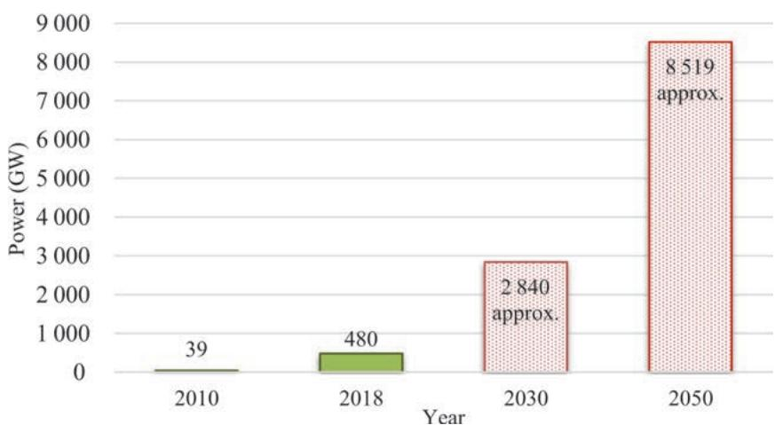  
Figure 1.1 Solar PV installed capacity at world level [1]

## 1.2 Role of power electronics in solar PV systems

The layout of a solar PV power plant is shown in Figure 1.4. The solar PV output is DC and variable, i.e., it depends on ambient conditions (temperature, solar irradiance, etc.). These variable electrical signals need to be regulated as per the desired shape and magnitude. Power electronics converters are used to regulate the PV output. Moreover, power electronics converters are also used to convert the DC voltage into the AC voltage of the desired magnitude and frequency. The ability of power electronics switches to operate with pulse width modulation (PWM) makes the system-control efficient. Different control algorithms can be implemented for generating PWM and obtaining accurate output power with a low response time.

Solar PV Power Generation (% Power Generation Share–World Level)  
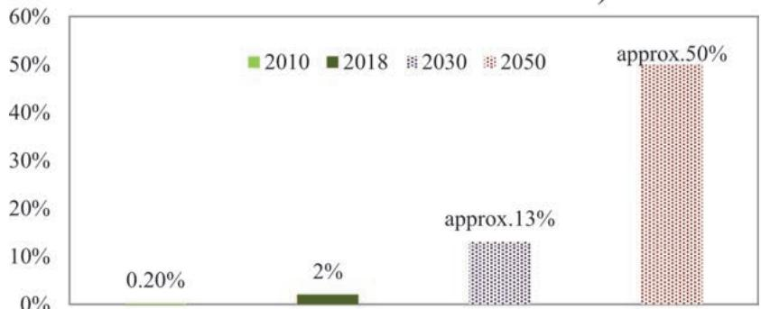  
Figure 1.2 Power generation share of solar PV-based plants at world level [1]

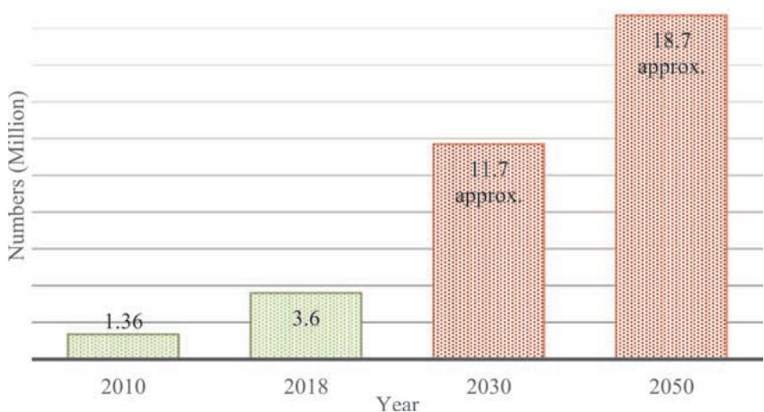  
Figure 1.3 Employment from investment in solar PV plants [1]

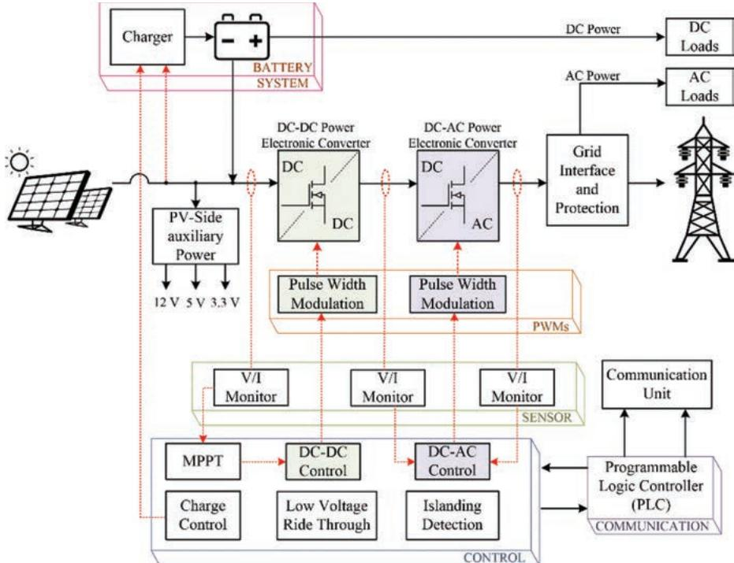  
Figure 1.4 Layout of solar PV plant

  
Figure 1.5 Main functions of DC–DC converters in solar PV plants

For a single-stage PV system, the output from the solar panel is directly fed to the DC–AC converter that regulated the incoming DC and converts it into AC. The output of the inverter is then passed through the filter before it is fed to the grid and local load. The control signal is generated by the measured voltage of the inverter at point of common coupling.

In the case of a two-stage system, the PV output from the solar panel is fed to the DC–DC converter. The maximum power point tracking (MPPT) control is implemented in the control of DC–DC converters. Also, if a battery is used in the solar PV plant, a charger circuit is required, which is also a power electronics converter. The PV-side auxiliary power is tapped off different DC voltage levels as per the requirement by the load. The main role of DC–DC converters in solar PV plant is shown in Figure 1.5. Similarly, the main functions of the DC–AC power electronics converter are shown in Figure 1.6. The LVRT and islanding detection protection are implemented in the control of the DC–AC converter.

## 1.3 DC-DC power electronics converters

In solar PV applications, DC–DC converters are used, and they are classified into two types: isolated and non-isolated type, as shown in Figure 1.7. The major difference between the two types of converters is in cost and galvanic isolation. The isolated type DC–DC has galvanic isolation between the input and output because of a magnetically coupled element, and at the same time, the cost is high. Flyback, resonant, forward, push-pull, bridge DC–DC converters are examples of isolated converters. The non-isolated type converters are Ćuk, SEPIC, boost, buck-boost, etc.

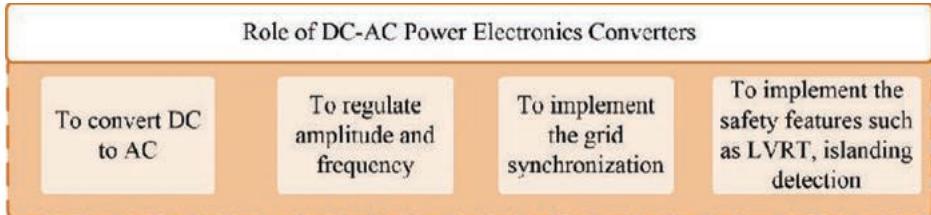  
Figure 1.6 Main functions of DC-AC converters in solar PV plants

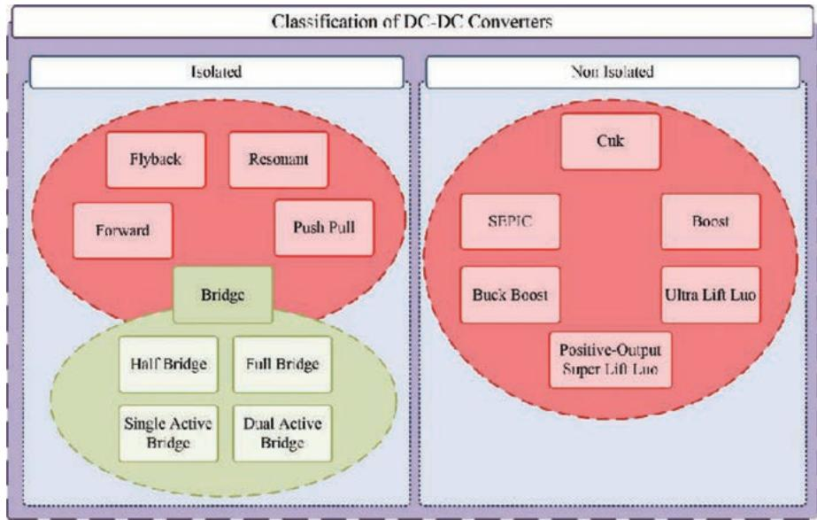  
Figure 1.7 Classification of DC–DC converters used in solar PV applications

These DC–DC converters used in solar PV applications are discussed in Sections 1.3.1 to 1.3.14.

## 1.3.1 Buck converter

The buck converter, also known as a step-down converter, is used to step down the input voltage at the output side. The schematic of the converter is shown in Figure 1.8. This converter is a switched-mode power supply containing a diode, a power switch, and an energy storage element in the form of either a capacitor or a inductor. Here, the input voltage source feeds the controllable power switch that is operated with a PWM either through a time base or with a frequency base. Generally, to eliminate the voltage ripple, a combination of capacitor and inductor can be used at both the load side and the supply side of the converter. The main application of this converter is in the battery charger circuit $[7]$ , solar PV pumping system $[8]$ , MPPT tracking, etc. $[9]$ .

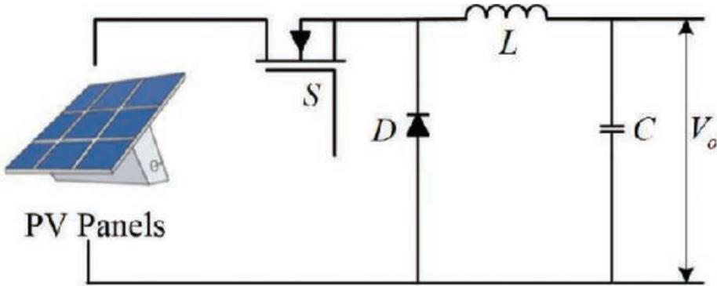  
Figure 1.8 Schematic of a buck DC–DC converter

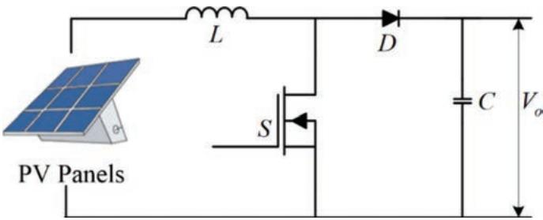  
Figure 1.9 Schematic of the boost DC–DC converter

## 1.3.2 Boost converter

The boost converter is referred to as a step-up converter and used in applications where the voltage magnitude at the output needs to be larger than the input voltage. This converter finds its majority of applications in PV systems to boost the PV voltage $[10–12]$ . The schematic of the boost converter is shown in Figure 1.9. Similar to a buck converter, the boost converter is also a switched-mode power supply containing an inductor, a power switch, a diode, and a capacitor. Here, the input voltage source feeds the inductor that leads to a constant input current. Further, the power switch is operated with a PWM to achieve the required output voltage. Many modifications are available for the basic boost converter in the literature $[10–13]$ to achieve ripple minimization, high voltage gain, and enhanced performance.

## 1.3.3 Buck-boost converter

The buck-boost converter can operate both in step-down and in step-up mode depending upon the duty cycle provided to the converter. The schematic of the converter shown in Figure 1.10 is developed by combining the basic buck converter and boost converter topologies discussed in Sections 1.3.1 and 1.3.2. This converter found most of its applications in stand-alone and grid-connected PV systems, and motor drives $[14]$ . Similar to the operation of a buck converter, the input voltage source feeds the controllable power switch in the converter that is operated with a PWM. The literature identified that the continuous current mode operation of the buck-boost converter has lower ripples in the current. Further, a buck-boost converter with two power switches can have the least current and voltage stress on the components operating in the converter. Moreover, to enhance the operation of a basic buck-boost converter, various other topologies such as SEPIC $[15]$ , Ćuk $[16]$ , and Luo converters $[17]$ are available in the literature.

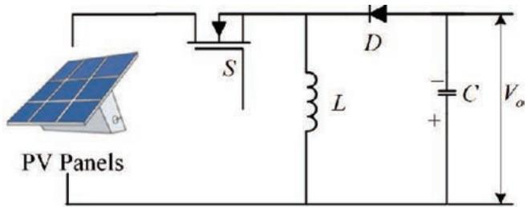  
Figure 1.10 Schematic of the buck-boost DC–DC converter

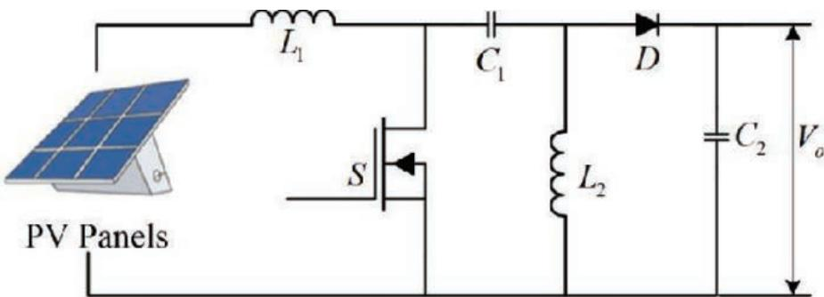  
Figure 1.11 Schematic of the SEPIC DC-DC converter

## 1.3.4 Single-ended primary inductance converter

The single-ended primary inductance converter (SEPIC) is widely used in DC voltage flickering control and sensor-less control of PV applications. The schematic of the SEPIC is shown in Figure 1.11. While operating the converter, the on-time switching must be larger than the off-time switching to realize a high voltage at the output. Further, this also ensures that the capacitor is fully charged. For any condition, if the switching is not achieved, the converter fails to provide the required output. Besides, the operation of the converter along with a high-frequency transformer achieves an output voltage with minimized ripples. This provides various advantages with key features such as continuous output current, minimized output ripples, and minimized switching stress $[15, 18–20]$ .

## 1.3.5 Ćuk converter

The schematic of a Ćuk converter shown in Figure 1.12 has similarities with the basic buck-boost-converter except for the fact that the inductor is replaced with a capacitor to achieve the power transfer. This arrangement is also known as a negative-output capacitive energy-based flyback DC–DC converter [21]. Further, the Ćuk converter achieves ripple-free output in a system by inverting the output polarity of the converter with suitable connections [16, 22, 23]. Besides, to improve the efficiency of Ćuk converters and achieve optimal bidirectional operation concerning the regulation of voltage and current [24], various modifications are proposed in the literature [25–28]. These studies have identified the application of the converter in various motor drive circuits [21] and renewable energy applications [29–31].

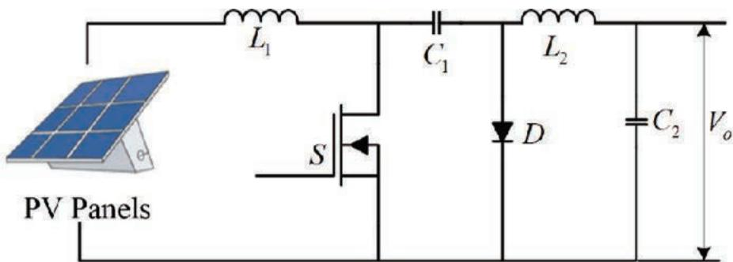  
Figure 1.12 Schematic of a Ćuk DC–DC converter

## 1.3.6 Positive-output super-lift Luo converter

The positive-output super-lift Luo converter shown in Figure 1.13 was initially introduced by Luo et al. [17] in 2003. This converter was developed with different series energy storage elements such as series inductors and capacitors that provide high output voltage resembling arithmetic progressions. Later, the design of the converter was modified in [32] by adding a high voltage transfer gain and its operation was enhanced by using a sliding mode controller in [33] for achieving the balance between the voltage regulation and load current. This converter is considered to be more powerful when compared to the SEPIC and Ćuk converters discussed in Sections 1.3.4 and 1.3.5 due to its unique features of enhanced efficiency and high output voltage resembling higher geometric progressions. Moreover, these converters are still under development for their operation with domestic and industrial PV applications $[34, 35]$ .

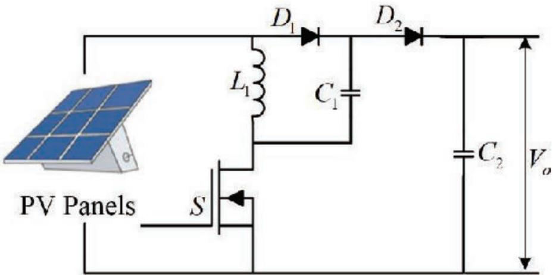  
Figure 1.13 Schematic of a positive-output super-lift Luo DC–DC converter

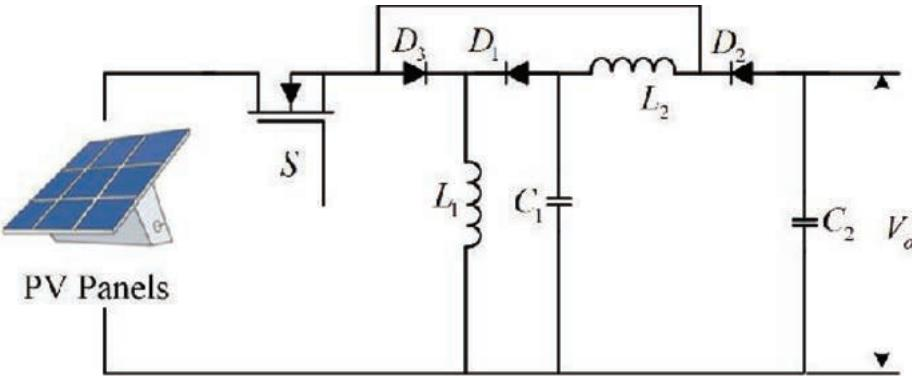  
Figure 1.14 Schematic of an ultra-lift Duo DC–DC converter

## 1.3.7 Ultra-lift Luo converter

The ultra-lift Luo converter is shown in Figure 1.14 [36, 37]. This converter combines the design aspects of voltage and super-lift Luo converters to produce a high-voltage conversion gain. This makes the converter highly efficient among the other non-isolated DC–DC converters. Further, it is identified that the closed-loop design of the converter is monotonous as the slightest variation in duty ratio results in large output voltage variations.

## 1.3.8 Zeta converter

The Zeta converter combines the advantages of the buck-boost, SEPIC, and Ćuk converters. The schematic of the Zeta converter is shown in Figure 1.15. When operated in a PV system, the Zeta converter enables continuous MPPT over the entire area of the PV curve. Further, the Zeta converter provides a non-inverted output voltage that has either an enhanced or a diminished value concerning the input voltage $[38–42]$ . Moreover, to reduce the output ripples and achieve enhanced voltage conversion in continuous and discontinuous modes, new topologies of the Zeta converter are developed in the literature $[43]$ . These advancements are constituted for operation with the battery storage systems in PV applications.

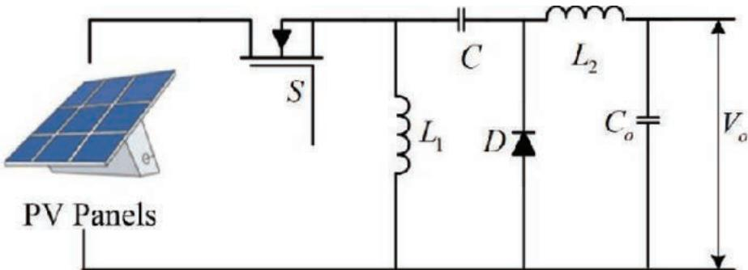  
Figure 1.15 Schematic of a Zeta DC–DC converter

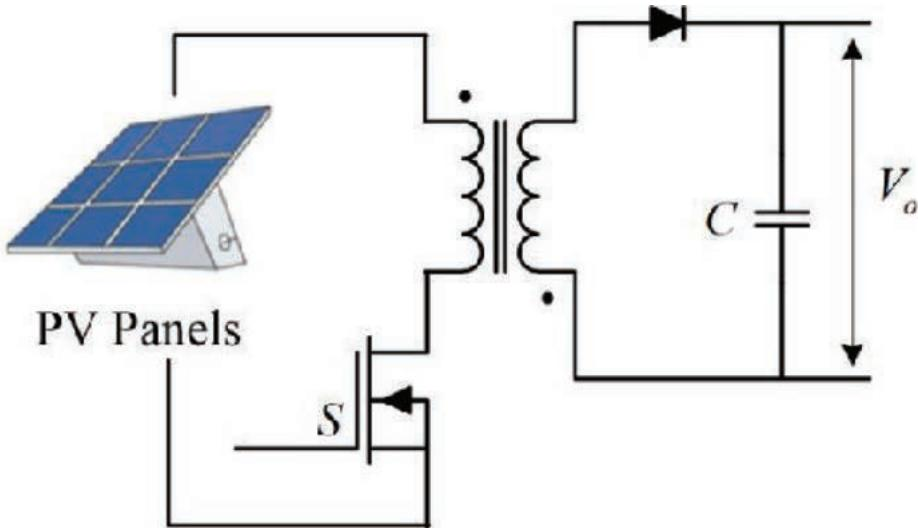  
Figure 1.16 Schematic of a flyback DC-DC converter

## 1.3.9 Flyback converter

The schematic of the flyback DC–DC converter is shown in Figure 1.16. This converter acts as a key solution for higher converter gain requirements by employing transformers in the system. For a transformer with a large air gap to store energy, the flyback converter can be used in high-power applications. Further, the large air gap results in less magnetizing inductance, and the flyback converter provides very less energy transfer efficiency and large leakage flux. Moreover, the flyback converter overcomes the drawback of output polarity inversion and high current flow in the power switch and output diode in Ćuk converters [44]. These advantages have seen the application of flyback converters to operate in the discontinuous mode with isolated grid-connected inverters [45]. This application identified the unique features such as swift dynamic response and less complexity of the converter. Further, the efficiency and decreased ripple content of the converter is enhanced by employing various soft switching techniques [46, 47].

## 1.3.10 Three-port half-bridge DC–DC converter

The schematic of a three-port half-bridge DC–DC converter is shown in Figure 1.17. The converter's primary circuit operates in the buck converter mode with synchronous rectification to provide the high-frequency transformer with a DC bias current. Further, various implementations are projected for post and synchronous regulations to regulate the three ports individually for achieving a single-stage power conversion with modest topology and simple control $[48]$ . Moreover, to achieve continuous input current with a wide range of zero-voltage switching and low ripple, the three switches are operated with an active-clamped half-bridge DC converter $[49]$ . Besides, to achieve a high voltage gain for large input voltage applications, the hybrid secondary rectifier is modified as a dual half-bridge LLC resonant converter. Here, depending on the switching strategy, the hybrid secondary rectifier acts as a quadruple rectifier $[50]$ . In $[51]$ , the output power and efficiency are improved by employing an interleaved high-performance DC converter. A half-bridge of this topology ensures that the duty cycle of the two interleaved converters is close to 50 percent for achieving a continuous output current width with less lag and small component size. Further, to reduce the electromagnetic interference and voltage stress and achieve a high efficiency, the three-level converter is operated with a high-voltage bidirectional half-bridge in high-voltage DC microgrid applications $[52]$ .

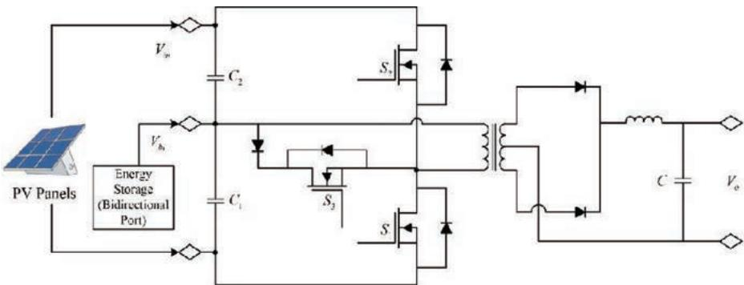  
Figure 1.17 Schematic of a three-port half-bridge DC–DC converter

## 1.3.11 Full-bridge converter

The full-bridge converter is used to integrate various components of the PV system such as PV array, energy storage device, and the load. The general schematic of a full-bridge converter is shown in Figure 1.18. The arrangement of a full-bridge converter consists of the integration of two buck-boost converters. This is developed to achieve zero-voltage switching and single power conversion with the topology $[53]$ . Further, the circulating current losses are minimized by achieving zero-voltage switching during turn-on of switches through operating the full-bridge topology with asymmetrical PWM. Moreover, the use of asymmetrical PWM with a full-bridge converter minimizes the stress on power switches and achieves higher efficiency $[54]$ . Besides, the problem of reverse recovery in output diode is overcome by achieving zero-current switchings during the switch turnoff through combining the resonant part of the circuit with the blocking capacitor and leakage inductance.

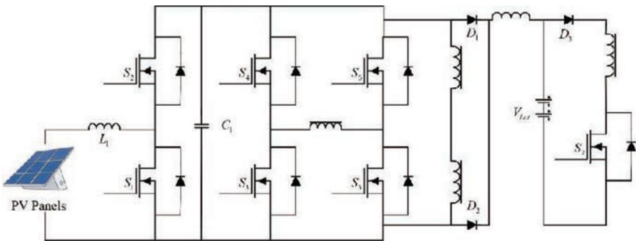  
Figure 1.18 Schematic of a full-bridge DC–DC converter

## 1.3.12 Dual active bridge converter

The dual active bridge converter has found its application in stand-alone hybrid systems due to its advantages with high conversion efficiency, bidirectional power flow, galvanic isolation, and high power density $[55–57]$ . The schematic of the converter is shown in Figure 1.19. From the circuit, it can be identified that the high-voltage DC sources feed the primary bridge and the low-voltage energy storage or load is connected to the secondary bridge. Further, a high-frequency power transformer is used to isolate the two full bridges whose leakage inductance is used as a storage element in the circuit. To enable the bidirectional power flow with the circuit, a square wave is conveniently phase shifted between both the bridges. Moreover, the voltage difference of the storage element is controlled to achieve power conversion with the circuit $[58]$ . The control aspects of the dual active bridge-isolated bidirectional DC–DC converter are widely discussed through digital controllers in $[59, 60]$ . In $[61, 62]$ , the high-frequency dual active bridge transformers were developed as an improvement to the existing converters. Besides, an ultra-capacitor-based dual active bridge converter was developed in $[60]$ .

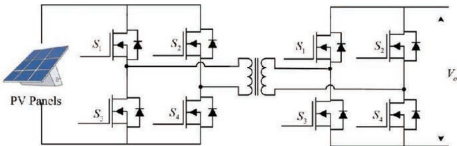  
Figure 1.19 Schematic of a dual active bridge DC–DC converter

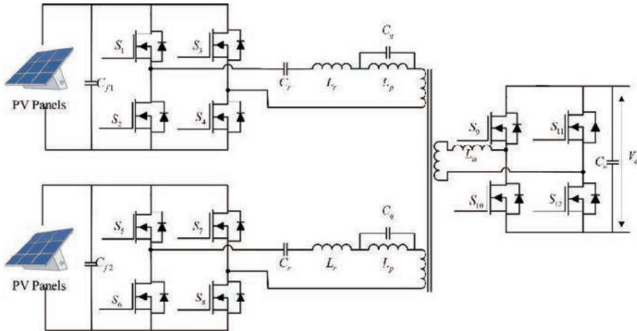  
Figure 1.20 Schematic of a bidirectional multielement DC–DC resonant converter

## 1.3.13 Multielement resonant converter

The multielement resonant converter is an enhanced topology of the traditional LLC converter $[63, 64]$ . This converter provides advantages of zero-voltage and -current switching using a short output circuit $[65, 66]$ , higher efficiencies at the full load operation, and high power density making them adaptable in renewable energy generation applications $[67, 68]$ . The schematic of a three-port multielement resonant converter is shown in Figure 1.20. The design aspects of this converter involve series and parallel connection of five resonant components in the circuit. These multiple resonant components provide various resonant frequencies in the circuit and their suitable placement helps in transferring the active power of fundamental and third-order harmonics. Further, the parasitic leakage current due to the nonideal isolated transformer is ignored for this converter. From the literature, it is identified that the zero-voltage switching characteristics can be easily achieved for all the power switches in the three ports along with 96 percent power-conversion efficiency $[69]$ .

## 1.3.14 Push-pull converter

The push-pull converter, also known as a switching converter, is shown in Figure 1.21. This converter involves a transformer and operates with the help of a center-tapped primary winding by acting as a forward converter to the transformer core effectively. Further, the push-pull converter has small filters for different available power levels with the circuit. The major advantage of this converter is the transistor pair in the circuit employs input lines that avail the flow of current through the main winding of the transformer. Besides, the concurrent switching of the transistors draws current from the transformer resulting in a shattered condition for the current at the line during the switching condition of half-cycle pair. Moreover, when operated with low input noise, the push-pull converters have stable input current and can have efficient high-power applications $[70]$ . Further, the center tapping that only utilizes half of the winding of the transformer at a time resulted in increased copper losses for the circuit.

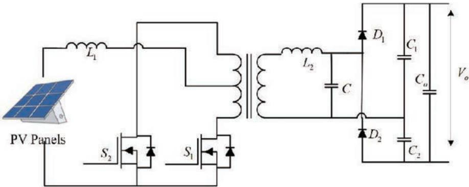  
Figure 1.21 Schematic of a push-pull DC–DC converter

Further, a summary of different DC–DC converters classified under isolated, non-isolated, unidirectional, and bidirectional are shown in Table 1.1 [71]. The summary identifies the important aspects of different converters and compares them with each other.

## 1.4 DC-AC converters

Solar inverters play a vital role in the PV application. The DC power from the panel after being boosted by a DC–DC converter is fed to the solar inverter before it can be supplied to the load and grid. The inverter converts DC power into a regulated AC power that can be controlled by varying the switching of the power electronics devices. The basic inverter topologies are presented in Figure 1.22. The topologies are designed to operate in a grid-connected mode of operation while satisfying different grid codes requirements. From Figure 1.22, it can be deduced that the solar inverter can be categorized into two classes: transformer-based and transformerless inverters $[72–74]$ . The galvanic isolation present in the transformer-based inverter provides isolation between the DC and the AC side and protects the system from any leakage power or power circulation that may occur in the AC side of the system. But the disadvantage of the transformer-based inverter is that the size of the inverter becomes large, and the efficiency of the inverter is low due to the transformer-based losses. To overcome the disadvantages, transformerless inverters were proposed. The absence of a transformer for the inverter reduces the size substantially and at the same time the efficiency of the inverter is improved $[75]$ . However, the concern with transformerless inverters is the absence of isolation between the AC and DC side of the system. There is a change of power flow from AC to DC end, which may cause damage to DC equipment. As a result, many different topologies have been proposed to reduce leakage currents in transformerless inverters.

Table 1.1 Comparison between different DC–DC converters

<table><tr><td></td><td>Converter type</td><td>Optimal power demand</td><td>Voltage stress</td><td>Efficiency</td></tr><tr><td>Non-isolated</td><td>Buck</td><td>Low</td><td>High</td><td>Medium</td></tr><tr><td>unidirectional DC-</td><td>Boost</td><td>Low</td><td>High</td><td>Medium</td></tr><tr><td>DC converter</td><td>Buck-boost</td><td>Low</td><td>Medium</td><td>Medium</td></tr><tr><td>Non-isolated</td><td>Buck-boost</td><td>Low</td><td>Medium</td><td>Medium</td></tr><tr><td>bidirectional DC-</td><td>SEPIC</td><td>Low</td><td>High</td><td>Medium</td></tr><tr><td>DC converter</td><td>Ćuk</td><td>Low</td><td>High</td><td>Medium</td></tr><tr><td></td><td>Half-bridge</td><td>Low</td><td>Medium</td><td>High</td></tr><tr><td rowspan="4">Isolated unidirectional DC-DC converter</td><td>Flyback</td><td>Low</td><td>High</td><td>High</td></tr><tr><td>Half-bridge</td><td>Low</td><td>High</td><td>High</td></tr><tr><td>Full-bridge</td><td>High</td><td>Medium</td><td>Medium</td></tr><tr><td>Push-pull</td><td>High</td><td>High</td><td>Medium</td></tr><tr><td rowspan="2">Isolated bidirectional DC-DC converter</td><td>Half-bridge</td><td>Low</td><td>High</td><td>Medium</td></tr><tr><td>Full-bridge</td><td>High</td><td>Low</td><td>Medium</td></tr></table>

## 1.4.1 Transformer-based inverter

The transformer in the inverter provides galvanic isolation that separates the AC from the DC. The isolation avoids injection of DC current into the grid and stops leakage currents from the grid into the DC circuit. Transformer inverters can be categorized based on the operating frequency. The low-frequency transformer inverter as depicted in Figure 1.23a [76] is more reliable and cost-effective but at the same time, the efficiency is significantly poor. Whereas in the case of the high-frequency transformer inverter depicted in Figure 1.23b [77], the size of the inverter is small, and the inverter is more efficient compared to the low-frequency one. Because of the high-frequency operation, the components are constantly operating in high stress and the reliability is low [78, 79].

## 1.4.2 Transformerless inverter

The transformer present in the inverter achieves galvanic isolation and reduces the leakage currents from the grid. This helps in ensuring safety, but a substantial amount of power is lost because of the transformer, which reduces the efficiency of the inverter. Due to the large size and low efficiency of the transformer-based inverter, there has been a shift in research toward the transformerless inverters for PV applications. A few of the commonly used transformerless inverter topologies $[80]$ are explained in this section. A comparative analysis of different transformerless inverters is presented in Table 1.2.

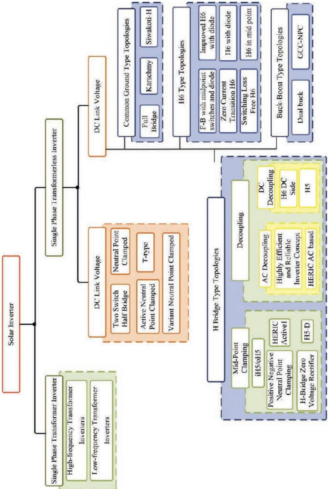  
Figure 1.22 Classification of DC-AC converters used in solar PV application

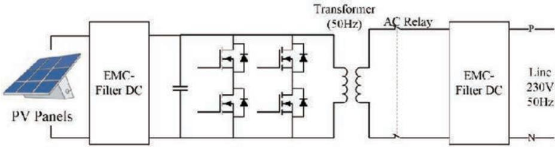  
(a)

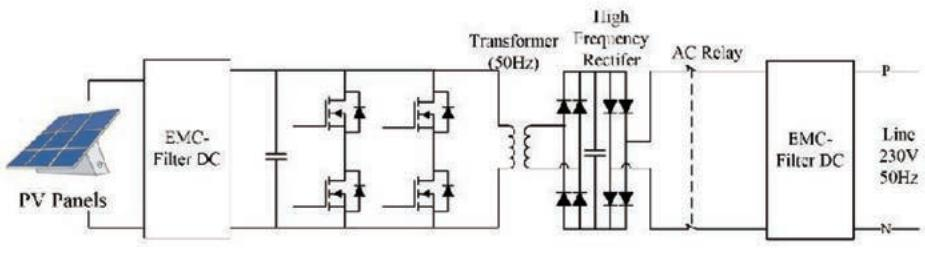  
(b)  
Figure 1.23 DC-AC converters with transformer: (a) low-frequency inverter, (b) high-frequency inverter

## 1.4.2.1 Half-bridge transformerless inverter

A half-bridge transformerless inverter comprises two power electronics switches connected in parallel with capacitors as shown in Figure 1.24 [105]. The operation is performed by turning on one switch at a time and charging the antiparallel capacitor at that instance. When the second switch is turned on, the corresponding capacitor is discharged, and the obtained inverter output is passed through an L-filter. The topology is simple to implement but achieving MPPT is difficult [106]. As a result, a high ripple is present in the output current.

## 1.4.2.2 Neutral point-clamped transformerless inverter

An neutral point-clamped (NPC) transformerless inverter comprises four power electronics switches with two diodes as shown in Figure 1.25 [82]. The clamping diodes at the midpoint aid in achieving the zero-voltage stage. Switches $S_{1}$ and $S_{3}$ operate in one-half cycle with alternating pulsing whereas $S_{2}$ and $S_{4}$ operate in another cycle. The current ripple is low compared to the half-bridge topology, but this topology is unable to balance conduction losses on the negative side causing a limitation for the DC-link [107].

Table 1.2 Comparison between different transformerless inverter topology

<table><tr><td rowspan="3" colspan="3">Single-phase transformerless inverter</td><td colspan="4">Components in topologies</td><td colspan="2">Filter</td><td></td><td></td><td></td><td></td><td></td></tr><tr><td colspan="2">Semiconductor switches</td><td colspan="2">Passive element</td><td></td><td></td><td></td><td></td><td></td><td></td><td></td></tr><tr><td>Insulated-gate bipolar transistor</td><td>Diodes</td><td>C</td><td>L</td><td>C</td><td>L</td><td>Common-mode current</td><td>Common-mode voltage</td><td>Power factor (PF)</td><td>Total harmonic distortion (THD)</td><td>η (%)</td></tr><tr><td rowspan="4" colspan="3">DC-link voltage ( $2V_{PV}$ )</td><td>Two-switch H-B [81]</td><td>2</td><td>2</td><td>2</td><td>0</td><td>0</td><td>1</td><td>&lt;20</td><td>Const.</td><td>N/A</td><td>1.1</td></tr><tr><td>NPC [82]</td><td>4</td><td>2</td><td>2</td><td>0</td><td>0</td><td>1</td><td>=0</td><td>Const.</td><td>N/A</td><td>1.19</td></tr><tr><td>ANPC [83]</td><td>6</td><td>6</td><td>2</td><td>0</td><td>0</td><td>1</td><td>&lt;20</td><td>N/A</td><td>N/A</td><td>N/A</td></tr><tr><td>T-type [84]</td><td>4</td><td>4</td><td>2</td><td>0</td><td>0</td><td>1</td><td>&lt;20</td><td>Const.</td><td>N/A</td><td>N/A</td></tr><tr><td rowspan="19">DC-link voltage ( $V_{PV}$ )</td><td rowspan="3" colspan="2">Common-ground-type topologies</td><td>S4 [85]</td><td>4</td><td>2</td><td>3</td><td>0</td><td>1</td><td>1</td><td>=0</td><td>Const.</td><td>0.8</td><td>2.1</td></tr><tr><td>Karschmy [86]</td><td>5</td><td>2</td><td>2</td><td>1</td><td>1</td><td>1</td><td>=0</td><td>Const.</td><td>Unity</td><td>N/A</td></tr><tr><td>Siwakoti-H [87]</td><td>4</td><td>1</td><td>2</td><td>0</td><td>1</td><td>1</td><td>=0</td><td>Const.</td><td>0.85</td><td>&lt;2.3</td></tr><tr><td rowspan="5" colspan="2">H6-type topologies</td><td>Improved H6 with diode [88]</td><td>6</td><td>2</td><td>1</td><td>0</td><td>1</td><td>2</td><td>&lt;20</td><td>190-200</td><td>0.9</td><td>N/A</td></tr><tr><td>ZCT-H6 [89]</td><td>8</td><td>3</td><td>4</td><td>2</td><td>1</td><td>2</td><td>&lt;250</td><td>N/A</td><td>Unity</td><td>N/A</td></tr><tr><td>H6 with diode [90]</td><td>6</td><td>2</td><td>1</td><td>0</td><td>1</td><td>2</td><td>&lt;200</td><td>159-240</td><td>0.99</td><td>1.86</td></tr><tr><td>SLF-H6 [91]</td><td>8</td><td>2</td><td>4</td><td>2</td><td>1</td><td>2</td><td>&lt;150</td><td>N/A</td><td>Unity</td><td>N/A</td></tr><tr><td>H6 in midpoint [92]</td><td>6</td><td>0</td><td>1</td><td>0</td><td>1</td><td>2</td><td>&lt;200</td><td>159-240</td><td>Unity</td><td>N/A</td></tr><tr><td rowspan="2" colspan="2">Buck-boost type topologies</td><td>Dual buck [93]</td><td>4</td><td>2</td><td>2</td><td>3</td><td>1</td><td>2</td><td>N/A</td><td>N/A</td><td>N/A</td><td>3.6</td></tr><tr><td>Generation control circuit-neutral point clamped [94]</td><td>6</td><td>2</td><td>2</td><td>1</td><td>1</td><td>1</td><td>&lt;20</td><td>N/A</td><td>Unity</td><td>4.08</td></tr><tr><td rowspan="9">H-bridge type topologies</td><td rowspan="4">Midpoint clamping</td><td>iH5/oH5 [95]</td><td>6</td><td>0</td><td>2</td><td>0</td><td>1</td><td>2</td><td>&lt;20</td><td>199-200</td><td>Unity</td><td>N/A</td></tr><tr><td>H5-D [96]</td><td>5</td><td>1</td><td>2</td><td>0</td><td>1</td><td>2</td><td>&lt;50</td><td>185-195</td><td>Unity</td><td>4.88</td></tr><tr><td>HERIC Active 1 [97]</td><td>7</td><td>2</td><td>2</td><td>0</td><td>1</td><td>2</td><td>&lt;25</td><td>199-200</td><td>N/A</td><td>N/A</td></tr><tr><td>HB-ZVR [98]</td><td>5</td><td>5</td><td>2</td><td>0</td><td>1</td><td>2</td><td>&lt;200</td><td>163-200</td><td>Unity</td><td>N/A</td></tr><tr><td rowspan="5">Decoupling</td><td>PN-NPC [99]</td><td>8</td><td>0</td><td>2</td><td>0</td><td>1</td><td>2</td><td>&lt;35</td><td>199-201</td><td>Unity</td><td>N/A</td></tr><tr><td>HERIC [100]</td><td>6</td><td>0</td><td>1</td><td>0</td><td>1</td><td>2</td><td>&lt;200</td><td>165-235</td><td>Unity</td><td>N/A</td></tr><tr><td>HERIC AC-based [101]</td><td>6</td><td>2</td><td>1</td><td>0</td><td>1</td><td>2</td><td>&lt;200</td><td>165-236</td><td>Unity</td><td>N/A</td></tr><tr><td>H6 DC side [102]</td><td>6</td><td>0</td><td>2</td><td>0</td><td>1</td><td>2</td><td>&lt;200</td><td>151-249</td><td>Unity</td><td>1.58</td></tr><tr><td>H5 [103, 104]</td><td>5</td><td>0</td><td>1</td><td>0</td><td>1</td><td>2</td><td>&lt;200</td><td>159-235</td><td>Unity</td><td>N/A</td></tr></table>

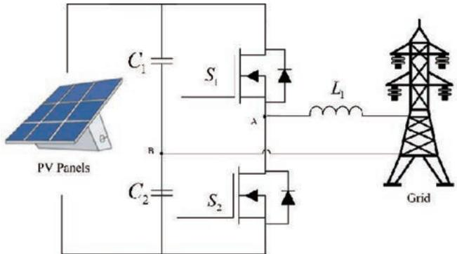  
Figure 1.24 Two-switch half-bridge transformerless inverter

## 1.4.2.3 Active neutral point-clamped transformerless inverter

An active neutral point-clamped (ANPC) transformerless inverter illustrated in Figure 1.26 is a modification of an NPC inverter [108]. In the ANPC, the diodes are replaced by power electronics switches. The upper clamping is controlled by $S_{2}$ and $S_{5}$ whereas the lower clamping is regulated by $S_{3}$ and $S_{6}$ [109]. By replacing the diodes with the power electronics switches, the conduction losses of the inverter are controlled.

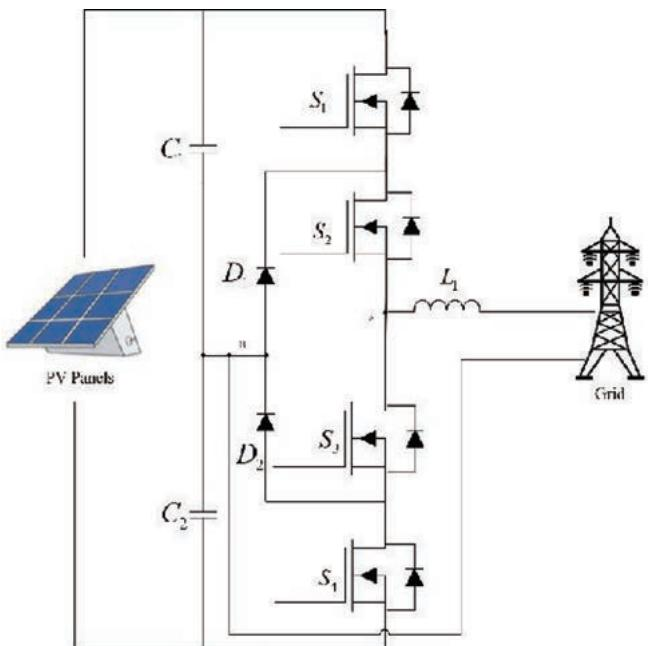  
Figure 1.25 NPC transformerless inverter

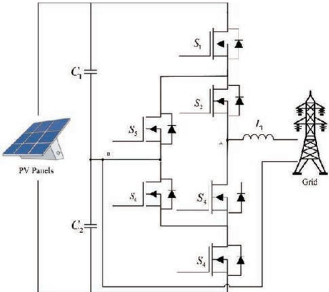  
Figure 1.26 ANPC transformerless inverter

## 1.4.2.4 T-type transformerless inverter

A T-type three-level transformerless inverter consists of four power electronics switches with two bidirectional switches incorporated in the midpoint of the DC-link capacitor and switches ( $S_{1}$ and $S_{2}$ ) leg [107] as illustrated in Figure 1.27. The $S_{1}$ and $S_{3}$ operate in a complementary way with $S_{2}$ and $S_{4}$ [110]. The clamping with two power electronics switches ( $S_{3}$ and $S_{4}$ ) reduces the requirement of switching devices, which causes a reduction in conduction losses when compared to the ANPC topology.

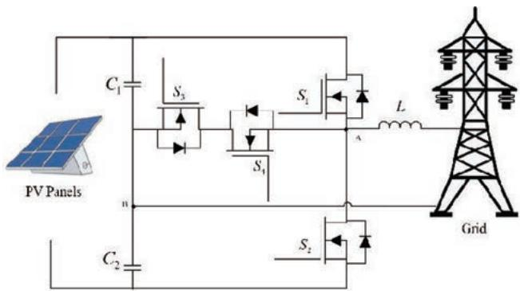  
Figure 1.27 T-type transformerless inverter

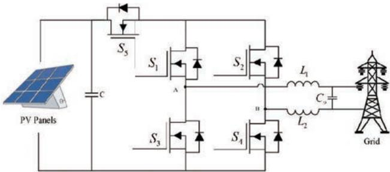  
Figure 1.28 Three-switch transformerless inverter

## 1.4.2.5 Three-switch transformerless inverter

The three-switch transformerless inverter is a modified NPC or ANPC inverter. The number of power electronics switches is reduced from previous topologies, as shown in Figure 1.28. The topology incorporates a diode bridge along with $S_{3}$ . The diode bridge provides the current path during the null state. The operation takes place in four modes. $S_{1}$ is turned on during the positive half-cycle whereas $S_{2}$ remains on during the negative half-cycle. During the freewheeling mode of a positive half-cycle, $D_{1}$ and $D_{4}$ are in forwarding bias with $S_{3}$ whereas for the negative half-cycle biasing, $D_{2}$ and $D_{3}$ are on alongside $S_{3}$ [111].

## 1.4.2.6 Full-bridge transformerless inverter

A full-bridge transformerless inverter consists of four power electronics switches as shown in Figure 1.29. During the positive half-cycle of operation, $S_{1}$ and $S_{4}$ are turned on and the antiparallel diode along $S_{2}$ and $S_{4}$ provide a path for the current flow. The $S_{2}$ and $S_{1}$ are complementary to each other and similarly $S_{3}$ and $S_{4}$ are complementary to each other. For positive half-cycle $S_{1}$ and $S_{4}$ are turned on and, as a result, the output voltage is equal to the input voltage. Whereas during the freewheeling mode of the positive cycle, the current flows though $S_{1}$ and antiparallel diode of $S_{2}$ [112].

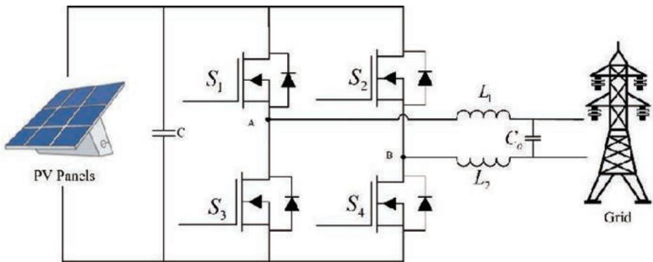  
Figure 1.29 Full-bridge transformerless inverter

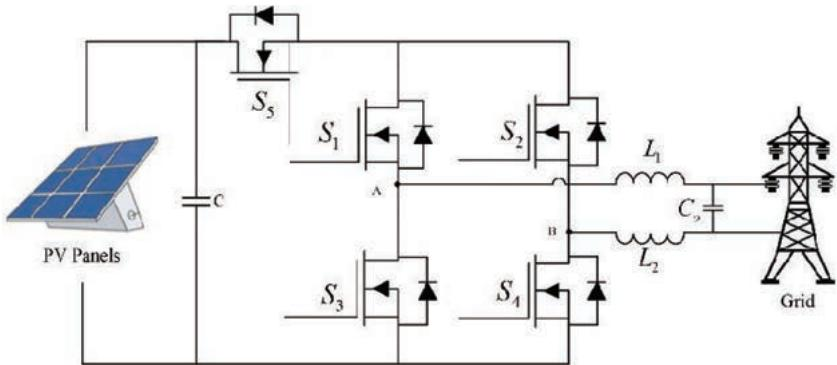  
Figure 1.30 H5 transformerless inverter

## 1.4.2.7 H5 transformerless inverter

The H5 transformerless inverter topology is the commonly implemented topology, which was patented and is commercially produced by SMA Solar Technology $[103]$ . The topology consists of five power electronics switches as shown in Figure 1.30. It can be observed that $S_{5}$ on the DC side acts as a DC decoupling switch. During the freewheeling mode of operating, $S_{5}$ is turned off, which disconnects the DC side and effectively reduces the common-mode current $[113, 114]$ . During the positive half-cycle, $S_{5}$ and $S_{4}$ operate at the switching frequency, whereas $S_{1}$ operates at the grid frequency. The other two switches remain in the off state. Whereas during the negative half-cycle, $S_{5}$ and $S_{2}$ operate at the switching frequency and $S_{3}$ operates at the grid frequency.

## 1.4.2.8 Full-bridge transformerless inverter with midpoint switches and diodes

The full-bridge transformerless inverter with midpoint switches and diodes topology is similar to the H5 transformerless inverter topology. Two extra switches are added on the top and bottom of a full-bridge inverter, as shown in Figure 1.31. While $S_{4}$ conduct, $S_{1}$ and $S_{6}$ conduct simultaneously. When $S_{3}$ is in on state, $S_{2}$ and $S_{5}$ operate with the same switching pulse. During a freewheeling period of a positive half-cycle, $D_{2}$ operates in forwarding bias along with $S_{4}$ . Whereas during the negative half-cycle, $D_{1}$ operates in forwarding bias along with $S_{2}$ [115].

## 1.4.2.9 H6-1 transformerless inverter

The H6-1 transformerless inverter consists of six power electronics switches, as shown in Figure 1.32 [116]. For operation in a positive half-cycle, $S_{1}$ , $S_{4}$ , and $S_{6}$ are turned on. And during the freewheeling state, $S_{6}$ along with the antiparallel diode of

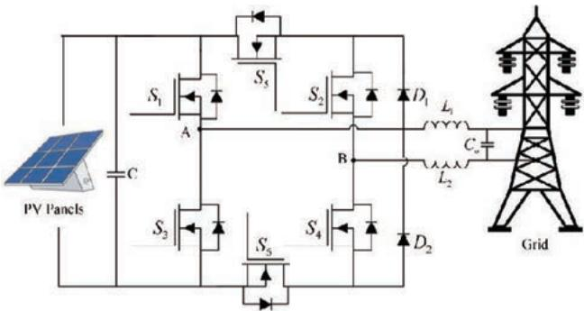  
Figure 1.31 Full-bridge transformerless inverter with midpoint switches and diodes

$S_{5}$ conducts without any input, and the current flows through the load. During the negative half-cycle, $S_{2}$ , $S_{3}$ , and $S_{5}$ are turned on and for freewheeling state, $S_{5}$ along with the antiparallel diode of $S_{6}$ conducts.

## 1.4.2.10 Modified Highly Efficient and Reliable Inverter Concept

The HERIC transformerless inverter consists of six power electronics switches and has an issue with leakage currents. To overcome the drawback a modified version was proposed in $[117–119]$ as shown in Figure 1.33. The topology aims at reducing the leakage current and keeping the common-mode voltage to the minimum. The drawback of this topology remains the shoot-through issue.

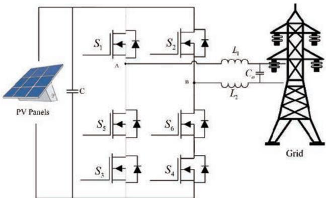  
Figure 1.32 H6-1 transformerless inverter

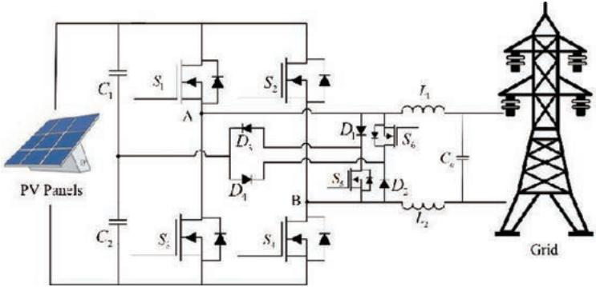  
Figure 1.33 Modified HERIC transformerless inverter

## 1.4.2.11 oH5-1 transformerless inverter

The oH5-1 topology has been derived from the H5 transformerless inverter topology. The topology aims to clamp the input voltage to the half value $[108]$ . The topology consists of six power electronics switches as shown in Figure 1.34.

## 1.4.2.12 Modified transformerless inverter

As illustrated in Figure 1.35, the topology presented is a modification over the basic full-bridge converter [120]. During the positive half-cycle $S_{1}$ and $S_{3}$ are in on state, whereas $S_{2}$ remains off. In case of the negative half-cycle, $S_{5}$ is in on state, whereas $S_{4}$ remains off.

## 1.5 Summary

Solar energy-based power generation is one of the major stakeholders in the renewable energy market around the globe. The low operating cost and easy availability have made it more favorable for the consumer. But many challenges are still present as a large amount of generated power is lost during the conversion process. As a result, many power electronics converters are designed over time to improve the efficiency and reliability of PV-based system. The chapter presents a brief introduction about the power electronics converters used for PV applications. Both the DC–DC converters and DC–AC converters are presented in this chapter and different topologies that are applied in PV applications are explained.

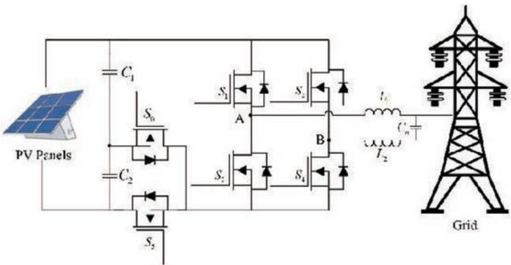  
Figure 1.34 oH5-1 transformerless inverter

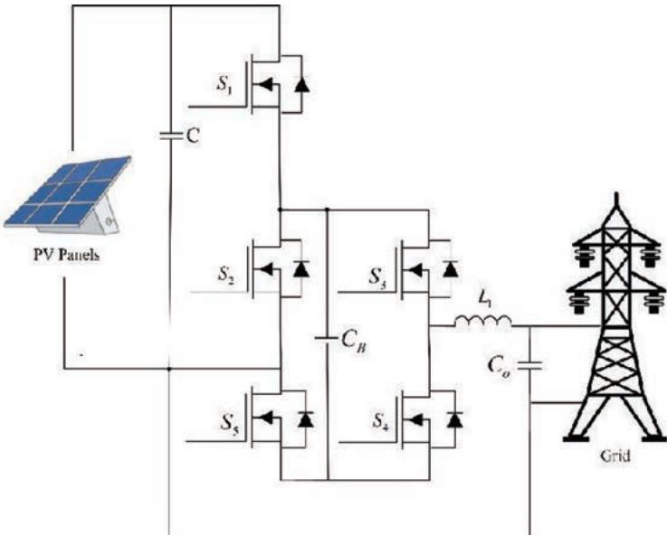  
Figure 1.35 Modified transformerless inverter

## References

[1] International Renewable Energy Agency – IRENA. Future of solar photovoltaic: deployment, investment, technology, grid integration and socio-economic aspects; 2019.

[2] Zhao Y., Lehman B., De Palma J.F., Mosesian J., Lyons R. Challenges to overcurrent protection devices under line-line faults in solar photovoltaic arrays. 2011 IEEE Energy Conversion Congress and Exposition; Phoenix, AZ, USA, 17-22 Sept. 2011; 2011.

[3] Fatama A.Z., Khan M.A., Kurukuru V.S.B., Haque A., Blaabjerg F. 'Coordinated reactive power strategy using static synchronous compensator for photovoltaic inverters'. International Transactions on Electrical Energy Systems. 2020;30(6):1–18.

[4] Khan M.A., Haque A., Kurukuru V.S.B., Saad M. ‘Advanced control strategy with voltage sag classification for single-phase grid-connected

photovoltaic system'. IEEE Journal of Emerging and Selected Topics in Power Electronics. 2020:1.

[5] Khan M.A., Kurukuru V.S.B., Haque A., Mekhilef S. ‘Islanding classification mechanism for grid-connected photovoltaic systems’. IEEE Journal of Emerging and Selected Topics in Power Electronics. 2020:1–1.

[6] Fatama A., Haque A., Khan M.A. 'A multi feature based Islanding classification technique for distributed generation systems'. 2019 International Conference on Machine Learning, Big Data, Cloud and Parallel Computing; 2019. pp. 160–6.

[7] Masoum M.A.S., Mousavi Badejani S.M., Fuchs E.F. 'Microprocessor-Controlled new class of optimal battery chargers for photovoltaic applications'. IEEE Transactions on Energy Conversion. 2004;19(3):599–606.

[8] Elgendy M.A., Zahawi B., Atkinson D.J. 'Assessment of perturb and observe MPPT algorithm implementation techniques for PV pumping applications'. IEEE Transactions on Sustainable Energy. 2012;3(1):21–33.

[9] Yusivar F., Farabi M.Y., Suryadiningrat R., Ananduta W.W., Syaifudin Y. 'Buck-converter photovoltaic simulator'. International Journal of Power Electronics and Drive Systems. 2011;1(2).

[10] Khazaei P., Mojtaba Modares S., Dabbaghjamanesh M., Almousa M., Moeini A. 'A high efficiency DC/DC boost converter for photovoltaic applications'. International Journal of Soft Computing and Engineering. 2016;2:2231–307.

[11] Saravanan S., Babu N.R. ‘A modified high step-up non-isolated DC-DC converter for PV application’. Journal of Applied Research and Technology. 2017;15(3):242–9.

[12] Forouzesh M., Siwakoti Y.P., Gorji S.A., Blaabjerg F., Lehman B. 'Step-up DC–DC converters: a comprehensive review of voltage-boosting techniques, topologies, and applications'. IEEE Transactions on Power Electronics. 2017;32(12):9143–78.

[13] Huber L., Jovanovic M.M. 'A design approach for server power supplies for networking applications'. in APEC 2000. Fifteenth Annual IEEE Applied Power Electronics Conference and Exposition; 2000. pp. 1163–9.

[14] Howlader A.M., Urasaki N., Senjyu T., Yona A., Saber A.Y. 'Optimal PAM control for a buck boost DC–DC converter with a wide-speed-range of operation for a PMSM'. Journal of Power Electronics. 2010;10(5):477–84.

[15] Chiang S.J., Hsin-Jang Shieh., Ming-Chieh Chen. 'Modeling and control of PV charger system with SEPIC converter'. IEEE Transactions on Industrial Electronics. 2009;56(11):4344–53.

[16] Simonetti D.S.L., Sebastian J., dos Reis F.S., Uceda J. 'Design criteria for SEPIC and Cuk converters as power factor preregulators in discontinuous conduction mode'. Proceedings of the 1992 International Conference on Industrial Electronics, Control, Instrumentation, and Automation; San Diego, CA, USA, 13 Nov. 1992; 1992. pp. 283–8.

[17] Luo F.L., Ye H. 'Positive output super-lift converters'. IEEE transactions on power electronics. 2003;18(1):105–13.

[18] Bose B.K. ‘Power electronics, smart grid, and renewable energy systems’. Proceedings of the IEEE. 2017;105(11):2011–18.

[19] Niculescu E., Niculescu M.C., Purcaru D.M. 'Modelling the PWM zeta converter in discontinuous conduction mode'. MELECON 2008 – The 14th IEEE Mediterranean Electrotechnical Conference; 2008. pp. 651–7.

[20] Al-Saffar M.A., Ismail E.H., Sabzali A.J., Fardoun A.A. 'An improved topology of SEPIC converter with reduced output voltage ripple'. IEEE Transactions on Power Electronics. 2008;23(5):2377–86.

[21] Song M.-S., Son Y.-D., Lee K.-H. 'Non-isolated bidirectional soft-switching SEPIC/ZETA converter with reduced ripple currents'. Journal of Power Electronics. 2014;14(4):649–60.

[22] Bist V., Singh B. ‘PFC Cuk converter-fed BLDC motor drive’. IEEE Transactions on Power Electronics. 2015;30(2):871–87.

[23] Tse C.K., Lai Y.M., Iu H.H.C. 'HOPF bifurcation and chaos in a free-running current-controlled Cuk switching regulator'. IEEE Transactions on Circuits and Systems I: Fundamental Theory and Applications. 2000;47(4):448–57.

[24] 10.1109/TPEL.2016.2516255[Darwish A., Massoud A., Holliday D., Ahmed S., Williams B. 'Single-stage three-phase differential-mode buck-boost inverters with continuous input current for PV applications'. IEEE Transactions on Power Electronics; 2016. p. 1.

[25] Mostaan A., Baghramian A. ‘Enhanced self lift zeta converter for negative-to-positive voltage conversion’. 4th Annual International Power Electronics, Drive Systems and Technologies Conference; 2013. pp. 212–17.

[26] Kamnarn U., Chunkag V. ‘Analysis and design of a modular three-phase AC-to-DC converter using CUK rectifier module with nearly unity power factor and fast dynamic response’. IEEE Transactions on Power Electronics. 2009;24(8):2000–12.

[27] Lin B.-R., Chen J.-J., Shen S.-F. 'Zero voltage switching double-ended converter'. IET Power Electronics. 2010;3(2):187.

[28] Fardoun A.A., Ismail E.H., Sabzali A.J., Al-Saffar M.A. 'New efficient bridgeless cuk rectifiers for PFC applications'. IEEE Transactions on Power Electronics. 2012;27(7):3292–301.

[29] Durán E., Andújar J.M., Segura F., Barragán A.J. ‘A high-flexibility DC load for fuel cell and solar arrays power sources based on DC–DC converters’. Applied Energy. 2011;88(no. 5):1690–702.

[30] Valencia P., Ramos-Paja C. ‘Sliding-mode controller for maximum power point tracking in Grid-Connected photovoltaic systems’. Energies. 2015;8(11):12363–87.

[31] Jiménez-Castillo G., Muñoz-Rodríguez F.J., Rus-Casas C., Gómez-Vidal P. 'Improvements in performance analysis of photovoltaic systems: array power monitoring in pulse width modulation charge controllers'. Sensors. 2019;19(9):2150.

[32] Berkovich Y., Axelrod B., Madar R., Twina A. 'Improved Luo converter modifications with increasing voltage ratio'. IET Power Electronics. 2015;8(2):202–12.

[33] Kumar K.R., Jeevananthan S. 'Sliding mode control for current distribution control in paralleled positive output elementary super lift Luo converters'. Journal of Power Electronics. 2011;11(5):639–54.

[34] Luo F.L., Ye H. 'Positive output cascade boost converters'. IEE Proceedings – Electric Power Applications. 2004;151(5):590.

[35] Singh B., Bist V., Chandra A., Al-Haddad K. 'Power factor correction in bridgeless-Luo converter-fed BLDC motor drive'. IEEE Transactions on Industry Applications. 2015;51(2):1179–88.

[36] Luo F.L., Ye H. 'Ultra-lift Luo-converter'. IEE Proceedings – Electric Power Applications. 2005;152(1):27.

[37] Luo F.L., Ye H. 'Ultra-lift Luo-converter'. 2004 International Conference on Power System Technology, 2004 PowerCon. 1; 2004. pp. 81–6.

[38] Seyedmahmoudian M., Rahmani R., Mekhilef S., et al. 'Simulation and hardware implementation of new maximum power point tracking technique for partially shaded PV system using hybrid DEPSO method'. IEEE Transactions on Sustainable Energy. 2015;6(3):850–62.

[39] Narula S., Singh B., Bhuvaneswari G. 'Power factor corrected welding power supply using modified zeta converter'. IEEE Journal of Emerging and Selected Topics in Power Electronics. 2016;4(2):617–25.

[40] Singh B., Bist V. ‘Reduced sensor configuration of brushless DC motor drive using a power factor correction-based modified-zeta converter’. IET Power Electron. 2014;7(9):2322–35.

[41] Singh S., Singh B., Bhuvaneswari G., Bist V. 'Power factor corrected zeta converter based improved power quality switched mode power supply'. IEEE Transactions on Industrial Electronics. 2015;62(9):5422–33.

[42] Murthy-Bellur D., Kazimierczuk M.K. 'Isolated two-transistor zeta converter with reduced transistor voltage stress'. IEEE Transactions on Circuits and Systems II: Express Briefs. 2011;58(1):41–5.

[43] A. M. S. S.A., Beltrame R.C., Schuch L., M. L. daS.M. 'PV module-integrated single-switch DC/DC converter for PV energy harvest with battery charge capability'. 2014 11th IEEE/IAS International Conference on Industry Applications; 2014. pp. 1–8.

[44] Gules R., dos Santos W.M., dos Reis F.A., Romaneli E.F.R., Badin A.A. 'A modified SEPIC converter with high static gain for renewable applications'. IEEE Transactions on Power Electronics. 2014;29(11):5860–71.

[45] D.D.-C.Lu., Agelidis V.G. 'Photovoltaic-battery-powered DC bus system for common portable electronic devices'. IEEE Transactions on Power Electronics. 2009;24(3):849–55.

[46] Achille E., Martire T., Glaize C., Joubert C. 'Optimized DC-AC boost converters for modular photovoltaic grid-connected generators'. 2004 IEEE International Symposium on Industrial Electronics. 2; 2004. pp. 1005–10.

[47] Hsieh Y.-C., Chen M.-R., Cheng H.-L. 'An interleaved flyback converter featured with zero-voltage transition'. IEEE Transactions on Power Electronics. 2011;26(1):79–84.

[48] Wu H., Chen R., Zhang J., Xing Y., Hu H., Ge H. 'A family of three-port half-bridge converters for a stand-alone renewable power system'. IEEE Transactions on Power Electronics. 2011;26(9):2697–706.

[49] Duong T.-D., Nguyen M.-K., Lim Y.-C., Choi J.-H. 'An active-clamped current-fed half-bridge DC-DC converter with three switches'. 2018 International Power Electronics Conference; 2018. pp. 982–6.

[50] Baek J.-I., Kim C.-E., Kim K.-W., Lee M.-S., Moon G.-W. Dual half-bridge LLC resonant converter with hybrid-secondary-rectifier (HSR) for Wide-Output-Voltage applications. 2018 International Power Electronics Conference (IPEC-Niigata 2018 – ECCE Asia); 2018. pp. 108–13.

[51] Hsieh H.-I., Chiu H.-L., Hsieh G.-C. 'Performance study of high-power half-bridge interleaved LLC converter'. 2018 International Power Electronics Conference; 2018. pp. 123–9.

[52] Andrijanovits A., Vinnikov D., Roasto I., Blinov A. 'Three-level half-bridge ZVS DC/DC converter for electrolyzer integration with renewable energy systems'. 2011 10th International Conference on Environment and Electrical Engineering; 2011. pp. 1–4.

[53] Hu W., Wu H., Xing Y., Sun K. 'A full-bridge three-port converter for renewable energy application'. 2014 IEEE Applied Power Electronics Conference and Exposition - APEC. 2014; 2014. pp. 57–62.

[54] Cha W.-J., Kwon J.-M., Kwon B.-H. 'Highly efficient asymmetrical PWM full-bridge converter for renewable energy sources'. IEEE Transactions on Industrial Electronics. 2016;63(5):2945–53.

[55] Stieneker M., De Doncker R.W. 'Dual-active bridge DC-DC converter systems for medium-voltage DC distribution grids'. 2015 IEEE 13th Brazilian Power Electronics Conference and 1st Southern Power Electronics Conference; 2015. pp. 1–6.

[56] Jeong D.-K., Kim H.-S., Baek J.-W., Kim J.-Y., Kim H.-J. 'Dual active bridge converter for energy storage system in DC microgrid'. 2016 IEEE Transportation Electrification Conference and Expo, Asia-Pacific; 2016. pp. 152–6.

[57] Sathishkumar P., Piao S., Khan M., et al. 'A blended SPS-ESPS control DAB-IBDC converter for a standalone solar power system'. Energies. 2017;10(9):1431.

[58] Ryu M., Jung D., Baek J., Kim H. ‘An optimized design of bi-directional dual active bridge converter for low voltage battery charger’. 2014 16th International Power Electronics and Motion Control Conference and Exposition; 2014. pp. 177–83.

[59] Sathishkumar P., Krishna T., Himanshu., Khan M., Zeb K., Kim H.-J. 'Digital soft start implementation for minimizing start up transients in high power DAB-IBDC converter'. Energies. 2018;11(4):956.

[60] Haihua Zhou., Khambadkone A.M. 'Hybrid modulation for dual-active-bridge bidirectional converter with extended power range for ultracapacitor application'. IEEE Transactions on Industry Applications. 2009;45(4):1434–42.

[61] Zhao B., Song Q., Liu W., Sun Y. 'Overview of dual-active-bridge isolated bidirectional DC–DC converter for high-frequency-link power-conversion system'. IEEE Transactions on Power Electronics. 2014;29(8):4091–106.

[62] Naayagi R.T., Forsyth A.J., Shuttleworth R. 'High-power bidirectional DC–DC converter for aerospace applications'. IEEE Transactions on Power Electronics. 2012;27(11):4366–79.

[63] Liu R., Lee C.Q. ‘Analysis and design of LLC-type series resonant convertor’. Electronics letters. 1988;24(24):1517.

[64] Koscelnik J., Frivaldsky M., Prazenica M., Mazgut R. 'A review of multi-elements resonant converters topologies'. 2014 ELEKTRO; 2014. pp. 312–17.

[65] Sharifi S., Jabbari M., Farzanehfard H. ‘A new family of single-switch ZVS resonant converters’. IEEE Transactions on Industrial Electronics. 2017;64(6):4539–48.

[66] Jabbari M., Kazemi H., Hematian N., Shahgholian G. ‘A novel resonant LLC soft-switching buck converter’. 2014 IEEE 23rd International Symposium on Industrial Electronics; 2014. pp. 370–4.

[67] Junjun Deng., Siqi Li., Sideng Hu., Mi C.C., Ruiqing Ma. 'Design methodology of LLC resonant converters for electric vehicle battery chargers'. IEEE Transactions on Vehicular Technology. 2014;63(4):1581–92.

[68] Khodabakhsh J., Moschopoulos G. 'A study of multilevel resonant DC-DC converters for conventional DC voltage bus applications'. 2018 IEEE Applied Power Electronics Conference and Exposition; 2018. pp. 2135–41.

[69] Wang Y., Han F., Yang L., Xu R., Liu R. 'A three-port bidirectional multielement resonant converter with decoupled power flow management for hybrid energy storage systems'. IEEE Access. 2018;6:61331–41.

[70] Petit P., Aillerie M., Sawicki J.-P., Charles J.-P. 'Push-pull converter for high efficiency photovoltaic conversion'. Energy Procedia. 2012;18:1583–92.

[71] Turksoy O., Yilmaz U., Teke A. 'Overview of battery charger topologies in plug-in electric and hybrid electric vehicles'. 16th International Conference on Clean Energy. 2018:9–11.

[72] Patrao I., Figueres E., González-Espín F., Garcerá G. ‘Transformerless topologies for grid-connected single-phase photovoltaic inverters’. Renewable and Sustainable Energy Reviews. 2011;15(7):3423–31.

[73] Khan M.A., Haque A., Bharath K.V., Mekhilef S. 'Single phase Transformerless photovoltaic Inverter for grid connected systems – an overview'. International Journal of Power Electronics. 2018;12(1):1–28.

[74] Islam M., Mekhilef S., Hasan M. ‘Single phase transformerless inverter topologies for grid-tied photovoltaic system: a review’. Renewable and Sustainable Energy Reviews. 2015;45(3):69–86.

[75] Gotekar P.S., Muley S.P., Kothari D.P., Umre B.S. Comparison of full bridge bipolar, H5, H6 and HERIC inverter for single phase photovoltaic systems - a review. 2015 Annual IEEE India Conference (INDICON); New Delhi, India, 17-20 Dec. 2015; 2015. pp. 1–6.