[76] Guo W., Jain P.K. 'A low frequency AC to high frequency AC inverter with build-in power factor correction and soft-switching'. IEEE Transactions on Power Electronics. 2004;19(2):430–42.

[77] Braun W.D., Perreault D.J. 'A high-frequency Inverter for variable-load operation'. IEEE Journal of Emerging and Selected Topics in Power Electronics. 2019;7(2):706–21.

[78] Kurukuru V.S.B., Haque A., Khan M.A., Tripathy A.K. 'Reliability analysis of silicon carbide power modules in voltage source converters'. 2019 International Conference on Power Electronics, Control and Automation; 2019. pp. 1–6.

[79] Shahzad M., Bharath K.V.S., Khan M.A., Haque A. ‘Review on reliability of power electronic components in photovoltaic Inverters’. 2019 International Conference on Power Electronics, Control and Automation; 2019. pp. 1–6.

[80] Shayestegan M., Shakeri M., Abunima H., et al. 'An overview on prospects of new generation single-phase transformerless inverters for grid-connected photovoltaic (PV) systems'. Renewable and Sustainable Energy Reviews. 2018;82:515–30.

[81] Shimizu T., Hashimoto O., Kimura G. 'A novel high-performance utility-interactive photovoltaic inverter system'. IEEE Transactions on Power Electronics. 2003;18(2):704–11.

[82] Nabae A., Takahashi I., Akagi H. 'A new neutral-point-clamped PWM inverter'. IEEE Transactions on Industry Applications. 1981;IA-17(5):518–23.

[83] Yuan X., Stemmler H., Barbi I. Investigation on the clamping voltage self-balancing of the three-level capacitor clamping inverter. 30th Annual IEEE Power Electronics Specialists Conference. Record. (Cat. No.99CH36321); Charleston, SC, USA, 1 July 1999; 1999. pp. 1059–64.

[84] Zhang Z., Zhang J., Wu X. 'A single phase T-type inverter operating in boundary conduction mode'. 2016 IEEE Energy Conversion Congress and Exposition; 2016. pp. 1–6.

[85] Ardashir J.F., Sabahi M., Hosseini S.H., Blaabjerg F., Babaei E., Gharehpetian G.B. 'A single-phase transformerless inverter with charge pump circuit concept for grid-tied PV applications'. IEEE Transactions on Industrial Electronics. 2017;64(7):5403–15.

[86] Karschny D. ‘Flying inductor topology, document de 196 42 522 C1’. 1998.

[87] Siwakoti Y.P., Blaabjerg F. 'H-bridge transformerless inverter with common ground for single-phase solar-photovoltaic system'. 2017 IEEE Applied Power Electronics Conference and Exposition; 2017. pp. 2610–4.

[88] Wang J., Luo F., Ji Z., et al. 'An improved hybrid modulation method for the single-phase H6 inverter with reactive power compensation'. IEEE Transactions on Power Electronics. 2018;33(9):7674–83.

[89] Xiao H.F., Lan K., Zhou B., Zhang L., Wu Z. 'A family of zero-current-transition transformerless photovoltaic grid-connected inverter'. IEEE Transactions on Power Electronics. 2015;30(6):3156–65.

[90] Ji B., Wang J., Zhao J. 'High-efficiency single-phase transformerless PV H6 inverter with hybrid modulation method'. IEEE Transactions on Industrial Electronics. 2013;60(5):2104–15.

[91] Xiao H.F., Zhang L., Li Y. 'An improved zero-current-switching single-phase transformerless PV H6 inverter with switching loss-free'. IEEE Transactions on Industrial Electronics. 2017;64(10):7896–905.

[92] San G., Qi H., Wu J., Guo X. 'A new three-level six-switch topology for transformerless photovoltaic systems'. Proceedings of The 7th International Power Electronics and Motion Control Conference; 2012. pp. 163–6.

[93] Chen B., Sun P., Liu C., Chen C.-L., Lai J.-S., Yu W. 'High efficiency transformerless photovoltaic inverter with wide-range power factor capability'. 2012 Twenty-Seventh Annual IEEE Applied Power Electronics Conference and Exposition; 2012. pp. 575–82.

[94] Figueres E., Garcerá G., Patrao I., González-Medina R. ‘Grid-tie inverter topology with maximum power extraction from two photovoltaic arrays’. IET Renewable Power Generation. 2014;8(6):638–48.

[95] Xiao H., Xie S. 'Leakage current analytical model and application in single-phase transformerless photovoltaic grid-connected inverter'. IEEE Transactions on Electromagnetic Compatibility. 2010;52(4):902–13.

[96] Li H., Zeng Y., Zhang B., Zheng T.Q., Hao R., Yang Z. 'An improved H5 topology with low common-mode current for transformerless PV grid-connected inverter'. IEEE Transactions on Power Electronics. 2018;8993.

[97] Li W., Gu Y., Luo H., Cui W., He X., Xia C. 'Topology review and derivation methodology of single-phase transformerless photovoltaic inverters for leakage current suppression'. IEEE Transactions on Industrial Electronics. 2015;62(7):4537–51.

[98] Kerekes T. Analysis and Modeling of transformerless Photovoltaic Inverter. Kjeller, Norway: Institut for Energiteknik, Aalborg Universitet; 2013.

[99] Xing Y. 'A family of neutral point clamped full-bridge topologies for transformerless photovoltaic grid-tied inverters'. IEEE transactions on power electronics. 2013;28(2):730–9.

[100] Araujo S.V., Zacharias P., Mallwitz R. 'Highly efficient single-phase transformerless inverters for grid-connected photovoltaic systems'. IEEE Transactions on Industrial Electronics. 2010;57(9):3118–28.

[101] Khan M.N.H., Forouzesh M., Siwakoti Y.P., Li L., Kerekes T., Blaabjerg F. 'Transformerless inverter topologies for single-phase photovoltaic systems: a comparative review'. IEEE Journal of Emerging and Selected Topics in Power Electronics. 2020;8(1):805–35.

[102] Yang B., Li W., Gu Y., Cui W., He X. 'Improved transformerless inverter with common-mode leakage current elimination for a photovoltaic grid-connected power system'. IEEE Transactions on Power Electronics. 2012;27(2):752–62.

[103] Victor M. 'US patent Application-H5 Inverter (SMA)'. 2005;0286281:A1.

[104] Khan M.A., Haque A., Kurukuru V.S.B. 'Voltage-balancing control for stand-alone H5 transformerless inverters'. Lecture Notes in Electrical Engineering; 2019. pp. 663–75.

[105] Kuo S.L. 'Half-bridge transistor inverter for DC power conversion'. IEEE Transactions on Industrial Electronics and Control Instrumentation. 1974;IECI-21(4):249–53.

[106] Gonzalez R., Gubia E., Lopez J., Marroyo L. 'Transformerless single-phase multilevel-based photovoltaic inverter'. IEEE Transactions on Industrial Electronics. 2008;55(7):2694–702.

[107] Schweizer M., Friedli T., Kolar J.W. 'Comparative evaluation of advanced three-phase three-level inverter/converter topologies against two-level systems'. IEEE Transactions on Industrial Electronics. 2013;60(12):5515–27.

[108] Tofigh Azary M., Sabahi M., Babaei E., Abbasi Aghdam Meinagh F. 'Modified single-phase single-stage grid-tied flying inductor Inverter with MPPT and suppressed leakage current'. IEEE Transactions on Industrial Electronics. 2018;65(1):221–31.

[109] Calais M., Agelidis V.G. 'Multilevel converters for single-phase grid connected photovoltaic systems – an overview'. IEEE International Symposium on Industrial Electronics. Proceedings. ISIE'98;1:224–9.

[110] Valderrama G.E., Guzman G.V., Pool-Mazun E.I., Martinez-Rodriguez P.R., Lopez-Sanchez M.J., Zuniga J.M.S. 'A single-phase asymmetrical T-type five-level transformerless PV inverter'. IEEE Journal of Emerging and Selected Topics in Power Electronics. 2018;6(1):140–50.

[111] Tang Y., Yao W., Loh P.C., Blaabjerg F. 'Highly reliable transformerless photovoltaic inverters with leakage current and pulsating power elimination'. IEEE Transactions on Industrial Electronics. 2016;63(2):1016–26.

[112] Wang J., Ji B., Zhao J., Yu J. 'From H4, H5 to H6 standardization of full-bridge single phase photovoltaic inverter topologies without ground leakage current issue'. 2012 IEEE Energy Convers Congr Expo ECCE 2012. 2012:2419–25.

[113] Khan M.A., Haque A., Kurukuru V.S.B. 'Performance assessment of standalone transformerless inverters'. International Transactions on Electrical Energy Systems. 2019;30(1):1–21.

[114] Khan M.A., Haque A., Kurukuru V.S.B. 'Control and stability analysis of H5 transformerless inverter topology'. 2018 International Conference on Computing, Power and Communication Technologies; 2018. pp. 310–5.

[115] Kadam A., Shukla A. 'A multilevel transformerless inverter employing ground connection between PV negative terminal and grid neutral point'. IEEE Transactions on Industrial Electronics. 2017;64(11):8897–907.

[116] Mekhilef S., Islam M. 'H6-type transformerless single-phase inverter for grid-tied photovoltaic system'. IET Power Electronics. 2015;8(4):636–44.

[117] Khan A., Ben-Brahim L., Gastli A., Benammar M. 'Review and simulation of leakage current in transformerless microinverters for PV applications'. Renewable and Sustainable Energy Reviews. 2017;74(1):1240–56.

[118] Khan M.A., Haque A., Kurukuru V.S.B. 'Intelligent control of a novel transformerless inverter topology for photovoltaic applications'. Electrical Engineering. 2020;102(2):627–41.

[119] M. A. M. A.K., Haque A., Bharath K.V.S., Kurukuru V.S.B. 'Hybrid voltage control for stand alone transformerless inverter'. 2018 2nd IEEE International Conference on Power Electronics, Intelligent Control and Energy Systems; 2018. pp. 552–7.

[120] Cavalcanti M.C., de Oliveira K.C., Neves F.A.S., Azevedo G.M.S., Camboim F.C. 'Modulation techniques to eliminate leakage currents in Transformerless three-phase photovoltaic systems'. IEEE Transactions on Industrial Electronics. 2010;57(4):1360–8.

Chapter 2

# Wear-out failure prediction of a PV microinverter

Yanfeng Shen $^{1}$ and Huai Wang $^{2}$

This chapter assesses and improves the reliability of a photovoltaic (PV) microinverter product by applying two different mission profiles and system-level electrothermal modeling. The system configuration and wear-out analysis process are described in brief before the electrothermal and lifetime models are developed for reliability-critical components in the microinverter, e.g., semiconductor devices and capacitors. Then the mission profiles of two distinct locations, Arizona, USA, and Aalborg, Denmark, are applied to the developed microinverter models, yielding the annual junction/hotspot temperature profiles and annually accumulative damages of components. Monte Carlo simulation and Weibull analysis are performed to obtain the system wear-out failure probability. Finally, an advanced multimode control scheme is introduced and a new long-lifetime electrolytic capacitor is employed in the DC link, leading to a significant reliability improvement of the PV microinverter product.

## 2.1 System description and reliability evaluation process

## 2.1.1 System description

The topology of the PV microinverter product is shown in Figure 2.1. As can be seen, it is composed of a synchronous quasi-Z-source series resonant DC–DC converter (qZSSRC) $[1]$ and a grid-tied full-bridge inverter. Depending on the input voltage $V_{PV}$ , three operation modes exist in the qZSSRC, i.e., pass-through mode (PTM), buck mode, and boost mode $[1]$ . Thus, the qZSSRC can deal with a wide range of input voltages, e.g., from 10 V to 60 V. The developed 300-W product is shown in Figure 2.2, and its parameters are listed in Table 2.1. The full-load experimental waveforms and efficiencies of the PV microinverter prototype are shown in Figure 2.3. As can be seen, the microinverter operates well in all the three modes, and its efficiency can be maintained relatively high over wide input voltage and power ranges.

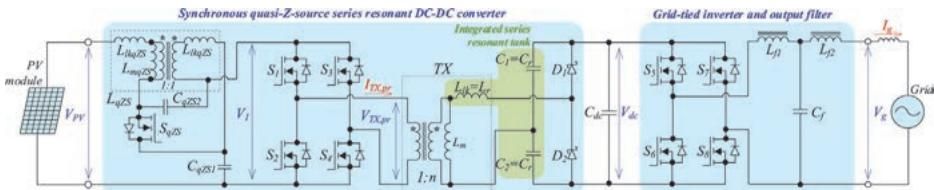  
Figure 2.1 Schematic of the impedance-source PV microinverter product

## 2.1.2 Reliability evaluation process

It is identified in $[2]$ that the temperature cycling is the most critical stress factor affecting the reliability of PV module-level power electronics. Therefore, this chapter takes into account the junction/hotspot temperature cycling and evaluates the wear-out failure probability of reliability-critical devices. The reliability evaluation flowchart is shown in Figure 2.4.

A real-field mission profile, including the ambient temperature and solar irradiance, is first translated into the microinverter input, i.e., the PV output voltage at maximum power points $V_{mpp}$ and PV output power at maximum power points $P_{mpp}$ . Then the power loss $P_{l}$ and junction/hotspot temperature $T_{j}$ can be obtained with an electrothermal model. The rainflow counting algorithm helps to derive the number of cycles of different stresses. With the component lifetime model and damage accumulation model, the accumulative damage can be obtained subsequently. In reality, there are many variations for component and model parameters, whose effect on the lifetime distribution can be evaluated with the Monte Carlo simulation. Finally, the system wear-out failure probability can be derived with the Weibull analysis and system reliability model.

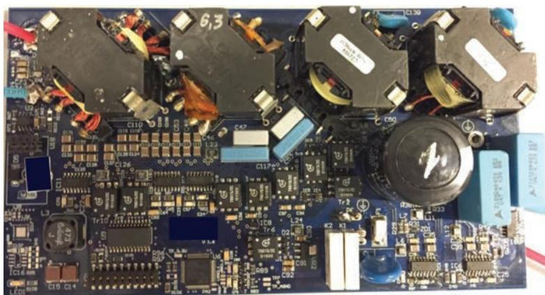  
Figure 2.2 Photo of the PV microinverter product

Table 2.1 Specifications and parameters of the PV microinverter prototype

<table><tr><td>Descriptions</td><td>Parameters</td></tr><tr><td>Input voltage range</td><td>10–60 V</td></tr><tr><td>Nominal voltage</td><td>33 V</td></tr><tr><td>Most probable operating voltage</td><td>20–40 V</td></tr><tr><td>Rated power</td><td>300 W</td></tr><tr><td>Switching frequency of DC–DC stage</td><td>110 kHz</td></tr><tr><td>Switching frequency of inverter stage</td><td>20 kHz</td></tr><tr><td>Switches  $S_{qZS}$ ,  $S_1-S_4$ </td><td>BSC035N10NS5</td></tr><tr><td>Switches  $S_5-S_8$ </td><td>SCT2120AFC</td></tr><tr><td>Diodes  $D_1-D_2$ </td><td>C3D02060E</td></tr><tr><td>Capacitors  $C_{qZS1}$  and  $C_{qZS2}$ </td><td> $2.2\mu F \times 12$ , C1210C225K1R</td></tr><tr><td>Coupled inductor  $L_{qZS}$ </td><td> $L_{mqZS} = 12\mu H$ ,  $L_{lkqZS} = 0.6\mu H$ , custom</td></tr><tr><td>Resonant capacitors  $C_l$  and  $C_2$ </td><td>10 nF // 33 nF</td></tr><tr><td></td><td>MKP1840310104M // B32672Z6333K</td></tr><tr><td>DC-link capacitor  $C_{dc}$ </td><td>150μF, 500-V electrolytic capacitor</td></tr><tr><td>Grid-side LCL filter: capacitor  $C_f$ </td><td>470 nF, B32653A6474K</td></tr><tr><td>Inductors  $L_{f1}$ </td><td>2.6 mH, custom</td></tr><tr><td>Inductors  $L_{f2}$ </td><td>1.8 mH, custom</td></tr><tr><td>Transformer TX</td><td> $L_m = 1$  mH,  $L_{lk} = 24\mu H$ , n=6, custom</td></tr></table>

## 2.2 Electrothermal and lifetime modeling

## 2.2.1 Power loss modeling

The current stresses of critical components in the microinverter are measured under different PV output voltages and power levels, and thus the power losses of MOSFETs, diodes, capacitors, and magnetic components can be calculated in different solar irradiances and ambient temperatures. It is noted that the drain-source on-state resistance of a MOSFET, the voltage drop and on-resistance of a diode, and the equivalent series resistance of an aluminum electrolytic capacitor are temperature-dependent. Therefore, their junction/hotspot temperatures interact with their power losses. The interdependency is considered in the electrothermal modeling. For other components, e.g., ceramic and film capacitors ( $C_{qZS}$ , $C_{r1}$ , $C_{r2}$ , $C_{f}$ ) and magnetic components (implemented with the 3C95 material), the dependency of their power losses on the hotspot temperatures is not significant and is therefore neglected.

## 2.2.2 Thermal modeling

The microinverter prototype is enclosed in a naturally cooled aluminum case with a dimension of $200 \, mm \times 150 \, mm \times 45 \, mm$ . The enclosure is filled up with high-thermal-conductivity compound, and as a result, the thermal cross-coupling (TCC) among the main devices is pronounced and cannot be neglected. The thermal impedance network of an enclosed converter system is shown in Figure 2.5. The thermal propagation from the junction to the ambient can be divided into two parts, i.e., from the junction to the enclosure and from the enclosure to the ambient.

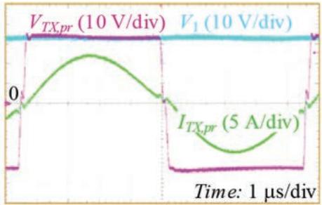  
(a)

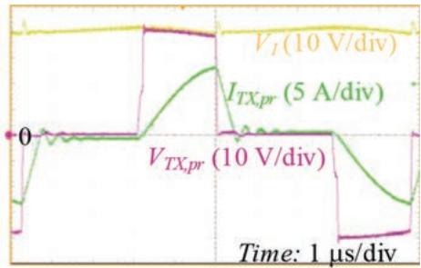  
(b)

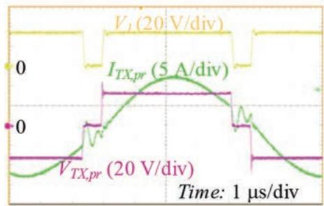  
(c)

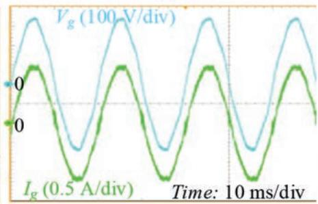  
(d)

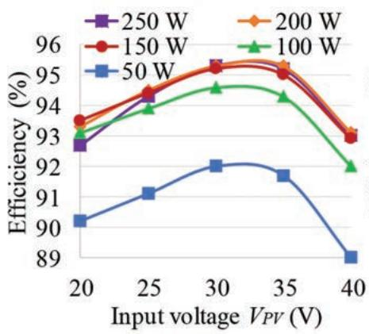  
(e)

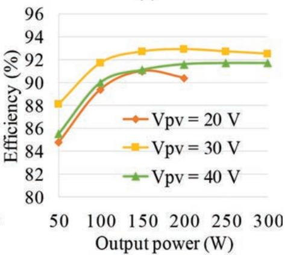  
(f)  
Figure 2.3 Experimental waveforms in the (a) pass-through mode, (b) buck mode, and (c) boost mode. (d) Measured grid voltage and current waveforms. Measured efficiency curves of (e) the DC–DC stage and (f) the whole microinverter including the auxiliary power supply.

Considering the Printed Circuit Board (PCB) traces and real physical properties of components, a finite element method (FEM) structure model of the PV microinverter prototype has been built in ANSYS/Icepak, as shown in Figure 2.6.

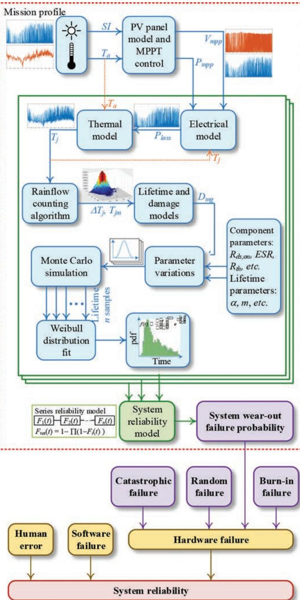  
Figure 2.4 Failure modes of power electronics systems and evaluation flowchart of the hardware wear-out failure probability

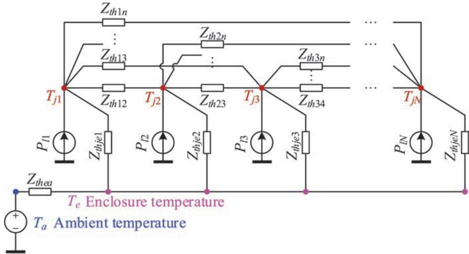  
Figure 2.5 Thermal impedance network of an enclosed converter system, including the self and mutual junction-enclosure thermal impedances

Enclosure-ambient thermal impedance: The heat is transferred from the enclosure to the ambient by three methods, i.e., radiation, conduction, and convection. Meanwhile, the enclosure is a custom irregular cylinder, and thus, it is difficult to analytically quantify the enclosure-to-ambient thermal impedance $Z_{thea}$ . Therefore, systematic FEM simulations have been conducted, and it is found that the aluminum enclosure is almost isothermal due to the filled high-thermal-conductivity compound. Based on the FEM simulations, the enclosure-ambient thermal impedance is modeled by Foster model:

$$
Z _ {t h e a} = R _ {t h e a} \left(1 - \mathrm{e} ^ {- t / \left(R _ {t h e a} C _ {t h e a}\right)}\right)\tag{2.1}
$$

where $C_{\text{thea}}$ is a constant as 2673 J/°C, but $R_{\text{thea}}$ is determined by the total power loss $P_{l}$ , i.e., $R_{\text{thea}} = 3.5P_{l}^{-0.216}$ .

Junction-enclosure thermal impedance: Conduction is the primary heat-propagation approach inside the enclosed PV microinverter prototype, which implies that the system consisting of the enclosure, main components, and compound is linear and time-invariant. Thus, it is possible to apply the superposition principle. The junction/hotspot temperature of a device is thus derived as

$$
\left[ \begin{array}{c} T _ {j 1} (t) \\ T _ {j 2} (t) \\ \vdots \\ T _ {j N} (t) \end{array} \right] = \frac {\mathrm{d}}{\mathrm{d} t} \left[ \begin{array}{c c c c} Z _ {j e 1 1} (t) & Z _ {j e 1 2} (t) & \dots & Z _ {j e 1 N} (t) \\ Z _ {j e 2 1} (t) & Z _ {j e 2 2} (t) & \dots & Z _ {j e 2 N} (t) \\ \vdots & \vdots & \ddots & \vdots \\ Z _ {j e N 1} (t) & Z _ {j e N 2} (t) & \dots & Z _ {j e N N} (t) \end{array} \right] * \left[ \begin{array}{c} P _ {l 1} (t) \\ P _ {l 2} (t) \\ \vdots \\ P _ {l N} (t) \end{array} \right] + T _ {e}\tag{2.2}
$$

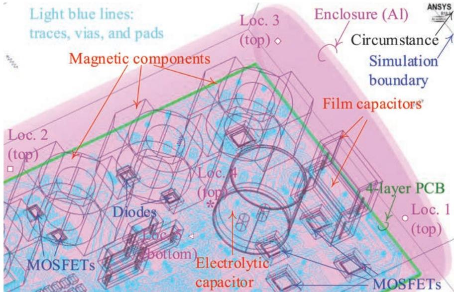  
Figure 2.6 Structure models of the main components, enclosure, and PCB (including traces and vias) built in ANSYS/Icepak for FEM simulations. The PCB and the enclosure are placed horizontally. The enclosure is naturally cooled, i.e., all faces are exposed to the open air.

where $T_{ji}$ is the junction/hotspot temperature of component i, $Z_{jenn}$ represents the self junction/hotspot-to-enclosure thermal impedance, $Z_{jemn}$ denotes the mutual junction/hotspot-to-enclosure thermal impedance between components m and n, $T_{e}$ is the enclosure temperature, $P_{ln}$ is the power loss of the nth component, and \* denotes convolution.

Multiple FEM simulations are performed to extract the elements of the thermal impedance matrix in (2.2). Figure 2.7 shows the FEM simulation results for the self and mutual thermal impedances of $S_{1}$ and the self thermal impedances of other components. The FEM simulations for the junction-enclosure thermal impedances are then fitted as multiorder Foster thermal models, i.e.,

$$
Z _ {j e m n} = \sum_ {k = 1} ^ {K} R _ {j e m n, k} \left(1 - e ^ {- t / \tau_ {j e m n, k}}\right)\tag{2.3}
$$

where $Z_{jemn}$ , $R_{jemn}$ , and $\tau_{jemn}$ are junction-enclosure thermal impedance, resistance, and time constant between components m and n, respectively.

The junction-enclosure temperature difference, enclosure-ambient temperature difference, and the junction temperature of component m can be calculated by the discrete equations

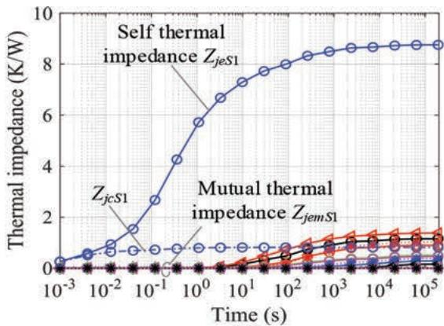

(a)  
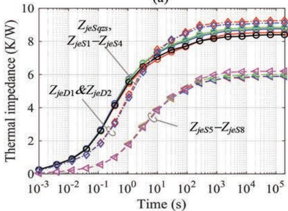  
(b)

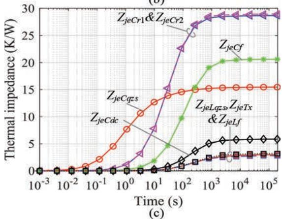  
Figure 2.7 FEM simulation results for thermal impedances. (a) Junction-case and junction enclosure thermal impedances of $S_{1}$ ; mutual junction-enclosure thermal impedances between $S_{1}$ and other components. Self junction-enclosure thermal impedances of (b) semiconductor devices and (c) passive components.

$$
\left\{ \begin{array}{c} \Delta T _ {j e m} (x + 1) = \sum_ {n = 1} ^ {N} \sum_ {k = 1} ^ {K} \left[ \begin{array}{c} \Delta T _ {j e m n, k} (x) e ^ {- t / \tau_ {m n, k}} \\ + P _ {l, n} (x) R _ {m n, k} \left(1 - e ^ {- t / \tau_ {m n, k}}\right) \end{array} \right] \\ \Delta T _ {e a} (x + 1) = \Delta T _ {e a} (x) e ^ {- t / \tau_ {e a}} + P _ {l, t o t} (x) R _ {e a} \left(1 - e ^ {- t / \tau_ {e a}}\right) \\ T _ {j m} (x + 1) = \Delta T _ {j e m} (x + 1) + \Delta T _ {e a} (x + 1) + T _ {a} \end{array} \right.\tag{2.4}
$$

where x denotes the time step, $\Delta T_{jem}$ is the junction-enclosure temperature difference, $\Delta T_{ea}$ represents the enclosure-ambient temperature difference, and $T_{jm}$ is the junction temperature of component m.

## 2.2.3 Lifetime modeling

According to the failure mode and effect analysis results in $[3, 4]$ , the progressive increase of the on-state resistance (wear-out) of MOSFETs is mainly caused by the growth of fatigue cracks and voids into the source metal layer. A 20 percent rise of the on-state resistance is chosen as the criteria of wear-out failure, and a Coffin-Manson law-based reliability model is built in $[3]$ .

$$
N _ {f} = \alpha \cdot \left(\Delta T _ {j}\right) ^ {- m}\tag{2.5}
$$

where $N_{f}$ is the number of cycles of failure, $\Delta T_{j}$ is the junction temperature swing, and $\alpha$ and m are fitting parameters. A widely used capacitor lifetime model is employed for the lifetime projection of capacitors [5]:

$$
L _ {c n} = L _ {c 0} \times 2 ^ {\frac {T _ {0} - T _ {h}}{n _ {1}}} \left(V / V _ {0}\right) ^ {- n _ {2}}\tag{2.6}
$$

in which $L_{cn}$ is the lifetime under the thermal and electrical stress $T_{h}$ and V, $L_{c0}$ is the lifetime under the reference temperature $T_{0}$ and the nominal voltage $V_{0}$ . The coefficient $n_{1}$ is a temperature-dependent constant and $n_{2}$ is the voltage stress exponent. The values of $n_{1}$ and $n_{2}$ vary for different types of capacitors, and the relevant information is provided in [5].

A commonly used damage accumulation model—Miner's rule [6] is employed to calculate the accumulative damage of a component. A device fails when the accumulative damage, $D_{mg}$ , reaches 1.

## 2.3 Wear-out failure analysis of the PV microinverter

The mission profiles from two locations, Arizona, USA, and Aalborg, Denmark, are applied to the PV microinverter models, yielding the annual temperature profiles of the critical components and enclosure, as shown in Figure 2.8. It can be seen that both the mission profile and the TCC effect have a significant impact on the junction/hotspot temperatures of components. When operating at Arizona and Aalborg (see Figure 2.8a and b), the highest component junction temperatures of the microinverter are $89\ °C$ and $75\ °C$ , respectively. If the TCC effect is neglected, a significant underestimation will be caused for the junction/hotspot temperatures, as shown in Figure 2.8c and d.

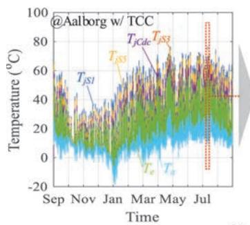

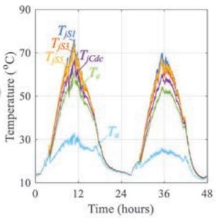

(a)  
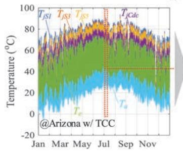

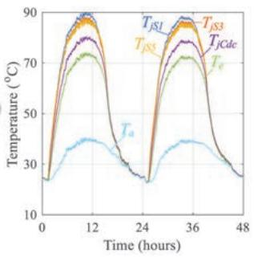

(b)  
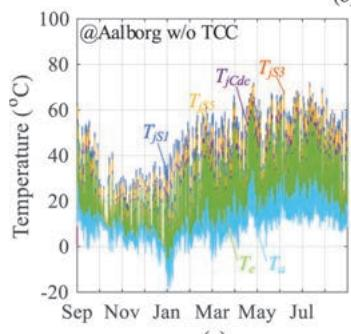  
(c)

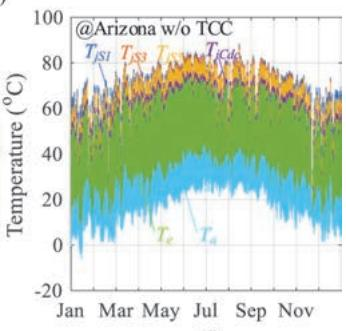  
(d)  
Figure 2.8 Temperature profiles of critical components ( $S_{1}$ , $S_{3}$ , $S_{5}$ , $C_{dc}$ ) and the enclosure. (a) Aalborg, Denmark, considering the TCC effect; (b) Arizona, USA, considering TCC; (c) Aalborg, Denmark, not considering TCC; (d) Arizona, USA, not considering TCC

## 2.3.1 Static annual damage of components

With and without considering the TCC effect, the annual damages of each critical component at the two locations are shown in Figure 2.9. It can be observed that the DC-link capacitor $C_{dc}$ has the highest annual damage at both locations, i.e., 0.01 and 0.057 for Aalborg and Arizona, respectively. Assuming there are no other kinds of failures, the corresponding wear-out lifetimes of the DC-link capacitor are 100 years and 17.54 years for the two operating locations. However, if the TCC effect is not considered, then the annual damages of $C_{dc}$ at the two locations are 0.007 and 0.031, which results in an underestimation rate of about 30 percent.

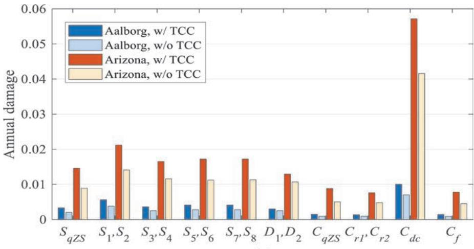  
(a)

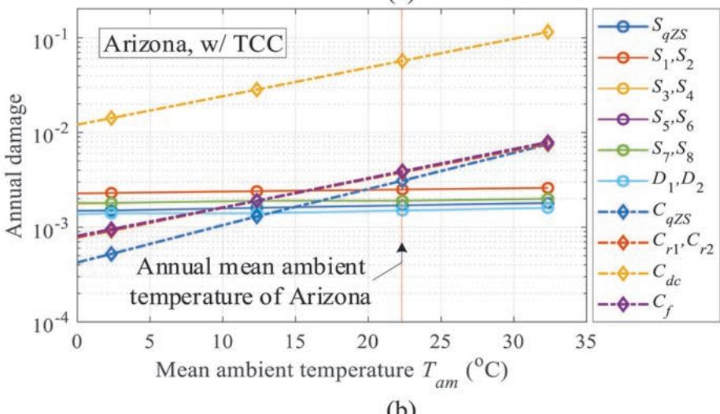  
(b)  
Figure 2.9 Annual damage to each critical component in the topology of Figure 2.1 when the microinverter operates at different locations with and without considering the TCC effect

## 2.3.2 Monte Carlo simulation

In the real-world operation, many uncertainties, e.g., parameter boundaries of the employed device lifetime models, parameter variations of devices, and mission profile variations, will influence the lifespan projection of the PV microinverter.

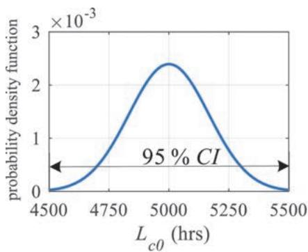

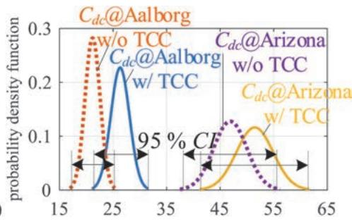  
Equivalent hot-spot temperature ( $^{\circ}$ C)

(a)  
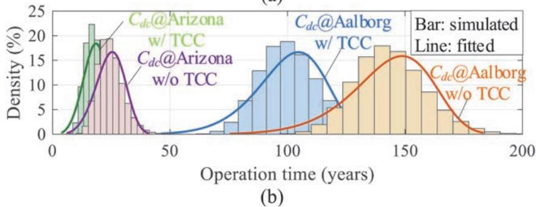  
Figure 2.10 Histograms of the years to the wear-out failure of (a) $C_{dc}$ and (b) $S_{1}$ for a population of $1 \times 10^{5}$ samples operating at the two locations, with and without considering the TCC effect

Considering all the variations that presumably obey the normal distribution, a sensitive analysis—Monte Carlo simulation is conducted. The histograms of years to wear-out failure for the selected components $C_{dc}$ and $S_{5}$ are shown in Figure 2.10a and b, respectively.

## 2.3.3 System failure probability due to wear-out

The histograms in Figure 2.10a and b are fitted as the Weibull distribution [7]. Assume all the considered devices are connected in series in the reliability model, i.e., any component failure will lead to system failure. Then the system wear-out failure $F_{sys}(t)$ is

$$
F _ {s y s} (t) = 1 - \prod \left(1 - F _ {i} (t)\right)\tag{2.7}
$$

where $F_{i}(t)$ represents the cumulative distribution function of wear-out failure of the ith component.

Figure 2.11 shows the probability curves of wear-out failures for components and the system when operating at Aalborg, Denmark, and Arizona, USA, with and without considering the TCC effect. First, it can be seen that the mission profile has a strong impact on the wear-out failure: when operating in a harsher environment, i.e., Arizona, the wear-out failure probabilities before 25-year operation are significantly higher. Second, neglecting the TCC effect will lead to an obvious underestimation of the wear-out failure probability; when operating at Aalborg, the predicted system wear-out failure probability before 25 years is 3.3 percent (see Figure 2.11a), whereas the corresponding value is only 1.3 percent (see Figure 2.11b) if neglecting the TCC effect. When operating at Arizona, the $B_{10}$ lifetimes with and without considering the TCC effect are 8.3 years and 12.2 years (see Figure 2.11c and d), respectively, which implies that about 45 percent lifetime overestimation can be made if the TCC effect is neglected. Also, it can be seen that the DC-link electrolytic capacitor $C_{dc}$ has the highest wear-out failure probability when the operating environment is harsh and thus dominates the system wear-out failure. Hence, it can be concluded that the DC-link electrolytic capacitor $C_{dc}$ is the bottleneck of 25-year reliable operation for the studied PV microinverter.

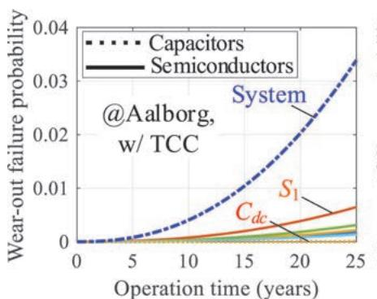  
(a)

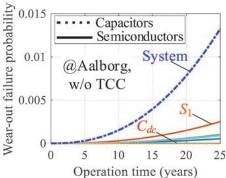  
(b)

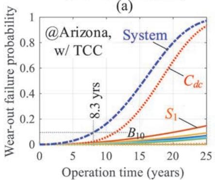  
(c)

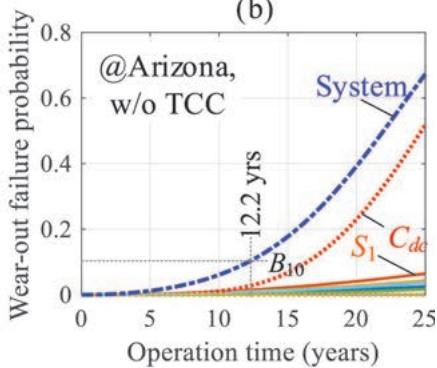  
(d)  
Figure 2.11 Probability curves of wear-out failure for each component and the system when operating at (a) Aalborg, Denmark, with considering the TCC effect; (b) Aalborg, Denmark, without considering the TCC effect o; (c) Arizona, USA, with considering the TCC effect; (d) Arizona, USA, without considering the TCC effect

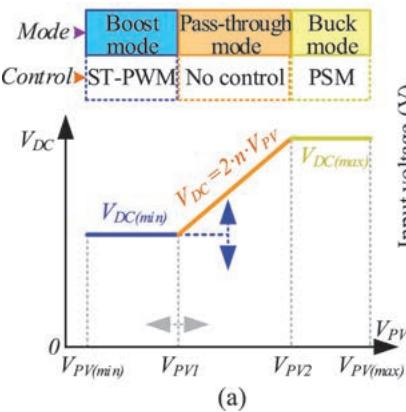

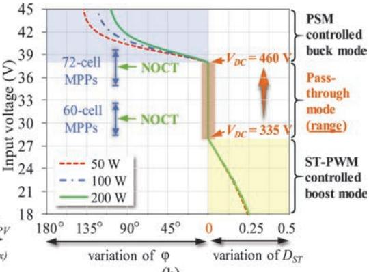  
(b)  
Figure 2.12 Advanced multimode control of the qZSSRC with a variable DC-link voltage: (a) sketch of DC-link voltage variations; (b) regulation characteristics. The abbreviations “PSM”, “ST”, “PWM”, “MPP” and “NOCT” represent “phase-shift modulation”, “shoot-through”, “pulse-width modulation”, “maximum power point” and “nominal operating cell temperature”, respectively.

## 2.4 Reliability improvement of the PV microinverter

## 2.4.1 Advanced multimode control of the qZSSRC

With the conventional multimode control scheme proposed in [1], the DC–DC converter operates in the PTM only at a particular input voltage, in which the converter has the highest efficiency, as shown in Figure 2.3e. However, it is not necessary for a grid-connected microinverter to have a stable DC-link voltage; hence, an advanced multimode (variable DC-link voltage) control scheme (see Figure 2.12a) can be applied to the DC–DC converter, as illustrated in Figure 2.12b. Specifically, the operation range of the PTM is $V_{in} \in [28, 38]$ V, and in this mode, the DC-link voltage varies with respect to $V_{in}$ from 335 V to 460 V. When $V_{in}$ is beyond the PTM range, the microinverter will operate in the buck or boost mode, and the DC-link voltage will be fixed at 460 V and 335 V, respectively. With the advanced control scheme, the efficiency performance of the microinverter can be significantly improved, as shown in Figure 2.13. Thus, the power losses and junction/hotspot temperatures of components can be remarkably decreased.

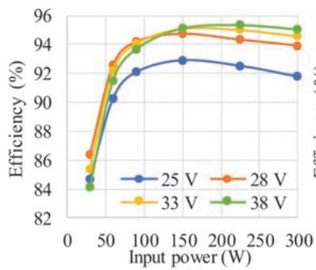  
(a)

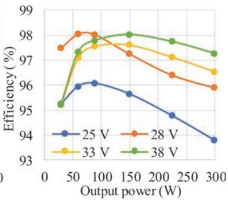  
(b)  
Figure 2.13 Measured efficiency with the new control strategy: (a) the whole PV microinverter including the auxiliary power, (b) the DC–DC power stage

## 2.4.2 New DC-link electrolytic capacitor with longer nominal lifetime

It has been observed from Figure 2.11c and d that the used DC-link electrolytic capacitor $C_{dc}$ is the bottleneck for the long-term reliable operation of the commercial PV microinverter product. In the baseline design, the DC-link employs a cost-optimized 150- $\mu$ F electrolytic capacitor, whose nominal lifetime is 5 000 hours at 85 $^{\circ}$ C. To improve system reliability, this chapter proposes to replace

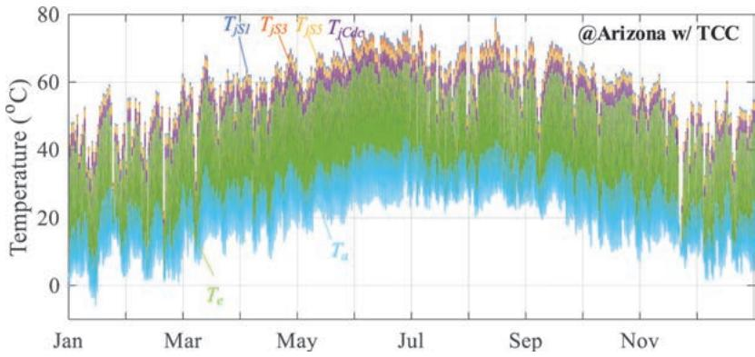  
Figure 2.14 Calculated temperature profiles of critical components ( $S_{1}$ , $S_{3}$ , $S_{5}$ , $C_{dc}$ ) and the enclosure of the PV microinverter with the new DC-link capacitor and new control scheme. The mission profile of Arizona is used and the TCC effect is taken into account in the temperature calculations.

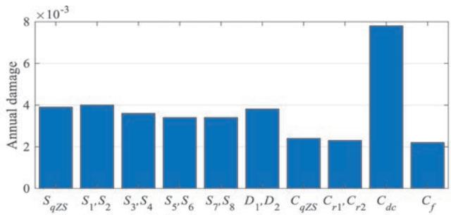  
(a)

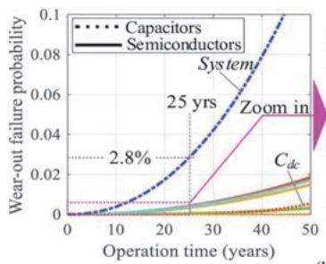

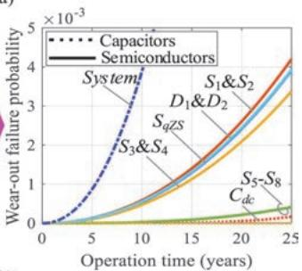  
(b)  
Figure 2.15 Reliability evaluation results of the PV microinverter with the variable DC-link voltage control and the new electrolytic capacitor; the mission profile of Arizona is applied: (a) annual damage and (b) wear-out failure probabilities of each component and the system

the previous electrolytic capacitor with a new one with a longer nominal lifetime (5 000 hours @105 °C) along with the advanced multimode control scheme.

## 2.4.3 Wear-out failure probability

With the proposed advanced multimode control and the better electrolytic capacitor, the temperature profiles of $S_{1}$ , $S_{3}$ , $S_{5}$ , $C_{dc}$ , and the enclosure are derived, as shown in Figure 2.14. Compared with the baseline solution, the new design enables the microinverter to operate at lower temperatures (see Figures 2.8 and 2.14). Figure 2.15 shows the obtained annual damage and wear-out failure probability with the new design.

Because of the lower junction/hotspot temperature, the annual damages of components are reduced; notably, the annual damage of $C_{dc}$ is remarkably decreased from 0.057 to 0.0078. The wear-out failure probabilities of the components and the system are shown in Figure 2.15b. With the new design, all the failure probabilities before 25 years are maintained low. For the system, its wear-out failure probability over 25-year operation is about 2.8 percent, which is significantly enhanced compared with the baseline solution (see Figure 2.9c).

## 2.5 Summary

This chapter presents a wear-out failure analysis and reliability improvement of a 300-W impedance-source PV microinverter product. A description of the product configuration and reliability evaluation process is first presented. With experimental measurements and FEM simulations, a system-level electrothermal model and empirical lifetime models are then built for the components and enclosure of the PV microinverter. After that, the wear-out performance of the microinverter is evaluated before measures are taken to improve its reliability. It is concluded that (i) both the mission profile and TCC effect have a remarkable impact on the lifetime projection of the PV microinverter; (ii) the DC-link capacitor is the weakest link in the product in terms of the wear-out performance; and (iii) the proposed variable DC-link voltage control and long-lifetime aluminum electrolytic capacitor can significantly reduce the system wear-out failure probability.

## References

[1] Vinnikov D., Chub A., Liivik E., Roasto I. 'High-performance quasi-Z-source series resonant DC–DC converter for photovoltaic module-level power electronics applications'. IEEE Transactions on Power Electronics. 2017;32(5):3634–50.

[2] TamizhMani G. ‘Standardization and reliability testing of module-level power electronics MLPE’. NREL Reliability Workshop. 2015:1–18.

[3] Testa A., De Caro S., Russo S. 'A reliability model for power MOSFETs working in avalanche mode based on an experimental temperature distribution analysis'. IEEE Transactions on Power Electronics. 2012;27(6):3093–100.

[4] Russo S., Testa A., De Caro S., et al. 'Reliability assessment of power MOSFETs working in avalanche mode based on a thermal strain direct measurement approach'. IEEE Transactions on Industry Applications. 2016;52(2):1688–97.

[5] Shen Y., Chub A., Wang H., Vinnikov D., Liivik E., Blaabjerg F. 'Wear-out failure analysis of an impedance-Source PV microinverter based on system-level electrothermal modeling'. IEEE Transactions on Industrial Electronics. 2019;66(5):3914–27.

[6] Miner M.A. ‘Cumulative damage in fatigue’. Journal of Applied Mechanics. 1945;12(3):A159–64.

[7] McPherson J.W. Reliability Physics and Engineering. 2nd edn. Berlin/Heidelberg: Springer; 2013.

# Chapter 3 Reliability analysis methods and tools Ionut Vernica $^{1}$ and Frede Blaabjerg $^{1}$

## 3.1 Background and motivation

Nowadays, due to the growing concerns regarding the impact of greenhouse gas emissions on the environment, renewable energies are seen as part of the solution to this problem and are gaining much of the attention of both public and private stakeholders. Among renewable energy solutions, photovoltaic (PV) technology can provide a large share of the future clean energy demands. Enabled by the advancements in semiconductor technologies, the cost of PV systems has seen a significant drop in recent years $[1]$ and, thus, facilitating a rapid growth in the PV installation capacity over the past decade $[2]$ .

With increased penetration level of PV systems, the safety and reliability requirements of such systems have also become more stringent over time. For example, currently, a typical PV system is expected to have a target lifetime between 5 and 30 years, considering 12 hours per day operation $[3]$ . These reliability requirements are likely to tighten in the near future, and PV systems will be expected to withstand more harsh environments and longer operating hours, with failure return rates in the parts per million (ppm) range $[4]$ .

Within the PV system, the inverter is an essential subsystem that can have a significant effect on the overall volume, efficiency, availability, and reliability of the entire system. However, by looking at the quantified reliability metrics (e.g., operation and maintenance events) reported by different PV plant operators $[5–7]$ , it can be noticed that the inverter represents one of the most prone-to-failure subassemblies of the PV system. Despite its crucial role in the correct operation of the overall system, as shown in Figure 3.1, the failure rate of the PV inverter can vary between 43 and 70 percent in commercial, residential, and utility PV installations. Thus, the inverter is often seen as the “bottleneck” of the PV system, with respect to reliability. Furthermore, as shown in Figure 3.2, from the cost breakdown of unscheduled maintenance events that occurred during the five-year operation of a utility-scale PV generation plant $[8]$ , it can be concluded that the PV inverter is the highest source of repair and maintenance cost in the PV system. Considering the additional costs associated with energy losses due to downtime, the reliability of the PV inverter can have a significant impact of the levelized cost of energy (LCOE).

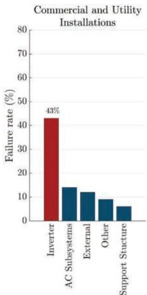  
(a)

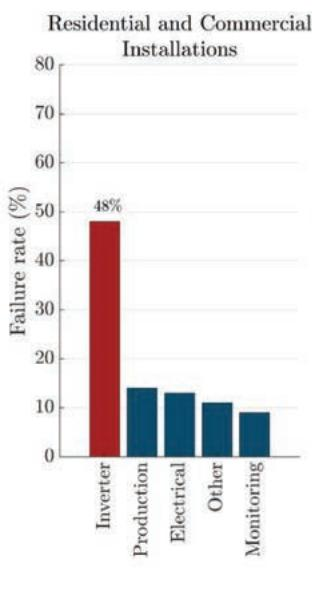  
(b)

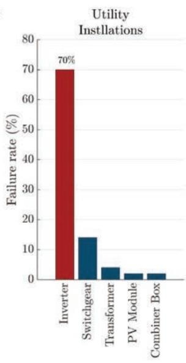  
(c)  
Figure 3.1 Failure rate distribution for (a) commercial and utility PV installations [4], (b) residential and commercial PV installations [5], and (c) utility PV installations [6]

Consequently, in an attempt to improve the reliability performance of the PV inverter and inherently reduce the number of unexpected maintenance events of the PV system, various reliability assessment methods and tools are employed. Ideally, the reliability analysis and allocation should be performed during the design and development stages of the product, as it is much more cost-effective to identify major flaws and design weaknesses in the PV inverter early on in the product life cycle. Additionally, considering that the design and manufacturing processes have been found responsible for more than half of the inverter failures $[9]$ , the reliability growth strategy should be built around employing reliability evaluation tools during these two crucial stages of the product life cycle.

As shown in Figure 3.3, several methods and tools can be used to assess and improve the reliability of PV inverters. However, the applicability and cost-effectiveness of each tool are strongly dependent on the product life cycle stage. A general overview of the most common reliability tools used for PV inverters is given in this chapter. The presented tools can be employed during both the early stages of the product development process (e.g., failure mode and effect analysis (FMEA), Design for Reliability (DfR), and custom or commercial software tools) and the more mature stages of the product life cycle (e.g., reliability testing and robustness validation). To provide the reader with a better understanding, practical examples on an Insulated Gate Bipolar Transistor (IGBT) inverter power module are given where possible.

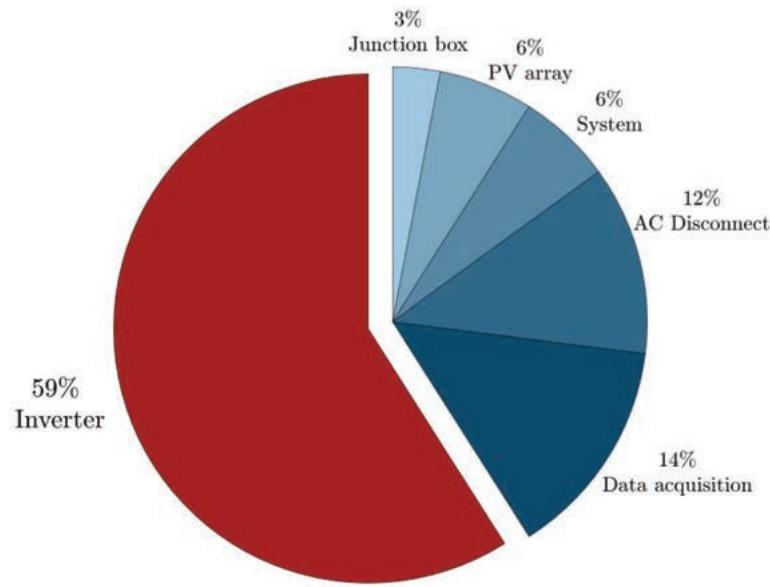  
Figure 3.2 Unscheduled maintenance cost breakdown of a utility-scale PV installation [8]

## 3.2 Failure mode and effect analysis

FMEA is a systematic methodology used to identify and understand the possible failure modes (FMs) of a system or process and assess their associated causes and effects to justly determine (and prioritize) corrective or preventive measures. Due to its versatility, FMEA can be applied throughout different stages of the product development process, and, thus, it can be classified into three major types:

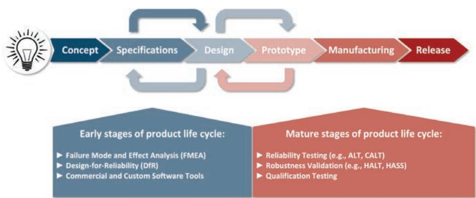  
Figure 3.3 Different reliability analysis methods and tools, and their applicability throughout the various stages of the product life cycle

\- System FMEA (SFMEA)—Typically employed during the early concept stages of the product, when a system-level analysis is possible and required (e.g., PV inverter system).

\- Design FMEA (DFMEA)—Typically employed during the design (and development) stages of the product with a focus on the design-related issues, which may appear at the subsystem or component level (e.g., IGBT power module used in the PV inverter).

\- Process FMEA (PFMEA)—Typically employed during the manufacturing stage of the product and focuses on the process-related issues associated with the manufacturing and assembly processes.

In general, FMEA should be performed when a new system or process is being developed, or when an existing system or process suffers significant modifications with high associated risks. FMEA relies strongly on knowledge regarding the design of the system or process, its mission profiles, and possible historical data from similar systems or processes (e.g., field failure statistics). Thus, to effectively use this tool and link the possible FMs to the potential causes and effects of its critical subsystems or components, prior information concerning the application use-cases is needed. Otherwise, in cases where there is a lack of available information or historical data (e.g., as is the case for new technologies/processes), the effectiveness of the FMEA depends solely on the knowledge and experience of the team carrying out the analysis. A general FMEA methodology is proposed in the IEC 60812 standard [10], whereas broader FMEA implementation guidelines can be found in [11].

In this chapter, the applicability of the DFMEA procedure is exemplified on the IGBT power module component of the PV inverter. The analysis helps to identify the possible FMs of the power module and to understand its causes and effects on the overall PV system (e.g., cease or significantly degrade the operation, affect the safety of the user). To perform DFMEA in a systematic manner, several graphical tools can be employed.

The boundary diagram is used to represent the physical relationships between the components of the system and, as the name suggests, the boundary of the analysis. The interdependencies between the target component or subsystem under a specific life cycle stage and its interfacing elements can be graphically illustrated, and, thus, the functions (and possible interferences) of the component or subsystem of interest can be identified. A sample “boundary diagram” for a power module used in a grid-connected PV inverter is shown in Figure 3.4. During its operation life cycle, the power module interacts with various components (e.g., DC-link busbar, printed circuit board assembly (PCBA) solder joint, cables) of the PV system. As shown in Figure 3.4, the interactions between the power module and each of the interface elements can be visually defined. For example, the power module interacts with the DC-link busbar through the current and harmonics it generates, and through the voltage, current, and harmonics it receives from the DC-link busbar.

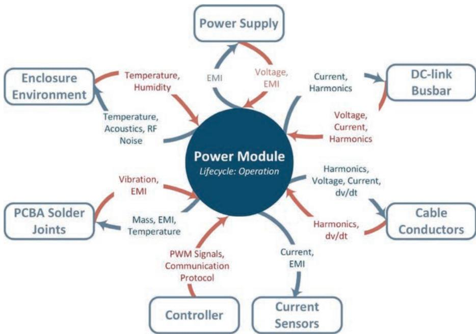  
Figure 3.4 “Boundary diagram” example of a power module used in a typical grid-connected PV inverter during the field operation life cycle. (PCBA = printed circuit board assembly, dv/dt = rate of change of voltage, EMI = electromagnetic interference, PWM = pulse width modulation, RF = radio frequency).

Another useful graphical tool that can facilitate the DFMEA process is the “Parameter Diagram” (P-Diagram). This tool illustrates the ideal correlation between the input of the component or subsystem and its desired output response. Additionally, the sensitivity of the specified component or subsystem function to external noise and control factors is considered, and potential error states (or unintended outputs) can be defined. Control factors are typically the adjustable design parameters of the component or subsystem, while noise factors represent the factors that can indirectly influence the design and behavior of the component or subsystem (e.g., piece-to-piece variations, degradation, customer usage profile, environmental or operating conditions, and system interactions). Finally, the error states can be defined as any kind of loss in functionality or any other unintended outputs. An example of a “P-Diagram” for the power module of a grid-connected PV inverter is shown in Figure 3.5. The inputs required by the power module to correctly perform its designated function and its ideal outputs are highlighted. To convert the DC electrical energy to controlled AC electrical energy and inherently generate controlled AC voltage and current signals, the power module requires a

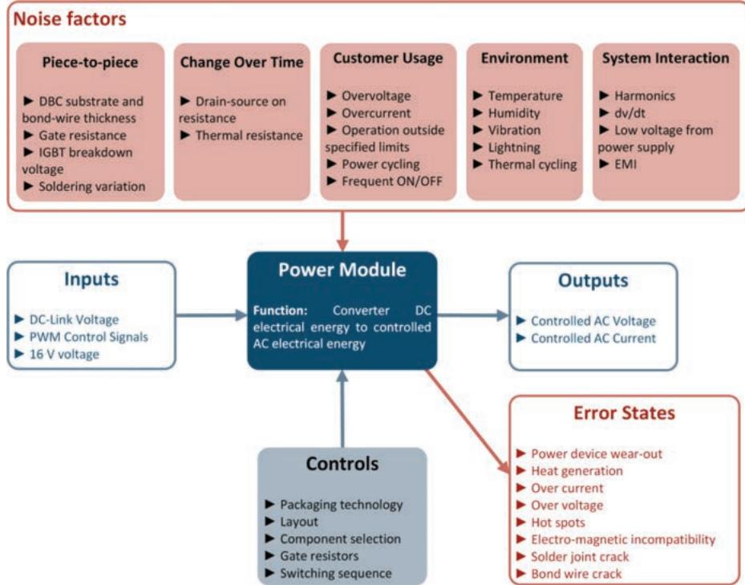  
Figure 3.5 Sample “P-DIagram” Representation of a Power Module Used Within a Typical Grid-Connected PV Inverter. (PWM = Pulse Width Modulation, DC = Direct Current, AC = Alternative Current, DBC = Direct Bonded Copper, IGBT = Insulated-Gate Bipolar Transistor, DV/DT = Rate of Change of Voltage, EMI = Electromagnetic Interference)

DC voltage, a sequence of PWM control signals, and a 16-V power supply voltage as inputs. The functionality of the power module can be influenced by several control factors, such as packaging technology, layout configuration, which will, in turn, result in variations in the AC current and voltage outputs. Moreover, external noise factors can lead to a suboptimal operation of the power module and several error states, such as wear-out, excessive heat generation, and bond-wire crack.

Finally, the “structure tree” tool can provide a graphical representation of the system structure and identify the interactions between the several subsystems or components of the PV systems. The top-down approach is typically the most effective, giving an overview from product level down to subcomponent level. An example structure tree of a typical PV system is given in Figure 3.6. As shown in Figure 3.6, the PV system can be divided into three major independent systems (e.g., PV module, PV inverter, and Balance of System (BOS)), which can then be further classified into different subsystems. The IGBT power module lies at the component level, under the PCBA subsystem, and with several subcomponents at its bottom level. Additionally, the “structure tree” can provide the designer with an optimal tool on which the FM and functional decomposition can be performed. Sample functions (F) and their corresponding FMs are given below for the power module component of the PV inverter.

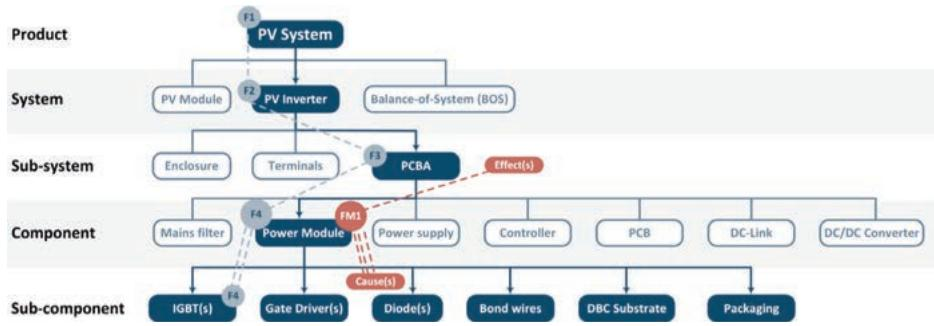  
Figure 3.6 Example “structure tree” of a power module used in a typical PV inverter of a grid-connected PV system. (PCBA = printed circuit board assembly, PCB = printed circuit board, IGBT = Insulated-Gate Bipolar Transistor, DBC = direct bonded copper, FMx = failure mode, Fx = function).

## F4.1: Convert DC electrical energy to controlled AC electrical energy

FM-01: IGBTs do not conduct when turned ON;

FM-02: IGBTs do not block when turned OFF;

FM-N: No commutation signal from gate drivers;

F4.2: Connect to DC busbar and cable conductors

FM-01: Weak connection;

FM-02: Crack in solder joints;

FM-N: Connection in wrong position;

F4.3: Withstand environmental conditions

FM-01: Subcomponent failure due to excessive humidity;

FM-02: Subcomponent failure due to excessive ambient temperature;

FM-N: Subcomponent failure due to excessive air pollution;

F4.N: Operate below electrical loss target

FM-01: Too high switching losses;

FM-02: Low-quality electrical input (e.g., harmonics)

FM-N: Degradation of internal parameters (e.g., thermal resistance)

Each component or subsystem of the PV system can perform multiple functions, and each function can have several FMs that can interrupt or degrade its functionality. Furthermore, each FM has a “cause,” which represents the specific reason for the failure, and an “effect,” which is the consequence of the failure. Typically, the causes can be linked to the below-layer of the “structure tree,” and can be tracked down until the root cause is identified. The effect of a specific FM is typically visible in the above-layer of the “structure tree.”

To determine the impact of different FMs on the system and to correctly define and assign preventive or corrective measures, each FM can be rated according to its severity of effect (S), likelihood of occurrence (O), and likelihood of detection (D). Thus, based on the above-mentioned factors, the Risk Priority Number (RPN) can be computed and used as a numerical ranking system of each potential FM. The RPN can be calculated as shown below:

$$
R P N = S \cdot O \cdot D\tag{3.1}
$$

Thus, based on the RPN ranking, educated decisions or actions can be taken to reduce the likelihood of occurrence of a certain FM (or improve its detectability), and, hence, the impact of a given FM can be minimized (or even mitigated) and the reliability of the PV system can be improved. Generic scales for the severity, occurrence, and detectability ratings can be found in $[12]$ . However, typically, these factors need to be adapted in accordance with the requirements of PV plant operator or user.

In conclusion, FMEA is an effective and flexible tool, which can help the designer to identify potential FMs early on in the development process of PV inverters and can help determine proper design methods for a sustainable reliability growth strategy. However, for complex systems with many subsystem or components, the analysis can become very time-consuming and resource-demanding. Additionally, the lack of available product use-cases and historical data can represent a significant drawback as the analysis is based solely on the experience and knowledge of the design team (e.g., a multidisciplinary team is needed).

## 3.3 Design for reliability

Another powerful reliability assessment and improvement tool, which can be used during the early life cycle stages of PV inverters, is the DfR methodology. The concept of DfR is based on the processes performed during the early design and development stages of a product, which guarantee that certain reliability or quality design targets are met $[3]$ . An effective implementation of the DfR method can help the designer to quickly benchmark different technologies, accelerate the reliability processing time, and, inherently, reduce the time-to-market of new products and their overall life cycle cost. This has led to the DfR concept to be widely adopted since the early 1950s. However, for PV inverters, the methodology has been gaining significant attention in recent years due to the progress in software simulation tools and increased testing capabilities of power electronic components.

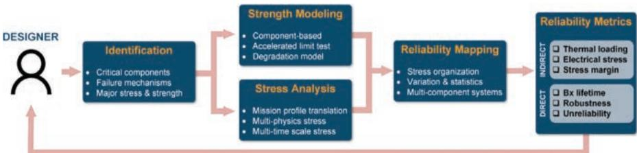  
Figure 3.7 Generic Flow Diagram of the DfR Methodology Used for Power-Electronic-Based Systems

A generic flow diagram of the DfR procedure is given in Figure 3.7. The analysis begins with the Identification phase, during which the designer classifies the critical components of the system and their corresponding FMs and failure mechanisms. This information can be obtained through other reliability analysis tools and concepts, such as FMEA and Physics-of-Failure (PoF). Moreover, during the first phase of the DfR approach, the stress and strength profile of the critical components can be determined with the help of robustness validation testing (e.g., highly accelerated life testing (HALT)). Within the second stage of the process, the critical component information can be used by the designer for Strength Modeling and Stress Analysis. Typically, the strength modeling is performed at component-level and reliability testing methods, such as Accelerated Life Testing (ALT), are used to determine an analytical lifetime model equation, which can describe a particular wear-out failure mechanism. On the other hand, within the Stress Analysis part, the environmental and operating mission profiles of the system are identified and used to analytically calculate the corresponding stressors of the components of interest, through specialized simulation software tools. Following, based on the developed strength and stress models, the Reliability Mapping phase of the DfR approach can commence. During this phase, the stress data needs to be organized and represented in such a way that it can be correctly applied to the lifetime model and determine the initial lifetime estimation of the components. For a more realistic approach, possible variations are included and different statistical tools (e.g., Weibull, Monte Carlo simulation) are used to determine the lifetime distribution of the components of interest. System-level reliability tools (e.g., Reliability Block Diagram (RBD)) can then be used to calculate the reliability performance of multicomponent systems. Finally, throughout the DfR procedure, the designer can obtain several critical reliability metrics, either as indirect reliability indicators (e.g., expected electrical and thermal loading or behavior) or as direct reliability indicators (e.g., estimated lifetime distribution, unreliability curve).

Thus, by applying the DfR concept, the designer can use the obtained reliability indicators to identify the major design weaknesses and flaws, and take effective decisions or actions regarding the reliability-oriented design of the product. Consequently, motivated by the potential cost-saving and time-to-market reduction benefits of the DfR methodology, mission-profile-based reliability assessment procedures for power electronics have been proposed throughout the scientific literature for a wide variety of applications (e.g., wind power converters [13], more electric aircrafts [14], traction inverters for electric vehicles [15]). Among these, mission-profile-based lifetime estimation methods of PV inverter systems have been the focus of many studies [16–18].

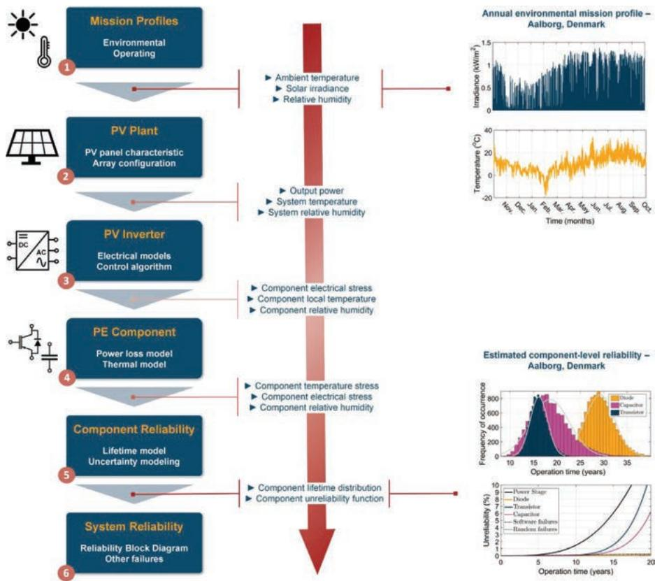  
Figure 3.8 Typical Mission-Profile-Based Lifetime Estimation Methodology for Power Electronics Used in PV Systems. (PE = Power Electronic)

A general mission-profile-based reliability assessment procedure of power electronics used in PV systems is presented in Figure 3.8. The presented six-step model-based approach is used to translate the environmental mission profiles to the system-level, converter-level, and then to the component-level stress, and, finally, to estimate the component-level and the system-level reliability metrics. This methodology integrates the various physical layers (e.g., electrical, thermal, lifetime, statistical) of the reliability analysis process in a straightforward manner, thus, allowing for a quick adoption and implementation by either PV inverter manufacturers, users, or integrators. A brief description of each of the six steps is given below:

\- Step 1: Mission Profile—Initially, the designer must determine what are the relevant operating and environmental conditions to which the PV systems are exposed to. The cumulation of these conditions represents the mission profile of the system. Typically, field-measured data of ambient temperature, solar irradiance, and relative humidity represent a generic mission profile for PV systems.

\- Step 2: PV Panel(s)—During this step, the input mission profiles are converted to the system-level outputs (e.g., system-level temperature or relative humidity and output electrical power of the PV panel). This can be achieved with the help of electromechanical analytical models of the PV panel or through look-up table approximations.

\- Step 3: PV Inverter—Based on the analytical electrical models of the power electronic system, the output electrical power of the PV panel is used to determine the electrical stresses (e.g., voltage or current loading) of each of the components of interest (e.g., IGBT, capacitor). The impact of the control algorithm and/or of the modulation technique can also be included within this step. Moreover, the system-level temperature or relative humidity can be translated to the local temperature or relative humidity of each component, either through rough “rule-of-thumb” approximations or through complex Finite Element Analysis (FEA) simulations.

\- Step 4: Power Electronic (PE) Component—In the next step of the procedure, the electrical loadings of the components of interest are translated into their corresponding thermal dynamic behavior. This is achieved according to the analytical electrothermal models, which are used to calculate the generated power losses of the components and, inherently, their thermal loadings. Additional information regarding the external thermal network (e.g., cooling) of the components can be included within this step for a more accurate estimation of the thermal stress.

\- Step 5: Component Reliability—Within this step, the previously determined stressors of the components of interest (e.g., temperature, electrical and/or relative humidity) are linked to their corresponding lifetime models and, thus, used to estimate the expected lifetime of the component. For a more realistic approach, the uncertainties that occur in the stressors or lifetime model coefficients are included in the statistical analysis, and different reliability metrics (e.g., lifetime distribution, unreliability curve) are identified.

\- Step 6: System Reliability—Finally, the reliability information of each of the components of interest can be merged together through various methods (e.g., RBD, Markov chain), and the system-level reliability can be estimated. Additionally, at this point, other FMs, which are difficult to model or calculate (e.g., catastrophic failures, software failures), can be approximated (e.g., annual percentage) and included in the final reliability estimation.

The above-mentioned mission-profile-based reliability assessment procedure can aid the designer to quickly identify major design flaws and implement preventive or corrective measures (e.g., redundancy, overdesign of fragile components), which can help to improve the design of the PV inverter with respect to reliability. If accurate data or information about the system are available to the designer, then the procedure can be effectively used to determine the product warranty periods and service intervals or schedule predictive maintenance routines. However, for cases where there is a lack of accurate available data, the given procedure could still facilitate the DfR methodology by allowing for fast benchmarking of different solutions and technologies, and quantifying their impact on the relative lifetime prediction.

In conclusion, the DfR methodology is a powerful asset in the designer's toolbox, which can be used during the early design and development stages of the PV inverter life cycle. A proper implementation can result in significant advantages, such as reduced time-to-market, reduced overall life cycle cost, or as a means of rapid comparison of the impact that different technologies have on the component or system reliability. However, an effective implementation of the DfR methodology requires it to be used together with other reliability analysis methods and tools, such as FMEA, fault tree analysis, simulation software, and accelerated life testing.

## 3.4 Software tools in design for reliability

Due to the rapid growth of available computational power and capabilities of general-purpose computers, simulation tools have become much more efficient in recent years and, thus, have come to be one of the most wide-spread tools among engineers. Based on defined input conditions, the design engineer can simulate the dynamic behavior of the component or system and get an accurate overview of its performance. As a result, potential design flaws can be identified before a physical prototype is built and, thus, saving valuable cost and time resources. However, an “all-purpose” simulation tool does not exist, and typically, different tools have various focus areas and intended purposes. As an example, computer-aided design tools are used to model mechanical structures, layout configurations, etc., which can then be used by specialized FEA software for different types of simulations (e.g., mechanical, electromagnetic interference, thermal).

For PV inverters, by far the most adopted and used tools by engineers are FEA software and circuit simulators. FEA tools such as ANSYS $^{\circledR}$ [19] or COMSOL $^{\circledR}$ [20] provide advanced numerical methods for multiphysics simulations, which can help the designer to perform complex analyses regarding the electrical response of the circuit, electromagnetic compatibility/interference, dynamic thermal behavior, or even the component or system-level reliability performance at both microelectronics and power electronics level. On the other hand, circuit simulators such as MATLAB Simulink $^{\circledR}$ [21], PLECS $^{\circledR}$ [22], or SaberRD $^{\circledR}$ [23] are used extensively to simulate the electrical and (in some cases) thermal behavior of the PV inverter power electronics and microelectronics circuits, together with their corresponding auxiliary interface elements (e.g., control, grid). At this point, it should be noted that for many simulation tools, microelectronics and power electronics are different focus areas, as they exhibit different standardization levels, characteristics, and/or dynamic behavior models. The presented tools can be used during the early stages of the PV inverter development process to determine its indirect reliability metrics according to some predefined input conditions and assumptions. The electrical behavior of the system, the generated power losses, or the expected heating temperature of the components are just some of the indicators that can be used to estimate the reliability of the PV inverter and, inherently, optimize its design in terms of specific electrical, thermal, or lifetime requirements.

However, when considering reliability-focused simulation tools for PV inverters, not many options are available in the market. Despite their strong capabilities of estimating both component and system-level reliability of microelectronic components, the reliability-oriented features of power electronics implemented in ANSYS are still quite limited. Similarly, MATLAB Simulink and PLECS do not include specific reliability-oriented features for PV inverter applications but allow for certain custom add-ons to be developed and used to extend their use-case to the reliability of power electronics. Consequently, due to the limited reliability functions of circuit simulators and FEA software, general-purpose reliability software is typically employed. One of the most widely used statistics-based reliability software is ReliaSoft $^{®}$ [24]. Its multitude of toolboxes allow the design engineer to perform a wide variety of analyses, such as reliability prediction and allocation, $B_{x}$ lifetime characterization, system-level reliability modeling, or FMEA. All the previously mentioned features make ReliaSoft a powerful tool, which can be used to translate field-failure data (or test data) to relevant direct reliability metrics, such as unreliability curve or lifetime distribution.

In addition to the above-mentioned commercial solutions, custom software tool platforms developed by academic or research institutions or by PV component or system manufacturers can also be used for estimating the direct and/or indirect reliability metrics of the PV inverter. For example, PowerSynth is a multi-objective optimization software tool developed at the University of Arkansas, USA, which allows for rapid design and verification of IGBT power modules by means of reduced-order modeling $[25]$ . The Simulation Assisted Reliability Assessment (SARA $^{®}$ ) software tool has been developed at the Center for Advanced Life Cycle Engineering (CALCE), University of Maryland, USA, and uses PoF-based principles to assist its users in the lifetime assessment and reliability estimation of microelectronic components and subassemblies $[26]$ . Another custom software tool platform that can be employed during the design and development stages of PV inverters is the Design for Reliability and Robustness (DfR $^{2}$ ) tool $[27, 28]$ , developed at the Center of Reliable Power Electronics (CORPE), Aalborg University, Denmark. The DfR $^{2}$ tool allows for rapid and straightforward estimation of the power electronic component or system reliability, under realistic long-term environmental mission profiles and operating conditions. Finally, online simulation tools provided by PV component or system manufacturers are worth mentioning, as they provide an accessible way of estimating the indirect or direct reliability metrics of a specific component or system, based on its datasheet parameters and operating conditions. For example, tools such as SemiSel $^{®}$ $[29]$ and IPOSIM $^{®}$ $[30]$ are provided by IGBT power module manufacturers and can be used to calculate indirect reliability indicators such as generated power losses or dynamic thermal behavior. Thus, these tools can be effectively employed during the early design stages of the PV inverter for optimal power electronic component selection.

Thus, it can be concluded that software tools are one of the key enablers of the DfR methodology, and they can help to identify critical weaknesses in the design of PV inverters early on in the product life cycle. The fast and user-friendly approach to the simulation and analysis of complex engineering problems make simulation tools widely used among design engineers. However, it should be noted that there is always a balance between computational-efficiency and simulation accuracy, which the designer should keep in mind when performing a given simulation and, inherently, during the overall design of the PV inverter. Moreover, the uncertainties introduced during the modeling process and the underlying assumptions of a given model or simulation (e.g., solver, sampling rate) should be clear and well-understood before the simulation results are interpreted and product design decisions or actions are taken.

## 3.5 Reliability testing and robustness validation

During the early development stages of a product, reliability analysis tools such as FMEA or DfR are used to ensure that the product design meets specific lifetime and safety criteria. Typically, after several design iterations, and only after the reliability requirements have been met, the product can move forward toward more mature product life cycle stages. Thus, based on the assumptions made during the design stage, a product prototype can be built. The main purpose of the prototype is not only to verify the correct functionality of the product but also to validate its reliability and robustness. Consequently, qualitative testing methods are usually employed to determine how robust the product design is, whereas quantitative testing methods are used to find the reliability performance of the product. Moreover, qualification (or design verification) testing is performed to ensure that an application-dependent relevant set of specific requirements (e.g., typically based on international standards) is met. A brief description of these three testing methods is given in Sections 3.5.1–3.5.3.

## 3.51 Qualitative test methods

Qualitative accelerated test methods are used to find the weakest points of an item of interest. By identifying these weaknesses, corrective measures can be taken, and the robustness of the product can be improved. Two of the most commonly used qualitative test methods are HALT and Highly Accelerated Stress Screening (HASS).

## • Highly Accelerated Life Testing

☐ HALT is an iterative testing process, which can improve the quality and robustness of the product, by identifying and removing the main weak-points in the design [31]. These tests are typically performed during more mature development stages, when a functional product-level, system-level, or even component-level prototype is already available. Through HALT, the operating and destructive limits of the product can be found, and, thus, the engineer can ensure that enough design margin is available to account for possible variations (e.g., degradation, changes in environmental conditions) and that the product requirements are met. The main stress factors that are usually applied in HALT are temperature, thermal cycling, vibration or shock, voltage, and a combination of vibration or shock and thermal cycling. Multiple tests are performed until the margins between the operating and destructive limits are within a reasonable range, according to product and application requirements. Sample operating and destructive limits resulting from HALT are shown in Figure 3.9. Despite having the limitation of not providing any information on the product reliability, HALT is still one of the most widely used testing procedures due to its large saving in terms of warranty and service costs and useful insight regarding the strength and operational margins of the product. A detailed guideline on the applicability and implementation of HALT can be found in the IEC 62506 standard [32].

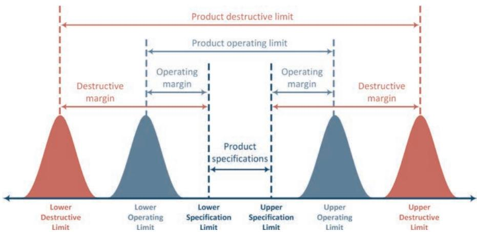  
Figure 3.9 Samples Operating and Destructive Limits Outcomes of Halt for a Specific Stress Factor (E.g., Vibration or Shock and Thermal Cycling)

## • Highly Accelerated Stress Screening

☐ The operating and destructive limits of the product, found during HALT, can be further used in HASS tests to find product defects, which are introduced during the manufacturing process $[31]$ . HASS testing consists of short exposures of the product at fast thermal cycles and vibration stress. The temperature and vibration stress level ranges are typically chosen outside of the product specification, and, thus, it is critical that HALT is performed prior to HASS. HASS testing implies that 100 percent of the production samples are screened, and, thus, it is most effectively applied for slow production rates or for the production of mission-critical products. Otherwise, for mature large-scale productions, an audit-based screening (e.g., only a given number of samples are screened) can be performed, and Highly Accelerated Stress Screening Audit (HASA) replaces HASS. Similar to HALT, neither HASS nor HASA can provide any information about the product reliability. Additionally, both have the limitation of increased risk of provoking new FMs and/or inducing “too much” degradation during the outside product-specification testing. However, HASS provides the benefit of being a quick testing method, which can detect faults induced during the manufacturing process, and, inherently, results in many of the infant mortality cases being screened out before delivering the product to the customer.

## 3.5.2 Quantitative test methods

Quantitative accelerated test methods are mainly employed to measure the reliability performance of a given product in a much shorter time than its expected lifetime. This can be achieved through accelerated tests, which consist of applying increased stress levels and/or repeated stress events to a product, with the purpose of quantifying the correlation between the test stress level and the exposure time. This can, in turn, provide the basis for developing an analytical lifetime model, which can be used to predict the reliability of a given product at a given use-case condition. However, prior to performing the accelerated tests, a clear understanding of the failure mechanisms, stressors, and environmental conditions must be ensured, so that they can accurately be reproduced within the accelerated test. Some of the most common accelerated test methods are the classic ALT and Calibrated Accelerated Life Testing (CALT). A brief description of the two is given below:

## • Accelerated Life Testing

Accelerated life testing is used to determine the impact that a given stressor has on the time-to-failure (or cycles-to-failure) of a product. Thus, considering a specific failure mechanism, the wear-out failure of a product can be addressed by calculating its lifetime under a given use-case condition, with the help of acceleration models and acceleration factors (AFs). By determining the time-to-failure $(T_{\mathrm{H}})$ at an accelerated stress level $(S_{\mathrm{H}})$ , the time-to-failure $(T_{\mathrm{L}})$ of the product under a lower accelerated stress level $(S_{\mathrm{L}})$ can be calculated based on the AF [33].

$$
T _ {L} = A F \cdot T _ {H}\tag{3.2}
$$

Depending on the acceleration model used to describe a particular failure mechanism, the AF can be determined as the ratio between two different stress levels. Otherwise, in cases where the AF is unknown, acceleration models can be employed for calculating the time-to-failure at any given stress level, and it can be defined as the product between a constant model parameter (A) and the function of the stress level (G(S)).

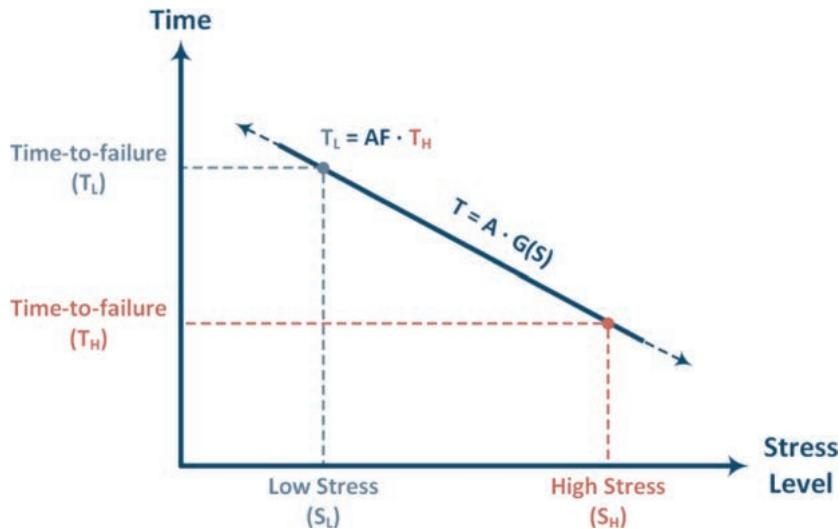  
Figure 3.10 Basic principle of accelerated life testing (based on [33])

$$
T = A \cdot G (S)\tag{3.3}
$$

Similar to the AF, the function of the stress level is dependent on the model, which best describes the considered wear-our failure mechanism (e.g., inverse power law, Arrhenius model, Eyring model), whereas the constant model parameters can be obtained by curve fitting the time-to-failure of at least three different stress conditions. The basic principle of the ALT method is presented in Figure 3.10.

A detailed description on the applicability and implementation of the accelerated life testing procedure can be found in $[34]$ and in the IEC 62506 standard $[32]$ . Since accelerated life testing methods are most effective when applied at the component or subassembly level, for grid-connected PV inverters, the main focus is usually placed on the most fragile parts, such as the IGBT power modules or the capacitors. For IGBT power modules, AC and DC power cycling test setups (as the one shown in Figure 3.11) are typically employed to expose the component to various accelerated stress levels until failure, and thus a particular failure mechanism can be induced, and the AF and acceleration model can be determined. Despite providing valuable insights regarding the product lifetime and a deep understanding of its reliability performance at different stress levels, accelerated life testing requires extensive knowledge of the product target failure mechanism, real-life stress conditions, etc. Additionally, since each failure mechanism needs to be dealt with separately, a large number of samples and stress conditions need to be tested until failure for the acceleration model and AF to have statistical significance. Thus, long testing time (e.g., up to a few months—depending on the selected stress level) can be expected.

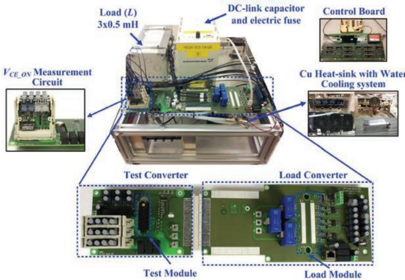  
Figure 3.11 Advanced AC Accelerated Power Cycling Test Setup For IGBT Power Modules [35]

## • Calibrated Accelerated Life Testing

For cases when the available testing time is limited, and the classic ALT cannot be effectively implemented, the CALT method can be employed. Similar to ALT, CALT is used to quantify the reliability performance of a product in terms of its expected lifetime for a given failure mechanism but in a much shorter testing time span. Prior to CALT, HALT needs to be performed to identify the overstress level margin of the product, thus identifying the foolish stress level. The procedure commences with the testing of two samples at a stress level, which is 10–15 percent lower than the foolish stress level. Afterward, a second test is performed, during which another two samples are tested at a stress level 10–15 percent lower than the foolish stress level. Based on the outcomes of the initial two tests, the third stress level can be determined by means of extrapolation. Considering the available testing time, the suitable stress level is selected and two or more samples can be tested to failure during the third and final testing phase. Finally, based on the testing results, the acceleration model can be determined and the lifetime of the product at any given normal stress level (e.g., typical real-life conditions) can be estimated. The overall principle of the CALT method is presented in Figure 3.12, and a detailed description of its assumptions and implementation is given in [36].

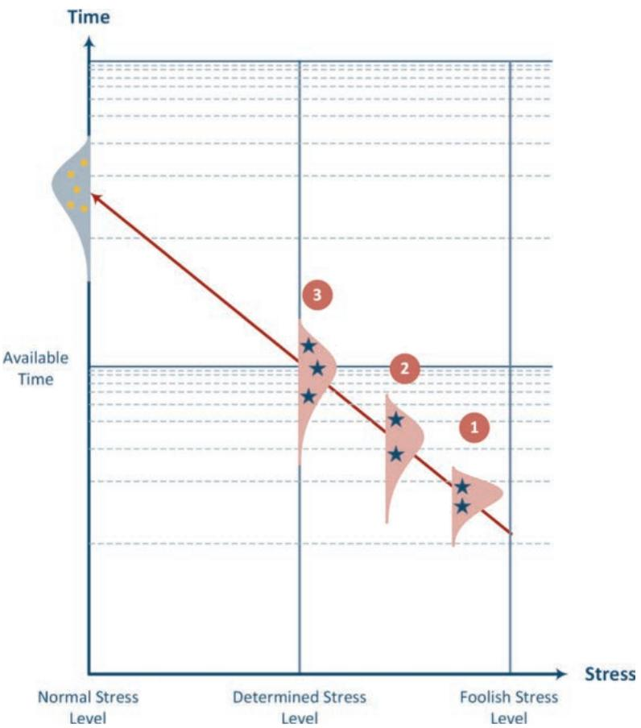  
Figure 3.12 Basic principle of CALT procedure (based on [36])

## 3.5.3 Qualification testing

Qualification (or design verification) testing is meant to establish if a product can fulfill a given set of specification requirements (e.g., functionality, quality, safety) and if it meets the relevant international standards for a given application. This is typically achieved by exposing the product to a series of qualification tests, which, for grid-connected PV inverters, can be performed either at subcomponent level (e.g., IGBT power module, capacitor) or at system level (e.g., PV inverter).

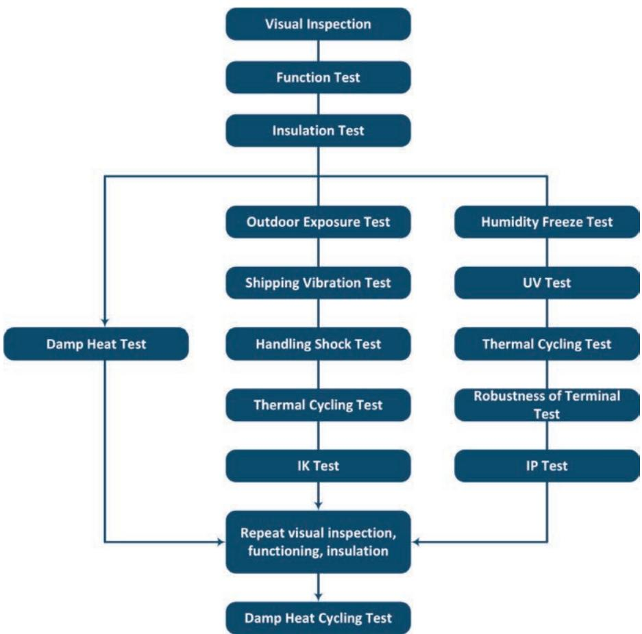  
Figure 3.13 Qualification testing procedure for PV inverter, as defined in IEC 62093 [43]

Although qualification standards for IGBT power modules or capacitors rated for PV applications are still in their infancy, generic qualification testing standards (e.g., IEC 60747 [37], IEC 60749 [38], IEC 60068 [39], IEC 60384 [40], JESD 22 [41]) can be considered for reference. Power modules need to undergo a series of tests including power cycling, temperature cycling, high-temperature reverse bias, high-temperature high-humidity reverse bias, high-temperature and low-temperature storage test, as well as mechanical shock, to ensure a certain level of quality. Similarly, the capacitors need to pass a series of environmental and exposure qualification tests (e.g., thermal shock, damp heat, high temperature, vibration, charge, and discharge) to be considered as market-ready qualified [42].

On the other hand, for PV inverter systems, the qualification test standards are in a more mature stage of their development. A general overview of the qualification tests, which a PV inverter must be exposed to, is presented in Figure 3.13, as described in the IEC 62093 standard [43]. The PV inverter must undergo some basic visual inspection, functionality tests, and insulation tests, after being subject to each of the environmental qualification tests, thus, assuring that certain quality requirements are met, without sacrificing the intended operation of the inverter. Additional industrial and standardized qualification stress tests for PV inverters are summarized in [7]. Despite not proving any information regarding the reliability or robustness of the PV inverter, qualification tests are important tools that can be used to guarantee that certain levels of safety and quality are achieved for various use-cases and environmental conditions.

## 3.6. Summary

With the rapid integration and installation of more and more PV systems, the reliability of the PV inverter plays a crucial role in the safety, availability, and LCOE of the overall system. To deal with the ever-growing and stringent reliability requirements that the PV inverter must fulfill, a particular emphasis is placed on the accurate and effective reliability analysis of the inverter during the various stages of its development process. Thus, PV inverter manufacturers, integrators, and users have a wide array of reliability analysis methods and tools at their disposal.

During the early design and development stages, tools such as FMEA can be employed to identify the various FMs that occur at the different product levels of the PV inverter and to get a better understanding of their causes or effects and of their overall impact on the inverter's reliability and intended functionality. Additionally, enabled by various software simulation tools, the DfR methodology can be used to assess the reliability performance of the inverter under realistic environmental and operating conditions, thus, allowing for quick design weakness detection and for the reliability-oriented optimization of the inverter.

Further down the development process of the PV inverter, different testing methodologies can be applied to assess and improve its reliability and robustness. Qualitative testing methods, such as HALT or HASS, can be performed during the “Prototype” and “Manufacturing” life cycle stages to determine its operating and destructive limits and, inherently, assess the robustness margins of the PV inverter operation. Qualitative testing methods, such as ALT or CALT, can then be employed and used to quantify the reliability performance of the PV inverter under use-case conditions, by means of acceleration models and AFs. Before its market release, the inverter and its critical components must be subject to various qualification tests to assure that specific application-dependent requirements or specific international standards are fulfilled.

Finally, it can be concluded that there is not one specific tool or method that can address the reliability challenges faced by the design engineers of PV inverters. Rather, a combination of the above-mentioned tools should be used to get an accurate overview of the reliability and robustness performance of the PV inverter and, consequently, develop a sustainable reliability growth strategy throughout its entire development process. Due to the continuous development of more efficient testing methods, new standards, and the rapid progress of simulation software in terms of computational-efficiency and capabilities, the reliability assessment and allocation strategy for PV inverters should remain subject to continuous improvement.

## References

[1] World energy outlook 2017. International Energy Agency [online]. 2017. Available from https://www.iea.org/ [Accessed Nov 2020].

[2] Fu R., Feldman D., Margolis R., Woodhouse M., Ardani K. U.S. Solar Photovoltaic System Cost Benchmark: Q1 2017, National Renewable Energy Laboratory (NREL), Tech. Rep. No. NREL/TP-6A20-68925. 2017. Available from https://www.nrel.gov/docs/fy17osti/68925.pdf [Accessed Nov 2020].

[3] Wang H., Liserre M., Blaabjerg F., et al. ‘Transitioning to physics-of-failure as a reliability driver in power electronics’. IEEE Journal of Emerging and Selected Topics in Power Electronics. 2014;2(1):97–114.

[4] Wang H., Blaabjerg F. 'Power electronics reliability: state of the art and outlook'. IEEE Journal of Emerging and Selected Topics in Power Electronics. 2020:1.

[5] Golnas A. ‘PV system reliability: an operator’s perspective’. IEEE Journal of Photovoltaics. 2013;3(1):416–21.

[6] Hibberd B. PV reliability and performance: a project developers experience. [online] Proceedings of NREL Photovoltaic Module Reliability Workshop 2011, NREL/TP-5200-60170. Available from https://www.nrel.gov/docs/fy-14osti/60170.pdf [Accessed Nov 2020].

[7] Hacke P., Lokanath S., Williams P., et al. 'A status review of photovoltaic power conversion equipment reliability, safety, and quality assurance protocols'. Renewable and Sustainable Energy Reviews. 2018;82(1):1097–112.

[8] Moore L.M., Post H.N. 'Five years of operating experience at a large, utility-scale photovoltaic generating plant'. Progress in Photovoltaics: Research and Applications. 2008;16(3):249–59.

[9] Lokanath S. Central inverter cost of ownership & event analysis. [online] Proceedings of the NREL/SNL/BNL PV Reliability Workshops. 2017. Available from https://www.nrel.gov/docs/fy17osti/68942.pdf [Accessed Nov 2020].

[10] ‘Failure mode and effect analysis (FMEA and FMECA)’. Standard IEC 60812. 2018.

[11] Carlson C.S. in Hoboken N.J. (ed.) Effective FMEAs: Achieving Safe, Reliable, and Economical Products and Processes Using Failure Mode and Effect Analysis. USA: Wiley; 2012.

[12] AIAG. Potential failure mode and effect analysis (FMEA): reference manual (4th edition) [online]. 2008. Available from http://parsetraining.com/wp-content/uploads/2018/11/FMEA\_Fourth-Edition.pdf [Accessed Nov 2020].

[13] Ma K., Liserre M., Blaabjerg F., Kerekes T. 'Thermal loading and lifetime estimation for power device considering mission profiles in wind power converter'. IEEE Transactions on Power Electronics. 2015;30(2):590–602.

[14] Burgos R., Chen G., Wang F., Boroyevich D., Odendaal W.G., Van Wyk J.D. 'Reliability-oriented design of three-phase power converters for aircraft applications'. IEEE Transactions on Aerospace and Electronic Systems. 2012;48(2):1249–63.

[15] Soldati A., Pietrini G., Dalboni M., Concari C. 'Electric-vehicle power converters model-based design-for-reliability'. CPSS Transactions on Power Electronics and Applications. 2018;3(2):102–10.

[16] Sangwongwanich A., Yang Y., Sera D., Blaabjerg F. 'Lifetime evaluation of grid-connected PV inverters considering panel degradation rates and installation sites'. IEEE Transactions on Power Electronics. 2018;33(2):1225–36.

[17] Vernica I., Wang H., Blaabjerg F. ‘Uncertainty analysis of capacitor reliability prediction due to uneven thermal loading in photovoltaic applications’. Microelectronics Reliability. 2018;88-90(1):1036–41.

[18] Shen Y., Chub A., Wang H., Vinnikov D., Liivik E., Blaabjerg F. 'Wear-out failure analysis of an impedance-source PV microinverter based on system-level electrothermal modeling'. IEEE Transactions on Industrial Electronics. 2019;66(5):3914–27.

[19] ANSYS®. Available from www.ansys.com/products [Accessed Nov 2020].

[20] COMSOL®. Available from www.comsol.com/products [Accessed Nov 2020].

[21] MATLAB Simulink®. Available from www.mathworks.com/products/simulink [Accessed Nov 2020].

[22] PLECS®. Available from www.plexim.com/products/plecs [Accessed Nov 2020].

[23] SaberRD®. Available from www.synopsis.com/verification/virtual-prototyping/saber/saber-rd [Accessed Nov 2020].

[24] Reliasoft®. Available from www.reliasoft.com/ [Accessed Nov 2020].

[25] Evans T.M., Le Q., Mukherjee S., et al. 'PowerSynth: a power module layout generation tool'. IEEE Transactions on Power Electronics. 2019;34(6):5063–78.

[26] Simulation Assisted Reliability Assessment (SARA®). Available from calce.umd.edu/calce-sara-software [Accessed Nov 2020].

[27] Vernica I., Wang H., Blaabjerg F. 'A mission-profile-based tool for the reliability evaluation of power semiconductor devices in hybrid electric vehicles'. Proceedings of IEEE International Symposium on Power Semiconductor Devices and ICs; 2020. pp. 380–3.

[28] Vernica I., Wang H., Blaabjerg F. 'Design for reliability and robustness tool platform for power electronic systems – study case on motor drive applications'. Proceedings of IEEE Applied Power Electronics Conference; 2018. pp. 1799–806.

[29] SemiSel®. Available from semisel.semikron.com/#/home [Accessed Nov 2020].

[30] IPOSIM®. Available from www.infineon.com/cms/en/tools/landing/iposim.html [Accessed Nov 2020].

[31] Hobbs G.K. Accelerated Reliability Engineering: HALT and HASS. New York, USA: Wiley; 2000.

[32] ‘Methods for product accelerated testing’. Standard IEC 62506. 2013.

[33] Otto S., Schmidt K.A., Johansen J. Practically applicable reliability tools – A guide with practical cases. SPM-181; 2013. Available from https://uk-spm.madebydelta.com/publications/reports/ [Accessed Nov. 2020].

[34] Kentved A.B. Acceleration factors and accelerated life testing. SPM-179;2011. Available from https://uk-spm.madebydelta.com/publications/reports/[Accessed Nov. 2020].

[35] Choi U.-M., Blaabjerg F., Jørgensen S. 'Power cycling test methods for reliability assessment of power device modules in respect to temperature stress'. IEEE Transactions on Power Electronics. 2018;33(3):2531–51.

[36] Edson L. The GMW3172 Users Guide: Electrical Component Testing; 2008.

[37] ‘Semiconductor devices – Part 1: General’. Standard IEC 60747. 2006.

[38] ‘Semiconductor devices – Mechanical and climatic test methods – Part 26: Electrostatic discharge (ESD) sensitivity testing – Human body model (HBM)’. Standard IEC 60749. 2018.

[39] ‘Environmental testing – Part 2: Tests – ALL PARTS’. Standard IEC 60068. 2020.

[40] ‘Fixed capacitors for use in electronic equipment – Part 16: Sectional specification – Fixed metallized polypropylene film dielectric DC capacitors’. Standard IEC 60384. 2019.

[41] ‘Solid state device packaging standards’. Standard JESD 22. 2020.

[42] Qualification of DC-link capacitors for automotive use: General requirements, test conditions and tests, ZVEl; Frakfurt am Main, Germany; 2017.

[43] ‘Balance-of-system components for photovoltaic systems – design qualification natural environments’. Standard IEC 62093. 2005.

Chapter 4

# Grid-connected solar inverter system: a case study

V. S. Bharath Kurukuru $^{1}$

Photovoltaic (PV) power systems have many vulnerable components whose lifecycle reliability is prone to relatively high risks. These risk indices generally deal with ambient environments, temperature, and power losses in the system. Meanwhile, the highly variable and uncontrollable solar irradiance, and PV system power input result in high electrical stresses for PV modules, which affect the operational lifecycles and power electronic converters. Consequently, these effects result in low system reliability when compared with the reliability of conventional generating plants. Besides, the high penetration of PV generation into the distribution networks leads to a detrimental effect causing reverse power flow and unacceptable rise in voltage at the distribution feeders. Generally, these overvoltages trigger the protection aspects of the inverter to disconnect from the grid, resulting in islanding operation of the PV system. This further contributes to abrupt voltage fluctuations, load shedding, and sudden changes in power flow. Therefore, the distribution networks associated with high-penetration PV generation have a risk of power outages and in turn increased maintenance costs. This necessitated the tools and methodologies to quantify reliability of the grid-connected PV systems. These reliability analysis tools and methods serve to evaluate the performance of PV systems and generate reliability indices, which further aid in achieving efficient design at the planning stage and determining the reduced cost and improved benefits at the operational phase. A systematic way to evaluate the reliability of grid-connected PV inverters is then presented in this chapter. The reliability analysis is carried out at the 2.2 MW grid-connected rooftop PV system installed in Jamia Millia Islamia (JMI), New Delhi, India, considering the variation of input power and failure rates of PV system components under ambient conditions. The reliability analysis is carried out for inverters at both string level and central level with the site data as a benchmark. A basic reliability indices computation method is adapted to realize the operation of both inverter systems for several risk metrics and quantify their impact on system operation.

## 4.1 Identifying the site for case study

PV systems have seen impressive growth around the world in the last decades. This growth is mainly due to the improving statistical average performance ratio of the new PV installations. However, the drawbacks due to probabilistic behavior and the unreliable nature of PV power demands the continuous improvement of the system. Besides, there are many vulnerable components in the PV system whose lifecycle reliability is highly affected by the operational conditions. Therefore, to improve the performance and increase the end of life of various components of PV systems, continuous monitoring and efficient reliability analysis methods need to be adapted. For facilitating the cost trade-off associated with PV systems, the reliability studies at the system and component level play a significant role. Generally, these studies are carried out at the laboratory level for various components of the PV system by subjecting them to accelerated testing scenarios. This process lacks various aspects when implemented with field operation of PV systems. Hence, meaningful statistical data of a PV plant operating under extreme climatic conditions with significant risks is the major aspect for performing the reliability analysis. Considering this, the PV installation in the northern part of India is identified for performing the case study.

## 4.1.1 Site details

The solar power industry in India is developing at a very fast pace with the lowest capital cost per MW. The Indian government is working toward an ambitious target of deploying 100 GW of solar PV capacity by 2022 under the national solar mission to combat climate change and avoid overdependence on fossil fuels for electricity generation $[1]$ . By March 31, 2020, 37.6 GW had been installed $[2]$ , and rapid additional deployment is expected to occur over next years. The 100 GW target is part of the overall goal to achieve 175 GW of nonfossil fuel energy by 2022 and resonates well with India's COP-21 obligation in Paris to have 40 percent of its electricity generated by renewables by 2030. A recent announcement that the 175 GW goal may be increased to 227 GW further emphasizes India's commitment to renewables $[3]$ . Out of the total installations, approximately 2.1 GW of PV systems correspond to rooftop solar power, which is the major aspect of this case study. Further, from the climatic point of view, the northern regions of India are considered to have extreme weather conditions that support the data required for the reliability analysis $[4]$ .

Given the above requirements, the reliability study of the grid-connected solar PV system in this chapter is focused on JMI central university located in the southeast part of Delhi, India. The university is in the coordinates $28^{\circ}34'N77^{\circ}17'E$ with an overlap between semi-arid and monsoon-influenced humid subtropical with high variations between winter and summer temperatures [5]. The location faces an extreme temperature ranging from $-2.2^{\circ}C$ to $48.4^{\circ}C$ in four seasons [6]. The university has a 2.2 MW PV project developed by Sun Source Energy Pvt. Ltd. under renewable energy service company model. The PV installations are around 50 rooftops of various buildings in the campus such as the central library, colleges, departments, and hostels. The PV arrays on each rooftop are operated with string and central inverter-based systems. The performance of the total PV installations over the last 12 months (May 2019 to May 2020) is listed in Figures 4.1–4.8.

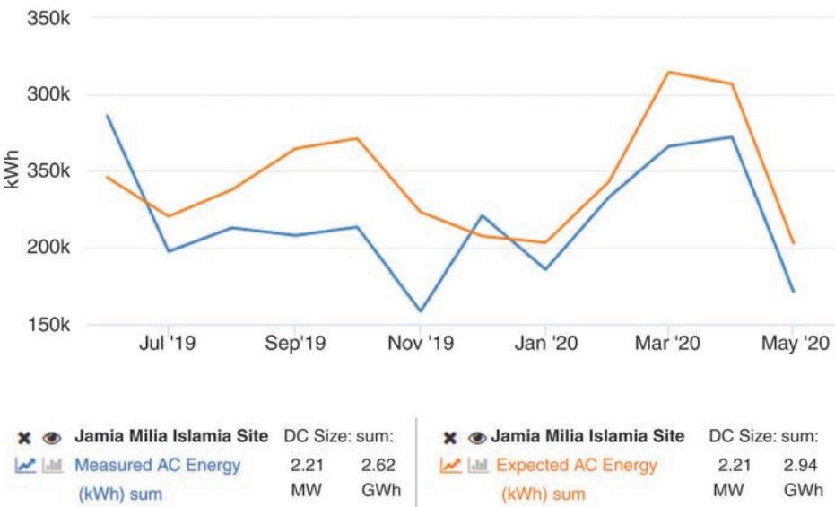  
Figure 4.1 Measured and expected energy (kWh)

Figure 4.1 shows the measured and expected energy generation from the 2.2 MW plant. The expected energy corresponds to the predictions made based on the forecasted metrological data for the geographical location, and the measured data corresponds to the PV generation under the real operational conditions. From the graph, it is identified that the lowest expected peak is nearly around 200 kWp during January and the highest expected peak is nearly around 320 kWp during April. Further, the real-time measurements identified that the lowest peak is nearly around 150 kWp during November and the highest peak is around April. Moreover, it is identified that the sum of expected energy generation from May 2019 to May 2020 is 2.94 GWh, whereas the measured generation is 2.62 GWh for the same period.

Figure 4.2 shows the measured average power generated for every month from the 2.2 MW plant. It is identified that the maximum average generation occurs around February to April with 708 kW.

Figure 4.3 shows the measured maximum power generated for every month from the 2.2 MW plant. It is identified that the maximum average generation occurs during January with 18.5 MW.

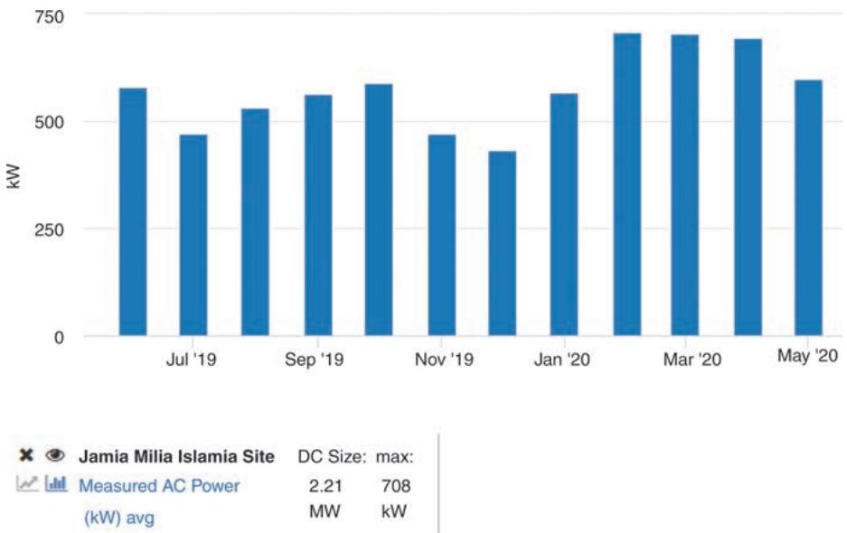  
Figure 4.2 Measured average power (kW)

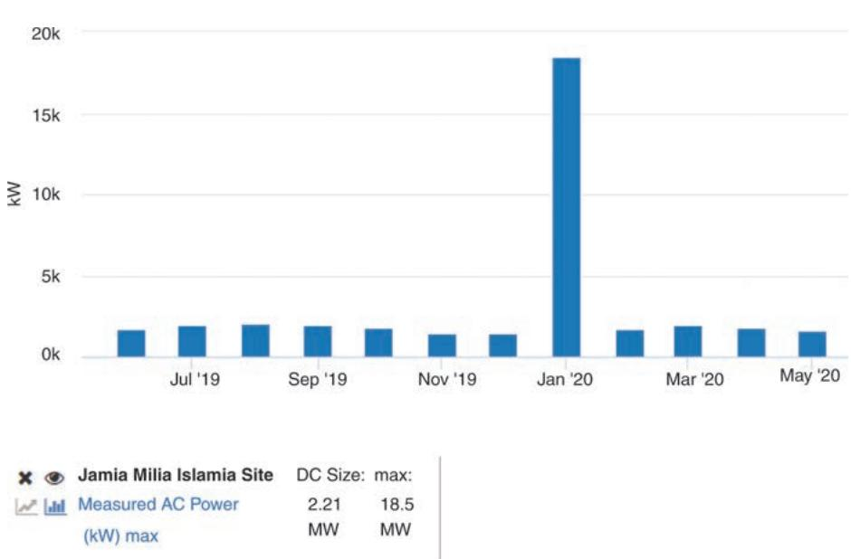  
Figure 4.3 Measured maximum power (kW)

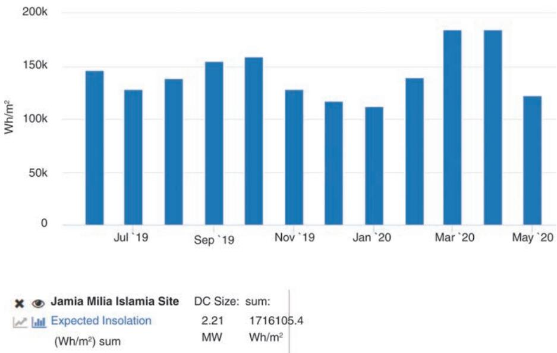  
Figure 4.4 Sum of expected insolation (Wh/m²)

Figure 4.4 shows the sum of expected insolation for every month for the 2.2 MW plant. It is identified that the maximum expected solar insolation is around $170\,000 \, Wh/m^{2}$ during March and April. The sum of expected insolation is $1\,716\,105.4 \, Wh/m^{2}$ .

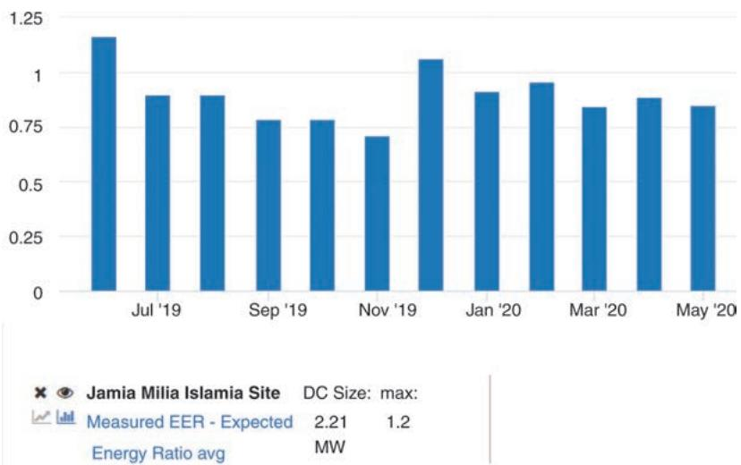  
Figure 4.5 Average modeled expected energy ratio (EER)