Spectral analyser is widely used in the first step of the feature detection process. The spectrogram can be useful in gathering information about a signal and in determining which features can be extracted from a signal. The spectrogram is used for defining statistical features of the signal, such as mean value, standard deviation, skewness and kurtosis. These features build a feature vector to retrieve similar signal from the database. Some of the other features that can be extracted are peak to peak value, power, energy, entropy, total harmonic distortion and signal to noise ratio. The process of feature extraction using wavelets is explained in $[21]$ .

Feature extraction process is initiated after the level of decomposition and reconstruction is performed with the wavelet coefficient. During the process of feature extraction critical information from the signals are obtained which aids in classification of different fault states $[36]$ . The process of feature extraction is usually performed using spectral analyser. The spectrogram aids in attaining information regarding signal and identification of feature that can be extracted. Statistical feature such as mean value, standard deviation, skewness and kurtosis are defined using spectrogram. A feature vector is formed by the features for retrieving similar signals from the database. Feature that can be extracted are peak to peak value, power, energy, entropy, total harmonic distortion and signal to noise ratio. These features can be expressed as follows:

Mean of the reconstructed signal is calculated by

$$
\text {Mean} (\mu) = \frac {1}{N} \sum_ {i = 0} ^ {N - 1} V _ {i}\tag{8.19}
$$

where N denotes the number of samples and $V_{i}$ is the sampled reconstructed signal. Standard deviation of the reconstructed signal is calculated by

$$
\text { Standard   deviation } (\sigma) = \frac {1}{N - 1} \sum_ {i = 0} ^ {N - 1} (V _ {i} - \mu) ^ {2}\tag{8.20}
$$

Skewness and kurtosis of the reconstructed signal is given by

$$
\text {Skewness} (S) = \frac {\frac {1}{N} \sum_ {i = 0} ^ {N} \left(V _ {i} - \mu\right) ^ {3}}{\left(\sqrt {\frac {1}{N} \sum_ {i = 0} ^ {N} \left(V _ {i} - \mu\right) ^ {2}}\right) ^ {3}}\tag{8.21}
$$

$$
\text {Kurtosis} (K) = \frac {\frac {1}{N} \sum_ {i = 0} ^ {N} \left(V _ {i} - \mu\right) ^ {4}}{\left(\sqrt {\frac {1}{N} \sum_ {i = 0} ^ {N} \left(V _ {i} - \mu\right) ^ {2}}\right) ^ {4}}\tag{8.22}
$$

Peak to peak value of the reconstructed signal is given by

$$
V _ {p p} = 2 \sqrt {2} \sigma\tag{8.23}
$$

Energy of the decomposed signal is formulated using

$$
E = \int_ {- \infty} ^ {\infty} | V (t) ^ {2} | d t\tag{8.24}
$$

Power of the reconstructed signal is given by

$$
P = \lim _ {N \to \infty} \frac {1}{2 T} \oint_ {- T} ^ {T} | V (t) ^ {2} | d t\tag{8.25}
$$

where $V(t)$ is the reconstructed signal.

Entropy is defined as a major tool in information theory. It is also used to estimate the type of wavelet suitable for decomposing and reconstructing a given signal. The entropy of a given signal is found by

$$
H (V) = - \sum_ {i = 1} ^ {N} p (V _ {i}) \log_ {1 0} p (V i)\tag{8.26}
$$

where $p(V_{i})$ is given by probability of sample of voltage signal.

To estimate the total harmonic distortion of a sinusoidal signal in time domain, we use (8.28):

$$
\begin{array}{l l} y (t) & = \alpha_ {0} + \frac {\alpha_ {2}}{2} + \frac {3 \alpha_ {4}}{8} + \left(\alpha_ {1} + \frac {3 \alpha_ {3}}{4} + \frac {1 0 \alpha_ {5}}{1 6}\right) \\ & \sin \omega_ {0} t - \left(\frac {\alpha_ {2}}{2} + \frac {\alpha_ {4}}{2}\right) \cos 2 \omega_ {0} t - \left(\frac {\alpha_ {3}}{4} + \frac {5 \alpha_ {5}}{1 6}\right) \\ & \sin 3 \omega_ {0} t + \frac {\alpha_ {4}}{8} \cos 4 \omega_ {0} t + \frac {\alpha_ {5}}{1 6} \sin 5 \omega_ {0} t \end{array}\tag{8.27}
$$

where $\alpha_{i}=$ coefficients of Taylor series.

The signal to noise ratio for a given signal is determined by the ratio of reconstructed signal to original signal:

$$
\mathrm{SRN} = \frac {\text {Reconstructed signal}}{\text {Original signal}}\tag{8.28}
$$

Once the required features of all the faults and operating conditions of PV systems were extracted, we apply principal component analysis (PCA) to minimize the feature set.

## 8.4.4 Principle component analysis

PCA is a statistical analysis tool that utilizes multiple dimensions data set for minimization and highlighting the similarity within data set. In case of high dimension data, the similarity identification is very difficult hence for such conditions the PCA analyses the data graphically. After the similarity are identified then the data is reduced with insignificant loss of information. These dimensions reduction can be achieved by transforming the original data set into a series of uncorrelated principal components. Principle algorithm for PCA is shown in Figure 8.7.

By applying PCA, the features are minimized into three uncorrelated variables which were in turn utilized with the ML techniques to obtain the trained data for fault classification.

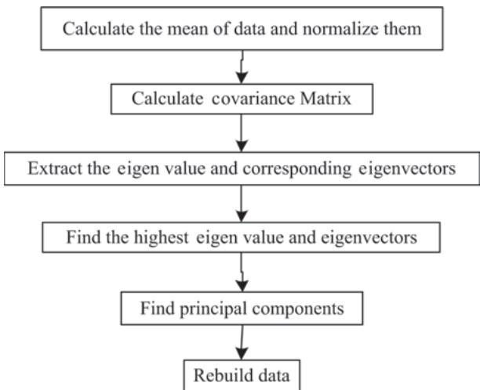  
Figure 8.7 Diagram flow of the PCA algorithm

## 8.5 Machine learning approach

ML is a cluster of algorithms that are used to obtain models from data. There are two main types of ML models. First is the supervised learning model and second is the unsupervised learning model. In this research, the supervised ML model is adapted through K-NNs for the classification process $[85]$ .

## 8.5.1 K-nearest neighbour classifier

The K-NN is a classification learner method which is used for categorizing data into different classes. An assumption in matric space $\Omega$ regarding set of points is considered and each point is assigned a label of either 0 or 1. The labelled samples are represented by $(X_{1}, Y_{1})$ , $(X_{2}, Y_{2})$ , $\ldots$ $(X_{n}, Y_{n})$ and $(X, Y)$ are in query. The label of query is predicted based on the most common class among the k closest point to the labelled sample X as illustrated in the Figure 8.8.

Case of ties has been avoided in the considered example. The figure illustrates two possible cases where ties can occur in algorithm. It is feasible to having multiple classes transpiring in identically frequently among the query of K-NNs. Even equal distance tie from the multiple points in query is possible. Distribution with density has also been discussed in may research for avoiding distance tie. Random selection is also one of the common methods for breaking ties, hence if a voting tie occurs then a random tie is selected from the most common labels and in case of a distance tie, a random point is selected at a distance. To avoid issues of binary classification, the vote tie is broken by selecting the label 1. By generating random variable $U_{1}, U_{2}, \ldots, U_{n}$ , distance tie is broken in case of uniform distribution on [0,1]. In case of distance tie between two point $X_{i}$ and $X_{j}, X_{i}$ is selected if $U_{i} > U_{j}$ and $X_{j}$ is selected if $U_{j} > U_{i}$ . The pseudocode is presented in algorithm as follows.

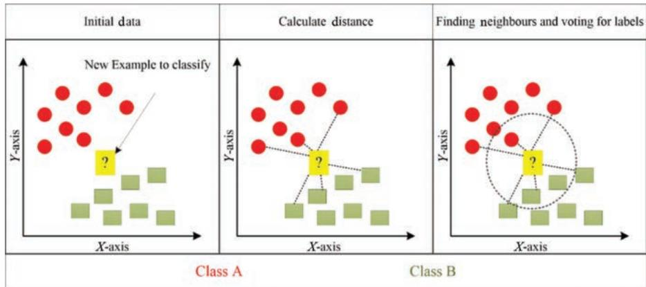  
Figure 8.8 Illustration of K-NN

Algorithm: $k$-NN pseudocode
Require: $k \in N$, $X$ is a domain, $Y$ is the response (must be a finite set $\{1,2,...,p\}$),
$\alpha \in X(x_1,y_1)$, ..., $(x_n,y_n) \in X \times Y$
{Calculate input point distance from all the data points}
    for $i = 1$ to $n$ do
        $d_i \leftarrow d(a, x_i)$
    end for
    {Finding $k$-nearest neighbours response for the input point}
    for $i = 1$ to $k$ do
        $m \leftarrow \arg_m \min \{d_m \text{ such that } 1 \leq m \leq n \text{ not previously selected}\}$ $a_i \leftarrow y_m$
end for
    {Finding the number of iterations}
    for $i = 1$ to $p$ do
        $d_i \leftarrow d(a,X_i)$
    end for
    $r \leftarrow \{y_i | 1 \leq i \leq p \text{ such that } v_i \text{ is maximum among } v_1, v_2, ..., v_p\}$
    {identification of most common response among $k$ nearest neighbours, and in case of multiple responses pick a fixed one}
    return $r$ {retuning the common response}

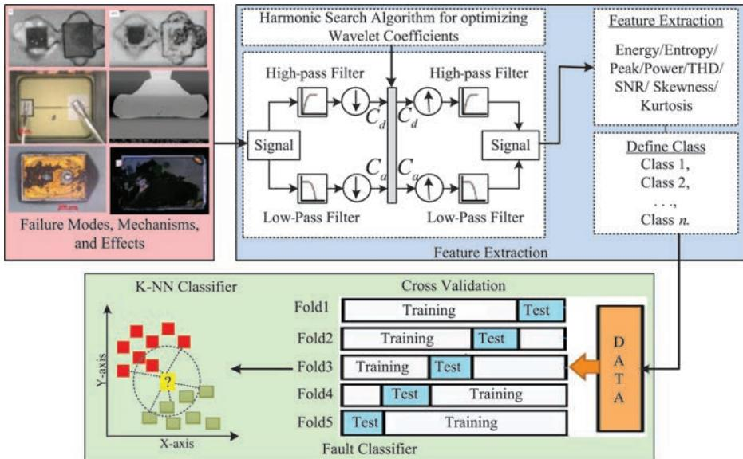  
Figure 8.9 Block diagram for the wavelet-based fault detection technique.

## 8.5.2 Fault classification algorithm

The methodology adapted for fault classification is structured as depicted in Figure 8.9. In this research, the fault classification technique is used to learn a model called a classifier. Data corresponding to various faults and operating conditions of PV system is divided into two groups: training set and testing set. In the training phase, the training set is fed to the classifier for labelled data set into one of the classes depending on the target output. A fivefold cross validation is applied to validate the trained data. In the testing phase, the test samples are verified depending on the target output. Once essential features have been identified, the classification of a fault condition is straightforward performed. The K-NN technique discussed in Section 8.5.1 is used for fault classification due to its advantages with nonlinear data classification as mentioned in Section 8.5.1. For simulation analysis, the input data (i.e., the extracted features) are tabulated and imported to the classification program. The classifier models are trained for functional fault classification.

To observe the performance of the proposed methodology, a 4-kW two-stage PV system for a fixed load is simulated for a varying climatic and load conditions. For experimental purpose, six different modes of operation (normal, bond-wire failure, solder fatigue, overstress due to ESD, wear out due to substrate cracking and other failure conditions) are categorized for the operation of the power PV inverter. The terminal voltage and current measurements of the inverter under different modes of operation for a determined time period are logged. A sample of waveforms recorded for all the operating conditions and failure mechanisms for developing the fault classification algorithm are depicted in Figure 8.10. The process of feature vector representation and applying DWT through HSA for the purpose of feature extraction is carried out. Eight different features such as energy, entropy, power, peaks, harmonics, signal to noise ratio, skewness and kurtosis are extracted for voltage and current outputs of each condition. This forms a feature set matrix $4\ 013 \times 8$ , where the normal operation has $513 \times 8$ features, bond-wire failure has $1\ 448 \times 8$ features, solder fatigue, overstress, wear out and other failures have $513 \times 8$ features each.

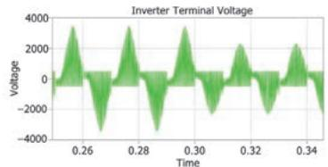  
(e) Voltage during overstress

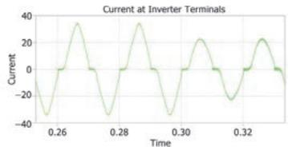  
(f) Current during overstress

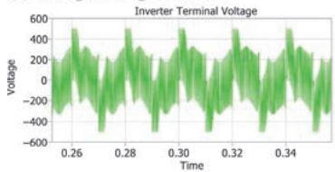  
(g) Voltage during wear out

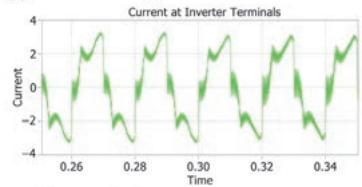

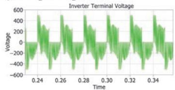  
(i) Voltage during other failures

(h) Current during wear out  
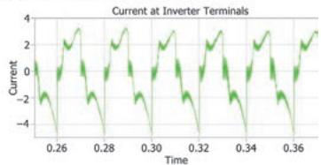  
(j) Current during other failures  
Figure 8.10 Various operating and fault conditions of PV inverter

The parameters of the classifier for the training process and the corresponding outcomes are shown in Table 8.5.

The classification accuracy is defined as the ratio of correctly classified samples to the total number of samples in the test data set. The corresponding equation is given as

Table 8.5 Model type and training performance results for K-NN

<table><tr><td colspan="2">Model type</td></tr><tr><td>Number of neighbours</td><td>10</td></tr><tr><td>Distance metric</td><td>Euclidean</td></tr><tr><td>Distance weight</td><td>Squared inverse</td></tr><tr><td>Standardize data</td><td>True</td></tr><tr><td colspan="2">Results</td></tr><tr><td>Accuracy</td><td>96.1%</td></tr><tr><td>Total misclassification cost</td><td>157</td></tr><tr><td>Prediction speed</td><td>~22000 obs/s</td></tr><tr><td>Training time</td><td>4.5238 s</td></tr></table>

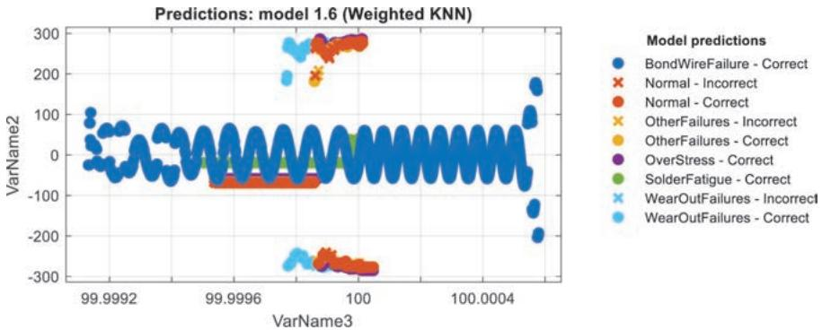  
Figure 8.11 Scatter plot of the trained data

$$
\text {Accuracy of classification} = \frac {\text {Total no. of samples classified correctly}}{\text {Total no. of samples in the data set}} \times 1 0 0\tag{8.29}
$$

To confirm the developed classifier data, a set of input data not used within the training stage, is given to the trained data. This technique improves the average accuracy about 96.1 per cent in training process. The corresponding results were depicted in Figures 8.11–8.13.

Figure 8.11 displays the scatter plot between two features of the training data. The scatter plot, explores the data for important predictors, outliners and visual patterns.

Figure 8.12 depicts the confusion matrix for the experiment. The confusion matrix aids in understanding the performance of the classifier in each of the classes. It supports the understanding that, if the classifier is executed poorly in identifying a class or all the classes are identified accurately. From the result, it is clear that all the classes were classified with almost precision after seeing the confusion matrix. It helps in assessing how currently selected classifier performs in each class.

Figure 8.13 depicts the receiver operating characteristics by plotting the sensitivity (true positive rate) and 1-specificity (false positive rate) for different possible cut points in a training network. It is observed in Figure 8.10 that all the classes are close to the left and top border of the receiver operating characteristic (ROC) space making the training and testing process most accurate.

## 8.6 Failure mode effect classification analysis

Both FMEA and FMMEA call for a criticality analysis to prioritize failure modes and mechanisms, respectively. Such prioritization allows for efficient allocation of resources for enabling and improving reliability of a system. One difficulty for prioritizing failure mechanisms for component level FMMEA is that the information necessary to make the decision is highly application dependent. This section will describe the traditional method for defining and estimating criticality and establish

Model 1.6 (Weighted KNN)

Model 1.6 (Weighted KNN)  
Model 1.6 (Weighted KNN)  
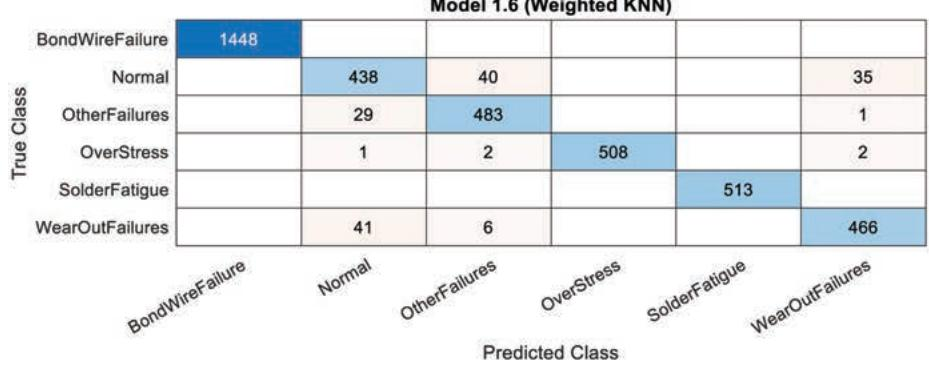  
(a) Truly and falsely classified features with weighted K-nearest neighbour

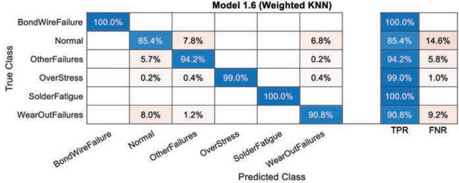

(b) True positive rate (TPR) and false negative rate (FNR) of features with weighted K-nearest neighbour  
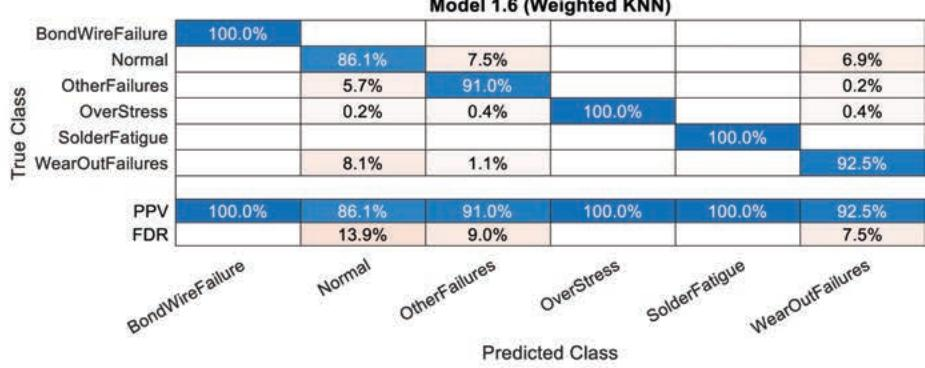  
(c) Positive predictive values (PPV) and false discovery rate (FDR) of classification process  
Figure 8.12 Confusion matrix for trained data

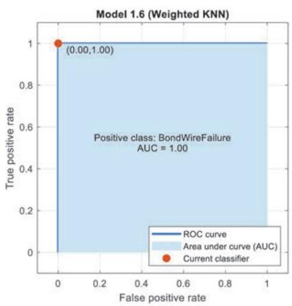  
(a) ROC-AUC for bond-wire failure

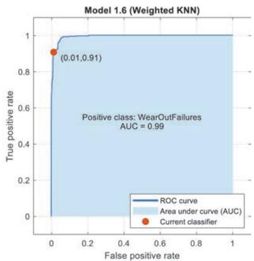  
(b) ROC-AUC for wear out failure

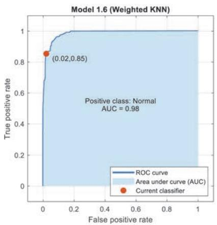  
(c) ROC-AUC for normal operation

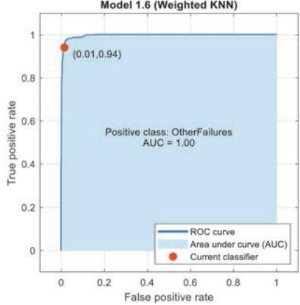  
(d) ROC-AUC for other failures

  
(e) ROC-AUC for over stress failure

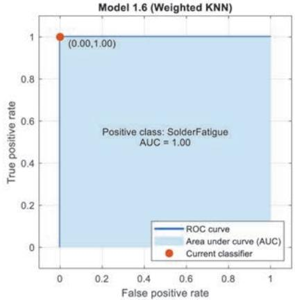  
(f) ROC-AUC for solder fatigue  
Figure 8.13 ROC for trained data

component-level information-based guidance for ranking failure mechanisms based on criticality.

## 8.6.1 Approaches for criticality analysis

Through JEP131B, JEDEC outlines three components for critically ranking failure modes: severity, occurrence and detection $[48]$ . Each of the three categories is separately given a ranking from 1 to 10 based on the judgement of the team that is completing the analysis with 10 being the most severe, highest occurrence and most difficult to detect. These three metrics are then multiplied together create a risk priority number (RPN). Failure modes with higher RPNs are determined to be of more concern than those with lower RPNs. Corrective actions meant to be prioritized to lower the RPN of the highest failure modes. The RPN should be updated after corrective actions are taken and the design should be re-evaluated. As the rankings are based on the judgement of the team, RPN rankings should not be compared with another group's RPN ranking for the same or any other system.

The severity of a failure mode is dependent on the effects to the end user. First and foremost, severity should consider any potential to harm the users of a system. If there is potential to harm due to the effects from a certain mode (or mechanism), that mode (or mechanism) should be assigned a higher severity rating. The next considerations should include costs to the user and the system manufacturer. Costs take on a variety of forms but may include legal, warranty and returns, associated maintenance and brand reputation. Based on the judgement of the team a severity ranking should be given which takes into consideration these factors. It is evident that the severity of the failure is application dependent. Component level severity will be discussed subsequently.

The occurrence of a failure mode is how likely it is to occur. Considerations for occurrence should include environmental and loading conditions as well as system materials, geometries and part types. Using this information, it is possible to establish a probability of a mode or mechanism that can then be ranked according to the judgement of the FMEA development team. This information is also application dependent.

Finally, the detection metric for a failure mode is traditionally defined as the ability to detect a failure mode before shipping the product to the customer. Traditionally, in the electronics industry detection deals with the escape rate of any given test or screen. JEDEC suggests using inverse of the escape rate as one way of quantifying the detection of the mode. As the scope of the FMEA developed for a system level, individual power semiconductors are not assumed to be tested at the system integration level. Therefore, a different approach to detection will be taken in the subsequent discussion.

## 8.6.2 Approaches for severity analysis

Severity is determined by the effect to the end user. In the absence of this information, severity must be viewed in a different context. However, all Si power devices will be used in a larger circuit and thus have other electrical components nearby. For the purposes of a component level prioritization, severity will be determined by the potential of the failure to be catastrophic and effect nearby components.

With respect to Si power devices, overstress mechanisms which result in short circuit failure have the most potential to damage the system around them. Short circuits can create significant joule heating, which, if uncontrolled can damage nearby components and potentially start a fire thus increasing the associated costs of failure. The wear out mechanisms can be considered less severe because it is likely that only the Si power device fails, not harming other nearby components, and the system can potentially be repaired or replaced.

## 8.6.3 Occurrence

Occurrence is dependent on the application operating and environmental conditions. Certain failure mechanisms can only be expected to occur when specific stressors are present. For example, electrochemical migration is not a concern in an application where humidity is below the threshold for initiation. To calculate a value for an occurrence there are two approaches: one for wear out mechanisms and one for overstress mechanisms. For wear out mechanisms, one must identify a failure model which relates the stressors with the materials and geometries of the system, from this a time to failure or equivalent can occur giving an indication of the occurrence of the mechanism in the application. One example of this is the use of the Norris–Landsberg model for calculating fatigue of die attach. Failure models express time-to-failure, or equivalent, as a function of the stresses action on a system. Overstress failures are given a high priority with respect to occurrence as the stresses which are reasonably expected in the life cycle profile should be designed against. Assuming the proper design precautions have been taken, overstress mechanisms are unlikely to occur in the field and can only be quantified by identifying a probability that an overstress condition could occur. For example, the probability that a lightning strike causes a burnout of a device due to overcurrent can be a ‘measure’ of occurrence.

## 8.6.4 Detection

Detection in the traditional sense is determined by the ability to detect a failures, defects and non-conformities before it leaves manufacturing or assembly. For a component level discussion, this traditional definition is not applicable. Therefore, detection will be considered as the ability to detect a failure in operation, before the failure occurs. For an expected loading profile, overstress mechanisms can be avoided through proper selection of parts and appropriate de-rating. However, overstress failures may still occur due to random and unpredictable loading excursions such as lightning strikes or crashes.

Not all mechanisms are unpredictable as accumulating damage changes some observable and measurable parameters. The ability to monitor and predict failure is a field of study referred to as prognostics and health management (PHM). In PHM, in situ data is monitored and analysed for purposes of anomaly detection, fault classification and remaining useful life calculation. Wear out mechanism can be detectable and several groups have successfully implemented PHM for Si power devices $[50,$ [86, 87]. Certain wear out mechanisms are more detectable than other wear out and overstress mechanisms depending on the feasibility and correlation with damage of electrical parameters associated with the mechanism. PHM techniques and methods are developing rapidly and reducing in cost and ease of implementation; however, the development and implementation of a PHM framework is not yet trivial and therefore it may only be cost efficient for certain critical components and applications. Additionally, competing failure mechanisms may convolute the measurement signals as they have the same or similar failure modes making it difficult to distinguish between the failure modes and take necessary corrective action.

## 8.7 Summary

This chapter developed a failure mode classification mechanism for condition monitoring of PV inverters. The developed algorithm performed signal preprocessing by DWT for noise removal, feature extraction and region of interest segmentation. The wavelet coefficients associated with the DWT were optimized by a novel approach based on HSA. Various types of features were extracted once the signal preprocessing is completed. The harmony search analysis proved to be very efficient in choosing the best wavelet coefficient depending upon the structure of the signal. The extracted features are assigned towards corresponding classes and randomly divided as training and test data for the purpose of evaluation of the classifier. K-NN is used to classify the fault conditions of PV inverters into normal and faulty status. A fivefold cross validation is performed to measure the performance of the classifier with input data. On validation, the developed approach depicted a training accuracy of 96.1 per cent. Further, criticality analysis is established from component-level information-based guidance for ranking failure mechanisms.

## References

[1] Koutroulis E., Blaabjerg F. 'Design optimization of transformerless grid-connected PV inverters including reliability'. IEEE Transactions on Power Electronics. 2013;28(1):325–35.

[2] Yang Y., Sangwongwanich A., Blaabjerg F. 'Design for reliability of power electronics for grid-connected photovoltaic systems'. CPSS Transactions on Power Electronics and Applications. 2016;1(1):92–103.

[3] Shahzad M., Bharath K.V.S., Khan M.A., Haque A. ‘Review on reliability of power electronic components in photovoltaic inverters’. 2019 International Conference on Power Electronics, Control and Automation (ICPECA); 2019. pp. 1–6.

[4] Wang H., Zhou D., Blaabjerg F. 'A reliability-oriented design method for power electronic converters'. 2013 Twenty-Eighth Annual IEEE Applied Power Electronics Conference and Exposition; 2013. pp. 2921–8.

[5] Bahman A.S., Iannuzzo F., Blaabjerg F. 'Mission-profile-based stress analysis of bond-wires in sic power modules'. Microelectronics Reliability. 2016;64(4):419–24.

[6] Kurukuru V.S.B., Haque A., Khan M.A., Tripathy A.K. 'Reliability analysis of silicon carbide power modules in voltage source converters'. 2019 International Conference on Power Electronics, Control and Automation; 2019. pp. 1–6.

[7] Lee K.-W., Kim M., Yoon J., Lee S.B., Yoo J.-Y. 'Condition monitoring of DC-link electrolytic capacitors in adjustable-speed drives'. IEEE Transactions on Industry Applications. 2008;44(5):1606–13.

[8] Haque A. ‘Maximum power point tracking (MPPT) scheme for solar photovoltaic system’. Energy Technology & Policy. 2014;1(1):115–22.

[9] Ristow A., Begovic M., Pregelj A., Rohatgi A. 'Development of a methodology for improving photovoltaic inverter reliability'. IEEE Transactions on Industrial Electronics. 2008;55(7):2581–92.

[10] Haque A., Bharath K.V.S., Khan M.A., Khan I., Jaffery Z.A. ‘Fault diagnosis of photovoltaic modules’. Energy Science Engineering. 2019;3:255.

[11] Kurukuru V.S.B., Blaabjerg F., Khan M.A., Haque A. 'A novel fault classification approach for photovoltaic systems'. Energies. 2020;13(2):308.

[12] Mahmud N., Zahedi A., Mahmud A. ‘A cooperative operation of novel PV inverter control scheme and storage energy management system based on ANFIS for voltage regulation of grid-tied PV system’. IEEE Transactions on Industrial Informatics. 2017;13(5):2657–68.

[13] Zhao Y., Lehman B., De Palma J.F., Mosesian J., Lyons R. ‘Challenges to overcurrent protection devices under LINE-LINE faults in solar photovoltaic arrays’. 2011 IEEE Energy Conversion Congress and Exposition; 2011. pp. 20–7.

[14] Pradeep Kumar V.V.S., Fernandes B.G. 'A fault-tolerant single-phase grid-connected inverter topology with enhanced reliability for solar PV applications'. IEEE Journal of Emerging and Selected Topics in Power Electronics. 2017;5(3):1254–62.

[15] Mendes A.M.S., Marques Cardoso A.J. 'Voltage source inverter fault diagnosis in variable speed AC drives, by the average current Park's vector approach'. IEEE International Electric Machines and Drives Conference. IEMDC'99. Proceedings (Cat. No.99EX272):704–6.

[16] Gilreath P., Singh B.N. 'A new centroid based fault detection method for 3-phase inverter-fed induction motors'. IEEE 36th Conference on Power Electronics Specialists; 2005. pp. 2664–9.

[17] Peuget R., Courtine S., Rognon J.-P. 'Fault detection and isolation on a PWM inverter by knowledge-based model'. IEEE Transactions on Industry Applications. 1998;34(6):1318–26.

[18] Singh R., Bhushan B. ‘Improving self-balancing and position tracking control for ball balancer application with discrete wavelet transform-based fuzzy logic controller’. International Journal of Fuzzy Systems. 2021;23(1):27–41.

[19] Singh R., Bhushan B. ‘Improved ant colony optimization for achieving self-balancing and position control for balancer systems’. Journal of ambient intelligence and humanized computing. 2020;53(2020):1–18.

[20] Singh R., Bhushan B. ‘Condition monitoring based control using wavelets and machine learning for unmanned surface vehicles’. IEEE Transactions on Industrial Electronics. 2020;68(8):1):7464:73.

[21] Ahmad S., Hasan N., Bharath Kurukuru V.S., Ali Khan M., Haque A. 'Fault classification for single phase photovoltaic systems using machine learning techniques'. 2018 8th IEEE India International Conference on Power Electronics; 2018. pp. 1–6.

[22] Kurukuru V.S.B., Haque A., Khan M.A., Tripathy A.K. 'Fault classification with robust knowledge transfer for single phase grid connected photovoltaic systems'. 2019 International Conference on Power Electronics, Control and Automation; 2019. pp. 1–6.

[23] Khan M.A., Kurukuru V.S.B., Haque A., Mekhilef S. ‘Islanding classification mechanism for grid-connected photovoltaic systems’. IEEE journal of emerging and selected topics in power electronics. 2021;9(2):1966–75.

[24] Heidari M., Seifossadat G., Razaz M. ‘Application of decision tree and discrete wavelet transform for an optimized intelligent-based islanding detection method in distributed systems with distributed generations’. Renewable and Sustainable Energy Reviews. 2013;27(4):525–32.

[25] Hopwood M., Gunda T., Seigneur H., Walters J. ‘An assessment of the value of principal component analysis for photovoltaic IV trace classification of physically-induced failures’. 2020 47th IEEE Photovoltaic Specialists Conference; 2020. pp. 0798–802.

[26] Khoa N.M., Viet D.T., Hieu N.H. ‘Classification of power quality disturbances using wavelet transform and k-nearest neighbor classifier’. 2013 IEEE International Symposium on Industrial Electronics; 2013. pp. 1–4.

[27] Khan M.A., Haque A., Kurukuru V.S.B. ‘An efficient islanding classification technique for single phase grid connected photovoltaic system’. 2019 International Conference on Computer and Information Sciences; 2019. pp. 1–6.

[28] Pandarakone S.E., Masuko M., Mizuno Y., Nakamura H. 'Deep neural network based bearing fault diagnosis of induction motor using fast Fourier transform analysis'. 2018 IEEE Energy Conversion Congress and Exposition; 2018. pp. 3214–21.

[29] Vernica I., Wang H., Blaabjerg F. ‘Uncertainties in the lifetime prediction of IGBTs for a motor drive application’. 2018 IEEE International Power Electronics and Application Conference and Exposition; 2018. pp. 1–6.

[30] Wu R., Blaabjerg F., Wang H., Liserre M., Iannuzzo F. ‘Catastrophic failure and fault-tolerant design of IGBT power electronic converters: an overview’. IECON 2013 – 39th Annual Conference of the IEEE Industrial Electronics Society; 2013. pp. 507–13.

[31] Gao Z., Cecati C., Ding S.X. 'A survey of fault diagnosis and fault-tolerant techniques – Part 1&2: Fault diagnosis with knowledge-based and hybrid/active approaches'. IEEE Transactions on Industrial Electronics: A Publication of the IEEE Industrial Electronics Society. 2015;62(6):3768–74.

[32] Rothenhagen K., Fuchs F.W. 'Performance of diagnosis methods for IGBT open circuit faults in voltage source active rectifiers'. IEEE 35th Annual Power Electronics Specialists Conference (IEEE Cat. No.04CH37551); 2004. pp. 4348–54.

[33] Yang S., Xiang D., Bryant A., Mawby P., Ran L., Tavner P. 'Condition monitoring for device reliability in power electronic converters: a review'. IEEE Transactions on Power Electronics. 2010;25(11):2734–52.

[34] Vidhya S D., M B, Balaji M. 'Failure-mode analysis of modular multilevel capacitor-clamped converter for electric vehicle application'. IET Power Electronics. 2019;12(13):3411–21.

[35] Choi U.-M., Blaabjerg F. 'Separation of wear-out failure modes of IGBT modules in grid-connected inverter systems'. IEEE Transactions on Power Electronics. 2018;33(7):6217–23.

[36] DiazR.P., Wang H., Yang Y., Blaabjerg F. 'Prediction of bond wire fatigue of IGBTs in a pv inverter under a long-term operation'. IEEE transactions on power electronics. 2015;31(10):1):7171:82.

[37] Gorecki K., Gorecki P., Zarebski J. 'Measurements of parameters of the thermal model of the IGBT module'. IEEE Transactions on Instrumentation and Measurement. 2019;68(12):4864–75.

[38] Khatir Z., Lefebvre S. ‘Thermal analysis of power cycling effects on high power IGBT modules by the boundary element method’. Seventeenth Annual IEEE Semiconductor Thermal Measurement and Management Symposium (Cat. No.01CH37189); 2001. pp. 27–34.

[39] Anurag A., Yang Y., Blaabjerg F. ‘Thermal performance and reliability analysis of single-phase PV inverters with reactive power injection outside feed-in operating hours’. IEEE Journal of Emerging and Selected Topics in Power Electronics. 2015;3(4):870–80.

[40] Khan M.A., Mishra S., Haque A. ‘A present and future state-of-the-art development for energy-efficient buildings using PV systems’. Intell. Build. Int. 2018:1–20.

[41] Stevanovic L.D., Beaupre R.A., Gowda A.V., Pautsch A.G., Solovitz S.A. 'Integral micro-channel liquid cooling for power electronics'. 2010 Twenty-Fifth Annual IEEE Applied Power Electronics Conference and Exposition (APEC); 2010. pp. 1591–7.

[42] Wang P., McCluskey P., Bar-Cohen A. 'Hybrid solid- and liquid-cooling solution for isothermalization of insulated gate bipolar transistor power electronic devices'. IEEE Transactions on Components, Packaging and Manufacturing Technology. 2013;3(4):601–11.

[43] Mohamed S., Jeyanthy P., Devaraj D., Shwehdi M., Aldalbahi A. 'DC-Link voltage control of a grid-connected solar photovoltaic system for fault ride-through capability enhancement'. Applied Sciences. 2019;9(5):952.

[44] Zhu B., Tan C., Farshadnia M., Fletcher J.E. 'Postfault zero-sequence current injection for open-circuit diode/switch failure in open-end winding PMSM machines'. IEEE Transactions on Industrial Electronics. 2019;66(7):5124–32.

[45] Department of Defense. MIL-STD-1629A (Procedures for performing a Failure Mode, Effects and Criticality Analysis; 1940.

[46] Society of Automotive Engineers. Fault/Failure Analysis Procedure ARP926C; 2018.

[47] JESD88E. JEDEC Dictionary of Terms for Solid-State Technology; 2013.

[48] JEDEC Solid State Technology Association. JEP131A-Potential Failure Mode and Effects Analysis (FMEA), Arlington. 2005. Available from http://www.jedec.org/Catalog/catalog.cfm.

[49] Mathew S., Alam M., Pecht M. 'Identification of failure mechanisms to enhance prognostic outcomes'. Journal of Failure Analysis and Prevention. 2012;12(1):66–73.

[50] Patil N., Das D., Yin C., Lu H., Bailey C., Pecht M. 'A fusion approach to IGBT power module prognostics'. EuroSimE 2009 – 10th International Conference on Thermal, Mechanical and Multi-Physics Simulation and Experiments in Microelectronics and Microsystems; 2009. pp. 1–5.

[51] Smet V., Forest F., Huselstein J.-J., et al. 'Ageing and failure modes of IGBT modules in high-temperature power cycling'. IEEE Transactions on Industrial Electronics. 2011;58(10):4931–41.

[52] Lefebvre S., Joubert P.-Y., Labrousse D., Bontemps S. 'Estimating current distributions in power semiconductor dies under aging conditions: bond wire liftoff and aluminum reconstruction'. IEEE Transactions on Components, Packaging and Manufacturing Technology. 2015;5(4):483–95.

[53] Martineau D., Mazeaud T., Legros M., Dupuy P., Levade C., Vanderschaeve G. 'Characterization of ageing failures on power MOSFET devices by electron and ion microscopies'. Microelectronics Reliability. 2009;49(9):1330–3.

[54] Navarro L.A., Perpiña X., Vellvehi M., Banu V., Jordà X. 'Thermal cycling analysis of high temperature die-attach materials'. Microelectronics Reliability. 2012;52(9–10):2314–20.

[55] Lai W., Chen M., Ran L., Alatise O., Xu S., Mawby P. 'Low stress cycle effect in IGBT power module die-attach lifetime modeling'. IEEE Transactions on Power Electronics. 2016;31(9):6575–85.

[56] McCluskey P. 'Reliability of power electronics under thermal loading'. 2012 7th International Conference on Integrated Power Electronics Systems (CIPS); 2012. pp. 2011–8.

[57] Frear D. ‘Packaging materials’ in Kasap S., Capper P. (eds.). Springer handbook of electronic and photonic materials. 2017 Springer Handbooks. 1. Springer, Cham: Springer; 2009. pp. 1–17978-3-319-48933-9. Available from https://link.springer.com/chapter/10.1007/978-3-319-48933-9\_53.

[58] Fleischer A.S., Chang L., Johnson B.C. 'The effect of die attach voiding on the thermal resistance of CHIP level packages'. Microelectronics Reliability. 2006;46(5–6):794–804.

[59] Katsis D.C., van Wyk J.D. 'Void-induced thermal impedance in power semiconductor modules: some transient temperature effects'. IEEE Transactions on Industry Applications. 2003;39(5):1239–46.

[60] Zhu N. 'Thermal impact of solder voids in the electronic packaging of power devices'. Fifteenth Annual IEEE Semiconductor Thermal Measurement and Management Symposium; 1999. pp. 22–9.

[61] Ciappa M. ‘Selected failure mechanisms of modern power modules’. Microelectronics Reliability. 2002;42(4–5):653–67.

[62] Huang J., Hu Z., Gao C., Cui C. Analysis of water vapor control and passive layer process effecting on transistor performance and aluminum corrosion. Proc. 2014 Progn. Syst. Heal. Manag. Conf. PHM 2014; Zhangjiajie, China, 24-27 Aug. 2014; 2014. pp. 26–30 pp..

[63] Benbahouche L., Merabet A., Zegadi A. 'A comprehensive analysis of failure mechanisms: Latch up and second breakdown in IGBT(IXYS) and improvement'. 2012 19th International Conference on Microwaves, Radar & Wireless Communications; 2012. pp. 190–2.

[64] Jahdi S., Alatise O., Bonyadi R., et al. ‘An analysis of the switching performance and robustness of power MOSFETs body diodes: a technology evaluation’. IEEE Transactions on Power Electronics. 2015;30(5):2383–94.

[65] Spirito P., Maresca L., Riccio M., Breglio G., Irace A., Napoli E. 'Effect of the collector design on the IGBT avalanche ruggedness: a comparative analysis between punch-through and field-stop devices'. IEEE Transactions on Electron Devices. 2015;62(8):2535–41.

[66] Sato M., Kumada A., Hidaka K., Yamashiro K., Hayase Y., Takano T. 'Surface discharges in silicone gel on AlN substrate'. IEEE Transactions on Dielectrics and Electrical Insulation. 2016;23(1):494–500.

[67] Fabian J.-H., Hartmann S., Hamidi A. 'Analysis of insulation failure modes in high power IGBT modules'. Fourtieth IAS Annual Meeting. Conference Record of the 2005 Industry Applications Conference; 2005. pp. 799–805.

[68] Zhang S., Kang R., Pecht M.G. 'Corrosion of ImAg-finished PCBs subjected to elemental sulfur environments'. IEEE Transactions on Device and Materials Reliability. 2011;11(3):391–400.

[69] Lu G.-Q., Yang W., Chen X., Chen G., Mei Y.-H.. ‘‘Migration of sintered nanosilver on alumina and aluminum nitride substrates at high temperatures in dry air for electronic packaging’. IEEE Transactions on Device and Materials Reliability: A Publication of the IEEE Electron Devices Society and the IEEE Reliability Society. 2014;14(2):600–6.

[70] Duvvury C., Rodriguez J., Jones C., Smayling M. 'Device integration for ESD robustness of high voltage power MOSFETs'. Proceedings of 1994 IEEE International Electron Devices Meeting; 1994. pp. 407–10.

[71] Anolick E.S., Nelson G.R. 'Low-field time-dependent dielectric integrity'. IEEE Transactions on Reliability. 1980;R-29(3):217–21.

[72] Su P., Goto K., Sugii T., Hu C. 'A thermal activation view of low voltage impact ionization in MOSFETs'. IEEE Electron Device Letters: A Publication of the IEEE Electron Devices Society. 2002;23(9):550–2.

[73] Yan R., Gao R.X. 'Hilbert–Huang transform-based vibration signal analysis for machine health monitoring'. IEEE Transactions on Instrumentation and Measurement. 2006;55(6):2320–9.

[74] [Hui L., Yuping Z. Bearing faults diagnosis based on EMD and Wigner-Ville distribution. Proceedings of World Congress on Intelligent Control and Automation; Dalian, China, 21-23 June 2006; 2006. pp. 5447–51.

[75] Morsi W.G., El-Hawary M.E. 'A new perspective for the IEEE standard 1459-2000 via stationary wavelet transform in the presence of nonstationary power quality disturbance'. IEEE Transactions on Power Delivery. 2008;23(4):2356–65.

[76] Titchmarsh E. Introduction to Fourier Integrals. 2nd Edition. United Kingdom: Oxford University Press; 1948. pp. 1–400.

[77] Mallat S.G. ‘A theory for multiresolution signal decomposition: the wavelet representation’. IEEE Transactions on Pattern Analysis and Machine Intelligence. 1989;11(7):674–93.

[78] Apolloni B., Howlett R.J., Jain L. (eds.). Knowledge-Based Intell. Inf. Eng. Syst. 1 Harmony search algorithm for solving Sudoku. 4692. Berlin, Heidelberg: Springer; 2007.

[79] Parizad A., Khazali A., Kalantar M. ‘Application of HSA and GA in optimal placement of facts devices considering voltage stability and losses’. Electric and Power Energy Conversion System. 2009;3(8):648–54.

[80] Lee K.S., Geem Z.W. ‘A new meta-heuristic algorithm for continuous engineering optimization: harmony search theory and practice’. Computer Methods in Applied Mechanics and Engineering. 2005;194(36–38):3902–33.

[81] Mahdavi M., Fesanghary M., Damangir E. 'An improved harmony search algorithm for solving optimization problems'. Applied Mathematics and Computation. 2007;188(2):1567–79.

[82] Kezunovic M., Ren J., Lotfifard S. 'Basics of Protective Relaying and Design Principles'. Design, Modeling and Evaluation of Protective Relays for Power Systems. 1. Springer, Cham: Springer International Publishing Switzerland 2016; 2016. pp. 1–297.

[83] Livani H., Evrenosoglu C.Y. ‘A fault classification method in power systems using DWT and SVM classifier’. Pes Transmission and Distribution. 2012:1–5.

[84] Khan M.A., Haque A., Kurukuru V.S.B., Saad M. 'Advanced control strategy with voltage sag classification for single-phase grid-connected photovoltaic system'. IEEE Journal of Emerging and Selected Topics in Industrial Electronics. 2020:1–11.

[85] Geethanjali M. Combined wavelet transforms and neural network (WNN) based fault detection and classification in transmission lines. 2009 International Conference on Control, Automation, Communication and Energy Conservation; 4-6 June 2009, Perundurai, India; 2009. pp. 1–7.

[86] Oh H., Han B., McCluskey P., Han C., Youn B.D. 'Physics-of-failure, condition monitoring, and prognostics of insulated gate bipolar transistor modules: a review'. IEEE Transactions on Power Electronics. 2015;30(5):2413–26.

[87] Ji B., Song X., Cao W., et al. 'In Situ diagnostics and prognostics of solder fatigue in IGBT modules for electric vehicle drives'. IEEE Transactions on Power Electronics. 2015;30(3):1535–43.

## Index

accelerated life testing (ALT) 68–70  
active islanding detection  
    active frequency drift 172  
    comparative analysis 171, 177  
    frequency jump method 173  
    frequency shift 172  
    impedance measurement method 174  
    Sandia-based frequency shift techniques 172–3  
    voltage shift 173–4  
active neutral point-clamped (ANPC) transformerless inverters 18, 19  
adaptive neuro fuzzy-based inference system (ANFIS)-based islanding detection 176  
air cooling methods 215  
aluminium  
    corrosion 220  
    reconstruction 218–19  
anti-islanding standards  
    institute of electrical and electronics engineering standard distributed energy resource (DER) interconnection 162–3  
    IEEE 1547 163–4  
    utility interface 164–5  
    islanding detection scheme communication-based 166–7  
    intelligent islanding detection scheme 175–6  
    local detection 168–75  
requirement overview 165  
unintentional islanding 162  
utility-interconnected PV inverters 164

arc detection-based fault diagnosing technique 190  
artificial neural network (ANN) islanding detection 175 multilevel inverter fault detection system 198  
avalanche breakdown mechanism 221

bond-wire fatigue 219
bond-wire heel crack 212
bond-wire lift-off failure 211
boost converter 6
boundary element method (BEM) 214
buck-boost converter 6–7
buck DC–DC power converter 5

calibrated accelerated life testing (CALT) 70–1
capacitor failure rate 89–90
capacitor lifetime mode 43
catastrophic failure 212–13
category-wise fault classification 199
central inverter-based PV system 85, 86
circuit simulators 64
Clarke transformation 122–3
coefficients of thermal expansion (CTE) 211
Coffin-Manson law-based reliability model 43
communication-based islanding detection scheme
power line carrier (PLC)
communication 166–7
transfer trip 167

computer-based islanding detection technique 172  
continuous wavelet transform (CWT) 225  
control strategy, grid-connected inverters  
anti-islanding standards (see anti-islanding standards)  
basic controls 117  
control structure 116  
3.5-kW grid-connected single-phase inverter 136  
10-kW grid-connected three-phase solar inverter  
designed controllers 132  
frequency response, double-loop control 133, 134  
system parameters 130–1  
maximum power point tracking control 118–21  
PV-system-specific controls 117  
reactive power control  
electrical performance 176–7  
junction temperature 178–9  
10 kW single and three-phase GCPVS 179, 180  
power control strategies 177  
power electronic application 177  
thermal model, IGBT and diode 178  
reliability-oriented controls 117  
single-phase inverters, PR controller 135–7  
solar inverter control  
DC-link voltage control 129–30  
double closed-loop control 121–2  
grid current controller 124–7  
reference frame transformation 122–4  
convolutional neural networks (CNNs)-based fault diagnosis  
category-wise fault classification 199  
condition monitoring algorithm 200  
convolution layer 195–6

feature extraction 198, 200–2
fuzzy rule base 201
pooling 196
pre-fault condition monitoring 198
rectified linear unit 196
thermal image processing 198
training algorithms
    performance 198
    progress curve 197
transformer-based multilevel
    converter 198
cost function
generator-side converter 150–1
grid-side converter 154
Ćuk converter 7–8

DC–AC power electronics converters
classification 14, 15
inverter topologies 14
main functions 4
transformer-based inverter 14, 16
transformerless inverters 14, 16–24
DC–DC power electronics converters
boost converter 6
buck-boost converter 6–7
buck converter 5
classification 5
comparison 14
Ćuk converter 7–8
dual active bridge converter 11–12
flyback converter 9–10
full-bridge converter 11
isolated type 4
main functions 4
multielement resonant converter 12,
13
non-isolated 4
positive-output super-lift Luo
converter 8
push-pull converter 12–13
single-ended primary inductance
converter 7
three-port half-bridge converter
10–11

ultra-lift Luo converter 8, 9  
Zeta converter 9  
DC-link capacitor failure 215–16  
decision tree-based islanding detection method 176, 177  
deep learning 195  
design failure mode and effect analysis (DFMEA) 56  
design for reliability (DfR)  
generic flow diagram 61  
identification phase 61  
mission-profile-based lifetime estimation 62–3  
reliability mapping phase 61  
software tools 64–6  
strength modeling 61  
stress analysis 61  
system-level reliability tools 61  
design for reliability and robustness (DfR²) tool 65  
die-attach fatigue and delamination 219  
die-attach voiding 220  
dielectric breakdown 222  
discrete wavelet transform (DWT) 225  
distributed energy resource (DER) interconnection 162–3  
dual active bridge DC–DC converter 11–12

electrochemical and silver migration 221–2
electrolytic capacitors 216
electrostatic discharge (ESD) 213
enclosure-ambient thermal impedance 40
entropy 233
Euclidean distance 230
expected energy output (EEO) 97–8

failure mode effect analysis (FMEA)
198
boundary diagram 56, 57
design (DFMEA) process 56, 57

general methodology 56  
P-diagram 57–8  
power semiconductors failure 216–17  
process 56  
risk priority number (RPN) 60  
sample functions (F) 59–60  
structure tree tool 58–9  
system 56  

failure mode effect and criticality analysis (FMECA) 216  
failure mode effect classification analysis  
criticality analysis 241  
detection 242–3  
occurrence 242  
severity analysis 241–2  
failure mode mechanisms (FMM) and effects analysis (FMMEA) 217  
fault classification methodology  
failure mode effect classification analysis 238, 241–3  
feature extraction decomposed signal energy 233 entropy 233  
feature vector 232 reconstructed signal 232 signal to noise ratio 233 spectral analyser 232 total harmonic distortion 233  
feature vector representation Euclidean distance 230 normalization 228–9 reference vector 229–30 signal preprocessing 226–8 variance 230–1  
harmony search algorithm 226  
machine learning approach 234–8  
power electronic converters 210–16  
power semiconductors failure 216–24  
principle component analysis 233–4  
wavelet transform amplitude-frequency domain representation 223, 225 computational time 225

transformed signal 225
wavelet coefficient 225
fault tolerant techniques 208
3D finite difference methods (FDM)
214
finite element method (FEM) 214
thermal modeling 38, 42
flyback DC–DC converter 9–10
frequency analysis-based fault
detection method 190
frequency-based islanding detection
168–9
frequency jump method 173
frequency shift islanding detection
172–3
full-bridge DC–DC converter 11
full-bridge transformerless inverters
21, 22
Fuzzy logic controller (FLC)-based
islanding detection technique
175–6

gate-oxide degradation 212
grid-connected solar PV inverter system
arc faults 208
control strategy (see control strategy,
    grid-connected inverters)
cost trade-off 78
current control algorithm 206
DC/DC converter 207
DC side failure 207
demands for 115–16
fault diagnostic block diagram 209
fault tolerant techniques 208
Jamia Millia Islamia (JMI), New
Delhi
aging and degradation effects 100
average modeled expected energy
ratio 81, 82
average of modeled normalized
power 82, 83
base case reliability analysis 91
capacitor equivalent series
resistance 105, 106

central inverter-based PV system 85, 86  
increased string number, PV system 107, 109  
inverter 84  
location 78–9  
maximum expected solar insolation 81  
maximum of modeled normalized power 83  
measured and expected energy generation 79  
measured average power 79, 80  
measured maximum power 79, 80  
panel failure rate 107, 110  
power electronics switches, failure rate 85–90  
PV module 83–4  
PV risk assessment 100–7  
reliability indices 90–1, 99–100  
reliability study 92–110  
solar insolation 104–6  
string inverter-based PV system 85  
temperature impact 101–4  
PV array reliability analysis  
aging and degradation 96–7  
equivalent parameters 94–5  
state enumeration 95–6  
PV system risk indices  
available, derated and outage hours 99  
energy availability 98  
expected energy output (EEO) 97–8  
ideal energy output (IEO) 97  
time unavailability 98  
reliability analysis 77  
risk modeling 92–4  
signal processing 208–9

harmony search algorithm (HSA) 226  
heat-sink cooling method 215  
high-frequency inverter 16  
highly accelerated life testing (HALT) 61, 66–7  
highly accelerated stress screening (HASS) 67–8  
highly efficient and reliable inverter concept (HERIC) transformerless inverter 22–3  
high-voltage breakdown 212  
Hilbert–Huang transform 225  
hot carrier injection (HCI) 222  
H5 transformerless inverters 21–2  
H6-1 transformerless inverters 22, 23  
hybrid islanding detection method 174–5

ideal energy output (IEO) 97  
image segmentation 194  
impedance measurement method 174  
impedance-source photovoltaic (PV) microinverter 35, 36  
instantaneous power theory 128  
insulated-gate bipolar transistors (IGBT) 178  
applications 210  
catastrophic failure 212–13  
failure rate 88  
failures and causes 211  
thermal modelling analytic models 213–14 network models 214 numeric models 214  
wear out failure 211–12  
intelligent islanding detection scheme ANFIS-based islanding detection 176  
ANN-based islanding detection 175  
decision tree 176  
fuzzy logic controller 175–6  
inverter modeltationary reference 151–4  
discrete time representation 153

grid current dynamics 153  
inverter filter 151  
inverter terminal voltages 151  
inverter voltage 153  
islanding detection scheme  
communication-based 166–7  
intelligent islanding detection scheme 175–6  
local detection 168–75

junction-enclosure thermal impedance 40–1

K-nearest neighbour classifier 234–5  
K power level clustering 93

latch-up failure 212  
lifetime modeling 43  
local islanding detection scheme  
    active islanding detection 170–4  
    hybrid islanding detection method 174–5  
    passive islanding detection 168–70  
low-frequency inverter 16  
low-voltage ride-through (LVRT)  
    experimental analysis  
        10 kW three-phase grid-connected system 161  
        line fault 159  
        power output 161  
        voltage sag effect 159–61  
    frequency variation 144  
    generator-side converter  
        capacitor charging/discharging power 150  
        continuous-time model 149  
        control algorithm 151  
        cost function 150–1  
        current 149  
        discrete-time model 149  
        predicted PV power 149  
        prediction horizon 149–50

grid code-based power factor requirement 145, 147  
grid-side converter control algorithm 152 cost function 154 current tracking control 154–5 inverter modeltationary reference 151–4  
parameters 141–2  
permissible limit frequency fluctuation 142–4 voltage fluctuation limit 142  
power factor variation 145, 146  
reactive power 144–5  
reduced power mode (RPM) 148  
requirement, grid codes 145–8  
symmetrical faults 155–6  
system capacity 145  
two-stage operation 148  
unbalanced faults 156–9

machine learning approach
    fault classification algorithm
        confusion matrix 238, 239
        4-kW two-stage PV system
            236–7
        model type and training
            performance 237
        operating and fault conditions
            237
        receiver operating characteristics
            238, 240
        scatter plot 238
        simulation analysis 236
        training set and testing set 236
    K-nearest neighbour classifier 236
MATLAB Simulink 64, 65
maximum power point tracking
    (MPPT) control
P&O MPPT algorithm 119–21
PV panel model
    diode saturation current 119
    equivalent circuit 118
    I–V and P–V characteristics 119

single-diode model 118  
mechanical overstress 213  
metallized polypropylene film (MPPF) capacitors 215  
micro-channel cooling solutions 215  
mission-profile-based reliability assessment 62–4  
modified transformerless inverters 23, 24  
Monte Carlo simulation 45–6  
multielement DC–DC resonant converter 12, 13

network models 214  
neutral point-clamped (NPC)  
transformerless inverter 18, 19

oH5-1 transformerless inverter 23, 24

Park's vector method 208  
Park transformation 123–4  
passive islanding detection  
    comparative analysis 169  
    frequency-based islanding detection 168–9  
    phase jump-based detection method 170  
    rate of change in frequency (ROCOF) 169  
    total harmonic distortion (THD) 170  
    voltage-based islanding detection method 170  
P-DIagram 57–8  
periodic discrete probability distribution 92–4  
phase jump-based detection method 170  
photovoltaic (PV) microinverter electrothermal and lifetime modeling lifetime modeling 43

power loss modeling 37
thermal modeling 37–8, 40–3
experimental waveforms 35, 38
failure modes 36, 39
impedance-source 35, 36
prototype specifications and parameter 35, 37
reliability evaluation process 36, 39
reliability improvement
advanced multimode control, qZSSRC 48–9
DC-link electrolytic capacitor 49
wear-out failure probability 49–51
system description 35, 36
wear-out failure analysis 43–8
positive-output super-lift Luo DC–DC converter 8
power diode failure 216
power electronic converters
cooling measures 214–15
DC-link capacitor failure 215–16
hot carrier injection (HCI) 222
IGBT
failure 210–13
thermal modelling 213–14
power diode failure 216
pulse width modulation 3
single-stage PV system 4
two-stage system 4
power electronics switches, failure rate
capacitor failure rate 89–90
diode failure rate 88–891
insulated-gate bipolar transistors
failure rate 88
thermal model 86–8
power line carrier (PLC)
communication 166–7
power loss analysis method 190
power semiconductors failure
aluminium corrosion 220
aluminium reconstruction 218–19
avalanche breakdown 221
bond-wire fatigue 219
bond-wire melting 220

competing failure mechanisms 223
die-attach fatigue and delamination 219
die-attach voiding 220
dielectric breakdown 222
electrochemical and silver migration 221–2
failure mode and mechanisms 223
failure mode effect analysis 216–18
latch-up 220–1
partial discharge 221
Si power devices 224
substrate cracking 219
PQ control 128–9
principle component analysis (PCA) 233–4
printed circuit board (PCB) 38
process failure mode and effect analysis (PFMEA) 56
pulse width modulation (PWM) 3
push-pull DC–DC converter 12–13

qualification testing procedure 71–3
quasi- Z-source series resonant DC–DC converter (qZSSRC) 35
advanced multimode control 48–9

rate of change in frequency (ROCOF) 169
rectified linear unit (ReLU) 196
reliability analysis methods and tools design for reliability (DfR) 60–4
failure mode and effect analysis 55–60
failure rate distribution 53, 54
methods and tools 55
qualification testing 71–3
qualitative testing methods highly accelerated life testing 66–7
highly accelerated stress screening 67–8
quantitative test methods

accelerated life testing 68–70
calibrated accelerated life testing
70–1
unscheduled maintenance cost
breakdown 53, 55
ReliaSoft® 65
risk priority number (RPN) 60

Sandia-based frequency shift techniques 172–3
Simulation Assisted Reliability Assessment (SARA®) software tool 65
single-ended primary inductance converter (SEPIC) 7
slip mode-based islanding detection technique 172
solar insolation 104–6
solar inverter control
DC-link voltage control 129–30
double closed-loop control 121–2
grid current controller
closed-loop transfer function 126–7
current control loop model 125
dq-reference frame 125
open-loop transfer function 126
single-phase inverter 124
three-phase inverter 124–125
transfer function 126, 127
L-type filter 122, 123
PQ control
active and reactive power 128
DC-link controller 128–9
reference frame transformation
Clarke transformation 122–3
Park transformation 123–4
single-phase inverter 123
three-phase inverter 123
solar photovoltaic (PV)-based power plant
employment from investment 3 layout 2, 3

power generation share 2
technological challenges 1
at world level 1, 2
solar photovoltaic (PV) power modules
fault detection 189–90
frequently occurring fault categories
192–3
thermal inspection 195
solder-joint failure 212
stationary wavelet transform (SWT)
225
step-down converter 5
string inverter-based PV system 85
system failure mode and effect analysis
(SFMEA) 56
system failure probability 46–8

thermal image-processing-based fault analysis
CNN-based fault diagnosis (see convolutional neural networks-based fault diagnosis)
condition-monitoring method 198
infrared (IR)
feature extraction 191
feature extraction and classification 194
hot-spot patterns 191
image classification 194
image segmentation 194
preprocessing 191
thermal image processing 191, 194
thermal interface material (TIM) 214
thermal model
enclosure-ambient thermal impedance 40
finite element method (FEM) simulation results 38, 42
IGBT and diode 86–8
junction-enclosure thermal impedance 40–1
printed circuit board 38

thermal cross-coupling (TCC) 37  
thermal impedance network 37–8  
three-port half-bridge DC–DC converter 10–11  
three-switch transformerless inverters 20  
time-dependent dielectric breakdown 222  
total harmonic distortion (THD) 170  
transfer trip islanding detection schemes 167  
transformer-based inverter 14, 16  
transformerless inverters 14  
active neutral point-clamped (ANPC) 18, 19  
comparative analysis 16, 17  
full-bridge 21, 22  
H5 21–2  
H6-1 22, 23  
half-bridge 18  
modified 23, 24  
modified highly efficient and reliable inverter concept 22–3  
neutral point-clamped 18  
oH5-1 23, 24  
three-switch 20  
T-type three-level 19–20  
T-type transformerless inverter 19–20  
two-phase forced convection cooling solution 215  
two-port theory 213–14

two-stage grid-connected solar inverter, dual-loop control 121
two-stage three-phase grid-connected solar inverter system 130–5
two-switch half-bridge transformerless inverter 18

ultra-lift Luo DC–DC converter 8, 9
utility-interconnected PV inverters 164

voltage-based islanding detection method 170
voltage sag effect 159–62

wavelet transform 224–6
wear out failure 211–12
wear-out failure analysis, PV microinverter
mission profile 43, 44
Monte Carlo simulation 45–6
probability curves 47
static annual damage 44–5
system failure probability 46–8
temperature profiles 44
Wigner-Ville distribution 225

Zeta DC–DC converter 9

# Reliability of Power Electronics Converters for Solar Photovoltaic Applications

The importance of power electronic converters for electricity grid equipment is increasing due to the growing distribution-level penetration of renewable energy sources. The performance of the converters mostly depends on interactions between sources, loads, and their state of operation. These devices must be operated with safety and stability under normal conditions, fault conditions, overloads, as well as different operation modes. Therefore, enhanced control strategies of power electronic converters are necessary to improve system stability.

This book for researchers and practitioners discusses enhanced control strategies, fault and failure mode classification mechanisms, and reliability analysis methods for PV modules, power electronic converters, and grid-connected PV systems, and thermal image-based monitoring. The technologies conveyed serve to improve the reliability and stability of power systems. Life calculation of converters, and case and reliability studies are included as well.

The international author team consists of researchers with a range of backgrounds from academia and industry.

## About the Editors

Ahteshamul Haque is an Assistant Professor(Senior Scale) and Principal Investigator for the Indian-Denmark SPARC project at the Department of Electrical Engineering, Jamia Millia Islamia University, New Delhi, India. His are of research is power electronics and its application, smart grids, electric vehicles, Reliability aspects of power electronics, Artificial Intelligence and Machine learning based operation in power electronics.

Frede Blaabjerg is a full professor in power electronics and drives at Aalborg University's Centre of Reliable Power Electronics, Denmark. His main research areas are renewable energy, reliability engineering and power electronic system stability.

Huai Wang is a full professor at the Centre of Reliable Power Electronics (CORPE), Aalborg University, Denmark. His research addresses the fundamental challenges in modeling power electronic component failure mechanisms and application issues in system-level predictability, condition monitoring, circuit architecture, and robustness design.

Yongheng Yang is a professor at Zhejiang University, China.

Zainul Abdin Jaffery is 'Professor and former head department of Electrical engineering, Jamia Millia Islamia, New Delhi, India.

ISBN 978-1-83953-116-3