where the bandwidth can be approximated as $f_{bw}^{d} = 1$ kHz according to (5.21). Otherwise, the PI controller for the DC-link voltage can be analytically designed based on (5.35). Considering that the timescale of the outer voltage control loop should be much larger than that of the inner current control loop, the bandwidth of the DC-link voltage controller should be limited between 1/50 and 1/10 of that in the current control loop [42]. Consequently, a bandwidth frequency of 100 Hz (i.e., ten times slower than the inner current control loop) is selected, and then the PI parameters for the DC-link voltage controller are calculated as

$$
k _ {\mathrm{vp}} = 0. 2 7 \text { and } k _ {\mathrm{vi}} = 1 6. 1 1\tag{5.37}
$$

According to the designed parameters, Figure 5.11 shows the frequency responses of the open-loop and the closed-loop transfer functions of the two control loops. It can be seen in Figure 5.11a that a phase margin of $78.8^{\circ}$ and $65.5^{\circ}$ for the DC-link voltage PI controller and the d-axis current controller, respectively, is achieved. The phase margins are sufficient to ensure the stability of the closed-loop control systems, as validated by Figure 5.11b. However, the bandwidth of the d-axis current control loop (1.45 kHz) is higher than the approximated one (1 kHz), which is also shown in Figure 5.11b. Nevertheless, the outer DC-link voltage control loop has a bandwidth of 92.5 Hz, which satisfies the timescale requirements for the double closed-loop controller. In that case, the inner current loop can have a fast dynamic tracking for the outer voltage loop.

With the above parameters, a two-stage three-phase grid-connected solar inverter system is built up in MATLAB®. Then, the designed controller parameters (i.e., (5.36) and (5.37)) are applied to the three-phase grid-connected solar inverter. Simulation results are shown in Figure 5.12, which includes the performance of the grid line-to-line voltages, the grid currents, the DC-link voltage, and the $dq$ -current components. There are two transient operations in the simulations, i.e., one is a step change in the active power from 0 to $8\mathrm{kW}$ at $t = 0.2\mathrm{s}$ , and the other is a step change of the reactive power from 0 to $6\mathrm{kVAR}$ at $t = 0.4\mathrm{s}$ . Specifically, when the input power is changed at $t = 0.2\mathrm{s}$ , the $d$ -axis current fast-tracks the change. As shown in Figure 5.12c, the DC-link voltage appears as a 7.5 percent overshoot and recovers to steady-state after one cycle. Moreover, the $q$ -axis current step change occurs at $t = 0.4\mathrm{s}$ , which can be achieved by directly setting the reactive power reference according to the open-loop control in Figure 5.10. That is an effective and simple reactive power control method under an abnormal grid voltage condition (e.g., the low-voltage ride-through). Furthermore, Figure 5.12e indicates that the $q$ -axis current can regulate quickly when there is a disturbance in the $q$ -axis current, i.e., the step change at $t = 0.2\mathrm{s}$ , which verified the effectiveness of the PI controller for the $q$ -axis current.

In all, the designed controllers of the three-phase grid-connected solar inverter in Figure 5.10 can have a good dynamic performance (i.e., accuracy and quickly tracking the disturbance). Notably, the grid-connected solar inverter system is always affected by the background harmonics of the real utility grid, resulting in serious distortions on the grid current. To alleviate this, a harmonic compensation should be integrated [33]. The case study in this chapter aims to provide an exercise for the audience to better understand the control design procedures of grid-connected solar inverters.

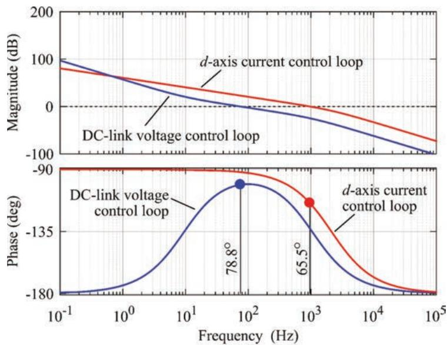  
(a)

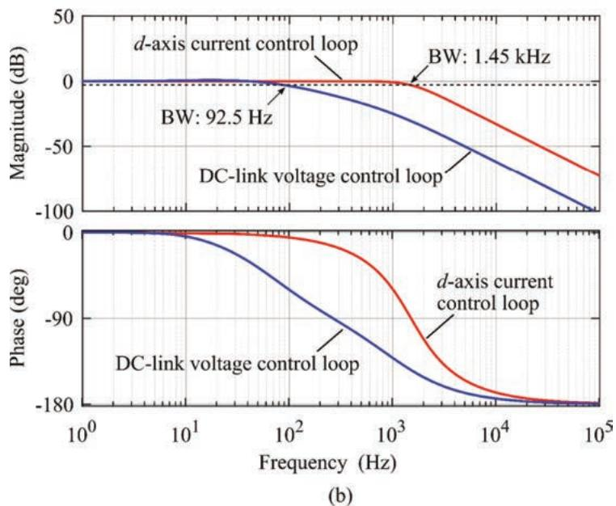  
Figure 5.11 Frequency response of the double-loop control (i.e., the DC-link voltage control loop and the d-axis current control loops) with the designed parameters: (a) open loop Bode plots and (b) closed-loop Bode plots, where BW represents bandwidth of the system

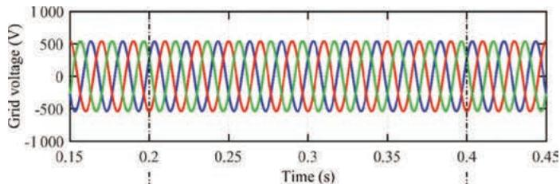

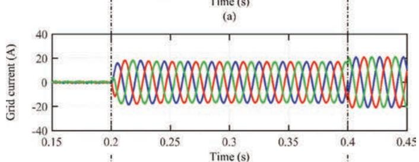

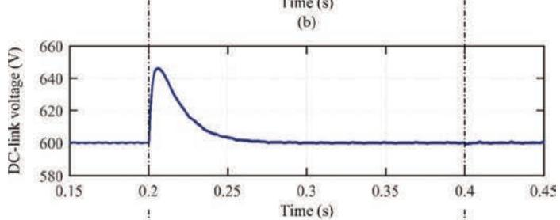

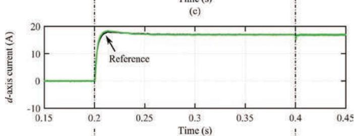

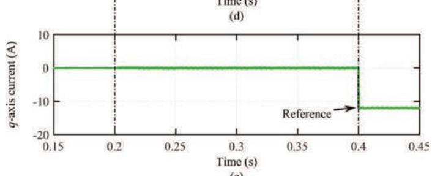  
(e)  
Figure 5.12 Simulation results for the grid-connected three-phase AC–DC converter system controlled in the synchronous reference frame with the designed parameters: (a) grid line-to-line voltages, (b) grid currents, (c) DC-link voltage, (d) d-axis current component, and (e) q-axis current

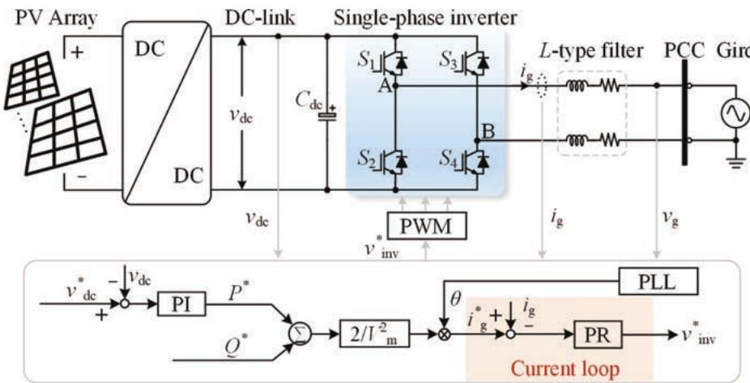  
Figure 5.13 Control structure of the single-phase grid-connected solar inverter, where the current loop adopts PR controller

## 5.4.2 PR controller for single-phase inverters

The PI controller in the dq-reference frame can be employed in both the three-phase and single-phase inverters, and yet the reference frame transformation for single-phase inverters will increase the calculation complexity. Alternatively, there are other advanced solutions to have zero-error tracking without the reference frame transformation, e.g., the PR controllers and repetitive controllers, which have good tracking performance in AC periodical signal systems $[43]$ . In this case, the control loop can still be taken as a cascaded-control system, which includes an outer voltage or power control and an inner current control. Generally, the design of the period control can also be applied directly to the single-phase inverter or in the $\alpha\beta$ -reference frame of the three-phase inverter. When considering without the effort of the Park transformation ( $\alpha\beta\rightarrow dq$ ), this control method, thus, is more beneficial to single-phase inverters.

Accordingly, an example of the current controller implemented with the PR controller in a single-phase inverter is demonstrated in Figure 5.13, being without the Park transformation ( $\alpha\beta\rightarrow dq$ ). Besides, the system parameters of a 3.5-kW grid-connected single-phase inverter are given in Table 5.2, while the controller parameters are designed according to the discussion in Subsection 5.3.2. Through (5.24), the controller parameters can be calculated as

$$
k _ {\mathrm{rp}} = 3 3. 3 \text { and } k _ {\mathrm{ri}} = 1 3 3 3 4\tag{5.38}
$$

Table 5.2 System parameters of the 3.5-kW grid-connected single-phase inverter.

<table><tr><td>Parameter</td><td>Symbol</td><td>Value</td></tr><tr><td>DC-link voltage reference</td><td> $v_{\text{dc}}^{*}$ </td><td>400 V</td></tr><tr><td>DC-link capacitor</td><td> $C_{\text{dc}}$ </td><td>1 000  $\mu$ F</td></tr><tr><td>Grid phase voltage amplitude</td><td> $V_{\text{m}}$ </td><td>311 V</td></tr><tr><td>Filter inductance</td><td> $L$ </td><td>7.6 mH</td></tr><tr><td>Filter resistance</td><td> $R$ </td><td>0.08  $\Omega$ </td></tr><tr><td>Switching frequency</td><td> $f_{\text{sw}}$ </td><td>10 kHz</td></tr><tr><td>Sampling frequency</td><td> $f_{\text{sw}} = 1/T_{\text{s}}$ </td><td>10 kHz</td></tr></table>

Figure 5.14 presents the simulation performance of the single-phase inverter with a current step change from 5 A to 10 A at t = 0.205 s. To compare with the PI control, the dynamic performance of the single-phase inverter has been transformed in the dq-reference frame, as shown in Figure 5.14. The results in Figure 5.14 indicate that the grid current can track the reference quickly and accurately, verifying the controllability of the PR controller. However, when compared to the simulation performance of the PI controller, the dynamics are slightly different in terms of overshoots and settling time, which may be related to the coupling effects and the reference frame in the three-phase solar inverter. Nevertheless, this case study with the PR controller illustrates that the control of single-phase solar inverters can be implemented in both the $\alpha\beta$ -reference frame and the dq-reference frame. In addition, the PR controller can also be employed in the $\alpha\beta$ -reference frame of the three-phase solar inverter.

In all, the two case studies, i.e., the PI controller in the dq-reference frame for the three-phase inverter and the PR controller in the $\alpha\beta$ -reference frame for single-phase inverter, provide full control design procedures, which should consider the performance in terms of dynamic response (i.e., accuracy and tracking speed) and steady-state characteristics.

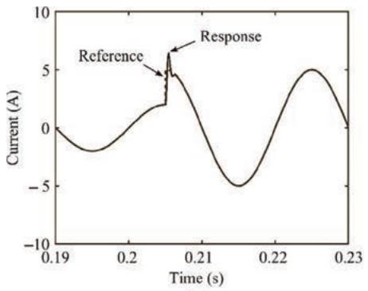  
(a)

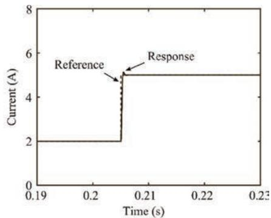  
(b)  
Figure 5.14 Dynamic performance of the single-phase inverter with the PR controller: (a) the grid current (i.e., the $\alpha$ -axis current) and (b) the d-axis current.

## 5.5 Summary

In this chapter, the general control for grid-connected solar inverters has been introduced, which includes the MPPT algorithm, the PQ control (e.g., the DC-link voltage control), and the grid current control. The brief introduction for the modeling and MPPT control of the PV panels is first presented, where the traditional P&O MPPT algorithm is exemplified to demonstrate the PV characteristics and the MPPT function. Then, the control procedures of grid-connected solar inverters (i.e., single-phase and three-phase inverters) have been exhibited, mainly designed in the dq-reference frame. The common procedures contain the reference frame transformations, the modeling and design of the controller, and the parameters tuning. Except for the PI controller in the dq-reference frame for the three-phase inverter, the design of a typical PR controller for a single-phase inverter (i.e., exemplified as an AC period system) has also been demonstrated. Finally, simulations are carried out to validate the controllability of the basic control strategies for grid-connected solar inverters.

## References

[1] Blaabjerg F., Yang Y., Yang D., Wang X. ‘Distributed power-generation systems and protection’. Proceedings of the IEEE. 2017;105(7):1311–31.

[2] IEEE Standard Committee. ‘IEEE standard for interconnection and interoperability of distributed energy resources with associated electric power systems interfaces’. IEEE Std 1547-2018. 2018:1–138.

[3] Blaabjerg F., Ionel D.M. Renewable Energy Devices and Systems with Simulations in MATLAB® and ANSYS®. 1st edn. CRC Press; 2017.

[4] Wu Y.K., Lin J.H., Lin H.J. 'Standards and guidelines for grid-connected photovoltaic generation systems: a review and comparison'. IEEE Transactions on Industry Applications. 2017;53(4):3205–16.

[5] Verband der Elektrotechnik. Power Generation Systems Connected to the Low-Voltage Distribution Network–Technical Minimum Requirements for the Connection to and Parallel Operation with Low-Voltage Distribution Networks (VDE-AR-N 4105). Frankfurt, Germany: Verband der Elektrotechnik Aug; 2011.

[6] Podder A.K., Roy N.K., Pota H.R. 'MPPT methods for solar PV systems: a critical review based on tracking nature'. IET Renewable Power Generation. 2020;14(9):1752–1424.

[7] Yang Y., Wang H., Blaabjerg F. ‘Reactive power injection strategies for single-phase photovoltaic systems considering grid requirements’. IEEE Transactions on Industry Applications. 2014;50(6):4065–76.

[8] Sangwongwanich A., Yang Y., Blaabjerg F. 'A sensorless power reserve control strategy for two-stage grid-connected PV systems'. IEEE Transactions on Power Electronics. 2017;32(11):8559–69.

[9] Rakhshani E., Rodriguez P. 'Inertia emulation in AC/DC interconnected power systems using derivative technique considering frequency measurement effects'. IEEE Transactions on Power Systems. 2017;32(5):3338–51.

[10] Fang J., Tang Y., Li H., Li X. 'A battery/ultracapacitor hybrid energy storage system for implementing the power management of virtual synchronous generators'. IEEE Transactions on Power Electronics. 2018;33(4):2820–4.

[11] Andresen M., Ma K., Buticchi G., Falck J., Blaabjerg F., Liserre M. 'Junction temperature control for more reliable power electronics'. IEEE Transactions on Power Electronics. 2018;33(1):765–76.

[12] Blaabjerg F., Teodorescu R., Liserre M., Timbus A.V. 'Overview of control and grid synchronization for distributed power generation systems'. IEEE Transactions on Industrial Electronics. 2006;53(5):1398–409.

[13] Villalva M.G., Gazoli J.R., Filho E.R. ‘Comprehensive approach to modeling and simulation of photovoltaic arrays’. IEEE Transactions on Power Electronics. 2009;24(5):1198–208.

[14] Esram T., Chapman P.L. 'Comparison of photovoltaic array maximum power point tracking techniques'. IEEE Transactions on Energy Conversion. 2007;22(2):439–49.

[15] Yang Y., Blaabjerg F. ‘A modified P&O MPPT algorithm for single-phase PV systems based on deadbeat control’. Proc. of IET PEMD’12. 2012:1–5.

[16] Rezk H., Fathy A., Abdelaziz A.Y. 'A comparison of different global MPPT techniques based on meta-heuristic algorithms for photovoltaic system subjected to partial shading conditions'. Renewable and Sustainable Energy Reviews. 2017;74(6):377–86.

[17] Ishaque K., Salam Z., Amjad M., Mekhilef S. 'An improved particle swarm optimization (PSO)-based MPPT for PV with reduced steady-state oscillation'. IEEE Transactions on Power Electronics. 2012;27(8):3627-38.

[18] Ahmed J., Salam Z. 'A maximum power point tracking (MPPT) for PV system using cuckoo search with partial shading capability'. Applied Energy. 2014;119:118–30.

[19] Blaabjerg F., Chen Z., Kjaer S.B. 'Power electronics as efficient interface in dispersed power generation systems'. IEEE Transactions on Power Electronics. 2004;19(5):1184–94.

[20] Teodorescu R., Liserre M., Rodriguez P. Grid Converters for Photovoltaic and Wind Power Systems. New York, NY, USA: Wiley; 2011.

[21] Romero-Cadaval E., Francois B., Malinowski M., Zhong Q.-C. 'Grid-connected photovoltaic plants: an alternative energy source, replacing conventional sources'. IEEE Industrial Electronics Magazine. 2015;9(1):18–32.

[22] Yang Y., Enjeti P., Blaabjerg F., Wang H. 'Wide-scale adoption of photovoltaic energy: grid code modifications are explored in the distribution grid'. IEEE Industry Applications Magazine. 2015;21(5):21–31.

[23] Vasquez J.C., Mastromauro R.A., Guerrero J.M., Liserre M. 'Voltage support provided by a droop-controlled multifunctional inverter'. IEEE Transactions on Industrial Electronics. 2009;56(11):4510–19.

[24] Cagnano A., De Tuglie E., Liserre M., Mastromauro R.A. ‘Online optimal reactive power control strategy of PV inverters’. IEEE Transactions on Industrial Electronics. 2011;58(10):4549–58.

[25] Zhong Q.-C., Hornik T. 'Cascaded current–voltage control to improve the power quality for a grid-connected Inverter with a local load'. IEEE Transactions on Industrial Electronics. 2013;60(4):1344–55.

[26] Carnieletto R., Brandão D.I., Farret F.A., Simões M.G., Suryanarayanan S. 'Smart grid initiative: a multifunctional single-phase voltage source inverter'. IEEE Industry Applications Magazine. 2011;17(5):27–35.

[27] Yang Y., Blaabjerg F., Wang H. 'Low-voltage ride-through of single-phase transformerless photovoltaic inverters'. IEEE Transactions on Industry Applications. 2014;50(3):1942–52.

[28] O'Rourke C.J., Qasim M.M., Overlin M.R., Kirtley J.L., C. J. O'Rourke, M.M., Qasim M.R.O. 'A geometric interpretation of reference frames and transformations: dq0, Clarke, and Park'. IEEE Transactions on Energy Conversion. 2019;34(4):2070–83.

[29] Clarke E. ‘Circuit analysis of AC power systems; symmetrical and related components. Vol. 1’. Wiley; 1943.

[30] Chen D., Zhang J., Qian Z. 'An improved repetitive control scheme for grid-connected inverter with frequency-adaptive capability'. IEEE Transactions on Industrial Electronics. 2013;60(2):814–23.

[31] Park R.H. 'Two-reaction theory of synchronous machines generalized method of analysis - Part I'. Transactions of the American Institute of Electrical Engineers. 1929;48(3):716–27.

[32] Teodorescu R., Liserre M., Rodriguez P. Grid Converters for Photovoltaic and Wind Power Systems. New York, NY, USA: Wiley; 2011.

[33] Teodorescu R., Blaabjerg F., Liserre M., Loh P.C. 'Proportional-resonant controllers and filters for grid-connected voltage - source converters'. IEE Proceedings - Electric Power Applications. 2006;153(5):750–62.

[34] Yang Y., Zhou K., Wang H., Blaabjerg F., Wang D., Zhang B. 'Frequency adaptive selective harmonic control for grid-connected Inverters'. IEEE Transactions on Power Electronics. 2015;30(7):3912–24.

[35] Stumper J.-F., Hagenmeyer V., Kuehl S., Kennel R. 'Deadbeat control for electrical drives: a robust and performant design based on differential flatness'. IEEE Transactions on Power Electronics. 2015;30(8):4585–96.

[36] Abdelhakim A., Mattavelli P., Boscaino V., Lullo G. 'Decoupled control scheme of grid-connected split-source inverters'. IEEE Transactions on Industrial Electronics. 2017;64(8):6202–11.

[37] Liserre M., Teodorescu R., Blaabjerg F. 'Multiple harmonics control for three-phase grid converter systems with the use of PI-RES current controller in a rotating frame'. IEEE Transactions on Power Electronics. 2006;21(3):836–41.

[38] Tan P.C., Loh P.C., Holmes D.G. 'High-performance harmonic extraction algorithm for a 25kV traction power quality conditioner'. IEE Proceedings - Electric Power Applications. 2004;151(5):505–12.

[39] Pan D., Ruan X., Bao C., Li W., Wang X. 'Optimized controller design for LCL-type grid-connected inverter to achieve high robustness against grid-impedance variation,'. IEEE Trans. Ind. Electron. 2015;62(3):1537–47.

[40] Akagi H., Kanazawa Y., Nabae A. ‘Instantaneous reactive power compensators comprising switching devices without energy storage components’. IEEE Transactions on Industry Applications. 1984;IA-20(3):625–30.

[41] Merai M., Naouar M.W., Slama-Belkhodja I., Monmasson E. ‘An adaptive Pi controller design for DC-link voltage control of single-phase grid-connected converters’. IEEE Transactions on Industrial Electronics. 2019;66(8):6241–9.

[42] Zhou D., Blaabjerg F. ‘Bandwidth oriented proportional-integral controller design for back-to-back power converters in DFIG wind turbine system’. IET Renewable Power Generation. 2017;11(7):941–51.

[43] Zhou K., Lu W., Yang Y., Blaabjerg F. ‘Harmonic control: a natural way to bridge resonant control and repetitive control’. Proceedings of the American Control Conference. 2013:3189–93.

Chapter 6

# Control strategy for grid-connected solar inverter for IEC standards

Mohammed Ali Khan $^{1}$ and Ariya Sangwongwanich $^{2}$

The rapid evolution of renewable-based power generation has increased the integration of distributed generation (DG) units recently. Increase in power capacity of the DGs and its feeding to the utilities has triggered many concerns. A vast range of fault, i.e., destabilization of grid due to unregulated power injection, can cause a complete grid collapse. Hence, to tackle such issues and create a secure perimeter for grid operation, utility companies along with the governments of different countries revised the grid codes. These grid codes ensure that the fault, such as frequency mismatch, overvoltage, and undervoltage is detected and depending upon the severity of the fault, appropriate action is performed by controlling the inverter to stabilize the anomaly. If the fault tends to persist even after a prescribed fault tolerance limit, the grid is disconnected from the DGs to prevent any further harm to the utilities as well as the DGs. All the important parameters such as operating voltage with fluctuation limits, frequency fluctuation limit, and permissible time up to which the fluctuation can be tolerated, are prescribed by the grid codes. The grid code enables the low-voltage ride-through (LVRT) capability of the DGs by providing set of operating instruction. In this chapter, a comparative analysis between different grid codes focusing on LVRT requirement and islanding criteria is presented along with the analysis of different control techniques proposed for islanding detection and reactive power injection.

## 6.1 LVRT requirement for control

The grid-connected photovoltaic (PV) system (GCPVS) is considered to be in LVRT condition when a certain criterion in the grid code is not maintained [1]. Hence, it is necessary to understand grid code and its focus on different aspects of grid integration. Various parameters such as operating frequency, operating voltage, power factor, and reactive power are monitored at the point of common coupling (PCC) [2, 3]. In this section, an overview of grid codes for different countries is presented regarding LVRT.

Table 6.1 Permissible limit of voltage fluctuation with respect to nominal voltage

<table><tr><td rowspan="2">Country</td><td rowspan="2">Grid code</td><td colspan="2">Requirement</td></tr><tr><td>Rating</td><td>Limit range (%)</td></tr><tr><td>United States</td><td>Federal Energy Regulatory Commission (2005) [5]</td><td>-</td><td>±10</td></tr><tr><td rowspan="2">United Kingdom</td><td rowspan="2">National Grid (2010) The grid code [6]</td><td>132 kV and 275 kV</td><td>±10</td></tr><tr><td>400 kV</td><td>±5</td></tr><tr><td rowspan="3">Ireland</td><td rowspan="3">EirGrid [7] EirGrid grid code [7]</td><td>110 kV</td><td>-10 to +12</td></tr><tr><td>220 kV</td><td>-9 to +12</td></tr><tr><td>400 kV</td><td>-13 to +5</td></tr><tr><td rowspan="2">China</td><td rowspan="2">China&#x27;s National Standard: GB/T 19963-2011 [8]</td><td>&gt;110 V</td><td>±8</td></tr><tr><td>≤110 V</td><td>±10</td></tr><tr><td rowspan="3">Germany</td><td rowspan="3">German e-on Grid code [9]</td><td>110 kV</td><td>-12.7 to +11.8</td></tr><tr><td>220 kV</td><td>-12.3 to +11.4</td></tr><tr><td>400 kV</td><td>-7.3 to +10.5</td></tr><tr><td>India</td><td>CERC (Indian Electricity Grid Code) Regulations, 2010 [10]</td><td>-</td><td>±6</td></tr><tr><td rowspan="3">Denmark</td><td rowspan="3">Technical regulation 3.2.1 for power plants up to and including 11 kW [11]</td><td>132 kV</td><td>-10 to +10</td></tr><tr><td>150 kV</td><td>-10 to +13</td></tr><tr><td>400 kV</td><td>-10 to +5</td></tr><tr><td>Australia</td><td>Australia Standards Electromagnetic Compatibility (EMC) AS61000.3.100 [12]</td><td>-</td><td>+10 to -6</td></tr></table>

## 6.1.1 Permissible limit for voltage fluctuation

The voltage at PCC is monitored and it is maintained to ensure a continuous operation even when the voltage varies under a certain range as specified by grid code $[4]$ . The range of voltage prescribed by different countries is listed in Table 6.1.

It is required that the GCPVS operates within the voltage fluctuation limits at PCC. The voltage control is in coordination with the reactive power. When the voltage is under the fluctuation limit at PCC it must also be ensured that the DGs are operating under the operating voltage range of the equipment present. Preferably the operating voltage range is between 0.9 p.u. and 1.1 p.u. [13].

## 6.1.2 Permissible limit for frequency fluctuation

Majority of the DGs utilizing synchronous generator for power production. The frequency can be regulated by controlling the rotor speed of synchronous generator [14]. If there is a frequency mismatch between generation and power consuming unit, a condition of power deviation will occur. This will not only harm the generation unit but also lead to a large-scale damage of equipment at consumer end $[15, 16]$ . To prevent such issues, several grid codes has specified to limit the frequency and provide an acceptable range of operation for the system as depicted in Table 6.2. The system operates with frequency relay $[17]$ which limits the operating range for frequency. When system operates beyond the range the relay disconnects utilities for the DGs. Based on the frequency range, the system is present in time tolerance range for that frequency level. Frequency deviation can cause a wide scale blackout if not mitigated within the prescribed time limit.

Table 6.2 Permissible limit of frequency fluctuation with respect to nominal frequency

<table><tr><td rowspan="2">Country</td><td rowspan="2">Grid code</td><td colspan="2">Requirement</td></tr><tr><td>Frequency range (Hz)</td><td>Tolerance limit</td></tr><tr><td>United States</td><td>Federal Energy Regulatory Commission (2005) [5]</td><td>59.95–60.05</td><td>Normal operation</td></tr><tr><td rowspan="5">United Kingdom</td><td rowspan="5">National Grid (2010) The grid code [6]</td><td>49–51</td><td>Normal operation</td></tr><tr><td>51.5–52</td><td>15 min</td></tr><tr><td>51–51.5</td><td>90 min</td></tr><tr><td>47.5–49</td><td>90 min</td></tr><tr><td>47–47.5</td><td>20 s</td></tr><tr><td rowspan="4">Ireland</td><td rowspan="4">EirGrid [7] EirGrid grid code [7]</td><td>49.5–50.5</td><td>Normal operation</td></tr><tr><td>50.5–52</td><td>60 min</td></tr><tr><td>49.5–47.5</td><td>60 min</td></tr><tr><td>&lt;47.5</td><td>20 s</td></tr><tr><td rowspan="3">China</td><td rowspan="3">China&#x27;s National Standard: GB/T 19963—2011 [8]</td><td>49.8–50.2</td><td>Normal operation</td></tr><tr><td>50.2–52</td><td>2 min</td></tr><tr><td>48–49.8</td><td>10 min</td></tr><tr><td>Germany</td><td>German e-on Grid code [9]</td><td>47.5–51.5</td><td>Normal operation</td></tr><tr><td>India</td><td>CERC (Indian Electricity Grid Code) Regulations, 2010 [10]</td><td>48.5–51.5</td><td>Normal operation</td></tr><tr><td rowspan="6">Denmark</td><td rowspan="6">Technical regulation 3.2.1 for power plants up to and including 11 kW [11]</td><td>49.5–50.2</td><td>Normal operation</td></tr><tr><td>49–49.5</td><td>5 h</td></tr><tr><td>48–49</td><td>30 min</td></tr><tr><td>50.2–52</td><td>15 min</td></tr><tr><td>47.5–48</td><td>3 min</td></tr><tr><td>47–47.5</td><td>20 s</td></tr><tr><td>Australia</td><td>Australia Standards Electromagnetic compatibility (EMC) AS61000.3.100 [12]</td><td>49.75–50.25</td><td>Normal operation</td></tr></table>

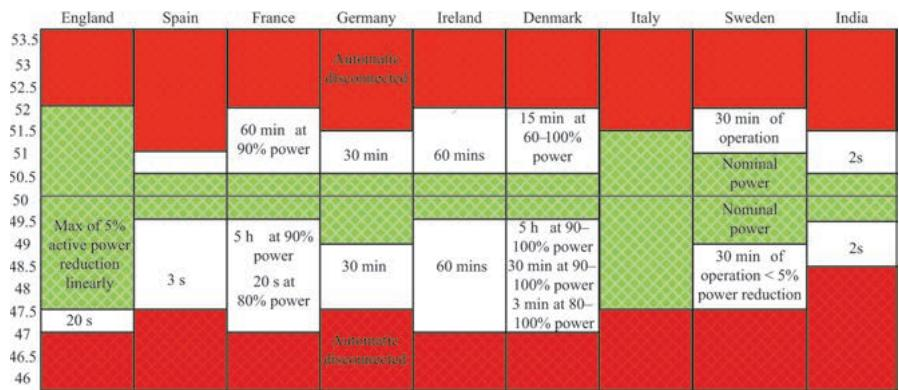  
Figure 6.1 Frequency variation as per the grid code of different countries [18]

From Table 6.2 it can be deduced that most of the counties in Asia and Europe operate at 50 Hz nominal frequency whereas, the nominal frequency for North and South American countries is 60 Hz. The permissible range various from $\pm3\%$ to $\pm5\%$ in majority of the cases [18]. In most of the European countries there are limit for critical frequency that permits the system to recover within specific time. For instance, in Denmark, the standard operating limit lies from +0.5 Hz to 0.2 Hz. Even if frequency drops below 49.5 Hz and is above 49 Hz, the grid is disconnected only if system does not recover under 5 h of time. Similarly, 30 min of recovery time is provided for frequency which is in the range of 48–49 Hz. A layout to represent the frequency variation range and recovery time is denoted in Figure 6.1.

## 6.1.3 Power factor, reactive current injection, and reactive power requirement

The reactive power of system directly impacts the voltage at PCC of the GCPVS. Reactive power is supplied to provide stability to the grid voltage during voltage deviation [19]. During grid fault or voltage sag, reactive power is supplied to provide static grid support and reactive current is injected for dynamic grid support [20]. At times, the DGs remain connected with the grid during fault condition for certain period as discussed in previous sections. Few grid code specify that during faulty condition the DGs must inject reactive power for supporting grid voltage recovery. As per German grid code, the reactive current injection needs to be initiated as soon as the grid fault is detected for providing support to grid voltage [21]. A specific amount of reactive current is injected into the grid depending upon the value of voltage sag. In general, $\pm 10\%$ variation in nominal voltage at PCC is acceptable [22, 23]. Hence, when system operates between 0.9 p.u. and 1.1 p.u., the system is in steady state. When the voltage drops below $10\%$ of the nominal value and is still greater than $50\%$ of nominal value [24], reactive current equivalent to $2\%$ of rated current is injected into the grid [25, 26] for every percent drop in voltage. If the voltage drops below $50\%$ of grid rated voltage, then the DGs must inject reactive power equivalent to the rated current. As a result, above explanation can be deduced into following equation:

$$
I _ {q} = \left\{ \begin{array}{l l} 0 & 0. 9 \leq V <   1. 1 \mathrm{p.u.}, \\ k \frac {V - V _ {o}}{V _ {n}} + 2 & 0. 5 \leq V <   0. 9 \mathrm{p.u.}, \\ - I _ {n} + I _ {q 0} & V <   0. 5 \mathrm{p.u.}, \end{array} \right.\tag{6.1}
$$

where $V_{n}$ and $I_{n}$ are nominal voltage and current, respectively. Voltage prior to fault is denoted by $V_{o}$ and V is voltage during fault condition. The reactive current prior to fault is denoted by $I_{q0}$ .

Recently, many of the GCPVS demands DGs to control the reactive power and utilizing it for stabilizing the grid voltage. On the basic of active power present at any instance the reactive power is controlled. The range of power factor and its relationship with active power and voltage is presented in Figure 6.2.

Based on the grid required of different countries, different grid code specify power factor requirement as presented in Table 6.3.

The requirement of reactive power varies in different countries depending upon the grid codes. In UK for 100% to 50% of active power production, a reactive power of -32% to +32% of rated active power is required. For 50% to 20% of active power production, a reactive power of -12% to +32% of rated active power is required. And for 20% to 0% of active power production, a reactive power of -5% to +5% of rated active power is produced. Whereas in Ireland, for 100% to 12% of active power production, a reactive power of -33% to +33% of rated active power is required. In Germany, the reactive power requirement is based on voltage fluctuation at PCC. When there is a voltage fluctuation from minimum operating voltage to full voltage capacity than the power factor varies from 0.95 inductive to 0.92 capacitive.

## 6.1.4 Overview of LVRT requirement based on grid codes

In Sweden, for a system capacity less than 100 MW, the DG system shall not be disconnected from the grid for a duration of 250 ms if the system voltage is below 25%. The DG must be capable of supplying 90% of the rated voltage within 250 ms. Similarly, for a system greater than 100 MW, the DG shall not be disconnected from the grid for the duration of 250 ms if the system voltage drops to zero. The DG shall recover 90% of system voltage within 750 ms. According to the Polish LVRT requirements, the system shall be disconnected if the voltage drops below 15% of nominal voltage. The maximal time before beginning of the recovery voltage is 600 ms and the time before which a voltage recovering process should finish is 3 s as represented in Figure 6.3. After this time, the line voltage should reach 80% of the nominal voltage. In UK, the grid regulation for LVRT require that the system should be connected to the grid for a total fault clearance time of 140 ms at zero voltage. Following the fault clearance, the voltage should reach 90% of the nominal voltage within 0.25 s as represented in Figure 6.3. For Danish grid code the DG shall not be disconnected from the grid for the duration of 100 ms if the system voltage is under 20%. The DG shall recover 5% of the system voltage within 750 ms. Similarly, for Italian grid code, the DG shall not be disconnected from the grid for the duration of 500 ms if the system voltage is under 20%. The DG shall recover 5% of the system voltage within 750 ms. For Belgium and France, the system should be connected to grid at zero voltage for 200 ms and 150 ms the nominal voltage within 750 ms as per the Belgian LVRT standards, and the grid voltage shall restore completely up to 100% of the nominal voltage within 0.15 s as per the French LVRT standards.

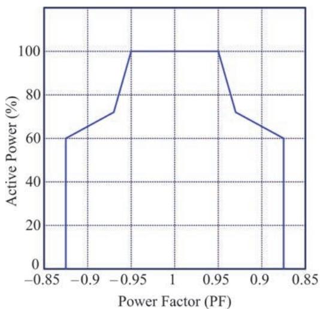  
(a)

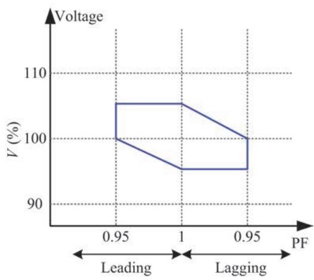  
(b)  
Figure 6.2 (a) Range of power factor variation with respect to active power and (b) range of power factor variation with respect to voltage [27]

Table 6.3 Grid code-based power factor requirement

<table><tr><td>Country</td><td>Grid code</td><td>Requirement</td></tr><tr><td>United States</td><td>Federal Energy Regulatory Commission (2005) [5]</td><td>0.95 lag to 0.95 lead</td></tr><tr><td>United Kingdom</td><td>National Grid (2010) The grid code [6]</td><td>0.95 lag to 0.95 lead</td></tr><tr><td>Ireland</td><td>EirGrid [7] EirGrid grid code [7]</td><td>0.95 lag to 0.95 lead at full production whereas active power drops to 12% when 100%</td></tr><tr><td>China</td><td>China’s National Standard: GB/T 19963-2011 [8]</td><td>0.95 lag to 0.95 lead</td></tr><tr><td>Germany</td><td>German e-on Grid code [9]</td><td>For reactive power injection the power factor must vary from 0.95 p.u. (inductive) to 1 p.u.</td></tr><tr><td>India</td><td>CERC (Indian Electricity Grid Code) Regulations, 2010 [10]</td><td>0.8 lag to 0.95 lead</td></tr><tr><td>Denmark</td><td>Technical regulation 3.2.1 for power plants up to and including 11 kW [11]</td><td>The power factor must range from 0.9 p.u. to 1 p.u., where the active power is 20% greater than the rated power</td></tr><tr><td>Australia</td><td>Service and Installation Rules of New South Wales [12]</td><td>Should not be less than 0.9 lagging</td></tr></table>

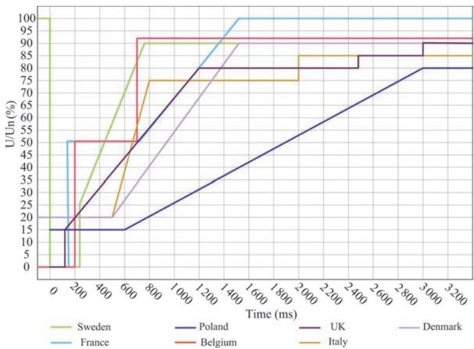  
Figure 6.3 LVRT plot based on different grid code [21]

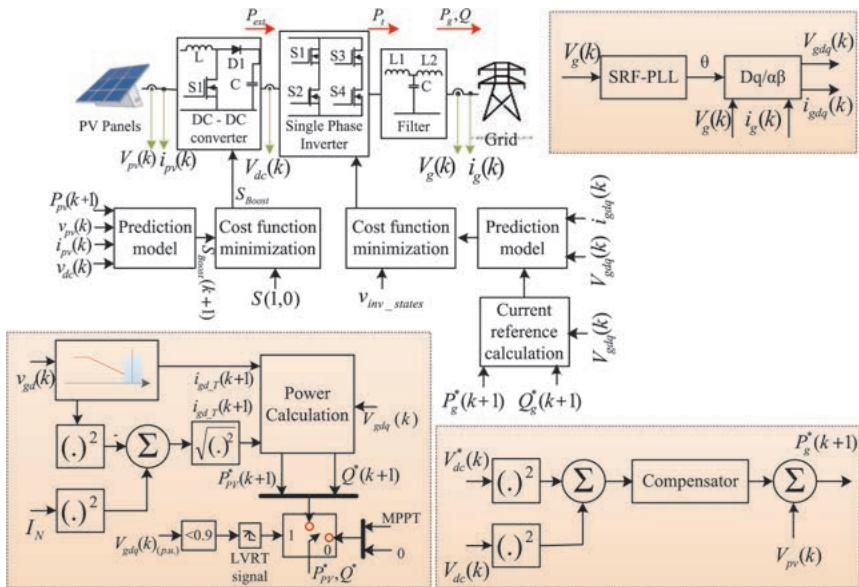  
Figure 6.4 Schematic of the control structure for a single-phase two-stage grid-connected PV system

## 6.2 Control strategy used to meet LVRT standards

In a GCPVS, the optimal operation of PV panels is achieved with the help of two typical topologies. These topologies are differentiated by adapting a DC/DC conversion stage between the PV strings and grid tied converter. In the absence of a DC/DC converter, the PV array is directly connected with the grid tied inverter. This approach has disadvantages as the inverter tends to draw a double line frequency current ripple resulting in deviation of the PV voltage away from the voltage at maximum power point $V_{mpp}$ . Hence, in this chapter, a two-stage topology for grid-tied PV systems is utilized. The two-stage operation of grid tied PV system along with the control layout is illustrated in Figure 6.4.

The two-stage operation provides an additional advantage with the boost converter operating in three different modes. These modes were selected based on the amount of active power to be injected for three voltage regions: (a) the DC/DC converter using MPPT mode operates only on the grids' voltage normal operation region; (b) the reduced power mode (RPM) operates when the voltage sag is between 0.9 p.u. ≤ $v_g$ ≤ 0.5 p.u., where the PV power is tracked to maintain the inverter power operation; and finally, (c) the short-circuit current mode is activated for severe voltage dips. In the short-circuit current mode, the PV inverter enter to a short-circuit region of the PV panel when the system is required to deliver only reactive power. Considering the operation of the grid-connected power systems with multivariable control algorithms (MCAs) [28, 29], the LVRT operation is achieved as discussed in Sections 6.2.1 and 6.2.4.

## 6.2.1 Generator-side converter

For a boost converter operating in two stage grid-connected system, the current $i_{LB}$ , when both states of the converter are considered is given by

$$
\frac {d i _ {L B}}{d t} = \frac {1}{L _ {B}} \left(V _ {P V} + \left(S _ {B o o s t} - 1\right) V _ {d c}\right)\tag{6.2}
$$

where $V_{dc}$ represents the voltage at the load R, and $S_{Boost}$ denotes the switching state of the boost converter that can be either 1 or 0, which indicates the states on and off, respectively. The continuous-time model can be converted to discrete-time by approximating the derivative using the forward Euler method [30–32].

$$
\frac {d x}{d t} = \frac {x (k + 1) - x (k)}{T _ {s B}}\tag{6.3}
$$

where $T_{sB}$ represents the discretization time sample. By substituting (6.3) into (6.2), the discrete-time model of the current $i_{LB}$ is given by

$$
\frac {i _ {L B} (k + 1) - i _ {L B} (k)}{T _ {s B}} = \frac {1}{L _ {B}} \left[ V _ {P V} (k) + \left(S _ {\text {Boost}} (k) - 1\right) V _ {d c} (k) \right]\tag{6.4}
$$

The predicted current in $(k + 1)$ can be simplified to

$$
i _ {L B} (k + 1) = \frac {T _ {s B}}{L _ {B}} \left[ V _ {P V} (k) + \left(S _ {\text {Boost}} (k) - 1\right) V _ {d c} (k) + i _ {L B} (k) \right]\tag{6.5}
$$

The presence of $C_{PV}$ in the system helps to maintain the PV voltage constant during operation, and if $T_{sB}$ is small enough, it can be assumed that $V_{PV}(k) \cong V_{PV}(k+1)$ . Therefore, to obtain $P_{PV}$ , both sides of (6.5) are multiplied by $V_{PV}$

$$
P _ {P V} (k + 1) = \frac {T _ {s B}}{L _ {B}} V _ {P V} (k) \left[ V _ {P V} (k) + \left(S _ {\text {Boost}} (k) - 1\right) V _ {d c} (k) \right] + P _ {P v} (k)\tag{6.6}
$$

The variables expressed in (6.5) consider only a one-step prediction, where all the variables can be obtained by measuring the signals indicated in Figure 6.4. Additionally, it does not consider the power required for the charging/discharging of the capacitor. The predicted PV power can be modified to include capacitor dynamics as

$$
\begin{array}{l} P _ {P V} (k + 1) = \frac {T _ {s B} V _ {P V} (k)}{L _ {B}} \left[ V _ {P V} (k) + \left(S _ {\text {Boost}} (k) - 1\right) V _ {d c} (k) \right] \\ + P _ {P V} (k) - C _ {P V} V _ {P V} \frac {d V _ {P V}}{d t} \end{array}\tag{6.7}
$$

where the derivative can be discretized also using Euler methods. However, the same equation can be rewritten to consider a different prediction horizon h:

$$
\begin{array}{l} P _ {P V} (k + h) = \frac {T _ {s B}}{L _ {B}} V _ {P V} (k + h - 1) \left[ V _ {P V} (k + h - 1) \right. \\ \left. + \left(S _ {\text {Boost}} (k + h - 1) - 1\right) V _ {d c} (k + h - 1) \right. \\ \left. + P _ {P V} (k + h - 1) - C _ {P V} V _ {P V} (k + h - 1) \frac {\Delta V _ {P V}}{\Delta t _ {h}} \right. \end{array}\tag{6.8}
$$

In general, the models in (6.5) to (6.8) correlate the $P_{PV}$ output power to the state of the switching signal given by $S_{Boost}$ , and the output voltage of the boost converter. Therefore, one can use (6.8) to predict the PV power, and in turn regulate $P_{PV}$ accurately. Similarly, (6.8) can be solved in terms of $S_{Boost}$ as

$$
\mathrm{S} _ {- B o o s t (k + h) = 1 +} \frac {1}{V _ {d c} (k + h - 1)} \left\{ \begin{array}{l} \frac {L _ {B}}{T _ {s B} V _ {P V} (k + h - 1)} [ P _ {P V} (k + h) - P _ {P V} (k + h - 1) \\ + P _ {C P V} ] - V _ {P V} (k + h - 1) \end{array} \right.\tag{6.9}
$$

where $P_{CPV}$ represents the capacitor charging/discharging power. In the notation given by (6.9), the predicted $P_{PV}$ has a different meaning. In this case, $P_{PV}(k+h)$ is no longer a predicted signal, but the power reference to track. Therefore, to avoid confusion, (6.9) is rewritten as

$$
\mathrm{S} _ {- B o o s t (k + h) = 1 +} \frac {1}{V _ {d c} (k + h - 1)} \left\{ \begin{array}{l} \frac {L _ {B}}{T _ {s B} V _ {P V} (k + h - 1)} \left[ P _ {P V} ^ {*} (k + h) - P _ {P V} (k + h - 1) \right. \\ + P _ {C P V} - V _ {P V} (k + h - 1) \end{array} \right.\tag{6.10}
$$

Equation (6.10) shows the optimal state of the boost converter that tracks, in this case, the PV power reference.

## 6.2.1.1 Cost function

As explained in previous sections, the predictive control scheme utilizes an optimization function that executes an algorithm in charge of finding a control action that delivers minimum error. Here, (6.8) and (6.10) provide two possible options to implement MCA; however, they differ in the cost function definition. When using the approach shown in (6.8), the main objective is to regulate the power delivered by the PV. On the other hand, when using (6.9), the cost function objective is changed to find which of the two possible states is closer to the optimal state, which in turn will regulate the PV power. When using the model given by (6.8), the cost function is defined as

$$
g _ {B} (k) = \left[ P _ {P V} (k + h) - P _ {P V} ^ {*} (k + h) \right] ^ {2}\tag{6.11}
$$

where $P_{PV}^{*}$ represents the PV power reference, in which its h-state can be estimated via an extrapolation technique such as Lagrange or vector angle methods [33, 34]. It is important to mention that for small enough sampling period, no extrapolation is required if the h-state does not exceed 2 [35, 36]. Moreover, in this case, no extrapolation is necessary because the signal reference is constant [37].

On the other hand, in the case of (9), the cost function is given by

$$
g _ {B} (k) = \left[ s _ {\text {Boost}} (k + h - 1) - s _ {\text {Booststates}} \right] ^ {2}\tag{6.12}
$$

where $s_{Booststates}$ represents a vector of the states of the boost converter (0 and 1).

## 6.2.1.2 Control algorithm

Two control approaches can be implemented to track the PV power and they are shown in Figure 6.5. The inductor current, PV voltage, and the voltage output of the boost converter are required for both predictive algorithms (refer to (6.8) and (6.10)). Although both methods utilize a different approach to calculate the optimized control action, they deliver the same result. The main reason to utilize the state-based MCA approach over the conventional method is that the former method utilizes fewer calculations to reach the same result, as can be seen by examining both flowcharts. The cost and minimization functions are calculated the same number of times; however, the predicted step is only calculated once on the state-based technique. Although there is not a significant improvement for the generator-side controller, only one computation was saved and the benefits of utilizing the state-based approach can be seen clearly for power converters that present multiple states like two-level and three-level converters.

## 6.2.2 Grid-side converter

## 6.2.2.1 Inverter modeltationary reference

Modeling the inverter shown in Figure 6.4 using phase lock loop (PLL) offers an advantage for the computationally demanding MCA scheme. First, the single-phase variables are transformed from the natural frame to the dq-frame. Second, dq variables are naturally DC quantities during symmetrical conditions, which in turn allows the use of approximations like $x(k) \cong x(k+1)$ , where x represents a state variable. For a single-phase system, the control signals forming the switching states define the value of the inverter terminal voltages as

$$
v _ {i} = s V _ {d c}\tag{6.13}
$$

For a two-level three-phase converter, three control signals labeled $S_{a}$ , $S_{b}$ , and $S_{c}$ are available. These control signals form a total of switching states, which in turn define the value of the inverter terminal voltages as

$$
\begin{array}{l} v _ {i a} = s _ {a} V _ {d c} \\ v _ {i b} = s _ {b} V _ {d c} \\ v _ {i c} = s _ {c} V _ {d c} \end{array}\tag{6.14}
$$

(6.15)

(6.16)

The grid currents can be expressed in terms of the inverter voltage, the grid voltage, and the inverter filter in the natural frame as

$$
\frac {d i _ {g}}{d t} = \frac {1}{L _ {g}} \left(V _ {i} - V _ {g} - R _ {g} i _ {g}\right)\tag{6.17}
$$

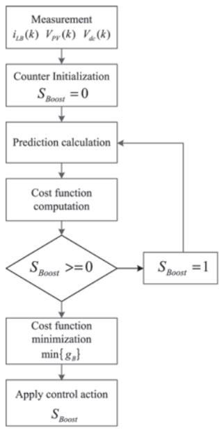  
(a)

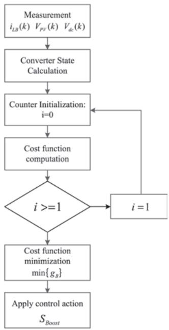  
(b)  
Figure 6.5 Control algorithm for generator-side stage: (a) power reference-based, (b) converter state-based

where for a three-phase system, $i_g = \left[i_a \ i_b \ i_c\right]^{\prime}$ , $V_i = \left[v_{ia} \ v_{ib} \ v_{ic}\right]^{\prime}$ , and $V_g = \left[v_{ga} \ v_{gb} \ v_{gc}\right]^{\prime}$ .

The grid current dynamics in the natural frame can be converted to the synchronous dq-frame and expressed in state-space form as shown in the following equations:

$$
\frac {d}{d t} \left[ \begin{array}{c} i _ {g d} \\ i _ {g q} \end{array} \right] = A \left[ \begin{array}{c} i _ {g d} \\ i _ {g q} \end{array} \right] + B _ {i} \left[ \begin{array}{c} V _ {i d} \\ V _ {i q} \end{array} \right] + B _ {g} \left[ \begin{array}{c} V _ {g d} \\ V _ {g q} \end{array} \right]\tag{6.18}
$$

where

$$
\mathrm{A} = \left[ \begin{array}{c c} - \frac {R _ {g}}{L _ {g}} & \omega_ {g} \\ - \omega_ {g} & - \frac {R _ {g}}{L _ {g}} \end{array} \right]; B _ {i} = \left[ \begin{array}{c c} \frac {1}{L _ {g}} & 0 \\ 0 & \frac {1}{L _ {g}} \end{array} \right]; B _ {g} = \left[ \begin{array}{c c} \frac {- 1}{L _ {g}} & 0 \\ 0 & \frac {- 1}{L _ {g}} \end{array} \right]\tag{6.19}
$$

where $\omega_{g}$ represents the grid electrical frequency.

The discrete time representation for d- and q-axis currents can be obtained from the continuous-time state-space representation in (6.18) for a one-step prediction, as follows:

$$
\left[ \begin{array}{c} i _ {g d} (k + 1) \\ i _ {g q} (k + 1) \end{array} \right] = \Phi \left[ \begin{array}{c} i _ {g d} (k) \\ i _ {g q} (k) \end{array} \right] + \Gamma_ {i} \left[ \begin{array}{c} V _ {i d} (k) \\ V _ {i q} (k) \end{array} \right] + \Gamma_ {g} \left[ \begin{array}{c} V _ {g d} (k) \\ V _ {g q} (k) \end{array} \right]\tag{6.20}
$$

where

$$
\begin{array}{c} \Phi = e ^ {A T _ {s}}, \Gamma_ {i} = A ^ {- 1} \left(\Phi - I _ {2 \times 2}\right) B _ {i} \\ \Gamma_ {g} = A ^ {- 1} \left(\Phi - I _ {2 \times 2}\right) B _ {g} \end{array}\tag{6.21}
$$

where I represents the identity matrix. As it is shown in (6.20), the predicted behaviour of the grid-side currents depends on the present grid variables and the inverter voltages $(V_{id}(k)$ and $V_{iq}(k))$ .

Similar to the approach followed in Section 6.1, can be expressed in terms of the control actions, which in this case is the inverter voltage. Therefore, (6.20) can be rewritten as

$$
\left[ \begin{array}{l} V _ {i d} (k) \\ V _ {i q} (k) \end{array} \right] = \Psi \left[ \begin{array}{l} i _ {g d} (k + 1) \\ i _ {g q} (k + 1) \end{array} \right] - \Upsilon_ {1} \left[ \begin{array}{l} i _ {g d} (k) \\ i _ {g q} (k) \end{array} \right] - \Upsilon_ {2} \left[ \begin{array}{l} V _ {g d} (k) \\ V _ {g q} (k) \end{array} \right]\tag{6.22}
$$

where

$$
\begin{array}{c} \Psi = \Gamma_ {i} ^ {- 1} \\ \Upsilon_ {1} = \Gamma_ {i} ^ {- 1} \Phi \\ \Upsilon_ {2} = \Gamma_ {i} ^ {- 1} \Gamma_ {g} \end{array}\tag{6.23}
$$

where the superscript notation $(-1)$ denotes the matrix inverse. The predicted d- and q-axis grid currents in $(6.20)$ have a different meaning in $(6.22)$ . In this notation, the predicted currents represent the d- and q-axis reference currents. Therefore, to avoid confusion, $(6.22)$ is rewritten as

$$
\left[ \begin{array}{c} V _ {i d} (k) \\ V _ {i q} (k) \end{array} \right] = \Psi \left[ \begin{array}{c} i _ {g d} ^ {*} (k + 1) \\ i _ {g q} ^ {*} (k + 1) \end{array} \right] - \Upsilon_ {1} \left[ \begin{array}{c} i _ {g d} (k) \\ i _ {g q} (k) \end{array} \right] - \Upsilon_ {2} \left[ \begin{array}{c} V _ {g d} (k) \\ V _ {g q} (k) \end{array} \right]\tag{6.24}
$$

where superscript \* indicates a reference signal.

Equation (6.24) shows that the inverter control signal at k depends on the current state variables and the reference current to track. Moreover, the matrices $\Psi$ , $\Upsilon_{1}$ , and $\Upsilon_{2}$ can be calculated beforehand to improve the algorithm execution speed.

## 6.2.2.2 Cost function

Similar to the cost function definition presented above for the generator-side controller, (6.20) and (6.24) allow MCA implementation for inverter control that deliver the same result. When using the model given by (6.20), the cost function is defined as

$$
g _ {g} (k) = \left[ i _ {g d} (k + 1) - i _ {g d} ^ {*} (k + 1) \right] ^ {2} + \left[ i _ {g q} (k + 1) - i _ {g q} ^ {*} (k + 1) \right] ^ {2}\tag{6.25}
$$

where the reference and the grid current are compared. On the other hand, if $(6.24)$ is used instead, the cost function is given by the state-based approach as

$$
\mathbf {g} _ {g} (k) = \left[ V _ {i d} (k) - V _ {I N V _ {S t a t e s _ {d}}} \right] ^ {2} + \left[ V _ {i q} (k) - V _ {I N V _ {S t a t e s _ {q}}} \right] ^ {2}\tag{6.26}
$$

where $V_{INV_{States_{d}}}$ and $V_{INV_{States_{q}}}$ represent all possible voltage vectors delivered by the inverter on dq-frame, given by

$$
\left[ \begin{array}{c} V _ {I N V _ {S t a t e s _ {d}}} \\ V _ {I N V _ {S t a t e s _ {q}}} \end{array} \right] = \left[ T _ {d q} \right] \left[ v _ {i} \right]\tag{6.27}
$$

For a three-phase system, all possible and voltage vectors delivered by the inverter on dq-frame, given by

$$
\left[ \begin{array}{l} V _ {I N V _ {S t a t e s _ {d}}} \\ V _ {I N V _ {S t a t e s _ {q}}} \end{array} \right] = \left[ T _ {d q} \right] \left[ v _ {i x} \right]\tag{6.28}
$$

where x = a, b, c. $v_{ix}$ is a $[3 \times 7]$ matrix that holds all possible voltage vectors that the inverter can provide according to the switching states. Therefore, $V_{INVStatesx}$ is a $[2 \times 7]$ matrix.

## 6.2.2.3 Current tracking control algorithm and simulation The current tracking control can be implemented following these steps:

\- Measurement: The grid voltage, $V_{g}$ the grid currents, $i_{g}$ and the DC-link voltage $V_{dc}$ are measured.

\- $\alpha\beta \rightarrow dq$ transformation: Using the estimated grid voltage angle provided by the PLL.

\- Calculation of the converter voltage: The - and -axis current reference is used in (6.24) for a single computation of the required converter voltages.

\- Calculation of the inverter voltage vectors: Build the matrix of voltage vectors that is related with the converter switching states using (6.27).

\- Cost function computation: Because the state-based approach was chosen to calculate the converter voltage, the cost function is calculated using (6.26).

\- Cost function minimization: Finally, the optimal control action is applied to the converter according to the minimum error of the cost function calculation.

## 6.2.3 Control structure on symmetrical faults

In the above sections, the details for the control of the generator and grid-side components of the PV system using MCA approach were given. In this section, both controllers are combined in a single control scheme that allows the LVRT for PV systems. Equation (6.24) shows the prediction function used to obtain the converter terminal voltages based on the inverter current references, grid variables, and system parameters. However, the control strategy utilized here is based on the power balance of the DC- and AC-side of the inverter by means of the DC-link voltage control. Therefore, the inverter current references for a single-phase system must be calculated based on the active and reactive power required during the fault event:

$$
\left[ \begin{array}{c} P \\ Q \end{array} \right] = \left[ \begin{array}{c c} V _ {g d} & V _ {g q} \\ V _ {g q} & - V _ {g d} \end{array} \right] \left[ \begin{array}{c} i _ {g d} \\ i _ {g q} \end{array} \right]\tag{6.29}
$$

for a three-phase system are calculated based on the active and reactive power required during the fault event:

$$
\left[ \begin{array}{c} P \\ Q \end{array} \right] = \frac {3}{2} \left[ \begin{array}{c c} V _ {g d} & V _ {g q} \\ V _ {g q} & - V _ {g d} \end{array} \right] \left[ \begin{array}{c} i _ {g d} \\ i _ {g q} \end{array} \right]\tag{6.30}
$$

For a single-phase system, the system described in (6.29) can be utilized to calculate the inverter active current reference for the next sampling time by inverting the matrix:

$$
\left[ \begin{array}{l} i _ {g d} ^ {*} (k + 1) \\ i _ {g q} ^ {*} (k + 1) \end{array} \right] = \left(\frac {1}{V _ {g d} ^ {2} (k) + V _ {g q} ^ {2} (k)}\right) \left[ \begin{array}{c c} V _ {g d} (k) & V _ {g q} (k) \\ V _ {g q} (k) & - V _ {g d} (k) \end{array} \right] \left[ \begin{array}{l} P _ {g} ^ {*} (k + 1) \\ Q _ {g} ^ {*} (k + 1) \end{array} \right]\tag{6.31}
$$

For a single-phase system, the system described in (6.30) can be utilized to calculate the inverter active current reference for the next sampling time by inverting the matrix:

$$
\left[ \begin{array}{l} i _ {g d} ^ {*} (k + 1) \\ i _ {g q} ^ {*} (k + 1) \end{array} \right] = \frac {2}{3} \left(\frac {1}{V _ {g d} ^ {2} (k) + V _ {g q} ^ {2} (k)}\right) \left[ \begin{array}{c c} V _ {g d} (k) & V _ {g q} (k) \\ V _ {g q} (k) & - V _ {g d} (k) \end{array} \right] \left[ \begin{array}{l} P _ {g} ^ {*} (k + 1) \\ Q _ {g} ^ {*} (k + 1) \end{array} \right]\tag{6.32}
$$

where $P_{g}^{*}(k+1)$ is given by the DC-link voltage compensator and $Q_{g}^{*}(k+1)$ is obtained following grid code requirement and voltage depth.

At the same time, the generator-side controller must operate the PV array at a specific location in the $P_{PV}$ vs $V_{PV}$ curve to avoid grid over current and eventual disconnection from the grid. Therefore, the PV power reference for a single-phase system is calculated based on the future grid current as

$$
P _ {P V} ^ {*} (k + 1) = \left[ V _ {g d} (k) i _ {g d \_ T} (k + 1) + V _ {g q} (k) i _ {g q \_ T} (k + 1) \right]\tag{6.33}
$$

The PV power reference for a three-phase system is calculated based on the future grid current as

$$
P _ {P V} ^ {*} (k + 1) = \frac {3}{2} \left[ V _ {g d} (k) i _ {g d _ {-} T} (k + 1) + V _ {g q} (k) i _ {g q _ {-} T} (k + 1) \right]\tag{6.34}
$$

where $i_{gd\_T}$ and $i_{gq\_T}$ are the active/reactive currents obtained as per the requirement. Finally, the control objectives for each stage include the following:

The implementation procedure is illustrated in Figure 6.6 and is as follows: (a) Variables Measurement: Grid voltages and currents, as well as PV voltage, PV current, and DC-link voltage are measured; (b) Synchronous Transformation: the grid voltage and currents are transformed to facilitate the implementation; (c) Fault Detection: $V_{gd}$ is utilized to calculate the presence and depth of a voltage sag; (d) Tracking Reference Calculation: If a voltage sag is detected, the future reference signals $P_{PV}^{*}(k+1)$ and $P_{g}^{*}(k+1)$ are computed warranting the operation limits of the PV system; (e) Prediction Calculation: The predictive models for the generator- and grid-side are utilized to process the next step; (f) Minimization: A cost function is utilized to achieve the minimum error; and, finally, (g) the switching state is applied to both stages of the PV system.

The overall control structure, as well as the two-stage PV system is shown in Figure 6.4. It is important to mention that the active and reactive powers are considered positive when flowing from the DC-side to the grid as it can be observed in the figure. Further, for a three-phase system, the need to control the unbalanced faults is a part of LVRT control.

## 6.2.4 Control structure and minimization function under unbalanced faults

Severe and abrupt disturbances on the grid voltage have a major impact on the performance of the grid-side converter, especially if the fault is non-symmetrical. When the faults are unbalanced, the injected currents using the approach described in the Section 2.3 are non-sinusoidal, and the active and reactive power includes oscillatory components that are reflected on the DC-link voltage control. These impacts are explained by the presence of a negative sequence component that does not exist during balanced conditions. This new component makes it more difficult and less accurate to retain synchronization with the grid, which in turns deteriorates the output current and DC-link voltage control. According to instantaneous power theory, and considering only the fundamental frequency, the instantaneous active and reactive power can be defined as

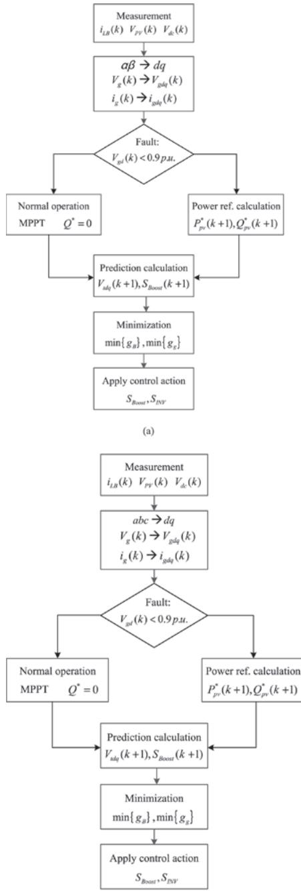  
(b)  
Figure 6.6 Flowchart of the PV system implementation using MCA: (a) control algorithm for single-phase system and (b) control algorithm for three-phase system

$$
\begin{array}{l} p = P _ {0} + P _ {c 2} \cos (2 \omega t) + P _ {s 2} \sin (2 \omega t) \\ q = Q _ {0} + Q _ {c 2} \cos (2 \omega t) + Q _ {s 2} \sin (2 \omega t) \end{array}\tag{6.35}
$$

where $P_{0}$ and $Q_{0}$ are the average values for the active and reactive power, respectively, and $P_{c2}$ , $P_{s2}$ , $Q_{c2}$ , and $Q_{s2}$ represent the second harmonic sine and cosine components of the active and reactive powers that appear when the three-phase system is not symmetrical and balanced. The voltages and currents to calculate the coefficients presented in (6.35) can be expressed in matrix notation using the synchronous reference as

$$
\left[ \begin{array}{c} P _ {0} \\ P _ {c 2} \\ P _ {s 2} \\ Q _ {0} \\ Q _ {c 2} \\ Q _ {s 2} \end{array} \right] = \frac {3}{2} \left[ \begin{array}{c c c c} v _ {d} ^ {+} & v _ {q} ^ {+} & v _ {d} ^ {-} & v _ {q} ^ {-} \\ v _ {d} ^ {-} & v _ {q} ^ {-} & v _ {d} ^ {+} & v _ {q} ^ {+} \\ v _ {q} ^ {-} & - v _ {d} ^ {-} & - v _ {q} ^ {+} & v _ {d} ^ {+} \\ v _ {q} ^ {+} & - v _ {d} ^ {+} & v _ {q} ^ {-} & - v _ {d} ^ {-} \\ v _ {q} ^ {-} & - v _ {d} ^ {-} & v _ {q} ^ {+} & v _ {d} ^ {+} \\ - v _ {d} ^ {-} & - v _ {d} ^ {-} & v _ {d} ^ {+} & v _ {d} ^ {+} \end{array} \right] \left[ \begin{array}{c} i _ {d} ^ {+} \\ i _ {q} ^ {+} \\ i _ {d} ^ {-} \\ i _ {q} ^ {-} \end{array} \right]\tag{6.36}
$$

where the superscripts + and - represent the positive and negative components of the voltage that can be obtained using PLL. The system of equations in (6.36) and a chosen control strategy can be used to find the positive and negative current references in the predictive model. One possible control strategy would be to eliminate the oscillations on the active power; in this case, the positive and negative current references are given by

$$
\left[ \begin{array}{c} i _ {d} ^ {+ *} \\ i _ {q} ^ {+ *} \\ i _ {d} ^ {- *} \\ i _ {q} ^ {- *} \end{array} \right] = \frac {2}{3} \left[ M _ {4 \times 4} \right] ^ {- 1} \left[ \begin{array}{c} P _ {0} \\ P _ {c 2} \\ P _ {s 2} \\ Q _ {0} \end{array} \right]\tag{6.37}
$$

where the matrix $M_{4\times4}$ includes only the four first rows of the matrix in (6.36). The variables $P_{0}$ and $Q_{0}$ are obtained based on the DC-link voltage regulation and the sag depth, respectively, Section 6.2.3, whereas the oscillatory components $P_{c2}$ and $P_{s2}$ are equal to zero to eliminate active power oscillations.

The negative current references given by (6.37) are used in the predictive model of the system under its negative sequence components. Therefore, the dynamics of the negative sequence current must be derived to obtain a predictive model similar to the positive sequence calculation shown in (6.24). In this case, the negative components of the injected currents are given by

$$
\frac {d}{d t} \left[ \begin{array}{c} i _ {g d} ^ {-} \\ i _ {g q} ^ {-} \end{array} \right] = A _ {n e g} \left[ \begin{array}{c} i _ {g d} ^ {-} \\ i _ {g q} ^ {-} \end{array} \right] + B _ {i} \left[ \begin{array}{c} V _ {i d} ^ {-} \\ V _ {i q} ^ {-} \end{array} \right] + B _ {g} \left[ \begin{array}{c} V _ {g d} ^ {-} \\ V _ {g q} ^ {-} \end{array} \right]\tag{6.38}
$$

where the superscript - represents the negative component of the electrical parameter, and the matrix $A_{neg}$ is given by

$$
A _ {n e g} = \left[ \begin{array}{c c} - \frac {R _ {g}}{L _ {g}} & - \omega_ {g} \\ \omega_ {g} & - \frac {R _ {g}}{L _ {g}} \end{array} \right]\tag{6.39}
$$

In general, (6.38) follows the same structure of the model presented in (6.18). Therefore, the analysis done for the positive sequence that goes from (6.20) to (6.24) to obtain the predictive model must be done as well for the negative component.

Finally, the cost function definition for the grid-side formulated in $(6.26)$ has to be modified to include the negative sequence injection objective. Therefore, the cost function using the state-based approach is formulated as

$$
\begin{array}{l} g _ {g} (k) = \left[ V _ {i d} (k) - V _ {I N V _ {S t a t e s _ {d}}} \right] ^ {2} + \left[ V _ {i q} (k) - V _ {I N V _ {S t a t e s _ {q}}} \right] ^ {2} \\ + \lambda \left\{\left[ V _ {i d} ^ {-} (k) - V _ {I N V _ {S t a t e s _ {d}}} ^ {-} \right] ^ {2} + \left[ V _ {i q} ^ {-} (k) - V _ {I N V _ {S t a t e s _ {q}}} ^ {-} \right] ^ {2} \right\} \end{array}\tag{6.40}
$$

where $V_{INV_{States_{d}}}$ and $V_{INV_{States_{q}}}$ represent all possible d and q voltage vectors delivered by the inverter in the dq-frame rotating in the opposite direction of the positive sequence, and are given by

$$
\left[ \begin{array}{c} V _ {I N V S t a t e s _ {d}} ^ {-} \\ V _ {I N V S t a t e s _ {q}} ^ {-} \end{array} \right] = \left[ T _ {d q ^ {- 1}} \right] \left[ v _ {i x} \right]\tag{6.41}
$$

where x = a, b, c. $v_{ix}$ is a $[3 \times 7]$ matrix that holds all possible voltage vectors that the inverter can provide according to the switching states, and $\lambda$ is transformation. On the other hand, represents the weighting factor for the negative current injection.

Finally, the implementation with negative compensation follows the same structure presented in the flowchart of Figure 6.6 with two additional aspects: (a) the calculation of the predictive negative current component and (b) the minimization function expressed in (6.40).

## 6.2.5 Experimental analysis

To assess the robustness of the developed fault ride-through controller, a line to ground fault is injected in 10 kW single-phase GCPVS. The line fault creates a voltage sag impact on the normal operation of the power system network. The voltage and current at the PCC during the action of sag fault for a single-phase system are shown in Figure 6.7. From the figure it can be identified that at t = 0.15 s, a voltage sag occurs disrupting the normal operation of the system. At this instant, the corresponding current at PCC increases up to the threshold limit. During this condition, the inverters control is designed to operate with constant peak current control through the duration of the event to ensure safe operation and avoid over current loading.

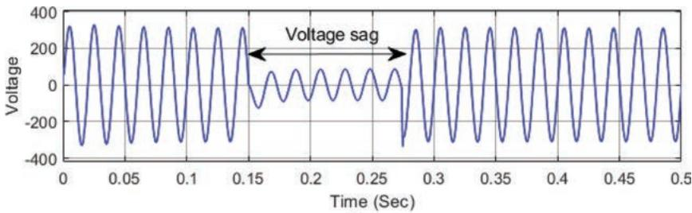  
(a)

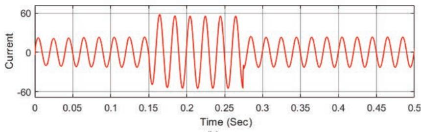  
(b)  
Figure 6.7 Voltage sag effect on single-phase GCPVS: (a) voltage and (b) current at PCC

The power output of the system during the inverter operation under the voltage sag profile is shown in Figure 6.8. At t = 0.15 s, the active and reactive power, experience high-frequency oscillations because of negative sequence components, and the PV system is exchanging power with an unbalanced grid system. The average value of PPCC drops from 10 kW to 6.9 kW and a reactive power of 8 KVar is injected with the help of proposed controller. This stabilizes the system voltage and restores the normal operation of the system before 1.35 s.

  
Figure 6.8 Active and reactive power during voltage sag effect on single-phase GCPVS

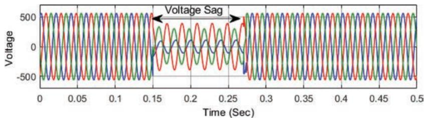  
(a)

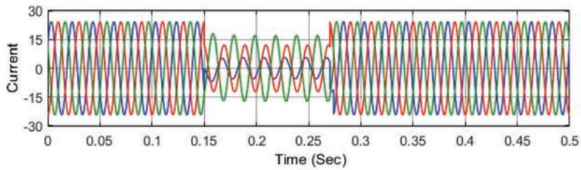  
(b)  
Figure 6.9 Voltage sag effect on single-phase GCPVS: (a) voltage and (b) current at PCC

Similarly, the robustness of the developed fault ride-through controller is tested for a 10 kW three-phase grid-connected system by injecting a line fault in the system. The line fault creates a voltage sag impact on the normal operation of the power system network. The voltage and current at the point of coupling during the action of sag fault for a three-phase system are shown in Figure 6.9. From the figure it can be identified that at t = 0.15 s, a voltage sag occurs disrupting the normal operation of the system. At this instant, the corresponding current at PCC increases up to the threshold limit. During this condition, the inverters control is designed to operate with constant peak current control through the duration of the event to ensure safe operation and avoid over current loading.

The power output of the system during the inverter operation under the voltage sag profile is shown in Figure 6.10. At t = 0.15 s, the active and reactive power, experience high-frequency oscillations because of negative sequence components, and the PV system is exchanging power with an unbalanced grid system. The average value of active power drops from 10 kW to 5 kW and a reactive power of 6 KVar is injected with the help of proposed controller. This stabilizes the system voltage and restores the normal operation of the system before 1.4 s.

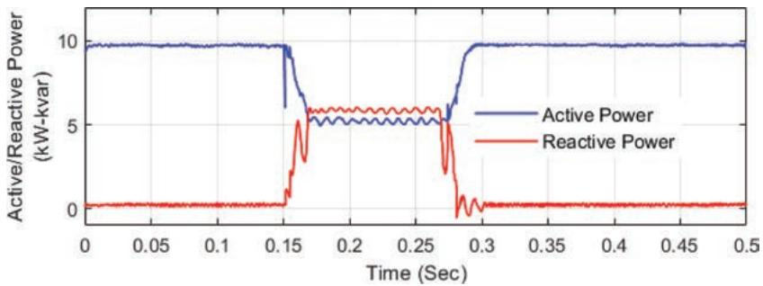  
Figure 6.10 Active and reactive power during voltage sag effect on single-phase GCPVS

## 6.3 Anti-islanding requirements for control

The anti-islanding detection of GCPVS is necessary during the power system failure. If the DGs are unable to recover the grid from fault condition by ride-through, an anti-islanding protection disconnects the DG from the grid and provides a necessary safety to both the utilities as well as the DGs and avoid the complete blackout for grid $[38]$ . The main aim of anti-islanding protection is to assure power system health and make sure that no unintentional islanding has occurred in the local area for safety reason $[39]$ . During unintentional islanding $[40]$ , the DGs tend to energies the local area at the PCC. It leads to the islanding of DGs area at local level and the grid is unaware of the islanding that has taken place. As a result, it can be hazardous for the safety personal who is working on line maintenance as he is unaware about the operation at the DGs end and he faces a threat of being electrocuted $[41]$ . Even inadequate grounding during unintentional islanding may lead to large transient over voltage due to rapid loss in load $[42]$ . The change of power quality and transient torque due to out of phase synchronization of machines are some other issue that can be of concern because of unintentional islanding $[42]$ . Hence, communication between DG and the utilities is necessary for avoiding any severe issues $[42]$ . As a result, many countries have come up with anti-islanding standards in their grid codes which specifies when the grid requires to be disconnected and based on different parameters at PCC. The severity of fault helps in setting up the priority and decide the instances at which the DGs disconnect from the grid. A few of the grid standard for anti-islanding are Section 6.3.3.

## 6.3.1 IEEE Standard for Interconnection and Interoperability of resources with interfaces (IEEE 1547)

The standard was documented by institute of electrical and electronics engineering (IEEE) with an aim to provide a guideline for distributed energy resource (DER) interconnection into the grid. It helps the energy industry to perform business with the different stack holders and influence the future of power system industry. The

IEEE 1547 [43] provides a list of regulations at local stand and federal levels to provide transparency and fairness in implementation DER interconnection with the grid. The major areas of concern during implementation of IEEE 1547 standard are:

IEEE 1547 (2003) [43] was the first edition of the standard concerning over DER interconnection. DER comprises DG as well as energy storage system. The standard focus on technical specification regarding testing and interconnection and does not focus on the technique of DER and stand as technologically neutral. The standard provides significance to operation, testing, performance, and maintenance of interconnection with DER. The conditions such as power quality, islanding state, and response time for abnormal condition are specified.

IEEE 1547 (2003) provided a criteria for interconnection but it lacked in providing any application-based guidelines. Further issue regarding self-protection of DER along with designing and maintenance of DGs and utility grid is not presented in the standards. Hence, the IEEE 1547.1 (2005) was designed to provide the specification for testing and evaluation. IEEE 1547.1 specify the type of test, product to be tested, and method of evaluating the test that is to be performed to establish the interconnection between DER and utility grid. IEEE 1547.2 (2008) [44] provides a background on 2003 standard and includes its logic to provide justification to technical description, application guidelines, schematics and interconnection examples for improving 1547. With rise in smart grid technology IEEE 1547.3 (2007) was designed, which presented a guidance for monitoring and information exchange and controlling via communication network. IEEE 1547 (2003) did not focus on intentional islanding and microgrid-based requirement and with the rise in renewable energy it was vastly required hence in IEEE 1547.4 (2011) the standards was updated. It aims on disconnecting the grid from the DGs in case of grid loss is detected and DG operations in islanding state. It provide good practices which need to be incorporated while designing, operating, and integrating DER with the utility grid. The standards provided instruction for DG to operate separately in islanded form and reconnecting grid once the grid is stable. The standards was revised in 2013 IEEE 1547.7 which address the impact of DG on the grids.

In 2014, the IEEE 1547 (2014) [45] standard was amended, and second issue was published. There has been a lot of development in the file of interconnection of DER, i.e., smart grid advancement, since the first issue was published in 2003. During the amendment, operation of DGs and coordination between DER was considered. By changing the active and reactive power, DER were now allowed to regulate the voltage level. The manufacturer must specify the characteristics of the equipment which will inject active and reactive power for regulating the voltage. Equipment can generally respond to variation of grid voltage which can be identified either by communication setting or by time scheduling. The amendment mostly aimed on flexible operation of the DG to avoid fault ride-through and attain prescribed voltage and frequency level for interconnection DERs. Based on the amendment IEEE P1547.1a (testing procedure) was also amended. The amended standard covered testing for voltage regulation and frequency ride-through. The equipment category for DER voltage regulation was created and functionality of the equipment under testing (EUT) are as follows [46]:

In 2018, the IEEE 1547 [47] was again amended to provide a uniform standard for interoperation and interconnection of DER with electrical power system. The requirement which are relevant for interconnection and interoperability such as performance, testing, operation, maintenance, safety, and security are considered. The revised 1547 (2018) standard addresses:

## 6.3.2 Utility-interconnected PV inverters—test procedure of islanding prevention measures (IEC 62116)

The standard was documented by international electrotechnical commission (IEC) with an aim to provide a guideline for interconnection of PV inverter with the utility. The first issue was published in 2008 and was latter replaced by updated issue in 2014 [48]. The updated considered active power of the system for most of the clause, whereas 2008 version considered real power. According to the standard, islanding is considered when a portion of utility consisting of both load and generation unit is isolated from the power grid. Islanding is created by controlling the utility and isolating a large section of grid, such action is known as intentional islanding. On the contrary unintentional islanding is created when grid containing load and only consumer owned generation is isolated from the grid by utility control. In regular application the consumer owned generation senses the absence of utility grid and terminate energy supply to the grid. However, when there is a presence of a well-balanced load and DGs, prior isolation and a very small amount of power is being used by the utility. Then it is difficult to detect the isolation of utility taking place. It can be very harmful as utility may not be controlling the generation and it may operate in some other frequency and voltage level causing damage to equipment present at the load terminal. Even the reconnection can lead to damage as the DGs may be out of synchronization from the grid. The energize line at the islanded end also causes threat to the line worker who is assuming that the line is dead from the grid-side.

Based on these issues, PV industry has developed various islanding detection and preventive measure over the years. The test procedure were created to check the efficiency of this detection mechanism as demonstrated in this document. The standard provided a compromise test procedure for evaluation of the islanding detection process along with overview of preventive measure to be taken for power conditioning of interconnection. The standards is specific to solar inverter but with some modification can be utilized for inverters using different power generation sources. The inverters and the other devices that meet the requirement of the document can be considered for the non-islanding operation.

## 6.3.3 IEEE recommended practice for utility interface of PV systems (IEEE 929)

The standard was documented by IEEE with an aim to provide guidelines regarding the equipment and tasks essential for ensuring smooth operation of PV system which is interconnected with grid in parallel [49]. The factors such as power quality, equipment safety, and personal safety are considered. Recommendation regarding island operation of PV system is also presented.

The recommendation in this documents are generally applied to the PV system which are interconnected with the grid in parallel. The recommendation is for static state inverter that converts DC to AC and is not applicable for rotating inverter. The recommended practices are specifically for small system with 10 kW or less rating which can be generally applicable for individual residences. The standardization of small-scale system tends to reduce the burden over both the utility as well as PV system installer. Medium and large-scale installation may combine various standards and customize as per requirement.

## 6.3.4 Requirement overview for anti-islanding operation

Islanding condition takes place when the DGs are disconnected from the grid and the generated power is used to feed the local load. It is mostly dominant on the low-voltage side of the network as a result it is required to disconnect the system if the frequency is not in the range of 49–51 Hz [50]. As discussed earlier, the grid codes need to be more stringent and need to be updated regularly as the amount of PV installation is increasing and will keep on expending in the future. When the large PV plant is integrated with the LV network, a large amount of active power is generated which leads to rise in voltage at the feeder and can exceed the specified limit. Prior there was no contribution of PV inverter in grid stability. But German standard VDE0126.1.1 (2015) [51] presented the following scenario when the inverter must disconnect from the grid:

Introduction of smart inverters have made the control process more challenging. Now the inverter are required to contribute to grid stability and support the grid during abnormal operating condition.

It is necessary that all the properties regarding the power quality of the DGs are maintained as per the grid code for interconnection of PV system.

## 6.4 Control strategy used to meet anti-islanding standards

Islanding is a protection scheme which disconnects the electrical system from the grid and islanded DGs generated power is consumed by the local load $[52]$ Section 6.3. One of the major constant between all the standards is that, in case of any abnormality at the grid end, the islanding detection algorithm must be able to detect it and disconnect the DGs from the grid under 2 s $[53]$ . A few of the challenges that are presented while islanding DGs are as follows $[54]$ :

Hence based on the standards and by keeping challenges in check, many different islanding detection methods have been proposed by the researchers over the years. The islanding detection technique can be classified into three categories: communication-based, local detection method, and intelligent islanding detection $[55]$ . The local detection technique can be further classified into active passive and hybrid detection technique as depicted in Figure 6.11.

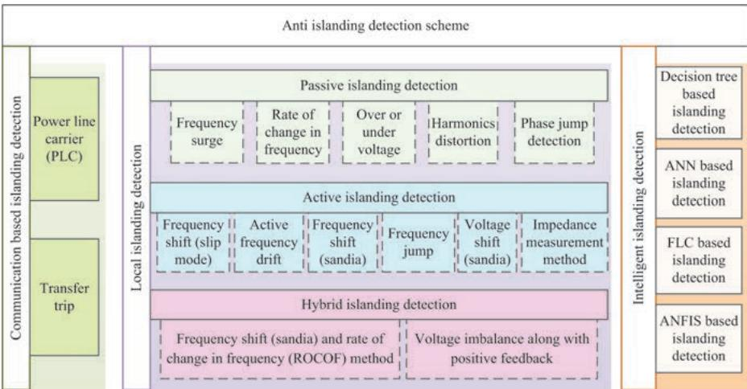  
Figure 6.11 Islanding detection schemes

## 6.4.1 Communication-based islanding detection scheme

It is one of the most reliable islanding detection scheme in which there is a direct communication between DGs and the utilities. The method is reliable but there is an issue regarding complexity and cost of implementation $[56]$ . A few of the commonly implemented communication-based islanding detection techniques are sections.

## 6.4.1.1 Power line carrier (PLC) communication

The power line is used to carry the communication signal with information regarding DGs state of operation (islanded or non-islanded). A signal generation is present at the substation of $25\mathrm{kV}$ or higher rating which is coupled with the network and keeps on broadcasting the DGs states information continuously as depicted in Figure 6.12. Because of the low-pass nature of the filter present in power system, it is required that the signal transmit either at or below the fundamental frequency and does not present any interference with other carrier signals [57]. During the normal operation, the signal received by the DGs and ensure the interconnection between utilities and DGs. Whereas in case of fault the signal is cut-off by the substation breaker and DGs stats to operate in islanding mode. The method is highly reliable and is simple in terms of control. For radial system only one transmission generator is required to communicate with multiple DGs continuously. The only time communication is disrupted is when there is a fault in line, or the line has been disconnected by an open breaker. In $[57]$ , a brief investigation on PLC-based islanding detection technique is presented and the data is verified on the field.

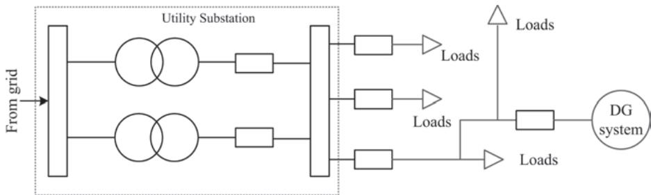  
Figure 6.12 PLC islanding detection schemes

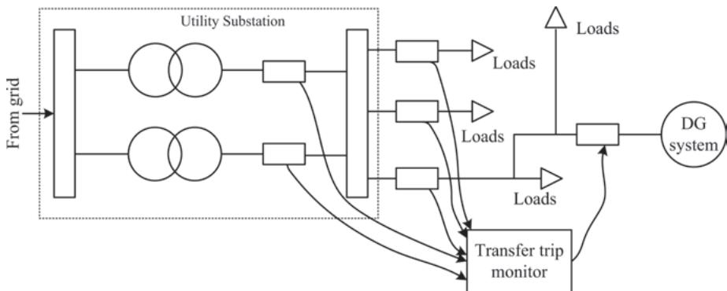  
Figure 6.13 Transfer trip islanding detection schemes

Even though the technique is vastly reliable and simple to implement, it does present few difficulties during practical implementation. At the substation voltage needs to be transformed from high potential to lower potential with the help of transformer. The transformer may present a cost barrier which may cause the installation of DGs undesirable for local network. In case of non-radial signal, multiple signal generator are required to communicate, which will lead to increment in cost by three folds. Another concern is regarding the transmission signal frequency which need to be near the fundamental frequency value. The energy required to attain such condition is very high and the value of SNR also increase with frequency in communication signal. In previous research it was reported that vibration in motor may lead to voltage fluctuations and in this method the trip signal may be generated $[58]$ .

## 6.4.1.2 Transfer trip

In transfer detection scheme, all the circuit breakers are linked and monitored by a centralized DG control as depicted in Figure 6.13. If a circuit breaker is tripped at any certain instance, the substation determines the islanded area and send a signal to the DG informing about islanded state and mode of operation to be performed further $[59]$ . The transfer trip has a distinct advantage over PLC. With radial connection consisting few DG sources and a limited number of circuit breakers, the state of the system can be monitored by DG at each point $[60]$ . It is also the limitations as for large system the complexity of control and cost of implementation are two major concerns. The size of the system makes the control complex and transfer trip obsolete.

## 6.4.2 Local islanding detection scheme

In case of local detection, the power producers are independent for detecting abnormality and disconnecting them from the system without any interface from the local utilities. The method is cost effective in comparison to the communication-based islanding detection. Local islanding detection can be further classified into active, passive, and hybrid islanding detection technique. During passive islanding detection scheme $[61]$ , the terminal voltage, current, and frequency of the DGs are monitored for any irregularities. Because of sensitivity limitation of the technique active islanding detection techniques was proposed. As per the literature $[62]$ in active islanding detection method a signal is injected in the network by the DG and is constantly monitored for any reaction which is compared with preset threshold value. However, the introduction of external signal may lead to power quality degradation and system can become unstable if a significant amount of signal is injected $[63]$ . To overcome the drawback of both the methods, hybrid islanding detection technique $[64]$ was introduced in which the external signal is injected when abnormality is detected in the system as a result the non-detection zone (NDZ) is small. Nevertheless, the islanding detection time is prolonged as both the detection methods are implemented.

## 6.4.2.1 Passive islanding detection technique

Passive islanding detection is one of the most widely used islanding detection scheme in which voltage, current, and the phase variation at the PCC is measured and islanding takes place in case of any abnormality $[61]$ . It is one of the most cost-effective method as it utilizes the relay which are already in place for protective measures. The sensor threshold is set to differentiate between the normal mode of operation and operation in islanded state. One of the biggest drawback being carried out in the field of passive islanding detection. The advantages and limitations of passive islanding detection techniques are presented in Table 6.4. The technique can be further classified as:

## 6.4.2.1.1 Frequency surge/over or under frequency

The frequency-based islanding detection scheme is mostly implemented for induction and synchronous machines. If power mismatch between generated and consumed power occurs, there is a possibility of frequency change for the system $[66]$ . As discussed in Section 6.3 that as per the standards the frequency need to be constant and a variation of 10 kW is permissible. Hence, if the frequency is found beyond the threshold limit then the system is operating in islanding condition and the DG relay open the breaker to avoid any damage. As per the literature $[67]$ , the change in power or power imbalance $(P_{l})$ is the difference between power generated by DG $(P_{dg})$ and power consumed by the load $(8KVAR)$ . By applying the value of P in swing equation, the value of frequency decline can be determined when the generation capacity is lower than the load requirement.

Table 6.4 Comparative analysis of passive islanding detection scheme [65]

<table><tr><td>Detection method</td><td>Advantage</td><td>Disadvantage</td></tr><tr><td>Frequency surge/over or under frequency</td><td>Low cost of implementationSame method can be used for protection loads and equipment from damage</td><td>NDZ is largeThe time of reaction for various protection equation is different</td></tr><tr><td>ROCOF</td><td>Faster detection speed compare to under and over frequencyHigh sensitivityHigh efficiency even for small frequency error</td><td>The threshold selection is difficultError may occur as the cause of frequency change is unknown</td></tr><tr><td>Over or under voltage</td><td>Low cost of implementationSame method can be used for protection loads and equipment from damage</td><td>NDZ is largeReaction time varies for different protective equipment</td></tr><tr><td>Harmonics distortion</td><td>Easy to implementHigh speed of detection</td><td>The threshold selection is difficultNDZ is largeMultiple DGs may degrade the performance</td></tr><tr><td>Phase jump detection</td><td>Easy to implementHigh speed of detectionMultiple DGs have minimal impact on efficiency</td><td>The threshold selection is difficultNDZ is large and can cause failure for local load if phase error is not sufficient</td></tr></table>

$$
P = \sum P _ {d g} - \sum P _ {l}\tag{6.42}
$$

$$
\Delta f = \frac {\Delta P}{D} \left(1 - e ^ {- D t / 2 H}\right)\tag{6.43}
$$

where the frequency change is indicated by $\Delta f$ , ration of percentage load change to percentage frequency change (load damping factor) is denoted by D, and system inertia constant is denoted by H.

## 6.4.2.1.2 Rate of change in frequency

It is another frequency-based method for islanding detection. Instead of $\Delta f$ , rate of change in frequency (ROCOF) $\left(\frac{df}{dt}\right)$ is used. The DG is set to trip if the value of $\frac{df}{dt}$ is beyond a certain threshold value. In majority of the cases the threshold is set to be 0.1 Hz/s to 1.2 Hz/s [54]. Consideration regarding the start-up frequency variation and fault-based frequency variation need to be made clear to avoid any unwanted trip taking place. The relation between power and voltage (magnitude, phase, and frequency) needs to be clear as per the following equations:

$$
P + j Q = \frac {V _ {a 1} V _ {b 1} \angle \theta}{Z _ {1}}\tag{6.44}
$$

$$
P = \frac {V _ {a 1} V _ {b 1}}{Z _ {1}}. \sin (\theta)\tag{6.45}
$$

$$
Q = \frac {V _ {a 1}}{Z _ {1}}. \left(V _ {b 1}. \cos (\theta) - V _ {a 1}\right)\tag{6.46}
$$

where active and reactive power are represented by P and Q, respectively. The voltage at two points are represented by $V_{a1}$ and $V_{b1}$ and impedance of the section is denoted by $Z_{1}$ . The change in value of P results into frequency and phase variation whereas voltage is varied by change the value of Q.

## 6.4.2.1.3 Over or under voltage

Passive islanding detection can also be performed by monitoring the voltage of the system. The reactive power mismatch will result in voltage variation. The excess of reactive power will cause over voltage condition whereas the lack of reactive power will lead to under voltage condition. If the voltage falls out of the preset threshold value, the relay will open the breaker and disconnect DG from the utility, initializing islanding state of operation. Most of the studies indicate that the voltage-based islanding detection method has higher performance in comparison to that of frequency-based islanding detection technique $[68]$ .

## 6.4.2.1.4 Harmonics distortion

This methods of islanding detection technique is majorly implemented in system comprising of an inverter, where harmonics are likely to be present. In this method the total harmonic distortion (THD) of the system is measured and the threshold is set. The relay open the breaker if the THD exceed the desired value $[69, 70]$ . Various factor such as motor drive, switching power supply, and nonlinear component are responsible for variation in harmonics. The level of harmonics fluctuates with variation in load. As per the standard discussed in Section 6.3, the permissible limit for THD variation is 5% for voltage waveform and 10% for current waveform $[71]$ under full load condition.

## 6.4.2.1.5 Phase jump detection

In phase jump-based detection method, the change in phase angle of voltage waveform to that of reference waveform is monitored. In case of fault, an instantaneous phase shift in DG is detected to accommodate the change in power requirement $[72]$ . Threshold based on maximum permissible jump limit is set and if the phase jump is beyond the limit then the relay is triggered. As per the standards, if a power mismatch of more than 33% is present then the relay will disconnect the DG after 300 ms of detection time $[73]$ .

## 6.4.2.2 Active islanding detection technique

For active islanding detection method, a small perturbation is injected into the grid. The generated perturbation will cause an insignificant disturbance when the DGs are connected to the utilities, whereas the disturbance becomes noticeable when DGs are disconnected $[62]$ . The active islanding detection technique has a smaller NDZ which is its advantage over passive techniques. The instability of grid due to large number of inverters is one of its prime disadvantage $[62]$ . This technique utilizes advanced controlling method along with load, voltage and current variation which is followed by measuring the detection time to monitor the islanding and non-islanding condition. The advantages and limitations of active islanding detection techniques are presented in Table 6.5. The active islanding techniques can be further classified as follows:

Table 6.5 Comparative analysis of active islanding detection scheme [65]

<table><tr><td>Detection method</td><td>Advantage</td><td>Disadvantage</td></tr><tr><td>Frequency shift (slip mode)</td><td>NDZ is smallHighly efficient even formultiple DGsPresent highly efficientdetection method, withimproved power qualityand improved transientstability of the system</td><td>Multiple degrees of transientstability and power qualityLevel of penetration is high,which leads to reducing thestability</td></tr><tr><td>Active frequency drift</td><td>NDZ is smallEasy to implement with thehelp of microcontrollerNo NDZ present for resistiveload</td><td>Degradation in power qualityChopping factor controls theNDZFor multiple DGs theefficiency of the detectionmethod falls</td></tr><tr><td>Frequency shift (Sandia)</td><td>For single inverter NDZ isalmost equal to zeroHighly efficiency on beingcoupled with Sandiavoltage shift schemePresent highly efficientdetection method, withimproved power qualityand improved transientstability of the system</td><td>Vulnerable to harmonicsDegradation in stability andpower quality</td></tr><tr><td>Frequency jump</td><td>Efficient for sophisticatedfrequency schemeNDZ is negligible forsingle inverter</td><td>Not effective for multi-DGs asfrequency synchronizationis a issue</td></tr><tr><td>Voltage shift (Sandia)</td><td>Easy to implementEfficiency of detectionimproves onimplementation along withSandia frequency shift</td><td>Dependent on inverter outputas a result easily effectedby implemented MPPTalgorithm</td></tr><tr><td>Impedance measurementmethod</td><td>NDZ is small for a singleinverter</td><td>If DGs are not operatingin synchronization thedetection efficiency fallsSelection of threshold valueis difficult as value of gridimpedance is required</td></tr></table>

## 6.4.2.2.1 Frequency shift (slip mode)

In slip mode-based islanding detection technique, a positive feedback control is used which tends to destabilize when islanding condition take place. The method can be explained by the equation

$$
i _ {i n v} = I _ {i n v} \sin (\omega t + \varphi)\tag{6.47}
$$

For a current source inverter, the phase of positive feedback is represented by $\varphi$ , Hence, the value of $\varphi$ needs to be varied for sliding the frequency and causing a short-term frequency change. For implementation of slip mode, modification are made in the PLL filter which lead to out of phase of fundamental value. During normal operating condition PLL track the phase and frequency changes in the network, but during faulty condition the slip mode keeps the inverter in phase. In case of frequency shift during islanding condition the PLL will observe a negative error and will try to shift the frequency away from the fundamental [66]. Because of the positive feedback the phase shift will occur in the reverse direction causing the frequency to go beyond the breaker threshold and causing the relay to disconnect the breaker.

Slid mode is easy to implement as only the value of inverter filter is to be varied. As per the literature $[74]$ slip mode has one of the smallest NDZ and is effective with multiple inverters. However, this method weakens in case of frequency response for RLC load is greater than slip mode-based system.

## 6.4.2.2.2 Active frequency drift

It is a computer-based islanding detection technique in which frequency of the output is distorted to create a continuous drift of the frequency from the fundamental. By altering the frequency and by incrementing the frequency for each half cycle followed by dead time, the system tends to wait for the fundamental to match the biased frequency $[74]$ . Current for each cycle can be deducted as per the equation

$$
i = \sqrt {2 I} \sin \left[ 2 \pi \left(f _ {V} + \delta f\right) \right]\tag{6.48}
$$

where the output current is deduced by i, maximum current is deduced by I, voltage frequency is represented by $f_{V}$ and change is frequency is denoted by $\delta f$ .

## 6.4.2.2.3 Frequency shift (Sandia)

Sandia-based frequency shift techniques is an advancement of positive feedback-based frequency biased technique. The error from the dead zone is taken by the positive feedback as a frequency error as depicted in Figure 6.14.

When the DG systems are connected to the grid, even a small variation in frequency will lead inverter to go beyond the range of line frequency, but the grid may keep the system stable. From the equation the feedback signal is represented.

$$
\theta_ {f} = \frac {\pi}{2} \left(c f _ {0} + K \left(f - f _ {0}\right)\right)\tag{6.49}
$$

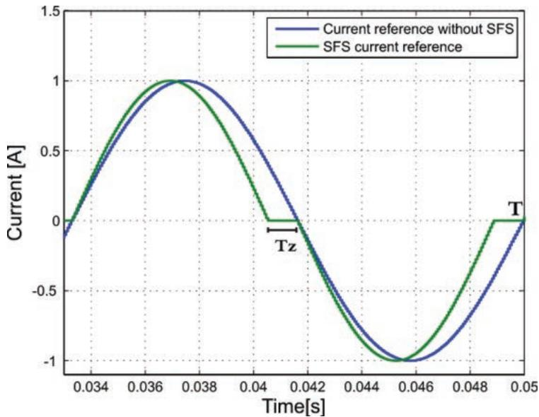  
Figure 6.14 Disturbance introduced by frequency shift islanding detection [76]

where the terminal frequency is represented by f and I represents the base frequency (50 Hz), positive feedback gain is depicted by K, and $cf_{0}$ represents initial chopping fraction.

When the fault occurs, the frequency error increases along with the dead zone. The method has a significant merit over the frequency bias method $[75]$ . Only the transient response efficiency is reduced when high-density source is present in the system. The method is implemented when a current control inverter is used, and it remains unsuitable for small DG integration $[76]$ .

## 6.4.2.2.4 Frequency jump

Frequency jump method is closely related to frequency biased method as dead zones are added but not for every cycle. Dead zone is added after every second cycle as per the predefined algorithm. On interconnecting the utility with the DGs the inverter current is modified whereas, grid linking voltage is observed. During the islanded condition, the current and voltage varies as per the inverter $[74]$ . As a result, the islanding state can be detected by frequency modification. The efficiency of this method reduces when more than one inverter is interconnected.

## 6.4.2.2.5 Voltage shift (Sandia)

In Sandia frequency shift method, voltage shift also uses positive feedback for islanding detection. The inverter power is decreased along with voltage during the application of this detection method. During the normal operation, there is no change in output terminal voltage as the grid provide system stability. Whereas, in case of faulty condition there is a drop in voltage along with drop in power $[74]$ . The positive feedback controller further drop the power to a point when the threshold value of relay is exceeded, and the voltage protection relay disconnects the DG from the grid.

## 6.4.2.2.6 Impedance measurement method

The method focus on fluctuation in voltage and its response on the current. During normal operation when the grid is interconnected with the inverter the change in output current will impact the voltage of the inverter as represented in the equation

$$
V = \frac {P _ {d g}}{2} \sqrt {\frac {R}{P _ {d g}}}\tag{6.50}
$$

where $P_{dg}$ represents the active power for the DG, R is the voltage at PCC, and R denotes the resistive load. As the value of R and $P_{dg}$ is constant, the variation in voltage is directly proportional to change in active power. The method has a small NDZ and even if the PV inverter output and load are balanced during the islanding condition, the inverter output tend to vary with the load causing a trip [77]. The presence of multiple inverters reduces the efficiency of the technique as multiple inverters may cause flickering that may lead to false trip signal generation.

## 6.4.2.3 Hybrid islanding detection scheme

Hybrid islanding detection method comprises of both active and passive islanding detection method. The perturbation for active islanding detection is added to the system when islanding is detected by passive islanding detection algorithm $[64]$ . Multiple passive detection techniques can be used with any one active detection techniques simultaneously. A few of the most used hybrid algorithms are as follows:

## 6.4.2.3.1 Frequency shift (Sandia) and ROCOF method

In this method of islanding detection Sandia frequency slip is an active islanding detection technique whereas ROCOF is the passive islanding detection technique. Whenever islanding is detected by ROCOF algorithm as explained in section 6.4.2.1 it activates the Sandia frequency shift algorithm to check if the islanding detection by ROCOF is appropriate $[63]$ . The trip signal at multiple point of the DG-grid interconnection is activated by frequency shift algorithm. This method prevents false trip from taking place and solve the issue of large NDZ present in passive islanding detection algorithm.

## 6.4.2.3.2 Voltage imbalance along with positive feedback

Like previous method, the passive islanding method of voltage imbalance is coupled with active islanding detection technique of positive feedback. The voltage at the PCC of the system is monitored constantly and in case of any abnormality is observed the frequency set point of the DG is varied. The trip signal that control the relay is activated by the positive feedback $[78]$ . The technique provides a large NDZ but because of operation of two islanding detection technique simultaneously, the operation time for islanding detection is increased.

## 6.4.3 Intelligent islanding detection scheme

Intelligent islanding-based technique refers to set of algorithms which are trained to imitate response like human intelligence. The techniques tends to learn from the past database and implement action based on trained dataset. A few of the most implemented techniques are artificial neural network (ANN), adaptive neuro fuzzy-based inference system (ANFIS), fuzzy logic control (FLC), and decision tree. The algorithms are equipped to solve multi-objective non-linear problems efficiently and more accurately when compared to conventional algorithms $[55]$ . Some of the implemented techniques are discussed in Sections 6.4.3.1–6.4.3.4.

## 6.4.3.1 ANN-based islanding detection

ANN-based islanding detection is one of the most used machine-learning-based algorithm for solving various engineering problems. In ANN, network between neurons is represented in the form of biological interconnection between the cells. For power system-based issues, multilayer feed forward network analysis is adopted in general. Various researchers have implemented a neural network (NN)-based islanding detection techniques for multi inverters and hybrid DGs $[79]$ . As per the literature $[80]$ , mostly the voltage at PCC is usually monitored and there is no impact on the power quality as in case of passive islanding detection technique. The feature of voltage signal obtained at PCC is extracted by discrete wavelet transform (DWT) $[81, 82]$ . A few of the commonly used features are $[83]$ energy, entropy, signal-to-noise ratio (SNR), etc. The obtained features are used train the ANN for identification if the system in islanded or not. During training, different condition of operation (islanding as well as non-islanding) are simulated to create a database. Non islanding condition may include line to ground fault, line to line fault, disconnection of capacitive load, three-phase to ground fault and other various states of DGs. For the obtained database, about 75% of the data is used for the purpose of training, and 15–15% of data is used for testing and validation $[84]$ . This method of islanding detection is found to have a high accuracy as per the literature.

## 6.4.3.2 FLC-based islanding detection technique

Fuzzy logic controller is one of the leading tool for system modeling in absence of specified mathematical formulation. During FLC the human knowledge is imitated by the system in terms of linguistic variables which are also known as fuzzy rules set $[85]$ . For implementation of FLC-based control for islanding detection, input need to be determined. Variation in input value will determine the complexity of the FLC. In the literature $[86]$ , three parameter (voltage, change in frequency, utilized for islanding detection. The three parameters are monitored and based on the fuzzy rule set it is determined whether the system is in islanded on non-islanded condition. In another literature $[87\ inputs\ were\ considered.\ The\ increase\ in\ number\ of\ input\ make\ the\ FLC\ more\ accurate\ but\ at\ the\ same\ time\ the\ processing\ speed\ of\ the\ controller\ is\ reduced.$

## 6.4.3.3 ANFIS-based islanding detection techniques

ANFIS is implemented for modeling non-linear system with less input and output data for training. It has ability to handle uncertainty like FLC and learning-based approach is present as in ANN. Because of advantages it is preferred over other techniques. Takagi-Sugeno method of FLC is utilized for ANFIS $[88]$ . As per the literature $[89]$ , ANFIS-based islanding detection technique five input parameters (voltage, frequency, current, power and ratio of frequency and power) are considered. During the first stage, different condition are simulated to create a database for all the input condition response in different cases. In the later stages, the database is then used for training the ANFIS to evaluate the islanding condition efficiently. ANFIS-based islanding detection technique is easy to implement and can detect islanding condition accurately even for multilayer DGs system.

## 6.4.3.4 Decision tree-based islanding detection method

Decision tree is a pattern recognition-based classifier which provides solution for all the input based on the statistical variables. It help in solving the problem which cannot be solved easily by analytical methods. Fast learning capability of decision tree make it more suitable over the other pattern recognition techniques $[90]$ . The decision tree breaks down the complex decision process into several decisions. The initial entry point is known as the root node which is then split into two or more child node depending upon the number of chooses available. A leaf node is formed where no more decision are to be made $[91]$ . The decision tree explained above can be represented by Figure 6.15.

The method is widely implemented for islanding detection. In the literature $[92]$ , the voltage and current signal of the system is monitored, and DWT is used for extracting the features of the signal. The features are used to train the decision tree (DT) and random voltage and current signal is passed through the DT to classify if the system is operating in islanding condition or normal operating conditions.

Based on all the different intelligent islanding detection techniques discussed, in Table 6.6 different literatures are compared based on their accuracy of the techniques as presented in various literature.

## 6.5 Reactive power control and its effect on reliability

Based on the studies [96] it can be concluded that the electrical performance of the system is directly impacted by the thermal nature of the device leading to power loss and vice versa. The conduction and switching losses account for the major share in system power loss and even led to rise in temperature of the device caused because of the thermal impedance present at the nodes. The power loss assists in studying the thermal stress on power electronic switches which may even cause device operation failure. Because of the above aspects, the reliability analysis prior to modeling of a power electronics converter is required $[97, 98]$ . For power electronic application, it has been observed that the temperature variation and peak presents difficulty for reliability study $[99, 100]$ . As a result, a stable junction is considered with minimalistic variation in temperature for reliability analysis $[98]$ . The coupling relation between junction temperature and power loss further helps in managing the device temperature by tuning the active and reactive power. The power control as discussed in Section 6.3, aid in regulating the junction temperature of a power electronics device. As a result, the power control strategies can enhance the reliability of the power electronic device and can further cause cost reduction in PV-based energy.

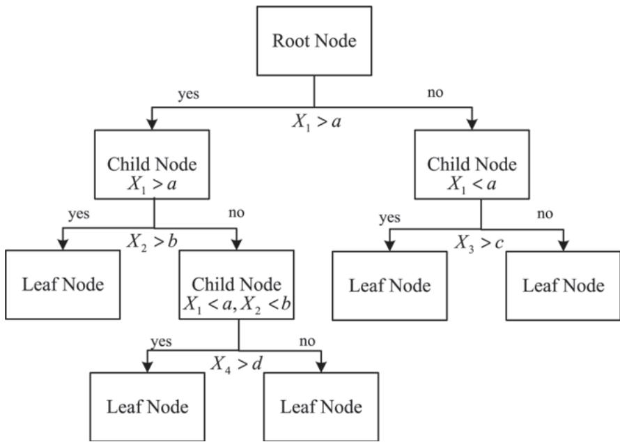  
Figure 6.15 Decision tree schematic with leaf and child nodes [91]

Table 6.6 Comparative analysis of active islanding detection scheme

<table><tr><td>Islanding detection classifier</td><td>Signal processing techniques</td><td>Recognition rate (%)</td></tr><tr><td>ANN [93]</td><td>Wavelet transform</td><td>95</td></tr><tr><td>Decision tree [94]</td><td>DWT</td><td>94</td></tr><tr><td>Ridgelet probabilistic neural network [95]</td><td>DWT</td><td>93.3</td></tr><tr><td>Multi-feature-based ANN [84]</td><td>DWT</td><td>98.1</td></tr></table>

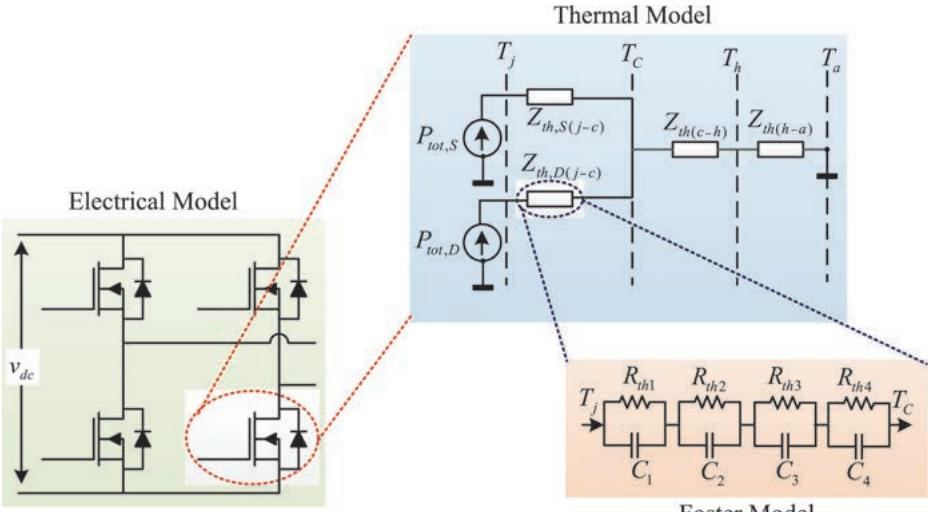  
Figure 6.16 Schematic of the thermal model of the IGBT diode module

To further understand the thermal modeling of power electronic converter, a schematics representation is depicted in Figure 6.16. The modeling of insulated-gate bipolar transistor (IGBT) and the diode are done simultaneously because of the complementary nature of operating cycles. The power loss dissipated by the IGBT and diodes is represented by the thermal resistance $R_{th,S(j - c)}$ and $R_{th,D(j - c)}$ , respectively. The thermal resistance lead to rise in junction temperature of $\mathrm{IGBT}(T_{Sj})$ and diode (10kW) beyond ambient condition temperature ( $T_{Dj}$ ). The foster model [101] is mostly used for the analysis and the thermal parameter required can be obtained from the device datasheet. The relation between the power loss and junction temperature, in case of both IGBT and diode, can be expressed by

$$
T _ {j} (t) = P _ {t o t} (t) Z _ {t h, (j - c)} (t) + T _ {c} (t)\tag{6.51}
$$

$$
T _ {c} (t) = T _ {a} (t) + \left[ P _ {t o t, S} (t) + P _ {t o t, D} (t) \right] \left[ Z _ {t h (c - h)} (t) + Z _ {t h (h - a)} (t) \right]\tag{6.52}
$$

where power loss of IGBT or diode is denoted by $P_{tot,S}$ and $P_{tot,D}$ , respectively. The thermal impedance from junction to case are denoted by $Z_{th,(j-c)}$ and, thermal impedance from case to heatsink and heatsink to ambient condition are denoted by $Z_{th,(c-h)}$ and $Z_{th,(h-a)}$ , respectively. The temperature of the case is represented by $T_{c}$ . The steady state nature of junction temperature is mainly attributed to thermal resistance ( $C_{th}$ ), whereas the dynamic behaviors is caused because of the thermal capacitance ( $C_{th}$ ). The time constant for the thermal impedance is large which lead to slow dynamic response [102].

The relation between the temperature and power control is addressed through the flowchart presented in Figure 6.17. Power control helps us in achieving multi-objective, i.e., fault ride-he power reference $(P_{1}^{*}, Q_{1}^{*}, P_{2}^{*}, Q_{2}^{*} \ldots)$ need to be optimized for achieving the desired outcome.

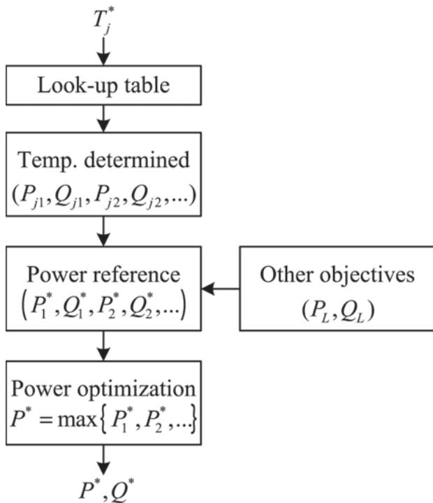  
Figure 6.17 Flowchart for relating junction temperature with power control strategy

In Figures 6.18 and 6.19, a simulated result of 10 kW single-phase and three-phase PV system are presented, respectively, to analyze the change in junction temperature with change in power control modes. It can be observed that by power control the IGBT junction temperature can remain constant even during the fault ride-through condition. And injection of sufficient reactive power helps the system to recover in time as well. As per the observation it can be concluded that multiple objectives are satisfied out of power control strategies.

## 6.6 Conclusion

The increase in installation of large capacity PV DG has reduced the pressure on the grid substantially, but at the same time has introduced many challenges during the interconnection process. The factors such as power quality, harmonics, flicker, etc., need to be regulated along with voltage and frequency level. In this chapter, the different regulation required for LVRT and anti-islanding have been discussed. And based on the regulation control strategies are presented for balancing the power and detecting the faulty condition.

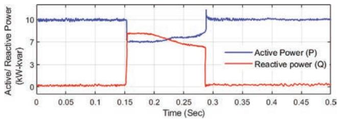  
(a)

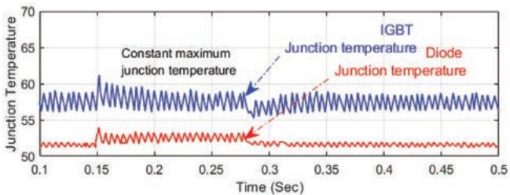  
(b)  
Figure 6.18 Simulation of 10 kW single-phase GCPVS with (a) active and reactive power, and (b) junction temperature for power device

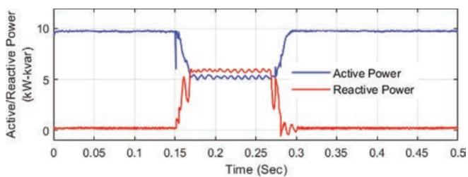

(a)  
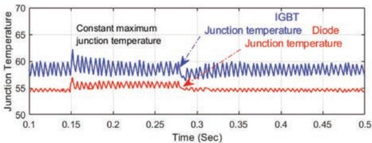  
(b)  
Figure 6.19 Simulation of 10 kW three-phase GCPVS with (a) active and reactive power and (b) junction temperature for power device

The aim of the chapter was to provide a brief regarding the requirement and enable the inverter controller with advance protection schemes.

## References

[1] Yang Y., Blaabjerg F., Wang H. 'Low-voltage ride-through of single-phase transformerless photovoltaic inverters'. IEEE Transactions on Industry Applications. 2014;50(3):1942–52.

[2] Al-Shetwi A.Q., Sujod M.Z., Blaabjerg F., Yang Y. 'Fault ride-through control of grid-connected photovoltaic power plants: a review'. Solar Energy. 2019;180(2):340–50.

[3] Piya P., Ebrahimi M., Karimi-Ghartemani M., Khajehoddin S.A. 'Fault ride-through capability of voltage-controlled inverters'. IEEE Transactions on Industrial Electronics. 2018;65(10):7933–43.

[4] Kumar P., Singh A.K. (eds.) 'Grid codes: goals and challenges' in Hossain J., Mahmud A.. (eds.). Renewable Energy Integration. Green Energy and Technology. 1. 1. Springer Science+Business Media Singapore; 2014.

[5] Office of Energy Projects. Energy policy act (EPAct) of 2005. Docket No. RM05-31-000 Order No. 665. Washington: Federal Energy Regulatory Commission; 2005. pp. 1–12.

[6] Hemus A. The grid code. Issue 5, Revision 21. National Grid House Warwick Technology Park Gallows Hill, Warwick CV34 6DA: National Grid Electricity Transmission plc; 2017. pp. 1–726.

[7] Grid Code Review Panel. EirGrid grid code. Version 3.3. Dublin, Ireland: Eirgrid Group; 2009. pp. 1–315.

[8] China Electric Power Research Institute. Technical rule for connecting wind farm to power system. GB/T 19963-2011. People's Republic of China: National Electricity Regulatory Standardization Technical Committee; 2011. pp. 1–12.

[9] Grid code high and extra high voltage. Bayreuth: E.ON Netz. GmbH; 2006. pp. 1–46. Available from http://www.pvupscale.org/IMG/pdf/D4\_2\_DE\_annex\_A-3\_EON\_HV\_grid\_connection\_requirements\_ENENARHS2006de.pdf.

[10] Electrical Installations Sectional Committee. National electrical code. ICS 01.120; 91.160.01. New Delhi: Government of India; 2011. pp. 1–379. Available from https://law.resource.org/pub/in/bis/S05/is.sp.30.2011.svg.html.

[11] Cronin T. An overview of grid requirements in Denmark and the DTU advanced grid test facility at ∅sterild. 2013DTU Wind Energy. Available from https://www.nrel.gov/grid/assets/pdfs/turbine\_sim\_13\_denmark\_grid\_requirements.pdf.

[12] Standards N. Electromagnetic compatibility (EMC) part 3.2: Limits-Limits for harmonic current emissions (equipment input current less than or equal to 16 A per phase). EN IEC 61000-3-2:2019. Brussels: European Committee for Electrotechnical Standardization; 2019. pp. 1–18.